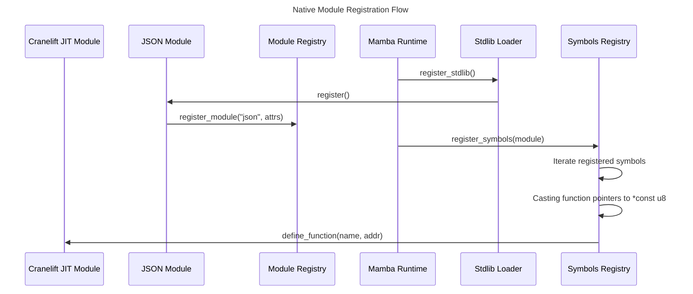
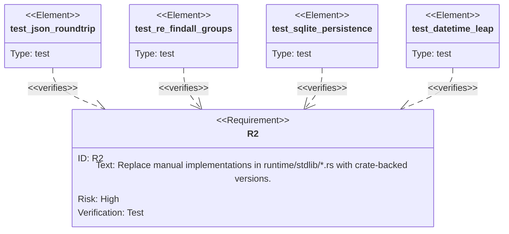

# Mamba Native Stdlib Spec

## Overview

This specification outlines the plan to rewrite the core standard library modules of the Mamba language in native Rust. Currently, many modules in `crates/mamba/src/runtime/stdlib` are either stubs or very basic manual implementations (e.g., literal search for `re`, manual JSON parsing). This change will integrate production-grade Rust crates (like `regex`, `serde_json`, `chrono`, and `rusqlite`) to provide robust, high-performance, and feature-complete implementations that align with the existing standard library specifications. Additionally, the registration process in `symbols.rs` will be refactored to improve maintainability and performance.
## Requirements

### R1: Dependency Integration
Integrate the following crates into `crates/mamba/Cargo.toml`:
- `serde_json` for the `json` module.
- `regex` for the `re` module.
- `chrono` for the `datetime` and `time` modules.
- `rusqlite` for the `sqlite3` module.
- `sha2`, `md-5`, `base64`, `rand` for security and utility modules.

### R2: Module Rewrite
Replace manual implementations in `runtime/stdlib/*.rs` with crate-backed versions:
- **json_mod.rs**: Use `serde_json` for `dumps` and `loads`.
- **re_mod.rs**: Use `regex` for `search`, `match`, `findall`, `sub`, and `split`.
- **datetime_mod.rs**: Use `chrono` for date math, formatting, and Unix timestamp conversions.
- **sqlite3_mod.rs**: Use `rusqlite` to implement a real SQLite interface (replacing the `HashMap` stub).

### R3: Refined Symbol Registration
Refactor `runtime/symbols.rs` to use a more automated and maintainable registration system (e.g., a macro-driven registry) to replace the current manual string-to-address mapping for every function.

### R4: Error Mapping
Implement a unified error mapping layer that converts Rust crate errors (e.g., `serde_json::Error`, `rusqlite::Error`, `std::io::Error`) into Mamba exceptions (`MbException`) with appropriate types and messages.

### R5: Builtins Stub Replacement
Fill in or improve existing stubs in `runtime/builtins.rs`, specifically focusing on `mb_eval`, `mb_exec`, and `mb_globals` to provide at least basic functional behavior where possible.
## Scenarios

### Scenario: Complex JSON Round-trip
- **WHEN** `json.dumps` is called with a deeply nested structure containing lists, dicts, and mixed primitives.
- **THEN** It produces a valid JSON string matching `serde_json` output, and `json.loads` returns an identical Mamba object.

### Scenario: Regular Expression with Capturing Groups
- **WHEN** `re.findall(r"(\d+)-(\w+)", "123-abc 456-def")` is called.
- **THEN** It returns a list of tuples `[("123", "abc"), ("456", "def")]`, matching Python's behavior and backed by the `regex` crate.

### Scenario: SQLite Persistence
- **WHEN** `sqlite3.connect("test.db")` is called, a table is created, and data is inserted and committed.
- **THEN** The data persists in the actual SQLite file and can be retrieved across different sessions.

### Scenario: Datetime Math across Leap Years
- **WHEN** `datetime(2024, 2, 28) + timedelta(days=1)` is calculated.
- **THEN** It returns `datetime(2024, 2, 29)` correctly using `chrono` logic.

### Scenario: Mapping Native Errors to Mamba
- **WHEN** `json.loads` is called with invalid JSON content.
- **THEN** A Mamba `ValueError` or `JSONDecodeError` is raised with a descriptive message from `serde_json`.
## Diagrams

### Registration Flow


### Error Mapping Flow
```mermaid
flowchart TB
    rust_call[Execute Crate Function]
    error_check[Result Check]
    map_error[Map to MbException]
    raise_mamba[[mb_raise(exc)]]
    return_none(Return MbValue::none())
    return_val(Return MbValue::from(v))
    rust_call --> error_check
    error_check -->|Err(e)| map_error
    error_check -->|Ok(v)| return_val
    map_error --> raise_mamba
    raise_mamba --> return_none
```
## API Spec

## Test Plan

The test plan focuses on verifying the correctness and performance of the new crate-backed implementations compared to the previous stubs.



### Unit Tests
- `test_json_roundtrip`: Verify `json.dumps` and `json.loads` handles all Mamba types and nested structures.
- `test_re_findall_groups`: Ensure `re.findall` correctly handles regex capturing groups and returns lists of tuples.
- `test_datetime_leap`: Validate leap year logic and duration arithmetic using `chrono`.

### Integration Tests
- `test_sqlite_persistence`: Confirm that `sqlite3` module correctly interacts with physical database files and supports standard SQL operations.
- `test_error_mapping`: Trigger various native errors (io, parse, sql) and verify they are correctly mapped to Mamba exceptions.
## Changes

### Configuration
- `crates/mamba/Cargo.toml`: Add dependencies (`serde_json`, `regex`, `chrono`, `rusqlite`, etc.)

### Runtime Standard Library
- `crates/mamba/src/runtime/stdlib/json_mod.rs`: Replace manual parser with `serde_json`.
- `crates/mamba/src/runtime/stdlib/re_mod.rs`: Replace literal search with `regex`.
- `crates/mamba/src/runtime/stdlib/datetime_mod.rs`: Replace manual date math with `chrono`.
- `crates/mamba/src/runtime/stdlib/sqlite3_mod.rs`: Replace `HashMap` stub with `rusqlite`.
- `crates/mamba/src/runtime/stdlib/mod.rs`: Ensure all modules are correctly registered.

### Core Runtime
- `crates/mamba/src/runtime/builtins.rs`: Improve stubs for `mb_eval`, `mb_exec`.
- `crates/mamba/src/runtime/symbols.rs`: Refactor registration flow.
- `crates/mamba/src/runtime/exception.rs`: Add new exception types if needed for error mapping.
# Reviews
