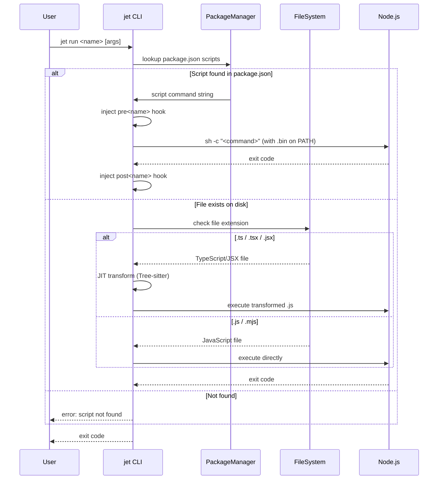
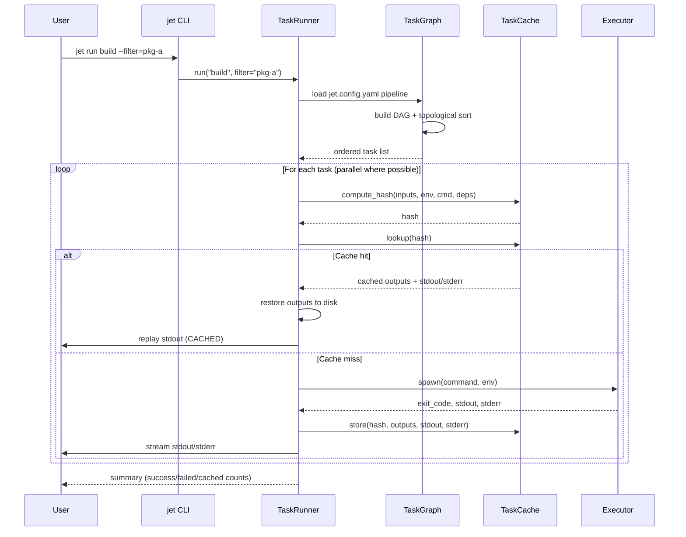
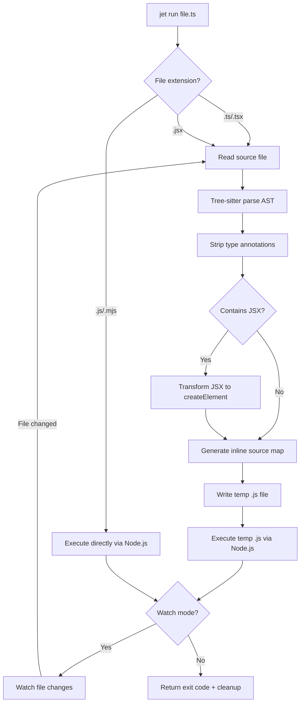
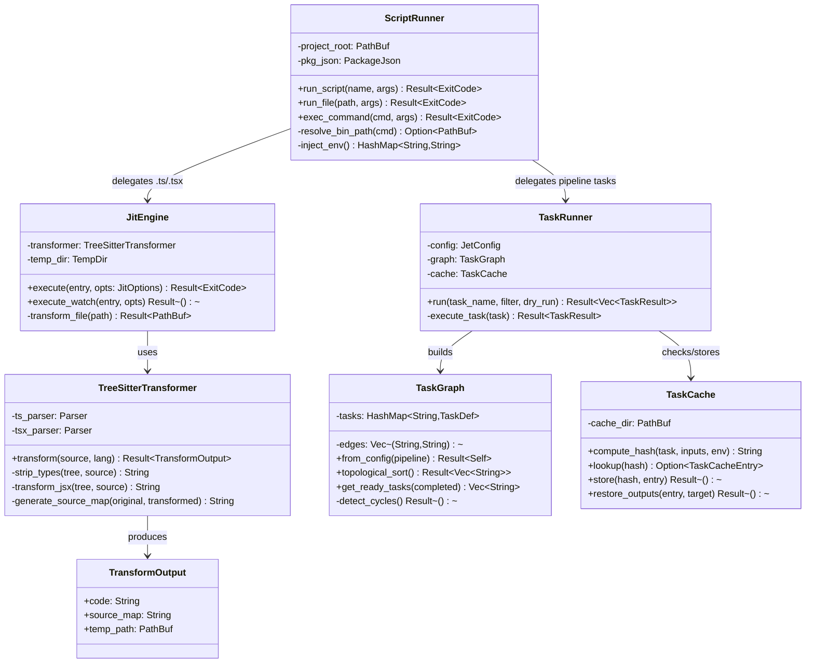
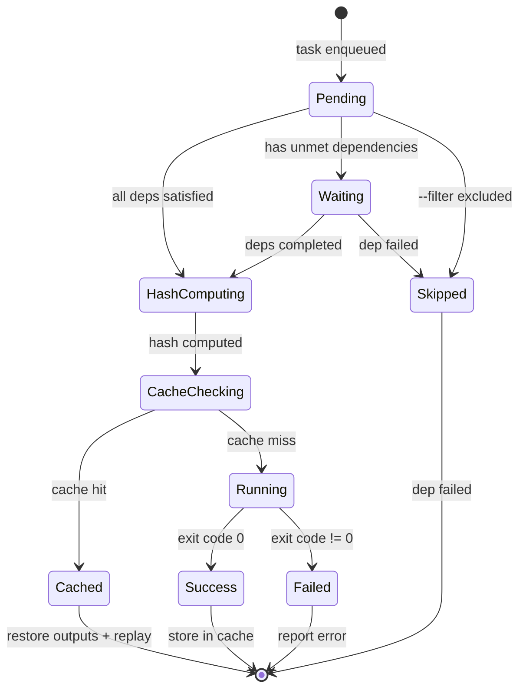

# Jet Jit Runner Spec

## Overview


Add JIT execution (run JS/TS without pre-build) and task runner (parallel script orchestration with caching) to jet, comparable to Bun run + Turborepo.

### Schemas

#### JetConfig (jet.config.yaml)

```json
{
  "$schema": "https://json-schema.org/draft/2020-12/schema",
  "$id": "jet://schemas/jet-config",
  "type": "object",
  "properties": {
    "pipeline": {
      "type": "object",
      "description": "Task definitions: task_name → TaskDef",
      "additionalProperties": { "$ref": "#/$defs/TaskDef" }
    }
  },
  "$defs": {
    "TaskDef": {
      "type": "object",
      "properties": {
        "dependsOn": {
          "type": "array",
          "items": { "type": "string" },
          "description": "Task dependencies. ^task means cross-package dep."
        },
        "inputs": {
          "type": "array",
          "items": { "type": "string" },
          "description": "Glob patterns for input files (e.g. ['src/**', 'package.json'])"
        },
        "outputs": {
          "type": "array",
          "items": { "type": "string" },
          "description": "Glob patterns for output files (e.g. ['dist/**'])"
        },
        "cache": { "type": "boolean", "default": true },
        "persistent": {
          "type": "boolean",
          "default": false,
          "description": "Long-running task (dev servers), never cached"
        },
        "env": {
          "type": "array",
          "items": { "type": "string" },
          "description": "Env vars that affect cache key"
        }
      }
    }
  }
}
```

#### TaskResult

```json
{
  "$schema": "https://json-schema.org/draft/2020-12/schema",
  "$id": "jet://schemas/task-result",
  "type": "object",
  "required": ["task_name", "status"],
  "properties": {
    "task_name": { "type": "string" },
    "package_name": { "type": ["string", "null"] },
    "status": { "enum": ["success", "failed", "cached", "skipped"] },
    "duration_ms": { "type": "integer" },
    "cache_hit": { "type": "boolean" },
    "exit_code": { "type": "integer" },
    "stdout": { "type": "string" },
    "stderr": { "type": "string" }
  }
}
```

#### TaskCacheEntry

```json
{
  "$schema": "https://json-schema.org/draft/2020-12/schema",
  "$id": "jet://schemas/task-cache-entry",
  "type": "object",
  "required": ["hash", "task_name", "outputs"],
  "properties": {
    "hash": { "type": "string", "description": "SHA-256 of inputs + env + command + deps hashes" },
    "task_name": { "type": "string" },
    "package_name": { "type": ["string", "null"] },
    "outputs": {
      "type": "array",
      "items": { "type": "string" },
      "description": "Relative paths of cached output files"
    },
    "stdout": { "type": "string" },
    "stderr": { "type": "string" },
    "created_at": { "type": "string", "format": "date-time" }
  }
}
```

#### JitOptions

```json
{
  "$schema": "https://json-schema.org/draft/2020-12/schema",
  "$id": "jet://schemas/jit-options",
  "type": "object",
  "properties": {
    "entry": { "type": "string", "description": "File path to execute (e.g. file.ts)" },
    "watch": { "type": "boolean", "default": false },
    "args": {
      "type": "array",
      "items": { "type": "string" },
      "description": "Arguments passed to the executed script"
    },
    "env": {
      "type": "object",
      "additionalProperties": { "type": "string" },
      "description": "Additional env vars"
    }
  }
}
```

#### ScriptRunOptions

```json
{
  "$schema": "https://json-schema.org/draft/2020-12/schema",
  "$id": "jet://schemas/script-run-options",
  "type": "object",
  "required": ["script_name"],
  "properties": {
    "script_name": { "type": "string" },
    "args": { "type": "array", "items": { "type": "string" } },
    "filter": { "type": ["string", "null"], "description": "Workspace filter pattern" },
    "dry_run": { "type": "boolean", "default": false }
  }
}
```
## Diagrams

### Sequence Diagram

#### jet run \<script\> — Script Resolution



#### jet run \<task\> — Task Runner with Caching



### Flowchart

#### JIT Transform Pipeline



### Class Diagram



### State Diagram

#### Task Execution States


## API Spec

### OpenAPI 3.1

N/A — jet is a CLI tool, not a web service.

### OpenRPC 1.3

N/A

### AsyncAPI 2.6

N/A

### Serverless Workflow 0.8

Task runner orchestration modeled as a serverless workflow:

```yaml
id: jet-task-runner
version: '0.8'
specVersion: '0.8'
name: Jet Task Runner Pipeline
description: Parallel task execution with dependency resolution and caching
start: resolve-tasks

functions:
  - name: loadConfig
    operation: jet://internal/load-jet-config
  - name: buildGraph
    operation: jet://internal/build-task-graph
  - name: computeHash
    operation: jet://internal/compute-content-hash
  - name: checkCache
    operation: jet://internal/check-task-cache
  - name: executeTask
    operation: jet://internal/execute-task
  - name: storeCache
    operation: jet://internal/store-task-cache
  - name: restoreOutputs
    operation: jet://internal/restore-cached-outputs

states:
  - name: resolve-tasks
    type: operation
    actions:
      - functionRef: loadConfig
      - functionRef: buildGraph
    transition: schedule-tasks

  - name: schedule-tasks
    type: switch
    dataConditions:
      - condition: "${ .ready_tasks | length > 0 }"
        transition: execute-batch
      - condition: "${ .all_complete == true }"
        transition: report-results
    defaultCondition:
      transition: wait-for-deps

  - name: wait-for-deps
    type: sleep
    duration: PT0.1S
    transition: schedule-tasks

  - name: execute-batch
    type: parallel
    branches:
      - name: per-task
        actions:
          - functionRef: computeHash
          - subFlowRef: cache-or-run
    completionType: allOf
    transition: schedule-tasks

  - name: cache-or-run
    type: switch
    dataConditions:
      - condition: "${ .cache_hit == true }"
        transition: restore-from-cache
    defaultCondition:
      transition: run-task

  - name: restore-from-cache
    type: operation
    actions:
      - functionRef: restoreOutputs
    end: true

  - name: run-task
    type: operation
    actions:
      - functionRef: executeTask
      - functionRef: storeCache
    end: true

  - name: report-results
    type: operation
    end: true
```
## Changes

### Milestone 1: Script Runner

| File | Action | Description |
|------|--------|-------------|
| `crates/cclab-jet/src/runner/mod.rs` | Create | ScriptRunner: resolve package.json scripts, inject .bin PATH, lifecycle hooks (pre/post) |
| `crates/cclab-jet/src/runner/env.rs` | Create | Environment injection: NODE_ENV, JET_* variables, .bin PATH construction |
| `crates/cclab-jet/src/cli.rs` | Modify | Add `run <script> [args]`, `exec <cmd>`, `dlx <pkg>` subcommands |
| `crates/cclab-jet/src/lib.rs` | Modify | Export runner module |

### Milestone 2: JIT TypeScript/JSX Execution

| File | Action | Description |
|------|--------|-------------|
| `crates/cclab-jet/src/runner/jit.rs` | Create | JitEngine: transform TS/TSX via Tree-sitter, write temp .js, execute via Node.js child process |
| `crates/cclab-jet/src/runner/source_map.rs` | Create | Inline source map generation for transformed files |
| `crates/cclab-jet/src/runner/watcher.rs` | Create | Watch mode: file change detection → re-transform → restart Node.js process |
| `crates/cclab-jet/src/transform/mod.rs` | Modify | Expose strip_types and transform_jsx as public API for JIT engine |
| `crates/cclab-jet/src/resolver/mod.rs` | Modify | Support tsconfig.json paths resolution for JIT imports |
| `crates/cclab-jet/Cargo.toml` | Modify | Add `notify` (file watcher), `tempfile` dependencies |

### Milestone 3: Task Runner

| File | Action | Description |
|------|--------|-------------|
| `crates/cclab-jet/src/task_runner/mod.rs` | Create | TaskRunner: load jet.config.yaml, orchestrate parallel execution |
| `crates/cclab-jet/src/task_runner/graph.rs` | Create | TaskGraph: DAG construction, topological sort, cycle detection, ready-task scheduling |
| `crates/cclab-jet/src/task_runner/config.rs` | Create | JetConfig parser: read jet.config.yaml pipeline section, TaskDef deserialization |
| `crates/cclab-jet/src/cli.rs` | Modify | Wire task runner into `jet run` when task name matches pipeline config |
| `crates/cclab-jet/src/lib.rs` | Modify | Export task_runner module |

### Milestone 4: Task Caching

| File | Action | Description |
|------|--------|-------------|
| `crates/cclab-jet/src/task_runner/cache.rs` | Create | TaskCache: content-hash computation (SHA-256 of inputs+env+cmd+deps), local cache store/restore |
| `crates/cclab-jet/src/task_runner/hash.rs` | Create | Hash computation: glob input files, hash env vars, combine with command and dependency hashes |
| `crates/cclab-jet/src/cli.rs` | Modify | Add `--dry` flag, `--filter` flag for task runner commands |
| `crates/cclab-jet/Cargo.toml` | Modify | Add `sha2` (hashing), `serde_yaml` (config parsing) dependencies |

### Integration with Workspace

| File | Action | Description |
|------|--------|-------------|
| `crates/cclab-jet/src/task_runner/workspace.rs` | Create | Workspace-aware task scheduling: cross-package deps (^task), filter by package pattern |
| `crates/cclab-jet/src/pkg_manager/workspace.rs` | Modify | Expose workspace graph for task runner cross-package dependency resolution |
# Reviews
