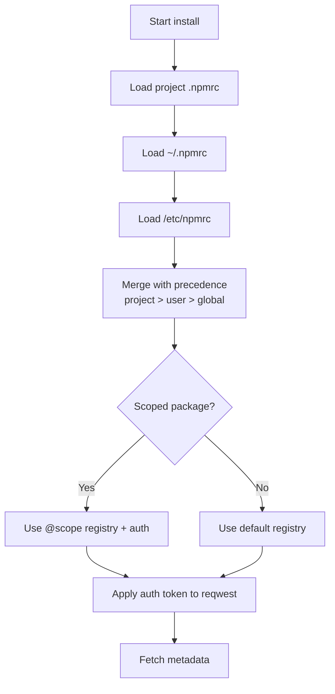
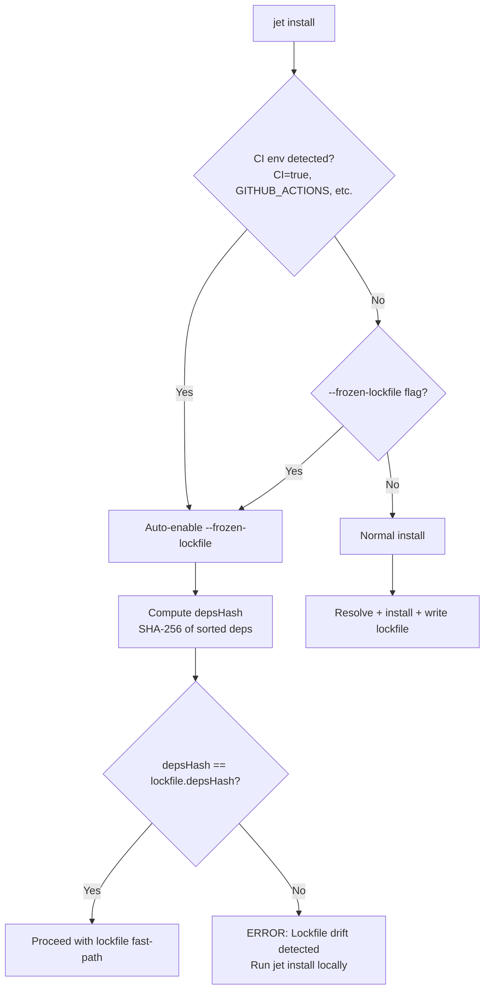
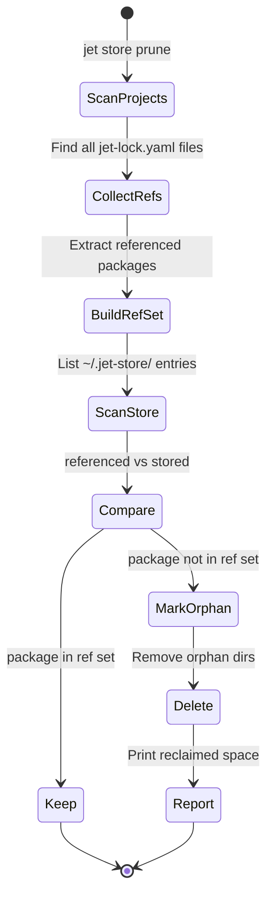
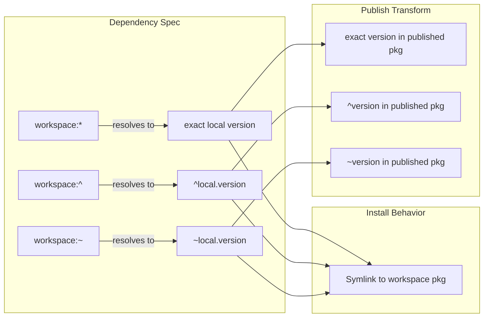
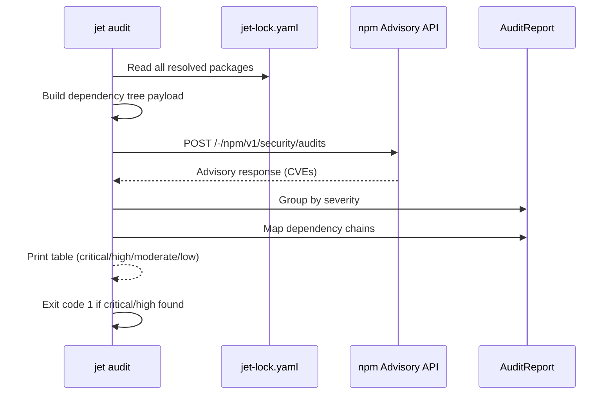
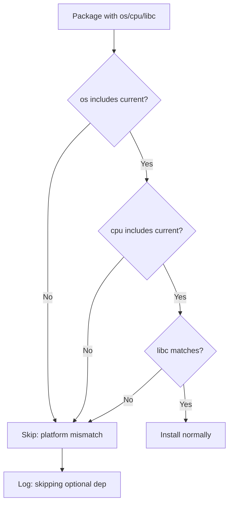
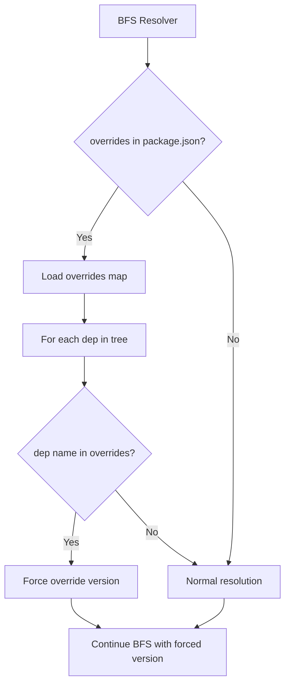

# Jet Pnpm Parity Spec

## Overview

Extend jet package manager to pnpm feature parity: .npmrc config, frozen lockfile, optional/alias deps, overrides, workspace/monorepo support, store GC, audit, and publishing.

### Schemas

#### NpmrcConfig

```json
{
  "$schema": "https://json-schema.org/draft/2020-12/schema",
  "$id": "jet://schemas/npmrc-config",
  "type": "object",
  "description": "Merged .npmrc config (project → user → global precedence)",
  "properties": {
    "registry": { "type": "string", "format": "uri", "default": "https://registry.npmjs.org/" },
    "scoped_registries": {
      "type": "object",
      "description": "@scope → registry URL",
      "additionalProperties": { "type": "string", "format": "uri" }
    },
    "auth_tokens": {
      "type": "object",
      "description": "//registry:_authToken mappings",
      "additionalProperties": { "type": "string" }
    },
    "proxy": { "type": ["string", "null"] },
    "https_proxy": { "type": ["string", "null"] },
    "strict_ssl": { "type": "boolean", "default": true }
  }
}
```

#### WorkspaceConfig

```json
{
  "$schema": "https://json-schema.org/draft/2020-12/schema",
  "$id": "jet://schemas/workspace-config",
  "type": "object",
  "properties": {
    "packages": {
      "type": "array",
      "items": { "type": "string" },
      "description": "Glob patterns for workspace packages (e.g. ['packages/*', 'apps/*'])"
    },
    "catalog": {
      "type": "object",
      "description": "Shared version definitions: dep_name → version_range",
      "additionalProperties": { "type": "string" }
    },
    "hoisting": {
      "type": "object",
      "properties": {
        "shamefully_hoist": { "type": "boolean", "default": false },
        "public_hoist_pattern": {
          "type": "array",
          "items": { "type": "string" },
          "default": ["*eslint*", "*prettier*"]
        }
      }
    }
  }
}
```

#### WorkspacePackage

```json
{
  "$schema": "https://json-schema.org/draft/2020-12/schema",
  "$id": "jet://schemas/workspace-package",
  "type": "object",
  "required": ["name", "path", "package_json"],
  "properties": {
    "name": { "type": "string" },
    "version": { "type": "string" },
    "path": { "type": "string", "description": "Relative path from workspace root" },
    "package_json": { "$ref": "jet://schemas/package-json" },
    "dependencies_on_workspace": {
      "type": "array",
      "items": { "type": "string" },
      "description": "Names of other workspace packages this depends on"
    }
  }
}
```

#### PackageJson (extended)

```json
{
  "$schema": "https://json-schema.org/draft/2020-12/schema",
  "$id": "jet://schemas/package-json-v2",
  "allOf": [{ "$ref": "jet://schemas/package-json" }],
  "properties": {
    "optionalDependencies": {
      "type": "object",
      "additionalProperties": { "type": "string" }
    },
    "overrides": {
      "type": "object",
      "description": "Force specific versions across dep tree",
      "additionalProperties": { "type": "string" }
    },
    "workspaces": {
      "type": "array",
      "items": { "type": "string" },
      "description": "Workspace package glob patterns"
    },
    "os": { "type": "array", "items": { "type": "string" } },
    "cpu": { "type": "array", "items": { "type": "string" } },
    "libc": { "type": "array", "items": { "type": "string" } }
  }
}
```

#### AuditReport

```json
{
  "$schema": "https://json-schema.org/draft/2020-12/schema",
  "$id": "jet://schemas/audit-report",
  "type": "object",
  "properties": {
    "vulnerabilities": {
      "type": "array",
      "items": {
        "type": "object",
        "required": ["package", "severity", "title"],
        "properties": {
          "package": { "type": "string" },
          "severity": { "enum": ["critical", "high", "moderate", "low", "info"] },
          "title": { "type": "string" },
          "url": { "type": "string", "format": "uri" },
          "vulnerable_versions": { "type": "string" },
          "patched_versions": { "type": "string" },
          "dependency_chain": { "type": "array", "items": { "type": "string" } }
        }
      }
    },
    "summary": {
      "type": "object",
      "properties": {
        "critical": { "type": "integer" },
        "high": { "type": "integer" },
        "moderate": { "type": "integer" },
        "low": { "type": "integer" },
        "total": { "type": "integer" }
      }
    }
  }
}
```

#### Lockfile v2 (extended)

```json
{
  "$schema": "https://json-schema.org/draft/2020-12/schema",
  "$id": "jet://schemas/lockfile-v2-ext",
  "allOf": [{ "$ref": "jet://schemas/lockfile" }],
  "properties": {
    "depsHash": { "type": "string", "description": "SHA-256 of sorted package.json deps for frozen lockfile check" },
    "overrides": { "type": "object", "additionalProperties": { "type": "string" } },
    "patchedPackages": {
      "type": "object",
      "description": "package@version → patch file path",
      "additionalProperties": { "type": "string" }
    }
  }
}
```
## Diagrams

### .npmrc Config Resolution



### Frozen Lockfile Flow



### Workspace Discovery and Install

```mermaid
sequenceDiagram
    participant CLI as jet install
    participant WS as WorkspaceManager
    participant PM as PackageManager
    participant Store as ~/.jet-store/

    CLI->>WS: discover_workspace(root)
    WS->>WS: Read package.json.workspaces<br/>or jet-workspace.yaml
    WS->>WS: Glob expand patterns<br/>(packages/*, apps/*)
    WS-->>CLI: Vec&lt;WorkspacePackage&gt;

    CLI->>WS: build_dependency_graph()
    WS->>WS: Topological sort workspace packages
    WS-->>CLI: Ordered packages

    loop Each workspace package
        CLI->>PM: resolve(pkg.dependencies)
        PM->>PM: Replace workspace:* with local version
        PM->>PM: Replace catalog refs with catalog versions
        CLI->>Store: install external deps
        CLI->>WS: symlink workspace deps → node_modules/
    end

    CLI->>CLI: Write single jet-lock.yaml at root
```

### Store GC (Garbage Collection)



### Workspace Protocol Resolution



### Audit Flow



### Optional Dependency Platform Check



### Override Resolution


## API Spec

### OpenAPI 3.1 (Internal API)

```yaml
openapi: 3.1.0
info:
  title: Jet Package Manager — pnpm Parity Extensions
  version: 3.0.0

paths:
  /install:
    post:
      operationId: PackageManager::install
      summary: Install with frozen lockfile and workspace support
      parameters:
        - name: frozen_lockfile
          in: query
          schema: { type: boolean, default: false }
          description: Fail if lockfile drift detected (auto-enabled in CI)
        - name: filter
          in: query
          schema: { type: string }
          description: Workspace filter pattern (e.g. "pkg-a", "apps/*")
        - name: recursive
          in: query
          schema: { type: boolean, default: false }
          description: Run across all workspace packages
      responses:
        200: { description: All packages installed }
        409: { description: Version conflict }
        422: { description: "Frozen lockfile drift: depsHash mismatch" }

  /update:
    post:
      operationId: PackageManager::update
      summary: Update packages to latest matching versions
      parameters:
        - name: package
          in: query
          schema: { type: string }
          description: "Specific package to update (omit for all)"
        - name: latest
          in: query
          schema: { type: boolean, default: false }
          description: "Ignore semver range, update to absolute latest"
      responses:
        200: { description: Packages updated, lockfile rewritten }

  /audit:
    get:
      operationId: PackageManager::audit
      summary: Check for known security vulnerabilities
      responses:
        200:
          description: No critical/high vulnerabilities
          content:
            application/json:
              schema: { $ref: "jet://schemas/audit-report" }
        1:
          description: Critical or high severity vulnerabilities found (exit code 1)

  /patch:
    post:
      operationId: PackageManager::patch
      summary: Create editable copy of installed package for patching
      parameters:
        - name: package
          in: query
          required: true
          schema: { type: string }
      responses:
        200: { description: "Package copied to patches/{name}@{version}/" }

  /patch/commit:
    post:
      operationId: PackageManager::patch_commit
      summary: Generate .patch file from modified package
      parameters:
        - name: package
          in: query
          required: true
          schema: { type: string }
      responses:
        200: { description: "Patch file written to patches/{name}@{version}.patch" }

  /publish:
    post:
      operationId: PackageManager::publish
      summary: Publish package to npm registry
      description: Resolves workspace:* protocols to real versions before publish
      parameters:
        - name: tag
          in: query
          schema: { type: string, default: "latest" }
        - name: access
          in: query
          schema: { type: string, enum: [public, restricted] }
      responses:
        200: { description: Package published }
        401: { description: Auth token missing or invalid }

  /pack:
    post:
      operationId: PackageManager::pack
      summary: Create tarball without publishing
      responses:
        200: { description: "Tarball created: {name}-{version}.tgz" }

  /store/prune:
    post:
      operationId: StoreManager::prune
      summary: Remove unreferenced packages from global store
      responses:
        200: { description: "Pruned N packages, reclaimed X MB" }

  /workspace/discover:
    get:
      operationId: WorkspaceManager::discover
      summary: Discover workspace packages from config
      responses:
        200:
          content:
            application/json:
              schema:
                type: array
                items: { $ref: "jet://schemas/workspace-package" }

  /config/npmrc:
    get:
      operationId: NpmrcParser::load
      summary: Load and merge .npmrc from all levels
      responses:
        200:
          content:
            application/json:
              schema: { $ref: "jet://schemas/npmrc-config" }
```
## Changes


| File | Action | Description |
|------|--------|-------------|
| `pkg_manager/npmrc.rs` (~200L) | create | `.npmrc` parser: 3-level merge (project → user → global), scoped registries, auth tokens, proxy settings |
| `pkg_manager/workspace.rs` (~350L) | create | Workspace discovery (`package.json` workspaces + `jet-workspace.yaml`), glob expansion, topological sort, `workspace:*`/`^`/`~` protocol resolution, catalog shared versions |
| `pkg_manager/audit.rs` (~150L) | create | npm advisory API client (`/-/npm/v1/security/audits`), `AuditReport` builder, severity grouping, exit code logic |
| `pkg_manager/patch.rs` (~120L) | create | `jet patch <pkg>` copy-to-edit, `jet patch-commit` diff generation, `.patch` file writer, `patchedPackages` lockfile integration |
| `pkg_manager/publish.rs` (~180L) | create | `jet publish` / `jet pack`: tarball creation, `workspace:*` → real version transform, `.npmrc` auth token injection, `npm` registry PUT |
| `pkg_manager/gc.rs` (~100L) | create | Store GC: scan all `jet-lock.yaml` files, build ref set, diff against `~/.jet-store/`, delete orphans, report reclaimed space |
| `pkg_manager/mod.rs` (315L) | modify | Add `--frozen-lockfile` flag (auto-enable in CI), `--filter` workspace filter, `--recursive` flag, `depsHash` computation and check, wire new submodules |
| `pkg_manager/resolver.rs` (343L) | modify | `optionalDependencies` with `os`/`cpu`/`libc` platform check, `overrides` map forcing, alias deps (`npm:` protocol), `workspace:*` local resolution |
| `pkg_manager/registry.rs` (185L) | modify | Use `NpmrcConfig` for registry URL + auth token per request, scoped registry routing, proxy support |
| `pkg_manager/store.rs` (417L) | modify | File-level content-addressable dedup (SHA-256 per file, hardlink identical files across packages), hoisting strategies (`shamefully-hoist`, `public-hoist-pattern`) |
| `pkg_manager/lockfile.rs` (295L) | modify | Add `depsHash`, `overrides`, `patchedPackages` fields to lockfile v2; import from `package-lock.json` / `yarn.lock` |
| `cli.rs` (249L) | modify | Add subcommands: `update`, `audit`, `patch`, `patch-commit`, `publish`, `pack`, `store prune`; add `--frozen-lockfile`, `--filter`, `-r` flags to `install` |
| `lib.rs` (12L) | modify | Re-export new modules: `npmrc`, `workspace`, `audit`, `patch`, `publish`, `gc` |
| `Cargo.toml` | modify | Add deps: `glob` (workspace patterns), `ini` (.npmrc parsing), `ignore` (gitignore-style matching) |
# Reviews
