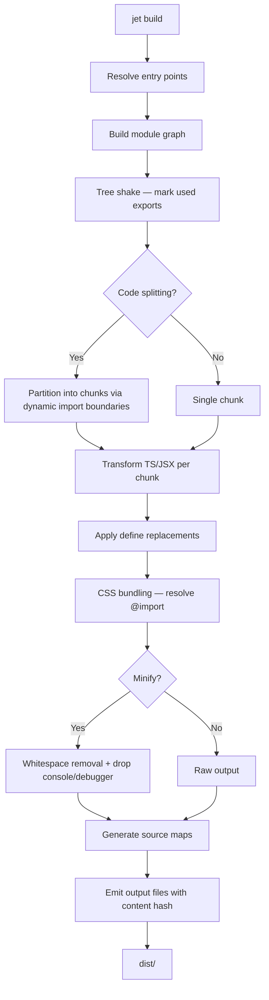
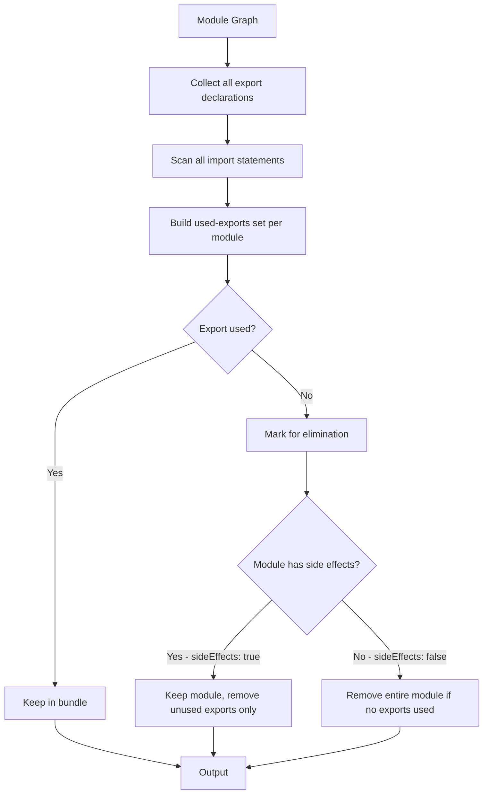
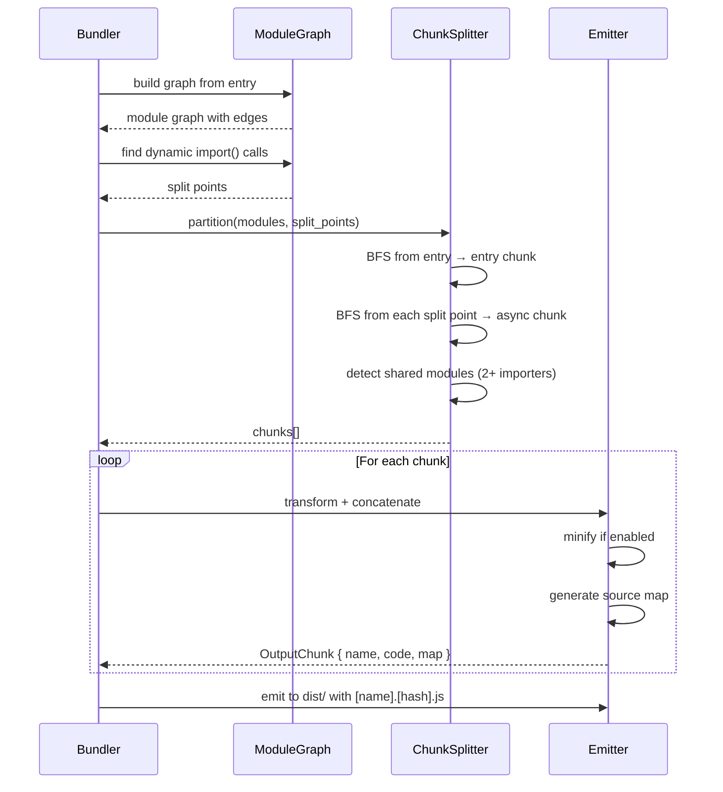
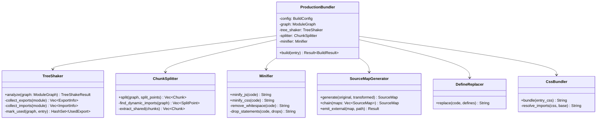
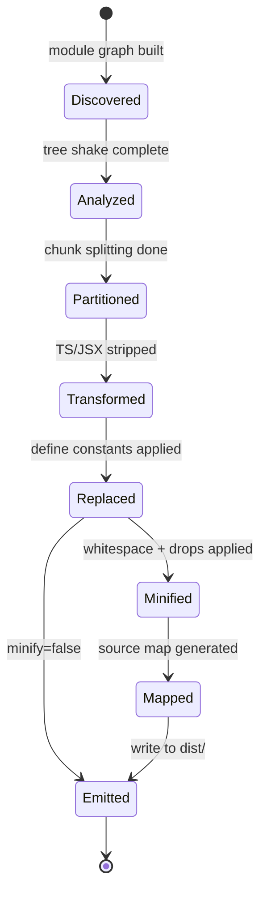

# Jet Aot Build Spec

## Overview
---

Production AOT build pipeline for jet. Extends existing bundler with tree shaking, code splitting, minification (Tree-sitter based), external source maps, basic CSS bundling, and env replacement. Verified via Mini React stub + Playwright DOM snapshot comparison against Vite.

### Schemas

#### BuildConfig

```json
{
  "$schema": "https://json-schema.org/draft/2020-12/schema",
  "$id": "jet://schemas/build-config",
  "type": "object",
  "properties": {
    "entry": {
      "oneOf": [
        { "type": "string" },
        { "type": "array", "items": { "type": "string" } }
      ],
      "description": "Entry point(s) for the build"
    },
    "outDir": { "type": "string", "default": "dist" },
    "minify": { "type": "boolean", "default": true },
    "sourcemap": {
      "oneOf": [
        { "type": "boolean" },
        { "enum": ["inline", "external", "hidden"] }
      ],
      "default": true
    },
    "target": {
      "enum": ["es2020", "es2022", "esnext"],
      "default": "es2020"
    },
    "define": {
      "type": "object",
      "additionalProperties": { "type": "string" },
      "description": "Compile-time constant replacement (e.g. process.env.NODE_ENV → '\"production\"')"
    },
    "external": {
      "type": "array",
      "items": { "type": "string" },
      "description": "Packages to exclude from bundle"
    },
    "splitting": { "type": "boolean", "default": false },
    "format": {
      "enum": ["esm", "cjs", "iife"],
      "default": "esm"
    },
    "cssBundle": { "type": "boolean", "default": true },
    "drop": {
      "type": "array",
      "items": { "enum": ["console", "debugger"] },
      "description": "Statements to remove in production"
    }
  }
}
```

#### BuildResult

```json
{
  "$schema": "https://json-schema.org/draft/2020-12/schema",
  "$id": "jet://schemas/build-result",
  "type": "object",
  "required": ["chunks", "duration_ms"],
  "properties": {
    "chunks": {
      "type": "array",
      "items": { "$ref": "#/$defs/OutputChunk" }
    },
    "duration_ms": { "type": "integer" },
    "warnings": {
      "type": "array",
      "items": { "type": "string" }
    }
  },
  "$defs": {
    "OutputChunk": {
      "type": "object",
      "properties": {
        "name": { "type": "string", "description": "e.g. main.[hash].js" },
        "type": { "enum": ["entry", "chunk", "asset"] },
        "size": { "type": "integer" },
        "modules": {
          "type": "array",
          "items": { "type": "string" },
          "description": "Source modules included in this chunk"
        },
        "imports": {
          "type": "array",
          "items": { "type": "string" },
          "description": "Other chunks this chunk imports (for async loading)"
        }
      }
    }
  }
}
```

#### TreeShakeResult

```json
{
  "$schema": "https://json-schema.org/draft/2020-12/schema",
  "$id": "jet://schemas/tree-shake-result",
  "type": "object",
  "properties": {
    "used_exports": {
      "type": "object",
      "additionalProperties": {
        "type": "array",
        "items": { "type": "string" }
      },
      "description": "module_path → list of used export names"
    },
    "eliminated_modules": {
      "type": "array",
      "items": { "type": "string" },
      "description": "Modules entirely removed (no used exports)"
    },
    "eliminated_bytes": { "type": "integer" }
  }
}
```

#### MiniReactAPI

```json
{
  "$schema": "https://json-schema.org/draft/2020-12/schema",
  "$id": "jet://schemas/mini-react-api",
  "type": "object",
  "description": "Minimal React-compatible API for build verification",
  "properties": {
    "createElement": { "description": "(tag, props, ...children) → VNode" },
    "render": { "description": "(vnode, container) → void" },
    "useState": { "description": "(initialValue) → [value, setter]" },
    "useEffect": { "description": "(callback, deps) → void" }
  }
}
```
## Diagrams

### Flowchart

#### AOT Build Pipeline



#### Tree Shaking Flow



### Sequence Diagram

#### Code Splitting — Dynamic Import



### Class Diagram



### State Diagram

#### Chunk Lifecycle


## API Spec

## Changes

### Phase 1: Mini React + Build Verification Fixture

| File | Action | Description |
|------|--------|-------------|
| `examples/mini-react/src/mini-react.ts` | Create | Minimal React API: createElement, render, useState, useEffect, reconciler |
| `examples/mini-react/src/app.tsx` | Create | TodoMVC app using mini-react |
| `examples/mini-react/src/index.tsx` | Create | Entry point: render App to DOM |
| `examples/mini-react/index.html` | Create | HTML shell with root div |
| `examples/mini-react/package.json` | Create | Build scripts for jet and Vite comparison |
| `examples/mini-react/vite.config.ts` | Create | Vite config for baseline build |
| `examples/mini-react/tests/dom-snapshot.spec.ts` | Create | Playwright tests: render, add/delete/toggle todos, compare DOM snapshots |

### Phase 2: Tree Shaking

| File | Action | Description |
|------|--------|-------------|
| `crates/cclab-jet/src/bundler/tree_shake.rs` | Create | TreeShaker: collect exports/imports, build used-exports set, mark dead code |
| `crates/cclab-jet/src/bundler/mod.rs` | Modify | Integrate tree shaking into bundle pipeline before concatenation |
| `crates/cclab-jet/src/bundler/graph.rs` | Modify | Add export/import tracking to ModuleNode for tree shaking analysis |

### Phase 2: Code Splitting

| File | Action | Description |
|------|--------|-------------|
| `crates/cclab-jet/src/bundler/splitting.rs` | Create | ChunkSplitter: detect dynamic import() boundaries, partition modules into chunks, extract shared chunks |
| `crates/cclab-jet/src/bundler/mod.rs` | Modify | Support multi-chunk output, chunk naming with content hash |

### Phase 2: Minification + Define Replacement

| File | Action | Description |
|------|--------|-------------|
| `crates/cclab-jet/src/bundler/minify.rs` | Create | Tree-sitter based minifier: whitespace removal, comment stripping, console.log/debugger drop |
| `crates/cclab-jet/src/bundler/define.rs` | Create | DefineReplacer: compile-time constant replacement (process.env.NODE_ENV → "production") |

### Phase 2: Source Maps

| File | Action | Description |
|------|--------|-------------|
| `crates/cclab-jet/src/bundler/sourcemap.rs` | Create | SourceMapGenerator: VLQ-encoded mappings, external .map file emission |

### Phase 2: CSS Bundling

| File | Action | Description |
|------|--------|-------------|
| `crates/cclab-jet/src/bundler/css_bundle.rs` | Create | CssBundler: resolve @import, concatenate CSS files |

### Integration

| File | Action | Description |
|------|--------|-------------|
| `crates/cclab-jet/src/bundler/mod.rs` | Modify | ProductionBundler: orchestrate full pipeline (tree shake → split → transform → define → minify → sourcemap → emit) |
| `crates/cclab-jet/src/bundler/types.rs` | Modify | Add BuildConfig, BuildResult, OutputChunk types |
| `crates/cclab-jet/src/cli.rs` | Modify | Enhance `jet build` with --minify, --sourcemap, --splitting, --define flags |
| `crates/cclab-jet/Cargo.toml` | Modify | Add base64 (VLQ encoding) if not already present |
# Reviews
