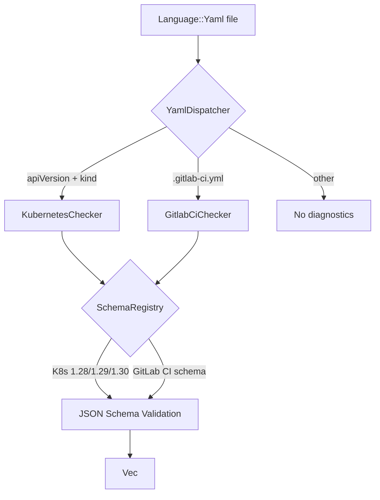
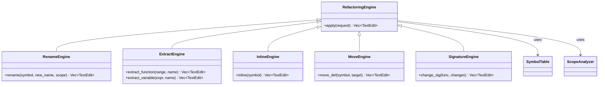
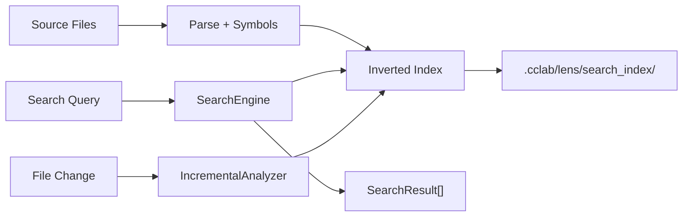

# Lens Comprehensive Spec

## Overview

Comprehensive upgrade to cclab-lens covering 5 major areas across 7 issues (#798-#804):

**1. Lint & Dispatch (#798, #801, #803)**
- YamlDispatcher: content-based routing of Language::Yaml to KubernetesChecker or GitlabCiChecker
- ~20 new lint rules across Dockerfile, Terraform, K8s, GitLab CI, Python security
- Bundled JSON schemas (K8s 1.28-1.30, GitLab CI) via include_bytes!() for offline validation

**2. Symbol Tables (#802)**
- New symbol builders for JavaScript (reuse TS), Dockerfile, Terraform, K8s (cross-file refs), GitLab CI
- Enables hover, go-to-definition, references for all new languages

**3. Refactoring Engine (#799)**
- 6 operations: Rename (cross-file), Extract Function, Extract Variable, Inline, Move Definition, Change Signature
- Python, TypeScript, Rust support
- New RPC methods + MCP tools

**4. Semantic Search (#800)**
- 6 modes: CallHierarchy, Usages, ByTypeSignature, Implementations, SimilarCode, DocumentationSearch
- Persisted inverted index under .cclab/lens/search_index/
- New MCP tools: lens_search, lens_call_graph

**5. Type Inference Gaps (#804)**
- TypeScript: generics, mapped types, conditional types, template literals
- Rust: lifetime elision, array size expressions, complex trait bounds, associated types

### Key Decisions
- K8s schemas: bundle all 3 versions (1.28, 1.29, 1.30)
- Python security rules: Warning severity by default
- GitLab CI cycle detection: full path reporting
- Refactoring: all 6 ops, cross-file rename, no undo (use git)
- Semantic search: all 6 modes, disk-persisted index
- JS symbols: reuse TS extractor
- K8s symbols: cross-file references (Service→Deployment)
- Rust lifetimes: full elision rules
- TS conditional types: full resolution when T is known
## Requirements

### R1 - YAML Dispatcher

```yaml
id: R1
priority: high
status: draft
```

Replace single `KubernetesChecker` entry in `CheckerRegistry` with `YamlDispatcher` composite checker. Routes based on:
- Filename `.gitlab-ci.yml` → GitlabCiChecker
- Content has `apiVersion:` + `kind:` → KubernetesChecker
- Otherwise → no diagnostics

### R2 - Expanded Lint Rules (~20 new)

```yaml
id: R2
priority: high
status: draft
```

| Language | New Rules | IDs |
|----------|-----------|-----|
| Dockerfile | 3 | DK004, DK006, DK010 |
| Terraform | 5 | TF002, TF003, TF007, TF009, TF010 |
| Kubernetes | 5 | K8002, K8005, K8008, K8009, K8010 |
| GitLab CI | 7 | GL002, GL005, GL006, GL009, GL010, GL011, GL012 |
| Python | 5 | PY301-PY305 (security: eval, exec, pickle, subprocess, hardcoded secrets) |

Python security rules default to Warning severity.

### R3 - Bundled JSON Schemas

```yaml
id: R3
priority: high
status: draft
```

Bundle via `include_bytes!()`:
- K8s API schemas for 1.28, 1.29, 1.30 (~5MB each)
- GitLab CI JSON schema
- `SchemaRegistry` struct with `validate_k8s(value, version)` and `validate_gitlab_ci(value)`
- K8s rules K8002, K8008 require schema; GitLab CI GL002 requires schema

### R4 - Symbol Tables for New Languages

```yaml
id: R4
priority: high
status: draft
```

| Language | Symbols |
|----------|---------|
| JavaScript | Reuse TS extractor (TS is superset) |
| Dockerfile | FROM stages, ENV vars, EXPOSE ports, LABEL keys, ARG decls |
| Terraform | resources, data, variables, outputs, locals, modules |
| K8s YAML | resources (name+kind+ns), labels, selectors, cross-file Service→Deployment refs |
| GitLab CI | jobs, stages, variables, templates, include refs |

Register in `semantic/symbols/mod.rs`. Wire to daemon hover/definition.

### R5 - Refactoring Engine

```yaml
id: R5
priority: high
status: draft
```

6 operations using existing types in `types/refactoring.rs`:
1. **Rename** — cross-file via project-wide SymbolTable index
2. **Extract Function** — selection → function with inferred params/return
3. **Extract Variable** — expression → named variable
4. **Inline** — replace references with definition body
5. **Move Definition** — between modules, update imports
6. **Change Signature** — add/remove/reorder params

Languages: Python, TypeScript, Rust. No undo (git revert).
Add RPC methods `refactor` to handler. Add MCP tools `lens_refactor`.

### R6 - Semantic Search Engine

```yaml
id: R6
priority: high
status: draft
```

6 search modes using existing types in `types/semantic_search.rs`:
1. **ByTypeSignature** — match `(str, int) -> bool`
2. **CallHierarchy** — callers/callees at depth N
3. **Implementations** — all impl of trait/interface
4. **Usages** — smart refs (exclude comments/strings)
5. **SimilarCode** — structural similarity
6. **DocumentationSearch** — docstring/comment search

Inverted index persisted to `.cclab/lens/search_index/`. Incremental update via IncrementalAnalyzer.
New MCP tools: `lens_search`, `lens_call_graph`. New RPC methods.

### R7 - TypeScript Inference Gaps

```yaml
id: R7
priority: medium
status: draft
```

- Generic type argument parsing (TODO at ~line 1290 in ts_infer.rs)
- Mapped types resolution (`{ [K in keyof T]: V }`)
- Conditional types with full resolution (`T extends U ? X : Y`)
- Template literal types (`\`hello ${string}\``)

### R8 - Rust Inference Gaps

```yaml
id: R8
priority: medium
status: draft
```

- Size expressions in array types `[T; N]`
- Complex trait bounds `T: Fn(A) -> B + Send + 'static`
- Associated type projections `<T as Trait>::Item`
- Full lifetime elision rules (single input, &self, etc.)
## Scenarios

### S1 - YAML Dispatcher Routes GitLab CI

**Given** a file named `.gitlab-ci.yml` with `stages: [build, test]`
**When** `cclab lens check .gitlab-ci.yml`
**Then** dispatches to GitlabCiChecker, reports GL* diagnostics (not K8*)

### S2 - YAML Dispatcher Routes K8s

**Given** a YAML file with `apiVersion: apps/v1` and `kind: Deployment`
**When** `cclab lens check k8s/deploy.yaml`
**Then** dispatches to KubernetesChecker, reports K8* diagnostics

### S3 - K8s Schema Validation

**Given** a K8s manifest missing required `spec.template` field
**When** validated against bundled 1.30 schema
**Then** reports K8002 (missing required fields) with path to missing field

### S4 - GitLab CI Cycle Detection

**Given** `.gitlab-ci.yml` with jobs A needs B, B needs C, C needs A
**When** `cclab lens check .gitlab-ci.yml`
**Then** reports GL006 with full cycle path: A→B→C→A

### S5 - Python Security Rules

**Given** a Python file with `eval(user_input)` and `subprocess.call(cmd, shell=True)`
**When** `cclab lens check app.py`
**Then** reports PY301 (eval) and PY304 (subprocess shell) as Warnings

### S6 - Dockerfile Hover on FROM Stage

**Given** daemon running, Dockerfile with `FROM node:18 AS builder`
**When** `cclab lens hover Dockerfile 1 25`
**Then** returns symbol info for stage `builder` with FROM base image

### S7 - Terraform Symbol Navigation

**Given** `main.tf` with `resource "aws_s3_bucket" "data"`
**When** `cclab lens definition main.tf 10 5` (on a reference to `aws_s3_bucket.data`)
**Then** returns position of the resource block definition

### S8 - Cross-File Rename

**Given** Python function `process_data` defined in `utils.py`, imported in `main.py` and `test.py`
**When** `cclab lens refactor rename utils.py 5 4 --new-name transform_data`
**Then** renames in all 3 files, updates import statements

### S9 - Extract Function

**Given** a selection of 5 lines in `app.py` that use variables `x` and `y`
**When** `cclab lens refactor extract-function app.py 10-14 --name compute_result`
**Then** creates new function `compute_result(x, y)` with return, replaces selection with call

### S10 - Call Hierarchy Search

**Given** daemon with indexed project
**When** `cclab lens search call-hierarchy utils.py 10 4 --depth 3`
**Then** returns callers/callees up to 3 levels with file positions

### S11 - Type Signature Search

**Given** project with multiple `(str) -> bool` functions
**When** `cclab lens search by-type "(str) -> bool"`
**Then** returns all matching functions across project with positions

### S12 - TS Conditional Type Resolution

**Given** TypeScript file with `type Result<T> = T extends Error ? never : T`
**When** `cclab lens type_at file.ts 5 10` where T is known to be `string`
**Then** resolves to `string` (not `never`)

### S13 - Rust Lifetime Elision

**Given** Rust function `fn first(s: &str) -> &str`
**When** `cclab lens hover lib.rs 3 4`
**Then** shows inferred lifetime: `fn first<'a>(s: &'a str) -> &'a str`
## Diagrams

### YAML Dispatch Flow



### Refactoring Architecture



### Search Index Architecture


## API Spec

### OpenAPI 3.1
<!-- TODO -->

### OpenRPC 1.3
<!-- TODO -->

### AsyncAPI 2.6
<!-- TODO -->

### Serverless Workflow 0.8
<!-- TODO -->

## Test Plan

### T1 - YAML Dispatcher Routing
Test GitLab CI detection by filename, K8s detection by content, fallback for plain YAML.

### T2 - New Lint Rules (per language)
For each of the ~25 new rules, create a test fixture with known violations and verify diagnostics.

### T3 - K8s Schema Validation
Validate K8s manifest against bundled 1.28/1.29/1.30 schemas. Test `--k8s-version` selection. Test missing required fields (K8002) and deprecated APIs (K8008).

### T4 - GitLab CI Schema + Cycle Detection
Test GL002 (unknown keywords via schema), GL005/GL006 (needs graph cycle detection with full path output).

### T5 - Python Security Rules
Test PY301-PY305 fire as Warning severity on eval/exec/pickle/subprocess/hardcoded secrets.

### T6 - Symbol Tables Per Language
For each new language, parse sample file and verify SymbolTable contains expected symbols. Test hover and definition responses via daemon.

### T7 - K8s Cross-File References
Create Service + Deployment YAML in same project. Verify Service selector → Deployment label cross-reference in symbol table.

### T8 - Refactoring: Rename
Test single-file rename, cross-file rename (function defined in A, imported in B/C). Verify import statements updated.

### T9 - Refactoring: Extract Function/Variable
Test extraction with inferred params/return. Test edge cases (multiple returns, captured variables).

### T10 - Refactoring: Inline/Move/ChangeSignature
Test inline replaces all references. Test move updates imports. Test signature change propagates to call sites.

### T11 - Semantic Search: CallHierarchy + Usages
Test callers/callees at depth 1 and 3. Test Usages excludes comments/strings.

### T12 - Semantic Search: ByTypeSignature + Implementations
Test matching `(str) -> bool`. Test finding all implementations of a Python protocol/TS interface.

### T13 - Search Index Persistence
Verify index written to `.cclab/lens/search_index/`. Restart daemon, verify warm load.

### T14 - TS Generics + Conditional Types
Test generic type argument resolution. Test conditional type evaluation when T is known vs unknown.

### T15 - Rust Lifetime Elision + Trait Bounds
Test lifetime inference on functions with single input ref. Test complex trait bound parsing `Fn(A) -> B + Send`.
## Changes

| File | Action | Description |
|------|--------|-------------|
| `src/lint/mod.rs` | MODIFY | Replace KubernetesChecker with YamlDispatcher in registry |
| `src/lint/yaml_dispatch.rs` | CREATE | YamlDispatcher composite checker (~80 lines) |
| `src/lint/dockerfile.rs` | MODIFY | Add DK004, DK006, DK010 rules |
| `src/lint/terraform.rs` | MODIFY | Add TF002, TF003, TF007, TF009, TF010 rules |
| `src/lint/kubernetes.rs` | MODIFY | Add K8002, K8005, K8008, K8009, K8010; wire SchemaRegistry |
| `src/lint/gitlab_ci.rs` | MODIFY | Add GL002, GL005, GL006, GL009-GL012; wire SchemaRegistry; cycle detection |
| `src/lint/python.rs` | MODIFY | Add PY301-PY305 security rules |
| `src/schemas/mod.rs` | CREATE | SchemaRegistry, include_bytes!() for bundled schemas |
| `src/schemas/k8s_1_28.json` | CREATE | Bundled K8s 1.28 API schema |
| `src/schemas/k8s_1_29.json` | CREATE | Bundled K8s 1.29 API schema |
| `src/schemas/k8s_1_30.json` | CREATE | Bundled K8s 1.30 API schema |
| `src/schemas/gitlab_ci.json` | CREATE | Bundled GitLab CI schema |
| `src/semantic/symbols/mod.rs` | MODIFY | Register new symbol builders |
| `src/semantic/symbols/javascript.rs` | CREATE | JS symbols (delegates to TS extractor) |
| `src/semantic/symbols/dockerfile.rs` | CREATE | Dockerfile symbol builder |
| `src/semantic/symbols/terraform.rs` | CREATE | Terraform/HCL symbol builder |
| `src/semantic/symbols/kubernetes.rs` | CREATE | K8s symbol builder with cross-file refs |
| `src/semantic/symbols/gitlab_ci.rs` | CREATE | GitLab CI symbol builder |
| `src/refactoring/mod.rs` | CREATE | RefactoringEngine trait + registry |
| `src/refactoring/rename.rs` | CREATE | Cross-file rename engine |
| `src/refactoring/extract.rs` | CREATE | Extract function/variable engine |
| `src/refactoring/inline.rs` | CREATE | Inline symbol engine |
| `src/refactoring/move_def.rs` | CREATE | Move definition engine |
| `src/refactoring/signature.rs` | CREATE | Change signature engine |
| `src/search/mod.rs` | CREATE | SearchEngine + index management |
| `src/search/index.rs` | CREATE | Inverted index with disk persistence |
| `src/search/query.rs` | CREATE | Query execution for 6 search modes |
| `src/types/ts_infer.rs` | MODIFY | Generics, mapped types, conditional types, template literals |
| `src/types/rust_infer.rs` | MODIFY | Lifetime elision, array sizes, trait bounds, associated types |
| `src/server/handler.rs` | MODIFY | Add refactor + search RPC methods |
| `src/mcp/tools.rs` | MODIFY | Add lens_refactor, lens_search, lens_call_graph tools |
| `src/lib.rs` | MODIFY | Add `pub mod refactoring; pub mod search; pub mod schemas;` |
| `Cargo.toml` | MODIFY | Add serde_json (for schema loading) if not present |
# Reviews