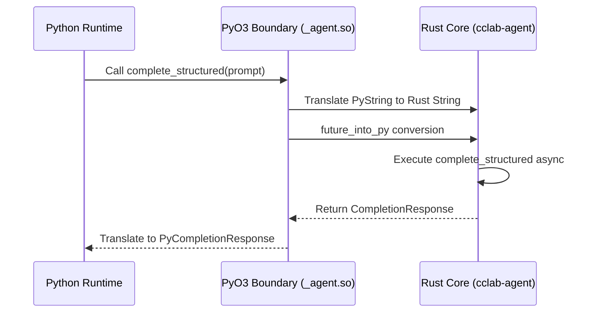
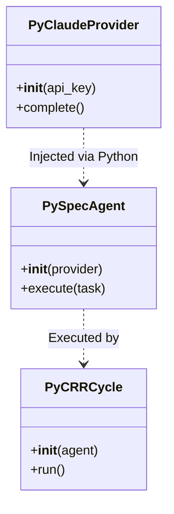

# Agent Pyo3 Spec

## Overview

## Overview

PyO3 bindings for cclab-agent. Module: _agent. Convention: Py{Name}.
## Requirements

### R1: PyAgent Trait Wrapper
Expose the `Agent` trait functionality through a `PyAgent` Python class.

### R2: Builder Pattern
Provide a `PyBuilder` class to allow constructing agents with method chaining from Python.

### R3: LLM Providers
Implement `PyClaudeProvider`, `PyOpenAIProvider`, and `PyGeminiProvider` wrapping the `LLMProvider` trait.

### R4: Completion Models
Expose `CompletionRequest` and `CompletionResponse` as `PyCompletionRequest` and `PyCompletionResponse`.

### R5: Specialized Agents
Expose `PyRestructureAgent` and `PyReviewAgent` with their corresponding cycle methods.
## Scenarios

### Scenario: Constructing an Agent
- **WHEN** a user creates a `PyBuilder`, adds a `PyClaudeProvider`, and builds the agent
- **THEN** it successfully returns a `PyAgent` instance.

### Scenario: Running a Completion
- **WHEN** a `PyAgent` receives a `PyCompletionRequest`
- **THEN** it delegates to the underlying Rust `Agent` and returns a `PyCompletionResponse`.

### Scenario: Using RestructureAgent
- **WHEN** a Python script invokes `PyRestructureAgent.run(...)`
- **THEN** the Rust `RestructureAgent` processes the input and returns the structured groups.
## Diagrams

### Sequence Diagram


### Class Diagram

## API Spec

No specific API endpoints, as this is a Python bindings library. The API consists of Python classes and methods exported via PyO3.
## Changes

```yaml
new_files:
  - path: crates/cclab-agent-pyo3/Cargo.toml
    description: "Maturin/PyO3 configuration for the bindings crate"
  - path: crates/cclab-agent-pyo3/src/lib.rs
    description: "PyO3 module definition named _agent"
  - path: crates/cclab-agent-pyo3/src/agents.rs
    description: "PyAgent, PyBuilder, PyRestructureAgent, PyReviewAgent"
  - path: crates/cclab-agent-pyo3/src/llm.rs
    description: "PyClaudeProvider, PyOpenAIProvider, PyGeminiProvider"
```
# Reviews