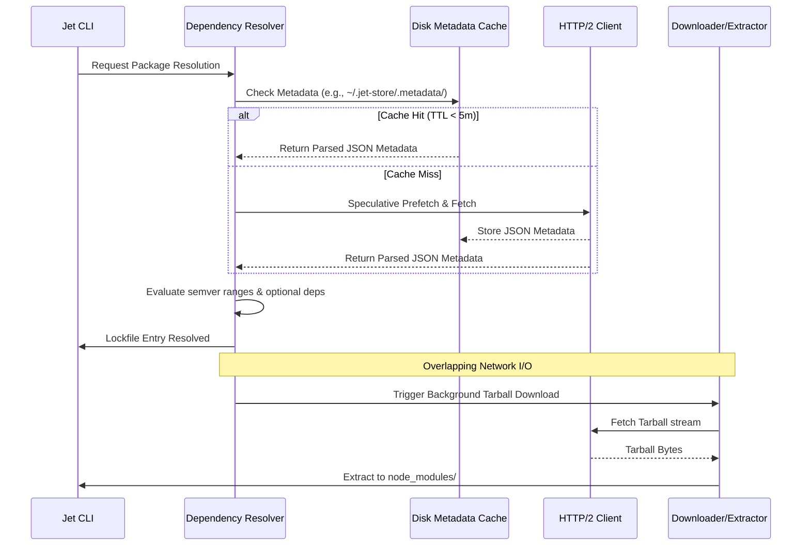
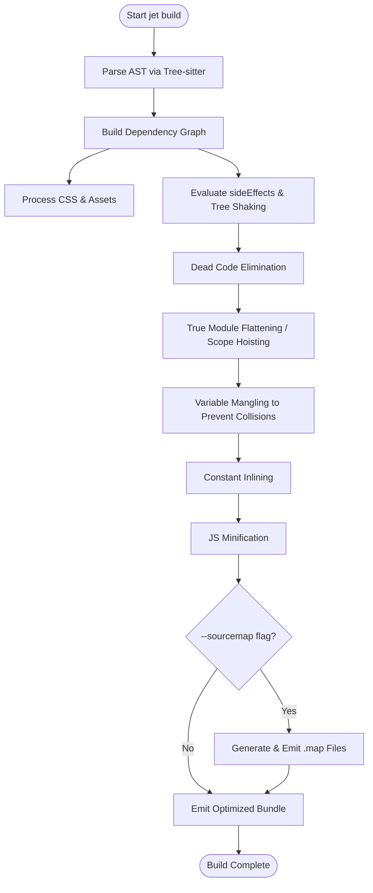

# All Open Jet Issues Spec

## Overview

This specification outlines the comprehensive enhancements to `jet` targeting performance, reliability, and AOT production readiness. It consolidates multiple improvements across the `jet build` and `jet install` workflows.

For `jet build`, it introduces a full AOT production build pipeline, incorporating advanced cross-module optimizations such as true module flattening (scope hoisting), tree shaking, variable mangling, and dead code elimination (DCE). It also provides foundational features including CSS standard bundling/modules, asset pipelines, and source maps generation. The build system's correctness will be heavily validated against real-world complex applications like React+Redux Realworld and TodoMVC, establishing full parity with Vite output expectations.

For `jet install`, the focus is on drastic cold-install performance improvements (targeting ≤ 3.0s). This is achieved via a persistent disk-based metadata cache (`~/.jet-store/.metadata/`), reqwest HTTP/2 multiplexing, speculative transitive prefetching, and overlapping network fetches. Resolver bugs dealing with version conflicts, complex ranges (`||`, space-separated), and optional dependencies are systematically addressed, and a lock-only mode (`--no-install`) is introduced.
## Requirements

### Jet Build: AOT Production & Scope Hoisting

- **R1: AOT Production Build Pipeline**
  Implement an end-to-end AOT production build pipeline supporting JavaScript minification by extending the existing Tree-sitter infrastructure. Enable code splitting and dynamic imports. Target a sub-196KB bundle size for `react-bench`.
- **R2: Cross-Module Optimization & Scope Hoisting**
  Implement true module flattening (merging module bodies into a single scope), variable mangling/renaming to prevent collisions, constant inlining, and cross-module Dead Code Elimination (DCE).
- **R3: Aggressive Tree Shaking**
  Strictly honor the `sideEffects` field in `package.json` dependencies (following standard npm conventions) to enable aggressive tree-shaking for libraries like React and MUI.
- **R4: Assets, Source Maps & CSS Pipeline**
  Provide an asset pipeline (handling images, fonts, `public/` directory). Add support for source maps (disabled by default, enabled via `--sourcemap`), standard CSS bundling, and CSS Modules.
- **R5: Build Validation & Parity**
  Build and successfully run the "TodoMVC React" and "React+Redux Realworld" applications to validate correct functional parity with Vite output. Document any unsupported complex legacy patterns as known limitations.

### Jet Install: Optimizations & Resolution

- **R6: Persistent Disk Metadata Cache**
  Implement a disk-based metadata cache in `~/.jet-store/.metadata/` to store npm registry JSON responses with a 5-minute TTL.
- **R7: HTTP & Network Fetch Overlapping**
  Optimize the `reqwest` HTTP client configuration for HTTP/2 multiplexing and connection reuse. Begin tarball fetches immediately when versions are resolved to overlap resolution and network I/O.
- **R8: Speculative Transitive Prefetching**
  Implement speculative prefetching of metadata for transitive dependencies to aggressively accelerate recursive graph resolutions. Target a cold install time of ≤ 3.0s.
- **R9: Resolver Robustness**
  Fix and consolidate resolver edge cases regarding `||` ranges, space-separated ranges, pre-release version handling, and `npm:` aliased packages. Accurately apply platform-specific filtering for `optionalDependencies`.
- **R10: Lock-Only Mode**
  Add a `--no-install` CLI flag to support updating `jet-lock.yaml` without downloading or extracting tarballs.
## Scenarios

### Scenario 1: AOT Scope Hoisting and Minification
- **WHEN** a user runs `jet build` on a production application (e.g., React Realworld).
- **THEN** the builder merges modules into a single flattened scope, mangles internal variable names to prevent collisions, applies Dead Code Elimination (DCE), and minifies the final JavaScript output, generating a significantly reduced bundle size.

### Scenario 2: Aggressive Tree Shaking via sideEffects
- **WHEN** a user runs `jet build` importing a named export from a library configured with `"sideEffects": false` (like MUI or lodash-es).
- **THEN** unused exports from that library are completely removed from the final bundle, as opposed to simply being marked as dead code.

### Scenario 3: Source Map Generation
- **WHEN** a user runs `jet build --sourcemap`.
- **THEN** the builder generates accurate `.map` files alongside the output JavaScript and CSS files, preserving original source lines across scope hoisting and minification transformations.

### Scenario 4: Cold Install with Metadata Caching
- **WHEN** a user runs `jet install` in a clean environment.
- **THEN** metadata is fetched with HTTP/2 multiplexing, speculative transitive dependencies are prefetched, tarball downloads begin immediately upon resolution, and the resulting metadata JSON is cached in `~/.jet-store/.metadata/`.

### Scenario 5: Warm Install using Disk Cache
- **WHEN** a user runs `jet install` within 5 minutes of the metadata being cached.
- **THEN** `jet` resolves the dependency graph entirely from the disk-based metadata cache in `~/.jet-store/.metadata/` without making new HTTP metadata requests.

### Scenario 6: Lock-Only Mode
- **WHEN** a user runs `jet install --no-install`.
- **THEN** the resolver processes the dependency graph and writes an updated `jet-lock.yaml`, but bypasses the tarball download and `node_modules` extraction phases entirely.

### Scenario 7: Complex Semver and Aliasing Resolution
- **WHEN** an application depends on packages with `||` semver ranges, space-separated ranges, and `npm:` aliases.
- **THEN** the `jet install` resolver correctly parses and evaluates these ranges without error, recording deterministic optimal matches in the lockfile.
## Diagrams

### Sequence Diagram: Optimized Install & Overlapping Fetch Pipeline

### Flowchart: AOT Production Build Pipeline

## API Spec

## Test Plan

- **AOT Build Unit Tests**: Add unit tests focusing on the Tree-sitter powered minifier, scope hoisting logic (ensuring collision-free variable renaming), and tree-shaking using `sideEffects: false` package definitions.
- **Source Map Verification**: Assert that source map files (`.map`) correctly map minified tokens back to original source code lines and columns.
- **Real-world Parity E2E Tests**: Use Playwright to smoke-test full builds of "TodoMVC React" and "Realworld React+Redux". Compare visual output, routing, and basic interactivity with equivalent Vite builds to guarantee absolute parity.
- **Install Performance Benchmarking**: Establish performance benchmarks to assert cold install speeds are ≤ 3.0s on reference hardware. Verify that cache hits result in skipped HTTP metadata fetching.
- **Resolver Unit Tests**: Introduce exhaustive unit testing for complex semver permutations (`||`, space-separated bounds, pre-release strings) and mock `optionalDependencies` filtering based on simulated host platforms (e.g., darwin vs linux).
- **Lock-Only Mode Integrity**: Test the `--no-install` flag to verify that `jet-lock.yaml` deterministic entries are fully populated but the `node_modules` tree remains completely empty.
## Changes

### Jet Build Architecture Additions
- **`crates/cclab-jet/src/build/minifier.rs`**: Introduce a new AST-based minification pass built on top of the existing Tree-sitter infrastructure.
- **`crates/cclab-jet/src/build/scope_hoist.rs`**: Add a dedicated transformer pass for module flattening, mapping `import`/`export` semantics to a unified global scope, complete with variable renaming logic to ensure collision-free mangling.
- **`crates/cclab-jet/src/build/tree_shake.rs`**: Implement a new Dead Code Elimination (DCE) mechanism that reads and enforces `sideEffects` properties mapped from `package.json`.
- **`crates/cclab-jet/src/build/source_map.rs`**: Add integration to generate and append V3 source maps correctly aligned with transformation and minification shifts.

### Jet Install Optimizations & Fixes
- **`crates/cclab-jet/src/install/cache.rs`**: Create a persistent disk-based JSON store logic pointing to `~/.jet-store/.metadata/` equipped with a 5-minute TTL TTL-expiration mechanism.
- **`crates/cclab-jet/src/install/network.rs`**: Refactor the `reqwest` client initialization to strictly enforce HTTP/2 multiplexing, keep-alive pooling, and trigger parallel/speculative tarball fetching.
- **`crates/cclab-jet/src/install/resolver.rs`**: Fix and enhance the resolution algorithm to natively support complex semantics (e.g., `||` operator, space-separated ranges, `npm:` package aliases) and apply OS/Arch conditional filtering for `optionalDependencies`.
- **`crates/cclab-jet/src/cli/install.rs`**: Introduce the `--no-install` argument, branching the execution flow to skip physical `node_modules` extraction while ensuring lockfile generation completes.

### E2E Testing Pipeline
- **`tests/e2e/realworld.spec.ts`**: Setup a Playwright suite running the final built artifacts of the "React+Redux Realworld" project against expected snapshot outputs.
# Reviews
