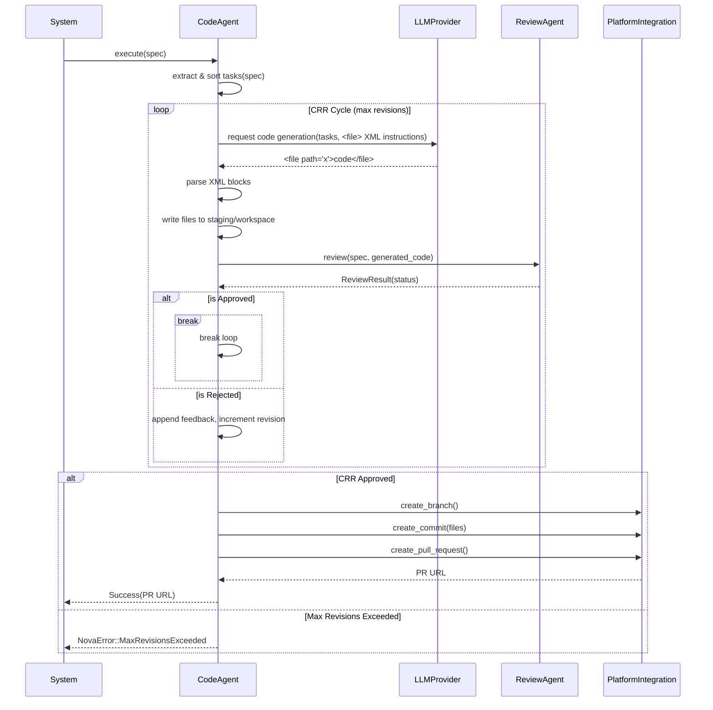

# Change Impl Agent Spec

## Overview

The CodeAgent is responsible for transforming approved specifications into code implementations. It operates within the `cclab-agent` crate and acts autonomously or interactively to fulfill implementation tasks. It bridges the gap between high-level specs and executable code by parsing specifications, decomposing them into topological task graphs, and delegating generation to an LLM.

Key responsibilities include:
1. Parsing specifications and decomposing them into ordered implementation tasks.
2. Interacting with platform integrations (e.g., GitHub, GitLab) to orchestrate source control (branches, commits, MRs/PRs).
3. Utilizing a multi-file XML code generation format for reliable and efficient LLM generation.
4. Coordinating with the `ReviewAgent` via the `CRRCycle` loop to ensure code quality and specification compliance.
5. Managing its own errors gracefully, rolling back or adjusting strategy when platform or LLM constraints are hit.
## Requirements

### R1: Task Decomposition and Sorting
The CodeAgent MUST parse a given specification, extract the necessary implementation tasks, and organize them into an execution-ordered list. It MUST utilize a topological sorting mechanism (conceptually similar to `TaskGraph::get_execution_order`) to ensure dependencies are respected (e.g., Data models implemented before Logic, Logic before Integration/Testing).

### R2: Multi-File Code Generation Format
The agent MUST instruct the LLM to output generated code for multiple files within a single response using a specific XML format. Each file's content MUST be encapsulated in `<file path="exact/path/to/file.ext">...</file>` tags to ensure reliable parsing and reduce LLM round trips.

### R3: Platform Integration for Source Control
The agent MUST NOT rely on local Git commands directly. Instead, it MUST use the `PlatformIntegration` trait (which MUST be extended to support `create_branch`, `create_commit`, and `create_pull_request` / `create_merge_request` operations). The GitHub and GitLab implementations of this trait MUST support these new operations.

### R4: CRRCycle and ReviewAgent Integration
The agent MUST coordinate with the existing `ReviewAgent` using the `CRRCycle` structure to facilitate automated code review. Upon generating code, it MUST pass the implemented code and the specification to the `ReviewAgent` and handle the resulting feedback iteratively until the code is approved or a maximum revision limit is reached.

### R5: Error Handling
The CodeAgent MUST handle failures gracefully using `NovaError`. This includes returning appropriate error variants for conditions such as hitting maximum revision cycles in the `CRRCycle`, failing to parse LLM XML output, or encountering platform integration API errors.
## Scenarios

### Scenario: Successful Spec Implementation and PR Creation
- **WHEN** the `CodeAgent` is provided with an approved specification and directed to implement it.
- **THEN** it correctly decomposes the spec into ordered tasks, prompts the LLM, parses the `<file>` XML tags, applies the generated code, successfully passes the `ReviewAgent` checks within the `CRRCycle`, creates a remote branch, commits the files, and opens a Pull/Merge Request.

### Scenario: CRRCycle Maximum Revisions Exceeded
- **WHEN** the `ReviewAgent` consistently finds issues with the generated code, causing the `CRRCycle` to loop and reach its configured maximum revision count.
- **THEN** the `CodeAgent` halts execution and returns a specific `NovaError` (e.g., `MaxRevisionsExceeded`) detailing the final unresolved review feedback, and NO Pull/Merge Request is created.

### Scenario: LLM Generates Malformed XML Output
- **WHEN** the LLM generates a response where the `<file>` tags are malformed or missing the `path` attribute.
- **THEN** the `CodeAgent` detects the formatting error during parsing, securely captures the error, and either requests a correction from the LLM or throws a `NovaError` (e.g., `MalformedLLMResponse`), preventing invalid data from being written to the filesystem.

### Scenario: Platform Integration API Failure
- **WHEN** the `CodeAgent` attempts to create a commit or branch using the `PlatformIntegration` but the underlying GitHub/GitLab API returns a failure (e.g., network error or missing permissions).
- **THEN** the `CodeAgent` catches the error, aborts the current integration step, and returns a contextual `NovaError` containing the upstream API error details.
## Diagrams

### Sequence Diagram

## API Spec

## Changes

- `crates/cclab-agent/src/agents/code_agent/mod.rs`: 
  - **CREATE**: Introduce the `CodeAgent` struct.
  - **DO**: Implement the `Agent` trait, providing the main execution entry point for implementing specs. Orchestrate the flow of parsing specs, triggering LLM generation, handling CRR feedback, and finalizing via `PlatformIntegration`.

- `crates/cclab-agent/src/agents/code_agent/parser.rs`:
  - **CREATE**: Add parsing utilities for extracting task blocks from the spec.
  - **DO**: Add XML parsing functions to reliably extract `<file path="...">...</file>` blocks from the LLM responses.

- `crates/cclab-agent/src/agents/code_agent/tasks.rs`:
  - **CREATE**: Task decomposition logic.
  - **DO**: Implement topological sorting to ensure tasks are executed in the correct order (Data -> Logic -> Integration -> Test).

- `crates/cclab-agent/src/integrations/mod.rs`:
  - **MODIFY**: Expand the `PlatformIntegration` trait.
  - **DO**: Add new asynchronous methods: `create_branch`, `create_commit`, and `create_pull_request` (or equivalent merge request).

- `crates/cclab-agent/src/integrations/github.rs` & `crates/cclab-agent/src/integrations/gitlab.rs`:
  - **MODIFY**: Implement the newly added methods from `PlatformIntegration`.
  - **DO**: Map the `create_branch`, `create_commit`, and `create_pull_request` functions to their respective platform API calls.

- `crates/cclab-agent/src/error.rs` (or equivalent error handling module):
  - **MODIFY**: Extend `NovaError` enum.
  - **DO**: Add variants for `MaxRevisionsExceeded`, `MalformedLLMResponse`, and any new platform API errors.
# Reviews
