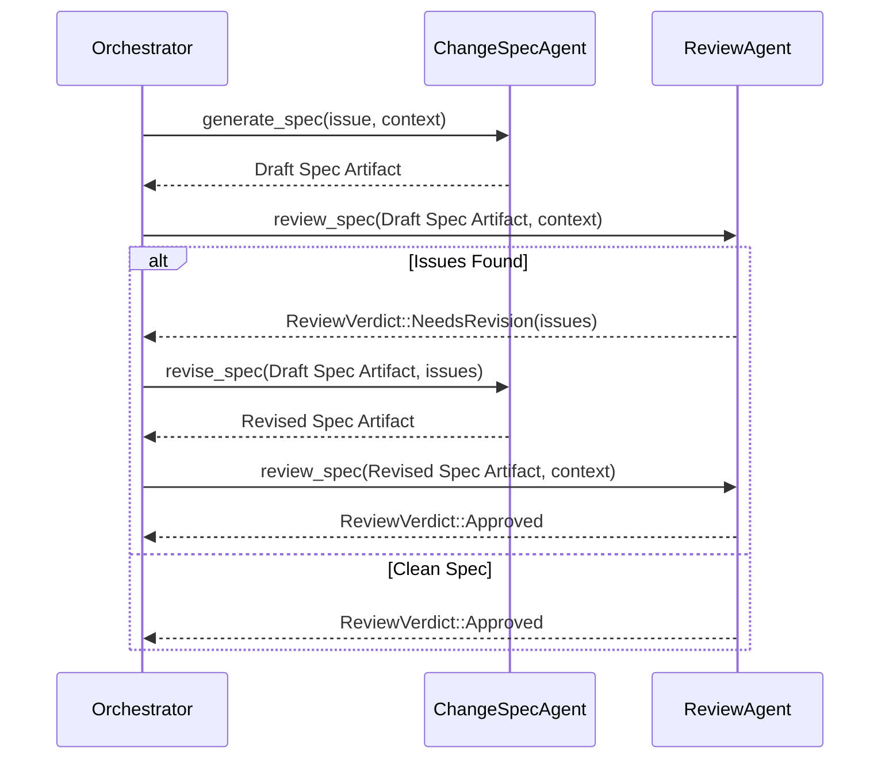
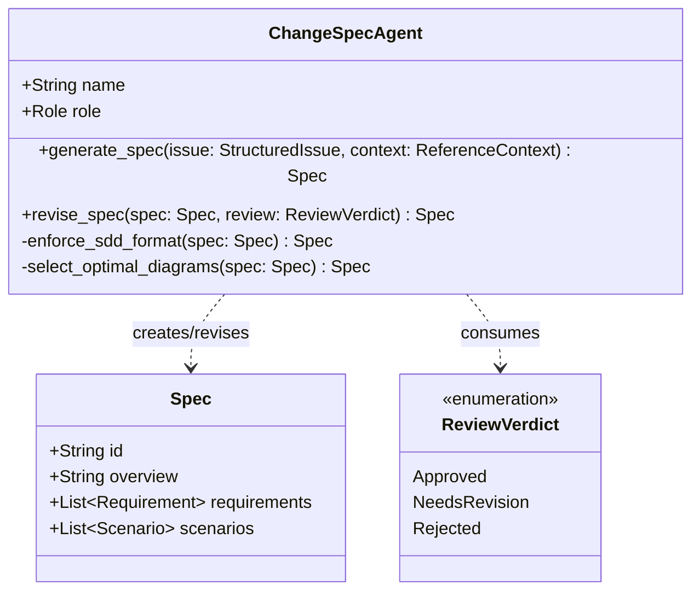

# Change Spec Agent Spec

## Overview

The `ChangeSpecAgent` is a specialized builder agent responsible for generating formal technical specifications based on structured issues and a synthesized `ReferenceContext`. 

It operates with an opinionated understanding of the `cclab-sdd` specification format rules. It enforces priority for structured representations (OpenRPC > JSON Schema > Mermaid > YAML > Markdown > Prose), applies strict diagram selection heuristics (e.g., FSMs to stateDiagrams, APIs to Sequence Diagrams), and adheres to the mandatory section structure (Overview, Requirements, Scenarios, etc.) to minimize natural language. 

The agent runs as the "creator" in a Create-Review-Revise (CRR) cycle, coordinating with the `ReviewAgent` (in Spec review mode) to iterate on the specification until it meets quality standards (e.g., < 10% natural language, absence of implementation code).
## Requirements

### R1: Spec Generation from Structured Inputs
The agent MUST accept a `StructuredIssue` and a `ReferenceContext` as input and generate a formal technical specification that resolves the issue while adhering to the contextual constraints.

### R2: SDD Format Prioritization
The agent MUST enforce `cclab-sdd` format priorities, selecting formal schemas (OpenRPC, JSON Schema, Mermaid) over Markdown and raw prose where applicable. Natural language MUST NOT exceed 10% of the spec.

### R3: Automated Diagram Selection
The agent MUST apply heuristic rules to select appropriate Mermaid diagram types based on the task:
- State machines and lifecycles -> `stateDiagram-v2`
- Algorithms and DAGs -> `flowchart`
- Object relations and data models -> `classDiagram`
- System interactions and APIs -> `sequenceDiagram`

### R4: Strict Section Structure
The agent MUST generate output conforming strictly to the `cclab-sdd` template structure: Overview, Requirements, Scenarios, Diagrams, API Spec, Test Plan, and Changes. Extraneous sections MUST NOT be generated.

### R5: CRR Cycle Integration
The agent MUST operate seamlessly within the Create-Review-Revise (CRR) cycle. It MUST be capable of receiving a `ReviewVerdict::NeedsRevision` containing checklist results and issues from the `ReviewAgent`, and appropriately revising the specification to resolve the findings.

### R6: Abstraction Enforcement (No Code)
The agent MUST NEVER generate real implementation code (e.g., Rust, Python, TypeScript) in the specification. It MUST restrict logic definitions to pseudo-code, interfaces, and formal abstractions.
## Scenarios

### Scenario: Happy Path Specification Generation
- **WHEN** a `StructuredIssue` defining a new API feature and a clear `ReferenceContext` are provided
- **THEN** the agent generates a complete specification containing OpenAPI schemas, sequence diagrams, and interface abstractions, adhering strictly to the template structure and passing review on the first attempt.

### Scenario: CRR Rejection Recovery (Too Much Prose)
- **WHEN** the generated specification contains a large paragraph explaining business logic, and the `ReviewAgent` returns `ReviewVerdict::NeedsRevision` with a failed checklist item for "excessive prose"
- **THEN** the agent processes the feedback and revises the specification, replacing the natural language paragraph with an equivalent Mermaid `flowchart` or `stateDiagram-v2`.

### Scenario: Abstraction Enforcement Recovery
- **WHEN** the agent accidentally includes a snippet of actual Rust implementation code in the "Interfaces" section
- **THEN** the `ReviewAgent` flags it as a severity HIGH issue, and the agent rewrites the section to use standard pseudocode blocks (e.g., `FUNCTION name(params) -> Result` with `INPUT`/`OUTPUT`/`ERRORS`).
## Diagrams

### Sequence Diagram

### Class Diagram

## API Spec

## Changes

- `crates/cclab-agent/src/agents/change_spec.rs` (Create): Implement `ChangeSpecAgent` conforming to `AgentBuilder` and providing core methods to map `StructuredIssue` and `ReferenceContext` to a full `Spec`.
- `crates/cclab-agent/src/agents/mod.rs` (Modify): Export `change_spec` module.
- `cclab/specs/cclab-agent/agents/change-spec-agent.md` (Create): The main spec for the agent.
# Reviews
