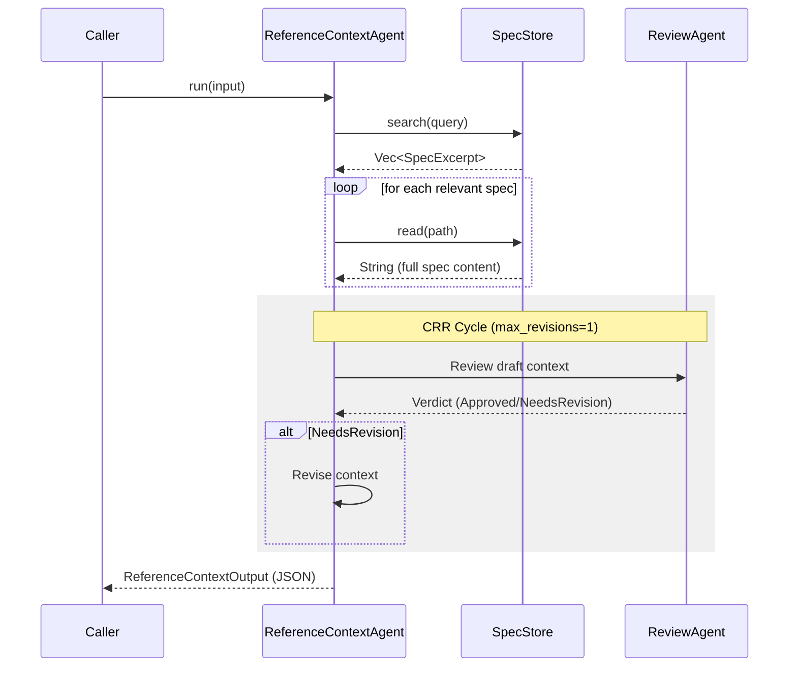
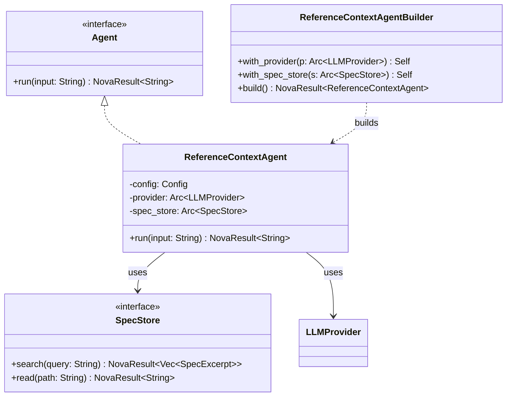

# Reference Context Agent Spec

## Overview

The `ReferenceContextAgent` is a specialized agent within the `cclab-agent` framework designed to automate the discovery and synthesis of specification context for spec-driven development (SDD). Operating during phases 4 (reference-context) and 5 (post-clarification) of the SDD workflow, the agent interfaces with the `SpecStore` to search for and read existing specifications. It evaluates and scores their relevance to the current change, identifies key requirements, and detects contradictions. It also employs an internal quality review loop via the `ReviewAgent` (the CRR Cycle) to ensure the accuracy and comprehensiveness of the generated reference context. This context is ultimately produced as a structured artifact to guide downstream agents.
## Requirements

### R1: Interface with SpecStore
The agent MUST use the `SpecStore` to search for specifications related to the change. The `SpecStore` trait MUST be extended with a `read(id: &str) -> NovaResult<String>` method to allow full text retrieval of specs, in addition to the existing `search` method.

### R2: Score Spec Relevance
The agent MUST evaluate each discovered spec and assign a relevance score of `high`, `medium`, or `low` based on its relationship to the current change group.

### R3: Identify Key Requirements
For each relevant spec, the agent MUST extract a concise summary of its key requirements that are applicable to the current change.

### R4: Detect Contradictions
The agent MUST analyze the discovered specs against the user's change requirements and explicitly identify any contradictions or conflicts.

### R5: Produce Structured Reference Artifact
The agent MUST generate a structured artifact containing the list of relevant specs, their assigned group, their relevance score, and the extracted key requirements.

### R6: Internal Quality Review (CRR Cycle)
The agent MUST utilize the `ReviewAgent` within a Create-Review-Revise (CRR) cycle (with `max_revisions=1` and `auto-approve` semantics) to internally review the quality, accuracy, and completeness of the reference context before finalizing it.

### R7: SDD Phase Support
The agent MUST support execution during Phase 4 (reference-context) and transition states properly, recognizing when it operates post-clarifications (Phase 5).
## Scenarios

### Scenario: Successful Context Generation
- **WHEN** the `ReferenceContextAgent` receives a change request with clear requirements.
- **THEN** it searches the `SpecStore`, identifies relevant specs, reads their full content, and produces a highly accurate reference context artifact containing key requirements and scoring without needing revisions from the `ReviewAgent`.

### Scenario: Internal Review Triggers Revision
- **WHEN** the `ReferenceContextAgent` generates an initial reference context that misses a key contradiction or mis-scores a spec.
- **THEN** the `ReviewAgent` flags the deficiency, and the `ReferenceContextAgent` refines the reference context before finalizing the artifact.

### Scenario: SpecStore Read Support
- **WHEN** the `ReferenceContextAgent` identifies a potentially relevant spec via search.
- **THEN** it successfully calls `SpecStore::read()` to fetch the full markdown content to deeply analyze its requirements and relevance.
## Diagrams

## Diagrams

### Flow: Reference Context Generation



### Class Diagram


## API Spec

## API Spec

### SpecStore

Extend the existing `SpecStore` trait (in `crates/cclab-agent/src/agents/restructure.rs`):

```rust
#[async_trait]
pub trait SpecStore: Send + Sync {
    /// Return spec excerpts ranked by relevance to the query.
    async fn search(&self, query: &str) -> NovaResult<Vec<SpecExcerpt>>;
    
    /// Return the full text of a specification file.
    async fn read(&self, path: &str) -> NovaResult<String>;
}
```

### ReferenceContextAgent

The `ReferenceContextAgent` is a standard agent implementation:

```rust
// crates/cclab-agent/src/agents/reference_context.rs

pub struct ReferenceContextAgent {
    config: ReferenceContextAgentConfig,
    provider: Arc<dyn LLMProvider>,
    spec_store: Arc<dyn SpecStore>,
    review_agent: Arc<dyn Reviewer>, // for internal quality review
}

#[async_trait]
impl Agent for ReferenceContextAgent {
    async fn run(&self, input: &str) -> NovaResult<String>;
    async fn run_with_handler(&self, input: &str, handler: &dyn StreamHandler) -> NovaResult<String>;
}

pub struct ReferenceContextAgentBuilder {
    // ... builder fields
}

impl ReferenceContextAgentBuilder {
    pub fn new() -> Self;
    pub fn with_provider(mut self, provider: Arc<dyn LLMProvider>) -> Self;
    pub fn with_spec_store(mut self, store: Arc<dyn SpecStore>) -> Self;
    pub fn with_review_agent(mut self, reviewer: Arc<dyn Reviewer>) -> Self;
    pub fn build(self) -> NovaResult<ReferenceContextAgent>;
}
```

### Output Schema (JSON)

```json
{
  "$schema": "http://json-schema.org/draft-07/schema#",
  "type": "object",
  "required": ["specs", "contradictions"],
  "properties": {
    "specs": {
      "type": "array",
      "items": {
        "type": "object",
        "required": ["spec_id", "spec_group", "relevance", "key_requirements"],
        "properties": {
          "spec_id": { "type": "string", "description": "Path relative to cclab/specs/" },
          "spec_group": { "type": "string", "description": "Logical group name" },
          "relevance": { "type": "string", "enum": ["high", "medium", "low"] },
          "key_requirements": { "type": "array", "items": { "type": "string" } }
        }
      }
    },
    "contradictions": {
      "type": "array",
      "items": {
        "type": "object",
        "required": ["spec_id", "requirement", "conflict", "resolution"],
        "properties": {
          "spec_id": { "type": "string" },
          "requirement": { "type": "string" },
          "conflict": { "type": "string" },
          "resolution": { "type": "string" }
        }
      }
    }
  }
}
```
## Changes

- `crates/cclab-agent/src/context/spec_store.rs`
  - Modify `SpecStore` trait: Add `fn read(&self, id: &str) -> NovaResult<String>`.
  - Update any existing implementations of `SpecStore` to implement the new `read` method.
- `crates/cclab-agent/src/agents/reference_context.rs`
  - Create new file.
  - Create new `ReferenceContextAgent` struct and implement `Agent` trait.
  - Implement internal methods to query `SpecStore`, read full text specs, and generate the reference context using the `ReviewAgent` via the CRR cycle.
  - Implement builder pattern with `ReferenceContextAgentBuilder`.
- `crates/cclab-agent/src/agents/mod.rs`
  - Export the `ReferenceContextAgent` module components.
- `crates/cclab-agent/src/types/artifacts.rs`
  - Define `ReferenceContext` schema or similar structures for typed output (representing the list of specs, relevance, key_requirements, and contradictions).
# Reviews