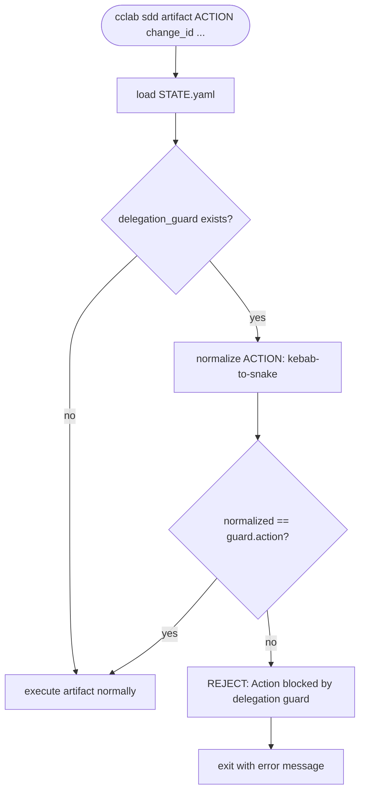

# Artifact Guard — Delegation Scope Enforcement

## Overview
<!-- type: overview lang: markdown -->

When a delegated agent is dispatched (via `sdd_delegate_agent`), a `delegation_guard` is set in STATE.yaml recording the expected action. Currently, artifact CLI commands (`cclab sdd artifact`) do not check this guard, allowing agents to call any artifact command regardless of scope.

This fix adds a guard check at the artifact CLI entry point. When `delegation_guard` is active, only the matching artifact action is allowed. All others are rejected with a clear error.

## Guard Check Logic
<!-- type: logic lang: mermaid -->



## Changes
<!-- type: changes lang: yaml -->

```yaml
files:
  - path: crates/cclab-sdd/src/tools/mod.rs
    action: MODIFY
    desc: Add guard check in artifact tool dispatch (call_artifact_tool or similar entry point)
  - path: crates/cclab-sdd/src/state/manager.rs
    action: MODIFY
    desc: Add check_delegation_guard(action) -> Result method
```

# Reviews
