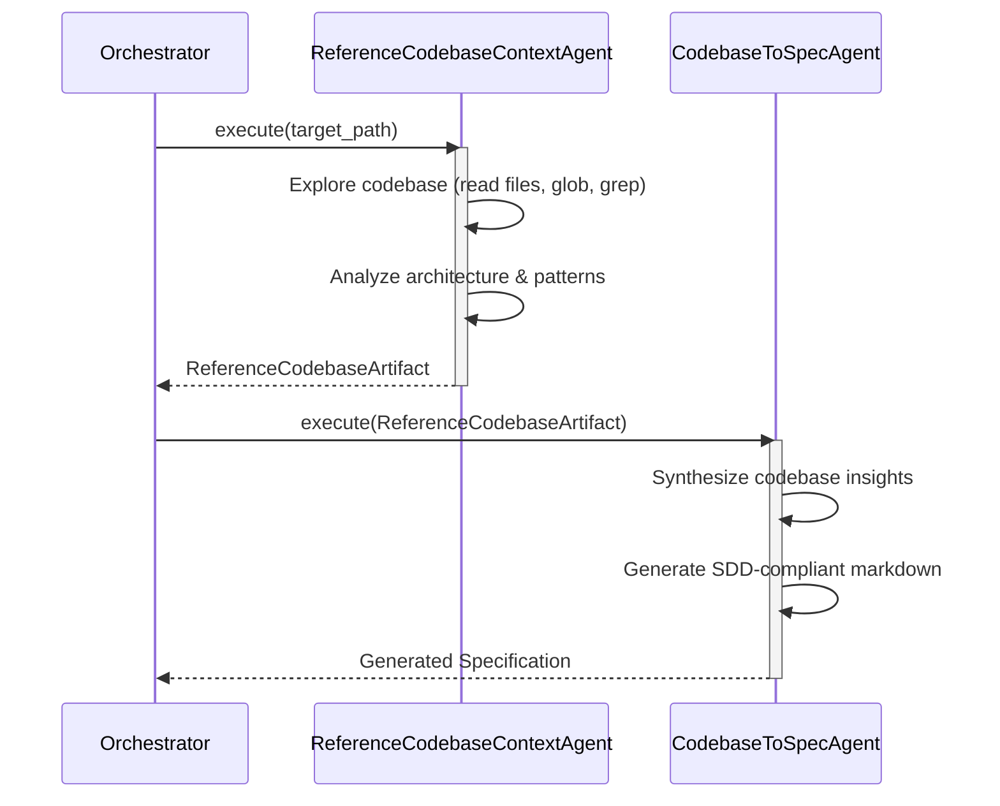

# Fillback Agents Spec

## Overview

This specification outlines the introduction of "fillback" reverse flow agents, specifically `ReferenceCodebaseContextAgent` and `CodebaseToSpecAgent`. It also covers the renaming of the existing `ReferenceContextAgent` to `ReferenceSpecContextAgent` to clarify its role. 

The reverse flow agents enable a codebase-to-spec synchronization workflow. The `ReferenceCodebaseContextAgent` is responsible for exploring the codebase, understanding its architecture, and extracting relevant context. The `CodebaseToSpecAgent` takes this context and reverse-engineers structured specifications from the existing code.
## Requirements

### R1: Rename ReferenceContextAgent
The existing `ReferenceContextAgent` MUST be renamed to `ReferenceSpecContextAgent` across the codebase. This includes updating the struct name, file name, builder methods, logs, and any usages to accurately reflect its role in resolving specification context.

### R2: ReferenceCodebaseContextAgent Implementation
A new `ReferenceCodebaseContextAgent` MUST be implemented, adhering to the `Agent` trait. This agent MUST be capable of autonomous codebase exploration to understand architecture and gather context for reverse engineering. It MUST have access to coding tools such as ReadFile, Glob, Grep, and Bash to perform its exploration.

### R3: ReferenceCodebaseContextAgent Output Schema
The `ReferenceCodebaseContextAgent` MUST produce a structured output (e.g., `ReferenceCodebaseArtifact`) detailing the discovered codebase context. This includes identified key files, architectural patterns, relationships, and dependencies.

### R4: CodebaseToSpecAgent Implementation
A new `CodebaseToSpecAgent` MUST be implemented, adhering to the `Agent` trait. It MUST take the codebase context (such as the one produced by `ReferenceCodebaseContextAgent`) as input and reverse-engineer structured specifications from it.

### R5: CodebaseToSpecAgent Output Schema
The `CodebaseToSpecAgent` MUST output structured specification artifacts aligned with the SDD (Spec-Driven Development) format. The generated specs must accurately reflect the functionality, data models, and logic present in the analyzed code.

### R6: Agent Builder Integration
Both `ReferenceCodebaseContextAgent` and `CodebaseToSpecAgent` MUST utilize the established builder pattern for instantiation and configuration, maintaining consistency with existing agent construction conventions.
## Scenarios

### Scenario: Instantiate Renamed Agent
- **WHEN** the system orchestrator or agent factory creates an agent for resolving spec context
- **THEN** it successfully instantiates the `ReferenceSpecContextAgent` using its updated builder.
- **AND THEN** the system logs and types reflect the `ReferenceSpecContextAgent` name.

### Scenario: Codebase Exploration and Context Extraction
- **WHEN** the `ReferenceCodebaseContextAgent` is invoked with a specific codebase module or component
- **THEN** it utilizes its provided coding tools (e.g., read_file, glob) to inspect the files
- **AND THEN** it completes by returning a structured `ReferenceCodebaseArtifact` detailing the discovered architecture, dependencies, and key logic.

### Scenario: Specification Generation from Code Context
- **WHEN** the `CodebaseToSpecAgent` is provided with a codebase context artifact
- **THEN** it analyzes the provided context
- **AND THEN** it generates a structured Markdown specification adhering to SDD guidelines, including sections for Overview, Requirements, and APIs/Diagrams if applicable.
## Diagrams

### Sequence Diagram

## API Spec

## Changes

* **Rename `ReferenceContextAgent` to `ReferenceSpecContextAgent`**
  * Search the codebase and rename all occurrences of `ReferenceContextAgent` to `ReferenceSpecContextAgent`.
  * Rename the source file (e.g., `crates/cclab-agent/src/agents/reference_context.rs` to `crates/cclab-agent/src/agents/reference_spec_context.rs`).
  * Update associated builder patterns, logs, and agent registry entries.

* **Implement `ReferenceCodebaseContextAgent`**
  * Create a new file for the agent (e.g., `crates/cclab-agent/src/agents/reference_codebase_context.rs`).
  * Implement the `Agent` trait for the new struct.
  * Define the structured output schema (e.g., `ReferenceCodebaseArtifact`).
  * Configure the agent builder to include necessary codebase exploration tools (like `ReadFile`, `Glob`, `Grep`, `Bash`).
  * Write unit tests verifying context extraction capabilities.

* **Implement `CodebaseToSpecAgent`**
  * Create a new file for the agent (e.g., `crates/cclab-agent/src/agents/codebase_to_spec.rs`).
  * Implement the `Agent` trait for the new struct.
  * Define the input dependencies and expected output structure (e.g., a synthesized Markdown string or specific SDD component blocks).
  * Set up the agent builder and associated prompts.
  * Write unit tests verifying spec generation from mock codebase contexts.

* **Update Agent Exporters and Orchestration**
  * Register both `ReferenceCodebaseContextAgent` and `CodebaseToSpecAgent` within the agent registry or factory system so they can be constructed dynamically or via workflows.
# Reviews
