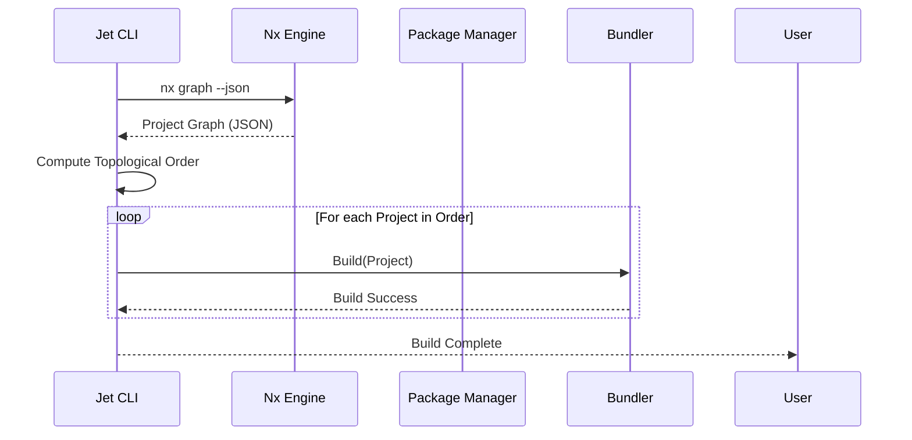
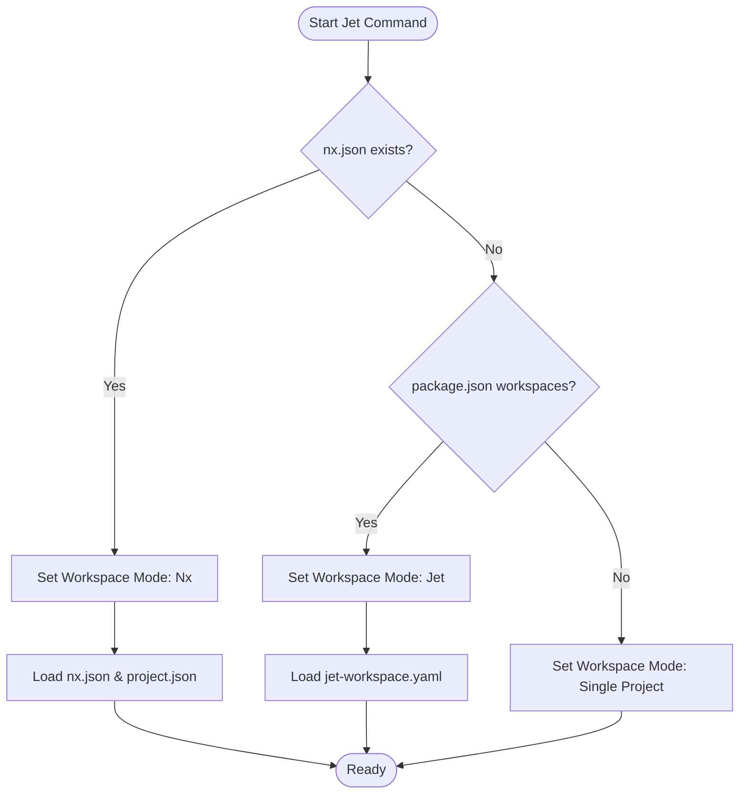

# Jet Nx Support Spec

## Overview


This specification outlines the architecture and design for adding Nx monorepo support to Jet. By integrating directly with Nx, Jet will be able to detect Nx workspaces, build a comprehensive project graph, and execute Jet-specific tasks (like `build` and `install`) as Nx targets. This enhances dependency resolution, caching, and task execution within large, multi-project repositories that rely on Nx.
## Requirements


### R1: Workspace Detection
Jet must automatically detect when it is operating within an Nx monorepo by locating configuration files such as `nx.json`. This should correctly identify the workspace root.

### R2: Project Graph Integration
Jet must integrate with the Nx project graph to infer and understand project dependencies within the monorepo, enabling accurate dependency resolution.

### R3: Task Pipeline Integration
Jet must define a task pipeline that allows execution of standard Jet commands, such as `jet build` and `jet install`, mapping them to executable Nx targets.

### R4: Configuration Handling
Jet must correctly parse and respect settings present in Nx-specific configuration files (e.g., `nx.json` and `project.json`) to adjust its behavior contextually for each project in the monorepo.
## Scenarios


### Scenario: Nx Workspace Initialization
- **WHEN** a user runs Jet in a repository containing an `nx.json` file.
- **THEN** Jet automatically detects the workspace type as an Nx monorepo and sets the appropriate internal state.

### Scenario: Resolving Dependencies from the Project Graph
- **WHEN** Jet attempts to build a project that depends on other local packages defined in `project.json`.
- **THEN** Jet interfaces with the Nx project graph to discover and order the dependencies appropriately before triggering the build.

### Scenario: Executing Jet Build as an Nx Target
- **WHEN** a user requests a build operation on a package inside the Nx workspace.
- **THEN** Jet translates this into an Nx task pipeline command, executing `jet build` via Nx caching and task orchestration.

### Scenario: Fallback for Non-Nx Workspaces
- **WHEN** Jet is executed in a standard repository lacking `nx.json`.
- **THEN** Jet proceeds using its default workspace logic without attempting to query Nx configurations or graphs.
## Diagrams


### Workspace Detection Flow


### Build Sequence in Nx

## Diagrams


### Workspace Detection Flow


### Build Sequence in Nx

## API Spec


### Interfaces

#### NxWorkspaceManager
```
FUNCTION NxWorkspaceManager::discover(root: Path) -> Result<Option<NxWorkspaceManager>>
  INPUT: Root path of the repository
  OUTPUT: Some(NxWorkspaceManager) if nx.json exists, otherwise None
  ERRORS: If nx.json is malformed

FUNCTION NxWorkspaceManager::get_project_graph() -> Result<NxProjectGraph>
  INPUT: None
  OUTPUT: Full project dependency graph from Nx
  ERRORS: If Nx CLI is missing or returns error

FUNCTION NxProjectGraph::topological_sort() -> Vec<ProjectName>
  INPUT: None
  OUTPUT: Sorted list of project names for build ordering
```

#### CLI Integration
```
FUNCTION run_build_command(project_name: Option<String>) -> Result<()>
  INPUT: Optional project name to build
  SIDE_EFFECTS: 
    - If in Nx mode:
      - Fetch graph
      - Filter projects if project_name provided
      - Build selected projects in order
    - Else:
      - Use standard build logic
```
## API Spec


### Interfaces

#### NxWorkspaceManager
```
FUNCTION NxWorkspaceManager::discover(root: Path) -> Result<Option<NxWorkspaceManager>>
  INPUT: Root path of the repository
  OUTPUT: Some(NxWorkspaceManager) if nx.json exists, otherwise None
  ERRORS: If nx.json is malformed

FUNCTION NxWorkspaceManager::get_project_graph() -> Result<NxProjectGraph>
  INPUT: None
  OUTPUT: Full project dependency graph from Nx
  ERRORS: If Nx CLI is missing or returns error

FUNCTION NxProjectGraph::topological_sort() -> Vec<ProjectName>
  INPUT: None
  OUTPUT: Sorted list of project names for build ordering
```

#### CLI Integration
```
FUNCTION run_build_command(project_name: Option<String>) -> Result<()>
  INPUT: Optional project name to build
  SIDE_EFFECTS: 
    - If in Nx mode:
      - Fetch graph
      - Filter projects if project_name provided
      - Build selected projects in order
    - Else:
      - Use standard build logic
```
## Changes


### 1. Data Layer
- [MODIFY] `crates/cclab-jet/src/pkg_manager/workspace.rs`:
  - Add `NxWorkspaceManager` struct.
  - Implement `WorkspaceManager::discover` to call `NxWorkspaceManager::discover`.
- [CREATE] `crates/cclab-jet/src/pkg_manager/nx.rs`:
  - Implement `NxProjectGraph` and `NxProject` data structures for JSON parsing.
  - Add logic to execute `nx graph --json` using `std::process::Command`.

### 2. Logic Layer
- [MODIFY] `crates/cclab-jet/src/pkg_manager/workspace.rs`:
  - Integrate `NxWorkspaceManager` into the primary `WorkspaceManager` logic.
  - Implement `topological_sort` for `NxProjectGraph`.
- [MODIFY] `crates/cclab-jet/src/cli.rs`:
  - Update `build` and `install` handlers to support Nx-specific execution paths.
  - Ensure correct working directory management when running inside Nx.

### 3. Integration Layer
- [MODIFY] `crates/cclab-jet/src/cli.rs`:
  - Add `--nx` flag (optional) to force Nx mode or override automatic detection.
  - Map standard CLI arguments to Nx-compatible inputs.

### 4. Testing Layer
- [CREATE] `crates/cclab-jet/tests/nx_support.rs`:
  - Add integration tests for Nx workspace detection and task execution.
- [CREATE] `crates/cclab-jet/src/pkg_manager/nx_test.rs`:
  - Add unit tests for `NxProjectGraph` and JSON parsing.
## Changes


### 1. Data Layer
- [MODIFY] `crates/cclab-jet/src/pkg_manager/workspace.rs`:
  - Add `NxWorkspaceManager` struct.
  - Implement `WorkspaceManager::discover` to call `NxWorkspaceManager::discover`.
- [CREATE] `crates/cclab-jet/src/pkg_manager/nx.rs`:
  - Implement `NxProjectGraph` and `NxProject` data structures for JSON parsing.
  - Add logic to execute `nx graph --json` using `std::process::Command`.

### 2. Logic Layer
- [MODIFY] `crates/cclab-jet/src/pkg_manager/workspace.rs`:
  - Integrate `NxWorkspaceManager` into the primary `WorkspaceManager` logic.
  - Implement `topological_sort` for `NxProjectGraph`.
- [MODIFY] `crates/cclab-jet/src/cli.rs`:
  - Update `build` and `install` handlers to support Nx-specific execution paths.
  - Ensure correct working directory management when running inside Nx.

### 3. Integration Layer
- [MODIFY] `crates/cclab-jet/src/cli.rs`:
  - Add `--nx` flag (optional) to force Nx mode or override automatic detection.
  - Map standard CLI arguments to Nx-compatible inputs.

### 4. Testing Layer
- [CREATE] `crates/cclab-jet/tests/nx_support.rs`:
  - Add integration tests for Nx workspace detection and task execution.
- [CREATE] `crates/cclab-jet/src/pkg_manager/nx_test.rs`:
  - Add unit tests for `NxProjectGraph` and JSON parsing.

# Reviews

## Review: reviewer (Iteration 1)

**Change ID**: jet-nx-support

**Verdict**: APPROVED

### Summary

The spec is complete and covers all requirements for Nx support. Diagrams and API interfaces are well-defined.

### Checklist

- ✅ Does it meet all requirements?
- ✅ Are diagrams clear and accurate?
- ✅ Is the API spec complete?
- ✅ Are the implementation tasks specific?

### Issues

No issues found.
