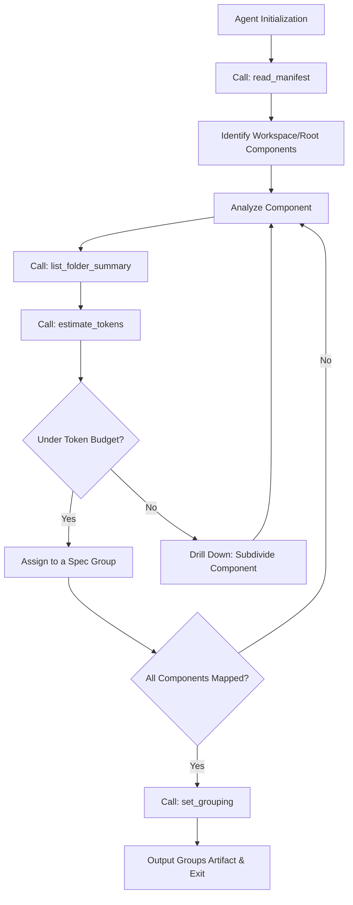

# Restructure Codebase Agent Spec

## Overview

This specification details the implementation of the `RestructureCodebaseAgent`, an agentic loop responsible for decomposing a large codebase into manageable modules or feature groups for downstream spec generation (fillback).

Unlike text-based issue grouping, this agent interacts directly with the repository structure. It operates via a multi-step agentic loop: reading workspace manifests (e.g., `pyproject.toml`, `package.json`, `Cargo.toml`), generating folder tree summaries, and estimating token counts for directories. Using these tools, the LLM makes budget-constrained grouping decisions, recursively drilling down into large folders until each group fits within the token budget. The final output is a structural groups artifact that prevents context window overflows for subsequent agents like `ReferenceCodebaseContextAgent` and `CodebaseToSpecAgent`.
## Requirements

### R1: Workspace Discovery
The agent MUST locate and parse workspace manifests (`pyproject.toml`, `package.json`, `Cargo.toml`) to identify root modules and workspace members as the primary top-level components before performing extensive directory listings.

### R2: Folder Summarization Tool
The agent MUST have access to a `list_folder_summary` tool that returns the folder tree, file count, and line count for a specified path and depth, enabling high-level structural analysis without full file reads.

### R3: Token Estimation Tool
The agent MUST have access to an `estimate_tokens` tool that calculates approximate token counts for a given directory path (using a heuristic such as `lines * 3`) to inform budget-constrained decisions.

### R4: Agentic Token-Budget Loop
The agent MUST operate in an iterative, multi-step loop guided by a maximum token budget constraint. It MUST recursively drill down into large directories that exceed the budget to ensure no generated group overflows the allowed context window.

### R5: Artifact Generation Tool
The agent MUST finalize its execution by invoking a mandatory `set_grouping` tool. This tool MUST generate the structural groups artifact required by downstream agents (e.g., `ReferenceCodebaseContextAgent`).
## Scenarios

### Scenario: Monorepo Root Analysis
- **WHEN** the agent is initialized at a repository root containing a `Cargo.toml` with `[workspace]` members (e.g., `crates/agent`, `crates/cli`).
- **THEN** it immediately reads the manifest, prioritizes analyzing those workspace directories as top-level components, and structures its grouping strategy around them before deep-diving into other paths.

### Scenario: Budget Exceeded Drill-down
- **WHEN** the agent estimates tokens for a directory `src/` and the heuristic returns `250,000` tokens, but the budget constraint is `50,000` tokens.
- **THEN** the agent rejects grouping `src/` as a single unit, invokes `list_folder_summary` on `src/` with a deeper depth to discover its subdirectories, and distributes these smaller modules into multiple groups that fit within the budget.

### Scenario: Successful Final Grouping
- **WHEN** the agent has successfully mapped and chunked all identified components such that no single group exceeds the allowed token budget constraint.
- **THEN** it invokes the `set_grouping(groups=...)` tool to generate the final groups artifact and successfully exits the execution loop.
## Diagrams

### Flowchart

## API Spec

## Changes

- [ ] 1.1 Create the RestructureCodebaseAgent loop
  - File: `crates/cclab-agent/src/agents/restructure_codebase.rs` (CREATE)
  - Spec: `specs/restructure-codebase-agent-spec.md#requirements`
  - Do: Implement the main agentic loop for `RestructureCodebaseAgent`. It should coordinate tool usage, track the total token budget, dynamically drill down into directories, and loop until the entire target codebase is mapped into safe groupings.
  - Depends: none

- [ ] 1.2 Implement Workspace Manifest Reader Tool
  - File: `crates/cclab-agent/src/tools/read_manifest.rs` (CREATE)
  - Spec: `specs/restructure-codebase-agent-spec.md#requirements`
  - Do: Create the `read_manifest` tool that parses known workspace manifest files (like `pyproject.toml`, `package.json`, `Cargo.toml`) to extract top-level components or workspace members.
  - Depends: none

- [ ] 1.3 Implement Folder Summary Tool
  - File: `crates/cclab-agent/src/tools/list_folder_summary.rs` (CREATE)
  - Spec: `specs/restructure-codebase-agent-spec.md#requirements`
  - Do: Create the `list_folder_summary` tool. It should read a given directory up to a provided `depth`, accumulating file counts and line counts for the tree structure.
  - Depends: none

- [ ] 1.4 Implement Token Estimation Tool
  - File: `crates/cclab-agent/src/tools/estimate_tokens.rs` (CREATE)
  - Spec: `specs/restructure-codebase-agent-spec.md#requirements`
  - Do: Create the `estimate_tokens` tool. It takes a file or folder path and returns a heuristic-based token estimate (e.g., total lines multiplied by 3).
  - Depends: 1.3

- [ ] 1.5 Implement Set Grouping Tool
  - File: `crates/cclab-agent/src/tools/set_grouping.rs` (CREATE)
  - Spec: `specs/restructure-codebase-agent-spec.md#requirements`
  - Do: Create the `set_grouping` tool. It accepts the final JSON/YAML array of component groupings, writes out the final artifact for downstream consumption, and signals the agent loop to successfully terminate.
  - Depends: 1.1
# Reviews
