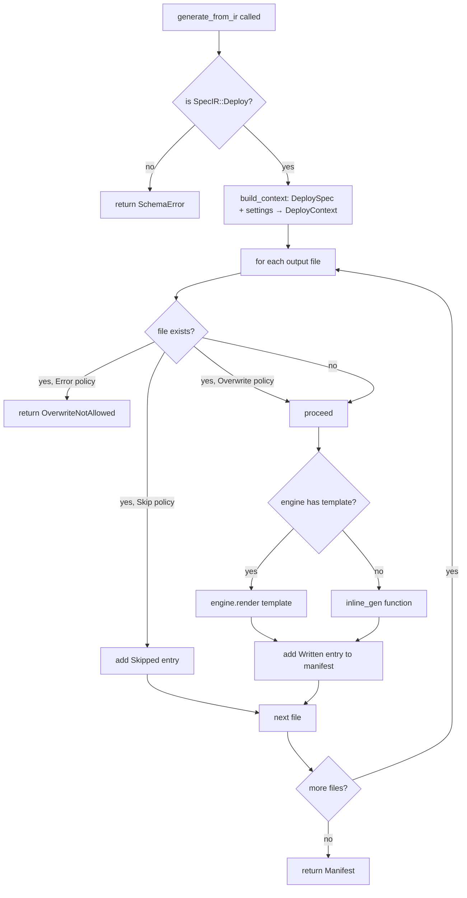
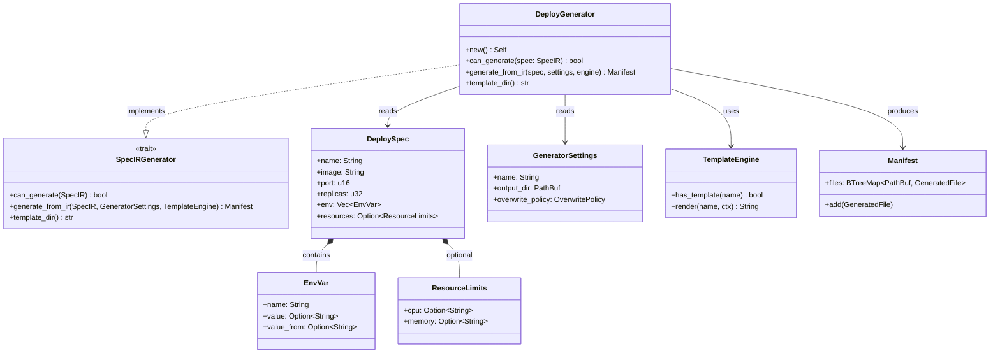

# Generator Deploy

## Overview
<!-- type: overview lang: markdown -->

Defines the `DeployGenerator` — a `SpecIRGenerator` that converts a `SpecIR::Deploy` payload into Kubernetes `Deployment` + `Service` YAML manifests. It accepts only the `deploy` section type and produces two output files: `deployment.yaml` (apps/v1) and `service.yaml` (v1 ClusterIP). When Tera templates are present under the `deploy/` directory they are used; otherwise inline string generation is the fallback. Overwrite behaviour is governed by `GeneratorSettings.overwrite_policy`.

## Requirements
<!-- type: requirements lang: markdown -->

### R1: SpecIRGenerator trait implementation

`DeployGenerator` must implement the `SpecIRGenerator` trait:
- `can_generate(spec)` returns `true` only for `SpecIR::Deploy` variants.
- `generate_from_ir(spec, settings, engine)` returns a `Manifest` with exactly two entries.
- `template_dir()` returns `"deploy"`.

**Priority**: high

### R2: Deployment manifest output

`generate_from_ir` must produce a valid `apps/v1 Deployment` resource at `<output_dir>/deployment.yaml` with:
- `metadata.name` = `spec.name` (falls back to `settings.name` when empty).
- `metadata.namespace` = `"default"`.
- `spec.replicas` from `DeploySpec.replicas` (default 1).
- Container image from `DeploySpec.image`.
- Container port from `DeploySpec.port` (default 8080).
- `env` block rendered for each `EnvVar` entry (literal `value:` or `valueFrom:` reference).
- Optional `resources.limits` block when `DeploySpec.resources` is set.

**Priority**: high

### R3: Service manifest output

`generate_from_ir` must produce a valid `v1 Service` resource at `<output_dir>/service.yaml` with:
- `type: ClusterIP`.
- `selector.app` matching the deployment name.
- Single port entry mapping `port` → `targetPort` from `DeploySpec.port`.

**Priority**: high

### R4: Template fallback

When the Tera template engine does not contain a template at `deploy/deployment.yaml.j2` or `deploy/service.yaml.j2`, the generator falls back to inline string generation. No error is raised if templates are absent.

**Priority**: medium

### R5: Overwrite policy enforcement

Before writing each output file the generator checks whether it already exists:
- `OverwritePolicy::Error` → return `GeneratorError::OverwriteNotAllowed`.
- `OverwritePolicy::Skip` → add a `Skipped` entry to the manifest and continue.
- `OverwritePolicy::Overwrite` → proceed and overwrite.

**Priority**: medium

## Scenarios
<!-- type: scenarios lang: markdown -->

### Scenario: can_generate returns true for Deploy variant

**GIVEN** a `SpecIR::Deploy` value
**WHEN** `DeployGenerator::can_generate()` is called
**THEN** it returns `true`

### Scenario: can_generate returns false for non-Deploy variant

**GIVEN** a `SpecIR::Api` value
**WHEN** `DeployGenerator::can_generate()` is called
**THEN** it returns `false`

### Scenario: generate produces two files

**GIVEN** a valid `SpecIR::Deploy` with `name="my-app"`, `image="my-app:1.0"`, `port=3000`, `replicas=2`
**WHEN** `generate_from_ir()` is called with a fresh `output_dir`
**THEN** the manifest contains exactly two entries: `deployment.yaml` and `service.yaml`

### Scenario: deployment.yaml includes resource limits

**GIVEN** a `DeploySpec` with `resources = { cpu: "500m", memory: "256Mi" }`
**WHEN** `generate_from_ir()` is called
**THEN** `deployment.yaml` contains a `resources.limits` block with the specified CPU and memory values

### Scenario: service.yaml is ClusterIP

**GIVEN** any valid `DeploySpec`
**WHEN** `generate_from_ir()` is called
**THEN** `service.yaml` contains `type: ClusterIP` and the correct `port`/`targetPort`

## Diagrams

### Interaction
<!-- type: interaction lang: mermaid -->
<!-- TODO -->

### Logic
<!-- type: logic lang: mermaid -->



### Dependencies
<!-- type: dependency lang: mermaid -->



### State Machine
<!-- type: state-machine lang: mermaid -->
<!-- TODO -->

### Data Model
<!-- type: db-model lang: mermaid -->
<!-- TODO -->

## API Spec

### REST API
<!-- type: rest-api lang: yaml -->
<!-- TODO -->

### RPC API
<!-- type: rpc-api lang: json -->
<!-- TODO -->

### Async API
<!-- type: async-api lang: yaml -->
<!-- TODO -->

### CLI
<!-- type: cli lang: yaml -->
<!-- TODO -->

### Schema
<!-- type: schema lang: json -->

```json
{
  "$schema": "http://json-schema.org/draft-07/schema#",
  "title": "DeploySpec",
  "description": "Kubernetes deployment specification for the deploy section type.",
  "type": "object",
  "properties": {
    "name": {
      "type": "string",
      "description": "Application name used as metadata.name in k8s resources. Falls back to GeneratorSettings.name when empty.",
      "default": ""
    },
    "image": {
      "type": "string",
      "description": "Container image reference, e.g. 'nginx:1.21'.",
      "default": ""
    },
    "port": {
      "type": "integer",
      "description": "Port the container listens on.",
      "default": 8080,
      "minimum": 1,
      "maximum": 65535
    },
    "replicas": {
      "type": "integer",
      "description": "Number of desired pod replicas.",
      "default": 1,
      "minimum": 0
    },
    "env": {
      "type": "array",
      "description": "Container environment variables.",
      "items": {
        "$ref": "#/definitions/EnvVar"
      },
      "default": []
    },
    "resources": {
      "$ref": "#/definitions/ResourceLimits",
      "description": "Optional CPU/memory resource limits."
    }
  },
  "definitions": {
    "EnvVar": {
      "title": "EnvVar",
      "type": "object",
      "required": ["name"],
      "properties": {
        "name": {
          "type": "string",
          "description": "Variable name."
        },
        "value": {
          "type": "string",
          "description": "Literal value (mutually exclusive with value_from)."
        },
        "value_from": {
          "type": "string",
          "description": "Source reference, e.g. 'secretKeyRef:my-secret:key'."
        }
      }
    },
    "ResourceLimits": {
      "title": "ResourceLimits",
      "type": "object",
      "properties": {
        "cpu": {
          "type": "string",
          "description": "CPU limit, e.g. '500m'."
        },
        "memory": {
          "type": "string",
          "description": "Memory limit, e.g. '256Mi'."
        }
      }
    }
  }
}
```

### Config
<!-- type: config lang: json -->
<!-- TODO -->

## Test Plan
<!-- type: test-plan lang: markdown -->

| Test | Requirement | Method |
|------|-------------|--------|
| `test_can_generate_deploy` | R1 | Assert `can_generate(SpecIR::Deploy)` returns `true` |
| `test_cannot_generate_non_deploy` | R1 | Assert `can_generate(SpecIR::Api)` returns `false` |
| `test_generate_produces_two_files` | R2, R3 | Assert manifest has exactly 2 entries: `deployment.yaml` and `service.yaml` |
| `test_deployment_yaml_content` | R2 | Assert `deployment.yaml` entry has a content hash (confirming content was generated) |
| `test_deployment_yaml_with_resources` | R2 | Assert generated YAML contains `resources.limits` with correct CPU and memory |
| `test_service_yaml_content` | R3 | Assert `service.yaml` contains `kind: Service`, `type: ClusterIP`, correct port |

All tests are in `crates/cclab-sdd/src/generate/generators/deploy.rs` under `#[cfg(test)]`.

## Changes
<!-- type: changes lang: yaml -->

```yaml
files:
  - path: crates/cclab-sdd/src/generate/generators/deploy.rs
    action: CREATE
    desc: >
      New file implementing DeployGenerator with SpecIRGenerator trait.
      Generates deployment.yaml (apps/v1 Deployment) and service.yaml
      (v1 ClusterIP Service) from SpecIR::Deploy payloads. Supports
      template-based and inline generation, overwrite policy, env vars
      (literal and valueFrom), and optional resource limits.
  - path: crates/cclab-sdd/src/generate/generators/mod.rs
    action: MODIFY
    desc: Export DeployGenerator from generators module.
  - path: crates/cclab-sdd/src/generate/spec_ir/types.rs
    action: MODIFY
    desc: >
      Add DeploySpec, EnvVar, ResourceLimits structs and SpecIR::Deploy
      variant. Add From<DeploySpec> impl for SpecIR.
  - path: crates/cclab-sdd/src/generate/lib.rs
    action: MODIFY
    desc: Re-export DeployGenerator and DeploySpec from generate crate public API.
```

## Wireframe
<!-- type: wireframe lang: yaml -->

<!-- TODO -->

## Component
<!-- type: component lang: json -->

<!-- TODO -->

## Design Token
<!-- type: design-token lang: json -->

<!-- TODO -->

## Doc
<!-- type: doc lang: markdown -->

<!-- TODO -->

# Reviews
