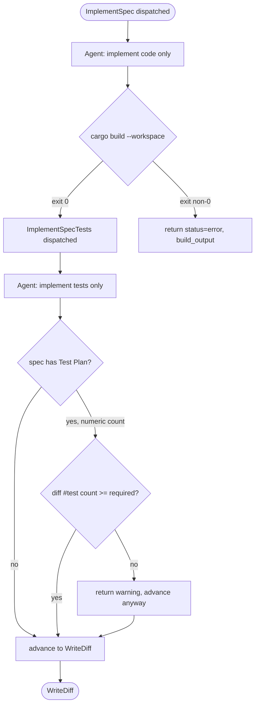
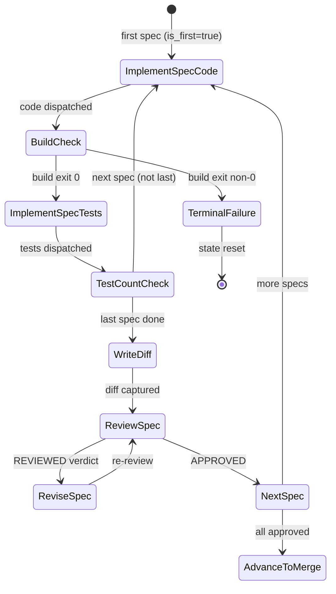
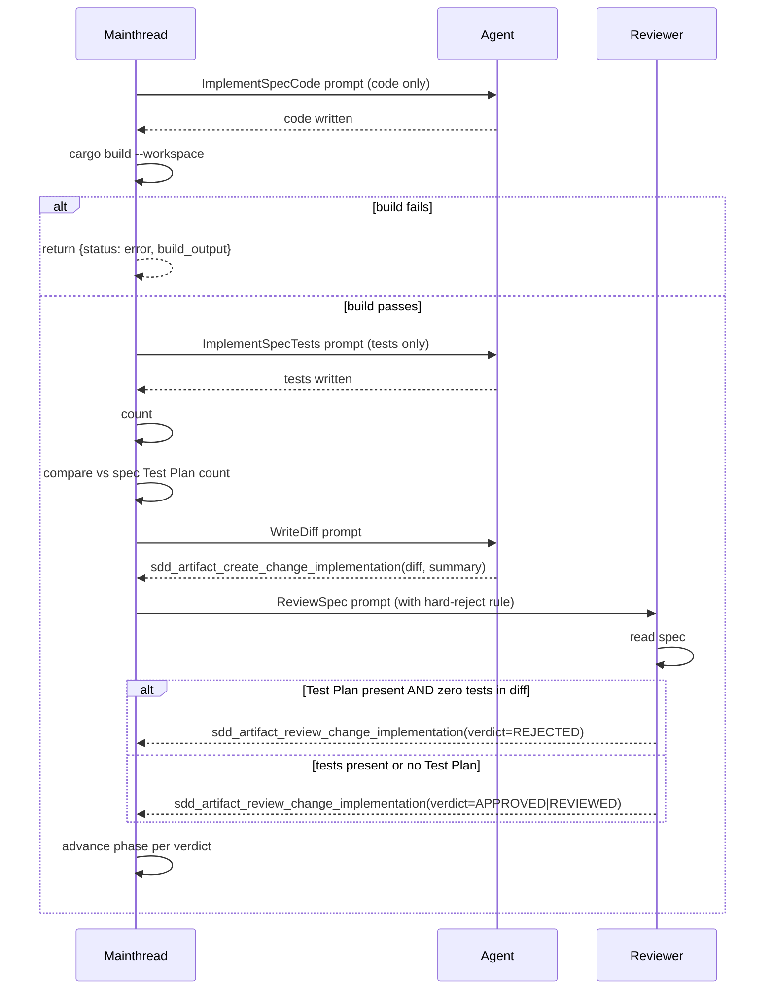

# Sdd Impl Test Split Spec

## Overview

Three targeted quality-gate improvements to the SDD implementation workflow:

| # | File | Fix |
|---|------|-----|
| 1 | `create_change_impl.rs` | Split single dispatch into **Phase 1** (code + `cargo build` verification) and **Phase 2** (tests + test-count verification) |
| 2 | `review_change_impl.rs` | Add **hard checklist enforcement**: REJECT if spec has `## Test Plan` but diff contains no `#[test]` functions |
| 3 | `create_change_spec.rs` | **Guard `create_complete`**: do not write `create_complete: true` when `failed_sections` is non-empty — return error for retry instead |

**Motivation**: The current implementation dispatch has no build or test-count gates, allowing agents to produce non-compiling code or skip tests entirely without detection. The review prompt's soft verdict guidelines do not enforce the spec's test-plan. The spec creation flow unconditionally marks a spec complete even when required sections failed to fill.
## Requirements

```yaml
fix1:
  file: crates/cclab-sdd/src/tools/create_change_impl.rs
  title: Two-Phase Dispatch
  R1.1: ImplementSpec dispatch is split into two sequential phases per spec:
    Phase1 (ImplementSpecCode):
      - Agent implements production code only (no test functions)
      - After agent returns, mainthread runs: cargo build --workspace
      - Build failure: hard gate — Phase 2 is blocked
      - Build failure verdict: return status=error, skip to TerminalFailure
    Phase2 (ImplementSpecTests):
      - Agent implements test functions only
      - After agent returns, mainthread counts #[test] functions in diff (added lines only)
      - Test-plan count source: parse ## Test Plan section in spec frontmatter or body
          numeric count present: enforce exact count OR at-least-N (gate: count < required)
          qualitative plan only: skip count check
          no Test Plan section: skip count check
      - Test count mismatch: return warning in result JSON (non-blocking on first miss)
  R1.2: New ImplSubState variants:
    ImplementSpecCode: { spec_id: String, is_first: bool }   # replaces ImplementSpec semantics
    ImplementSpecTests: { spec_id: String }                  # new: test-only phase
  R1.3: Phase tracking in STATE.yaml:
    impl_spec_phase: HashMap<spec_id, "code" | "tests">
    - Set to "code" when ImplementSpecCode dispatched
    - Set to "tests" when build passes and ImplementSpecTests dispatched
    - Cleared when spec transitions to WriteDiff
  R1.4: Build check:
    command: cargo build --workspace
    scope: entire workspace (simple, no per-crate detection)
    on_failure: return {status: "error", message: "Build failed", build_output: "...", next_actions: []}

fix2:
  file: crates/cclab-sdd/src/tools/review_change_impl.rs
  title: Hard Checklist Enforcement
  R2.1: Extend review prompt (build_review_prompt) with:
    - Mandatory pre-review step: read spec ## Test Plan section
    - Hard checklist items (in addition to existing soft checklist):
        - [HARD] code matches all spec requirements
        - [HARD] if spec has Test Plan section: diff contains at least one #[test] function
        - [HARD] existing tests still pass (no regressions)
  R2.2: Hard REJECT rule (injected into prompt as explicit constraint):
    IF spec ## Test Plan section is present
    AND diff contains zero #[test] or #[cfg(test)] blocks
    THEN verdict MUST be REJECTED — no exceptions, regardless of other checklist results
  R2.3: Prompt path for spec:
    cclab/changes/{change_id}/groups/{group_id}/specs/{spec_id}.md

fix3:
  file: crates/cclab-sdd/src/tools/create_change_spec.rs
  title: Guard create_complete on Failure
  R3.1: Lines 519-524 — replace unconditional create_complete write with guarded write:
    IF failed_sections is non-empty:
      - Do NOT write create_complete: true to frontmatter
      - Return {status: "error", failed_sections: [...], next_action: "sdd_workflow_create_change_spec"}
    ELSE:
      - Prune TODO sections as before
      - Write create_complete: true (existing behavior)
  R3.2: Error response schema when failed_sections non-empty:
    {
      "status": "error",
      "spec_id": "<spec_id>",
      "message": "Spec '<spec_id>' has <N> unfilled sections. Retry required.",
      "failed_sections": ["<section1>", ...],
      "next_actions": [
        { "cli": "cclab sdd workflow create-change-spec <change_id>" }
      ]
    }
```
## Fix 1 — create_change_impl.rs: Two-Phase Dispatch

```yaml
R1.1: ImplementSpec dispatch is split into two sequential phases per spec:
  Phase1 (ImplementSpecCode):
    - Agent implements production code only (no test functions)
    - After agent returns, mainthread runs: cargo build --workspace
    - Build failure: hard gate — Phase 2 is blocked
    - Build failure verdict: return status=error, skip to TerminalFailure
  Phase2 (ImplementSpecTests):
    - Agent implements test functions only
    - After agent returns, mainthread counts #[test] functions in diff (added lines only)
    - Test-plan count source: parse `## Test Plan` section in spec frontmatter or body
      - If spec has numeric test count: enforce exact count OR at-least-N (gate: count < required)
      - If spec has qualitative test plan (no numeric count): skip count check
      - If spec has no Test Plan section: skip count check
    - Test count mismatch: return warning in result JSON (non-blocking on first miss)

R1.2: New ImplSubState variants:
  ImplementSpecCode { spec_id: String, is_first: bool }   # replaces ImplementSpec semantics
  ImplementSpecTests { spec_id: String }                  # new: test-only phase

R1.3: Phase tracking in STATE.yaml:
  impl_spec_phase: HashMap<spec_id, "code" | "tests">     # tracks which phase each spec is in
  - Set to "code" when ImplementSpecCode dispatched
  - Set to "tests" when build passes and ImplementSpecTests dispatched
  - Cleared when spec transitions to WriteDiff

R1.4: Build check:
  command: cargo build --workspace
  scope: entire workspace (simple, no per-crate detection)
  on_failure: return {status: "error", message: "Build failed", build_output: "...", next_actions: []}
```

## Fix 2 — review_change_impl.rs: Hard Checklist Enforcement

```yaml
R2.1: Extend review prompt (build_review_prompt) with:
  - Mandatory pre-review step: read spec's `## Test Plan` section
  - Hard checklist items (in addition to existing soft checklist):
      - [HARD] code matches all spec requirements
      - [HARD] if spec has Test Plan section: diff contains at least one #[test] function
      - [HARD] existing tests still pass (no regressions)

R2.2: Hard REJECT rule (injected into prompt as explicit constraint):
  IF spec `## Test Plan` section is present
  AND diff contains zero #[test] or #[cfg(test)] blocks
  THEN verdict MUST be REJECTED — no exceptions, regardless of other checklist results

R2.3: Prompt path for spec:
  Reviewer reads spec from: cclab/changes/{change_id}/groups/{group_id}/specs/{spec_id}.md
  (group-aware path, same as implementation prompt)
```

## Fix 3 — create_change_spec.rs: Guard create_complete

```yaml
R3.1: Lines 519-524 — replace unconditional create_complete write with guarded write:
  IF failed_sections is non-empty:
    - Do NOT write create_complete: true to frontmatter
    - Return {status: "error", failed_sections: [...], next_action: "sdd_workflow_create_change_spec"}
  ELSE:
    - Prune TODO sections as before
    - Write create_complete: true (existing behavior)

R3.2: Error response schema when failed_sections non-empty:
  {
    "status": "error",
    "spec_id": "<spec_id>",
    "message": "Spec '<spec_id>' has <N> unfilled sections. Retry required.",
    "failed_sections": ["<section1>", ...],
    "next_actions": [
      { "cli": "cclab sdd workflow create-change-spec <change_id>" }
    ]
  }
```
## Fix 1 — create_change_impl.rs: Two-Phase Dispatch

```yaml
R1.1: ImplementSpec dispatch is split into two sequential phases per spec:
  Phase1 (ImplementSpecCode):
    - Agent implements production code only (no test functions)
    - After agent returns, mainthread runs: cargo build --workspace
    - Build failure: hard gate — Phase 2 is blocked
    - Build failure verdict: return status=error, skip to TerminalFailure
  Phase2 (ImplementSpecTests):
    - Agent implements test functions only
    - After agent returns, mainthread counts #[test] functions in diff (added lines only)
    - Test-plan count source: parse `## Test Plan` section in spec frontmatter or body
      - If spec has numeric test count: enforce exact count OR at-least-N (gate: count < required)
      - If spec has qualitative test plan (no numeric count): skip count check
      - If spec has no Test Plan section: skip count check
    - Test count mismatch: return warning in result JSON (non-blocking on first miss)

R1.2: New ImplSubState variants:
  ImplementSpecCode { spec_id: String, is_first: bool }   # replaces ImplementSpec semantics
  ImplementSpecTests { spec_id: String }                  # new: test-only phase

R1.3: Phase tracking in STATE.yaml:
  impl_spec_phase: HashMap<spec_id, "code" | "tests">     # tracks which phase each spec is in
  - Set to "code" when ImplementSpecCode dispatched
  - Set to "tests" when build passes and ImplementSpecTests dispatched
  - Cleared when spec transitions to WriteDiff

R1.4: Build check:
  command: cargo build --workspace
  scope: entire workspace (simple, no per-crate detection)
  on_failure: return {status: "error", message: "Build failed", build_output: "...", next_actions: []}
```

## Fix 2 — review_change_impl.rs: Hard Checklist Enforcement

```yaml
R2.1: Extend review prompt (build_review_prompt) with:
  - Mandatory pre-review step: read spec's `## Test Plan` section
  - Hard checklist items (in addition to existing soft checklist):
      - [HARD] code matches all spec requirements
      - [HARD] if spec has Test Plan section: diff contains at least one #[test] function
      - [HARD] existing tests still pass (no regressions)

R2.2: Hard REJECT rule (injected into prompt as explicit constraint):
  IF spec `## Test Plan` section is present
  AND diff contains zero #[test] or #[cfg(test)] blocks
  THEN verdict MUST be REJECTED — no exceptions, regardless of other checklist results

R2.3: Prompt path for spec:
  Reviewer reads spec from: cclab/changes/{change_id}/groups/{group_id}/specs/{spec_id}.md
  (group-aware path, same as implementation prompt)
```

## Fix 3 — create_change_spec.rs: Guard create_complete

```yaml
R3.1: Lines 519-524 — replace unconditional create_complete write with guarded write:
  IF failed_sections is non-empty:
    - Do NOT write create_complete: true to frontmatter
    - Return {status: "error", failed_sections: [...], next_action: "sdd_workflow_create_change_spec"}
  ELSE:
    - Prune TODO sections as before
    - Write create_complete: true (existing behavior)

R3.2: Error response schema when failed_sections non-empty:
  {
    "status": "error",
    "spec_id": "<spec_id>",
    "message": "Spec '<spec_id>' has <N> unfilled sections. Retry required.",
    "failed_sections": ["<section1>", ...],
    "next_actions": [
      { "cli": "cclab sdd workflow create-change-spec <change_id>" }
    ]
  }
```
## Scenarios

### S1 — Phase 1 build passes, Phase 2 test count matches

```
Given: spec has Test Plan with 3 test cases
And:   agent implements code in Phase 1
When:  cargo build --workspace succeeds
And:   agent adds 3 #[test] functions in Phase 2
Then:  workflow advances to WriteDiff without error
```

### S2 — Phase 1 build fails → hard gate

```
Given: agent returns after implementing code
When:  cargo build --workspace exits non-zero
Then:  workflow returns {status: "error", message: "Build failed", build_output: "..."}
And:   ImplementSpecTests is NOT dispatched
And:   next_actions is empty (mainthread must decide: fix or skip)
```

### S3 — Phase 2 test count mismatch (spec has numeric count)

```
Given: spec Test Plan declares 4 test scenarios
And:   agent Phase 2 diff contains 2 #[test] functions (added lines)
When:  mainthread counts tests in diff
Then:  result includes {verification: {passed: false, test_count: 2, required: 4}}
And:   workflow still advances (non-blocking warning)
```

### S4 — Phase 2 spec has no Test Plan → count check skipped

```
Given: spec has no ## Test Plan section
When:  Phase 2 completes
Then:  test count check is skipped entirely
And:   workflow advances normally to WriteDiff
```

### S5 — Reviewer hard REJECT: Test Plan present, no tests in diff

```
Given: spec has a ## Test Plan section with 2 scenarios
And:   implementation diff contains zero #[test] or #[cfg(test)] blocks
When:  reviewer evaluates checklist
Then:  reviewer MUST return verdict: REJECTED
And:   no other checklist result can override this rule
```

### S6 — Reviewer approves: Test Plan present, tests present in diff

```
Given: spec has a ## Test Plan section
And:   implementation diff contains at least one #[test] function
When:  reviewer evaluates all checklist items
Then:  reviewer may return APPROVED or REVIEWED based on other checks
```

### S7 — create_complete guard: failed_sections non-empty

```
Given: agent filled overview and scenarios but failed on requirements
And:   failed_sections = ["requirements"]
When:  create_change_spec finalizes the spec
Then:  create_complete: true is NOT written to frontmatter
And:   response is {status: "error", failed_sections: ["requirements"], next_actions: [{cli: "cclab sdd workflow create-change-spec ..."}]}
```

### S8 — create_complete guard: all sections filled

```
Given: agent filled all required sections successfully
And:   failed_sections = []
When:  create_change_spec finalizes the spec
Then:  create_complete: true IS written to frontmatter
And:   spec proceeds to review workflow
```

## Logic



## State Machine



### ImplSubState additions

```yaml
ImplSubState:
  ImplementSpecCode:  { spec_id: String, is_first: bool }   # NEW (was ImplementSpec)
  ImplementSpecTests: { spec_id: String }                   # NEW
  # Existing variants unchanged:
  ImplementSpecWithCodegen: { spec_id: String }
  WriteDiff: ~
  ReviewSpec: { spec_id: String }
  ReviseSpec: { spec_id: String }
  TerminalFailure: { spec_id: String, revisions: u32 }
  AdvanceToMerge: ~
  NoSpecs: ~
```

### STATE.yaml additions

```yaml
impl_spec_phase:         # new field
  "<spec_id>": "code" | "tests"   # tracks current phase per spec
  # cleared when spec transitions to WriteDiff
```

## Interaction


## Diagrams

### Interaction
<!-- type: interaction lang: mermaid -->
<!-- TODO -->

### Logic
<!-- type: logic lang: mermaid -->
<!-- TODO -->

### Dependencies
<!-- type: dependency lang: mermaid -->
<!-- TODO -->

### State Machine
<!-- type: state-machine lang: mermaid -->
<!-- TODO -->

### Data Model
<!-- type: db-model lang: mermaid -->
<!-- TODO -->

## API Spec

### REST API
<!-- type: rest-api lang: yaml -->
<!-- TODO -->

### RPC API
<!-- type: rpc-api lang: json -->
<!-- TODO -->

### Async API
<!-- type: async-api lang: yaml -->
<!-- TODO -->

### CLI
<!-- type: cli lang: yaml -->
<!-- TODO -->

### Schema
<!-- type: schema lang: json -->
<!-- TODO -->

### Config
<!-- type: config lang: json -->
<!-- TODO -->

## Test Plan

| # | Test | File | Validates |
|---|------|------|-----------|
| T1 | `test_build_gate_blocks_phase2_on_failure` | `create_change_impl.rs` tests | Given build fails, ImplementSpecTests is NOT dispatched; response has `status=error` |
| T2 | `test_build_gate_passes_on_success` | `create_change_impl.rs` tests | Given build passes, ImplementSpecTests IS dispatched next |
| T3 | `test_test_count_warning_on_mismatch` | `create_change_impl.rs` tests | Diff with 2 `#[test]`, spec requires 4 → result has `verification.passed=false` |
| T4 | `test_test_count_skipped_no_test_plan` | `create_change_impl.rs` tests | Spec with no `## Test Plan` section → count check skipped, no warning |
| T5 | `test_test_count_skipped_qualitative_plan` | `create_change_impl.rs` tests | Spec with qualitative Test Plan (no integer count) → count check skipped |
| T6 | `test_review_hard_reject_no_tests_in_diff` | `review_change_impl.rs` tests | Review prompt with Test Plan present + zero `#[test]` in diff → reviewer must REJECT |
| T7 | `test_review_checklist_includes_test_plan_item` | `review_change_impl.rs` tests | Generated review prompt contains explicit Test Plan checklist item and hard-reject rule text |
| T8 | `test_create_complete_blocked_on_failed_sections` | `create_change_spec.rs` tests | failed_sections=["requirements"] → spec file does NOT contain `create_complete: true`; response has `status=error` |
| T9 | `test_create_complete_written_on_all_filled` | `create_change_spec.rs` tests | failed_sections=[] → spec file DOES contain `create_complete: true` |
| T10 | `test_impl_spec_phase_tracking_in_state` | `common_change_impl.rs` tests | After ImplementSpecCode dispatched, STATE.yaml `impl_spec_phase["spec-id"]=="code"`; after build pass, `=="tests"` |
## Changes

```yaml
files:
  - path: crates/cclab-sdd/src/tools/common_change_impl.rs
    action: MODIFY
    desc: |
      Add ImplSubState variants: ImplementSpecCode { spec_id, is_first } and ImplementSpecTests { spec_id }.
      Add impl_spec_phase field tracking logic in resolve_next_impl().
      Update build_spec_execution_order() callers if needed.

  - path: crates/cclab-sdd/src/tools/create_change_impl.rs
    action: MODIFY
    desc: |
      Split ImplementSpec arm into two: ImplementSpecCode (Phase 1) and ImplementSpecTests (Phase 2).
      After ImplementSpecCode prompt returns, run `cargo build --workspace`; on failure return error.
      After ImplementSpecTests prompt returns, parse spec Test Plan and count #[test] in diff added-lines;
      emit warning in result if count mismatch. Update execute_workflow() match arms accordingly.

  - path: crates/cclab-sdd/src/tools/review_change_impl.rs
    action: MODIFY
    desc: |
      Update build_review_prompt() to include:
      (a) mandatory pre-review step to read spec ## Test Plan section,
      (b) hard checklist items for code/tests/test-plan enforcement,
      (c) explicit hard-REJECT rule text for Test Plan present + no tests in diff.

  - path: crates/cclab-sdd/src/tools/create_change_spec.rs
    action: MODIFY
    desc: |
      Lines 519-524: guard create_complete write behind failed_sections.is_empty().
      When failed_sections is non-empty, skip prune+mark and return error response
      with failed_sections list and next_action pointing to sdd_workflow_create_change_spec.

specs:
  - path: cclab/specs/cclab-sdd/logic/implement-task.md
    action: UPDATE
    desc: |
      Add ImplementSpecCode and ImplementSpecTests to ImplSubState enum.
      Add impl_spec_phase STATE.yaml field.
      Update Phase 1 / Phase 2 sections: build gate, test-count verification rules.
      Update ReviewSpec prompt template with hard-reject rule.

  - path: cclab/specs/cclab-sdd/logic/change-spec.md
    action: UPDATE
    desc: |
      Document create_complete guard behavior: only written when failed_sections is empty.
      Update error response schema for failed-section case.
```
## Wireframe
<!-- type: wireframe lang: yaml -->

<!-- TODO -->

## Component
<!-- type: component lang: json -->

<!-- TODO -->

## Design Token
<!-- type: design-token lang: json -->

<!-- TODO -->

## Doc
<!-- type: doc lang: markdown -->

<!-- TODO -->

# Reviews
