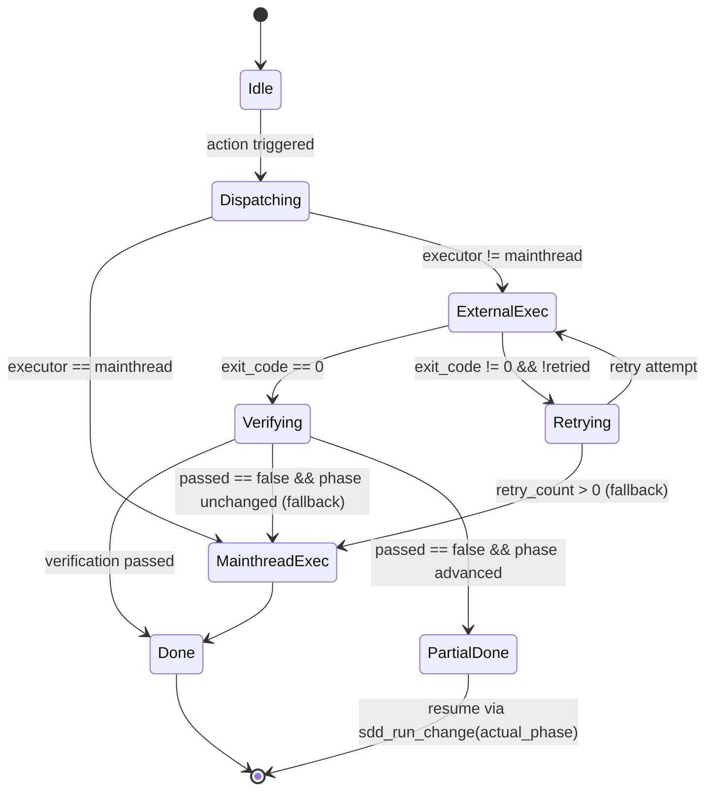
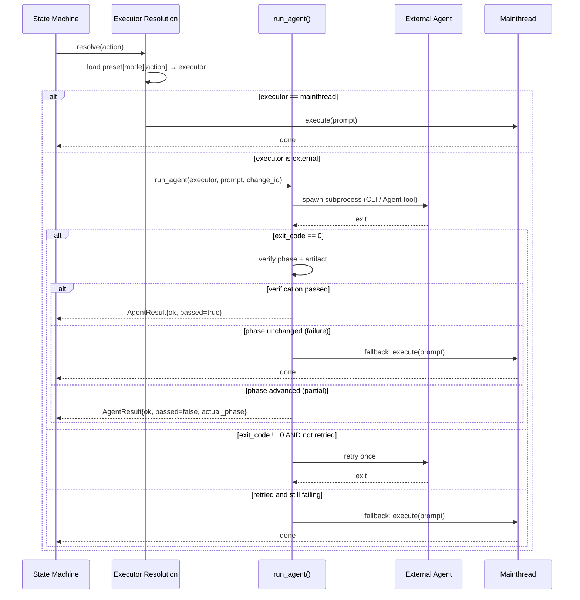

# Sdd Execution Modes

## Overview

<!-- type: overview lang: markdown -->

Replace `[workflow.agents]` per-action config with a single `workflow.mode` field selecting one of 4 fixed execution-mode presets. Each preset defines a complete phase-to-executor mapping — no per-action overrides.

| Mode | Dispatch Mechanism | Characteristics |
|------|--------------------|-----------------|
| `multi_agents` | External CLI subprocesses (gemini/codex/claude) | Model diversity, cost optimization |
| `multi_claude_agents` | `claude --agent sdd-X` subprocess | Full tooling + isolation + least-privilege |
| `claude_subagents` | Claude Code Agent tool (mainthread invokes) | Low overhead, inherits session |
| `mainthread` | Current LLM context (no delegation) | Zero overhead, shared context |

**Config** (`cclab/config.toml`):
```toml
[workflow]
# "multi_agents" | "multi_claude_agents" | "claude_subagents" | "mainthread"
mode = "multi_claude_agents"
```

Executor resolution reads `workflow.mode` once, loads the corresponding preset table, and dispatches all phase actions from it. Agent failure triggers: retry once → fallback to mainthread.
## Requirements

<!-- type: requirements lang: markdown -->

### R1: Single Mode Config

Replace `[workflow.agents]` per-action arrays with `workflow.mode` in `cclab/config.toml`.

- **WHEN** config is loaded, **THEN** `workflow.mode` resolves to one of `"multi_agents"`, `"multi_claude_agents"`, `"claude_subagents"`, `"mainthread"`
- **WHEN** `workflow.mode` is absent, **THEN** default is `"mainthread"`
- **WHEN** `[workflow.agents]` per-action keys are present, **THEN** they are ignored (backward compat: log warning)

### R2: Fixed Preset Tables

Each mode embeds a complete phase-to-executor mapping — no per-action overrides.

- **WHEN** mode is `multi_agents`, **THEN** executor resolution uses the `multi_agents` preset (gemini/codex/mainthread by phase)
- **WHEN** mode is `multi_claude_agents`, **THEN** executor resolution uses the `multi_claude_agents` preset (`claude --agent sdd-X` by phase)
- **WHEN** mode is `claude_subagents`, **THEN** executor resolution uses the `claude_subagents` preset (Agent tool by phase)
- **WHEN** mode is `mainthread`, **THEN** all phase actions route to mainthread

### R3: Fallback Chain

- **WHEN** an external agent fails (non-zero exit or timeout), **THEN** retry once with the same executor
- **WHEN** retry also fails, **THEN** fall back to mainthread execution
- **WHEN** verification fails but phase has not changed, **THEN** treat as agent failure (fallback)
- **WHEN** verification fails but phase has advanced, **THEN** resume from `actual_phase` via `sdd_run_change`

### R4: `multi_claude_agents` Agent Definitions

New agent definition files in `.claude/agents/`:

| Agent | Tools | Disallowed | Model | maxTurns | Bash Hook |
|-------|-------|------------|-------|----------|-----------|
| `sdd-reference-context` | Read, Glob, Grep, Bash | Write, Edit, Agent | sonnet | 20 | readonly |
| `sdd-change-spec` | Read, Write, Edit, Glob, Grep | Bash, Agent | opus | 30 | — |
| `sdd-review` | Read, Glob, Grep, Bash | Write, Edit, Agent | sonnet | 15 | readonly+test |
| `sdd-change-implementation` | Read, Write, Edit, Glob, Grep, Bash | Agent | opus | 50 | safe |

### R5: Bash Hook Scripts

- **WHEN** `sdd-reference-context` or `sdd-review` runs Bash, **THEN** only `git log/diff/status/show`, `ls`, `cat`, `find`, `cargo test/check` are allowed
- **WHEN** `sdd-change-implementation` runs Bash, **THEN** `rm -rf`, `git push/reset`, `chmod 777` are blocked

### R6: Phase-Specific CLAUDE.md

- **WHEN** `run_agent()` spawns `claude --agent` for `multi_claude_agents` mode, **THEN** it generates a phase-specific CLAUDE.md before spawning
- **WHEN** phase is `reference_context`, **THEN** CLAUDE.md focuses on specs structure and explore strategy
- **WHEN** phase is `change_spec`, **THEN** CLAUDE.md focuses on spec format rules and JSON Schema/Mermaid conventions
- **WHEN** phase is `change_implementation`, **THEN** CLAUDE.md focuses on code style, test requirements, file size limits
- **WHEN** phase is `review`, **THEN** CLAUDE.md focuses on review checklist and severity criteria
## Scenarios

<!-- type: scenarios lang: markdown -->

### Scenario: multi_agents — spec phase routes to gemini

- **WHEN** `workflow.mode = "multi_agents"` and action is `create_change_spec`
- **THEN** executor resolves to `gemini:pro`
- **AND** `run_agent()` spawns `gemini` CLI subprocess with the spec prompt

### Scenario: multi_agents — review phase routes to codex

- **WHEN** `workflow.mode = "multi_agents"` and action is `review_change_spec`
- **THEN** executor resolves to `codex:max`
- **AND** `run_agent()` spawns `codex` CLI subprocess

### Scenario: multi_claude_agents — reference context routes to sdd-reference-context agent

- **WHEN** `workflow.mode = "multi_claude_agents"` and action is `create_reference_context`
- **THEN** executor resolves to `claude --agent sdd-reference-context` (sonnet)
- **AND** `run_agent()` generates a reference-context CLAUDE.md and spawns the subprocess
- **AND** only Read/Glob/Grep/Bash tools are available; Write/Edit/Agent are disallowed

### Scenario: multi_claude_agents — spec writing routes to sdd-change-spec agent

- **WHEN** `workflow.mode = "multi_claude_agents"` and action is `create_change_spec`
- **THEN** executor resolves to `claude --agent sdd-change-spec` (opus)
- **AND** Bash is disallowed; agent writes specs via Write/Edit tools only

### Scenario: claude_subagents — explore routes to Explore agent

- **WHEN** `workflow.mode = "claude_subagents"` and action is `create_reference_context`
- **THEN** mainthread invokes Agent tool with `subagent_type: "Explore"` and `model: "sonnet"`
- **AND** no subprocess is spawned; agent inherits mainthread session tools

### Scenario: mainthread — all phases execute inline

- **WHEN** `workflow.mode = "mainthread"`
- **THEN** every phase action executes in the current LLM context
- **AND** no external processes are spawned

### Scenario: agent failure with successful retry

- **WHEN** external agent exits with non-zero code on first attempt
- **THEN** `run_agent()` retries once with the same executor
- **AND** if retry succeeds, execution continues normally

### Scenario: agent failure with fallback to mainthread

- **WHEN** external agent fails on both initial attempt and retry
- **THEN** mainthread executes the phase prompt directly
- **AND** telemetry records the fallback event

### Scenario: verification failure with partial phase advance

- **WHEN** agent exits cleanly but expected artifact is missing and phase has advanced partially
- **THEN** `run_agent()` returns `status: ok, passed: false` with `actual_phase`
- **AND** caller resumes via `sdd_run_change` from `actual_phase`

### Scenario: config.toml missing mode field

- **WHEN** `cclab/config.toml` has no `workflow.mode` key
- **THEN** executor resolution defaults to `mainthread` for all phase actions
## Diagrams

### Interaction
<!-- type: interaction lang: mermaid -->
<!-- TODO -->

### Logic
<!-- type: logic lang: mermaid -->
<!-- TODO -->

### Dependencies
<!-- type: dependency lang: mermaid -->
<!-- TODO -->

### State Machine
<!-- type: state-machine lang: mermaid -->
<!-- TODO -->

### Data Model
<!-- type: db-model lang: mermaid -->
<!-- TODO -->

## API Spec

### REST API
<!-- type: rest-api lang: yaml -->
<!-- TODO -->

### RPC API
<!-- type: rpc-api lang: json -->
<!-- TODO -->

### Async API
<!-- type: async-api lang: yaml -->
<!-- TODO -->

### CLI
<!-- type: cli lang: yaml -->
<!-- TODO -->

### Schema
<!-- type: schema lang: json -->
<!-- TODO -->

### Config
<!-- type: config lang: json -->
<!-- TODO -->

## Test Plan

<!-- type: test-plan lang: markdown -->

### Unit: Preset Table Lookup

- For each of the 4 modes, verify every phase action maps to the correct executor string
- Verify that `workflow.mode` missing from config defaults to `mainthread`
- Verify no per-action override is possible (preset is immutable)

### Unit: `multi_claude_agents` Agent Definitions

- Parse each `.claude/agents/sdd-*.md` file and verify frontmatter fields (tools, disallowedTools, model, maxTurns)
- Verify `sdd-reference-context` has Write/Edit/Agent in disallowedTools
- Verify `sdd-change-spec` has Bash/Agent in disallowedTools
- Verify `sdd-change-implementation` has Agent in disallowedTools but NOT Bash

### Unit: Bash Hook Scripts

- `sdd-readonly-bash.sh`: verify `cargo build` is blocked, `cargo test` is allowed
- `sdd-readonly-bash.sh`: verify `git push` is blocked, `git log` is allowed
- `sdd-safe-bash.sh`: verify `rm -rf /` is blocked, `cargo build` is allowed
- `sdd-safe-bash.sh`: verify `git reset --hard` is blocked

### Integration: Executor Resolution → run_agent() Dispatch

- `multi_agents` mode: `create_change_spec` → gemini subprocess spawned with correct args
- `multi_claude_agents` mode: `create_change_spec` → `claude --agent sdd-change-spec` spawned with phase CLAUDE.md
- `claude_subagents` mode: `create_reference_context` → Agent tool invoked with `subagent_type: "Explore"`
- `mainthread` mode: all actions execute inline (no subprocess)

### Integration: Fallback Chain

- Agent exits non-zero → retry once → if retry succeeds, no fallback
- Agent exits non-zero on both attempts → mainthread fallback executes
- Verification fails + phase unchanged → treated as failure → mainthread fallback
- Verification fails + phase advanced → `actual_phase` returned, no fallback

### Integration: Phase-Specific CLAUDE.md Generation

- Before `claude --agent sdd-change-spec` spawns, verify CLAUDE.md contains spec format rules
- Before `claude --agent sdd-reference-context` spawns, verify CLAUDE.md contains specs explore strategy
- Before `claude --agent sdd-review` spawns, verify CLAUDE.md contains review checklist

### Config: TOML Parsing

- Valid mode strings parse correctly
- Invalid mode string returns config validation error
- Missing `workflow.mode` falls back to `mainthread` without error
## Changes

<!-- type: changes lang: yaml -->

```yaml
files:
  # Core model + executor resolution
  - path: crates/cclab-sdd/src/models/change.rs
    action: MODIFY
    desc: Replace AgentsConfig per-action arrays with ExecutionMode enum (multi_agents | multi_claude_agents | claude_subagents | mainthread). Add WorkflowMode field to SddConfig. Embed 4 preset tables as const maps.

  - path: crates/cclab-sdd/src/workflow/helpers.rs
    action: MODIFY
    desc: Update executor_for_action() to read workflow.mode once, load preset table, and return executor string. Remove per-action config lookup.

  - path: crates/cclab-sdd/src/mcp/tools/workflow_common.rs
    action: MODIFY
    desc: Update get_executor_chain() to delegate to new preset-based resolution. Remove multi-agent chain logic (preset returns single executor per action).

  # Spec updates
  - path: cclab/specs/crates/cclab-sdd/config/agents.md
    action: MODIFY
    desc: Replace per-action [workflow.agents] tables with workflow.mode field + 4 preset tables (multi_agents, multi_claude_agents, claude_subagents, mainthread).

  - path: cclab/specs/crates/cclab-sdd/logic/executor-resolution.md
    action: MODIFY
    desc: Update flowchart to show mode → preset lookup → per-mode dispatch branches. Remove old single-chain resolution flow.

  - path: cclab/specs/crates/cclab-sdd/tools/utils/delegate-agent.md
    action: MODIFY
    desc: Add multi_claude_agents (claude --agent) and claude_subagents (Agent tool) execution paths to sequence diagram and behavior flowchart.

  # Agent definition files
  - path: .claude/agents/sdd-reference-context.md
    action: CREATE
    desc: Agent definition for explore phase. tools: Read/Glob/Grep/Bash. disallowedTools: Write/Edit/Agent. model: sonnet. maxTurns: 20. Bash hook: sdd-readonly-bash.sh.

  - path: .claude/agents/sdd-change-spec.md
    action: CREATE
    desc: Agent definition for spec writing phase. tools: Read/Write/Edit/Glob/Grep. disallowedTools: Bash/Agent. model: opus. maxTurns: 30.

  - path: .claude/agents/sdd-review.md
    action: CREATE
    desc: Agent definition for review phases. tools: Read/Glob/Grep/Bash. disallowedTools: Write/Edit/Agent. model: sonnet. maxTurns: 15. Bash hook: sdd-readonly-bash.sh (+ cargo test/check).

  - path: .claude/agents/sdd-change-implementation.md
    action: CREATE
    desc: Agent definition for implementation phases. tools: Read/Write/Edit/Glob/Grep/Bash. disallowedTools: Agent. model: opus. maxTurns: 50. Bash hook: sdd-safe-bash.sh.

  # Bash hook scripts
  - path: .claude/hooks/sdd-readonly-bash.sh
    action: CREATE
    desc: PreToolUse hook for read-only agents. Allows git log/diff/status/show, ls, cat, find, cargo test/check. Blocks all write operations.

  - path: .claude/hooks/sdd-safe-bash.sh
    action: CREATE
    desc: PreToolUse hook for implementation agent. Blocks rm -rf, git push/reset, chmod 777. Allows all other commands.

  # Config template
  - path: crates/cclab-sdd/templates/config.toml
    action: MODIFY
    desc: Replace [workflow.agents] per-action entries with workflow.mode = "mainthread" (default). Add comments for all 4 mode options.
```
## Wireframe
<!-- type: wireframe lang: yaml -->

<!-- TODO -->

## Component
<!-- type: component lang: json -->

<!-- TODO -->

## Design Token
<!-- type: design-token lang: json -->

<!-- TODO -->

## Doc
<!-- type: doc lang: markdown -->

<!-- TODO -->


## Logic

<!-- type: logic lang: mermaid -->

```mermaid
flowchart TD
    Start([action]) --> ReadMode[read workflow.mode]
    ReadMode --> LoadPreset[load preset table for mode]
    LoadPreset --> Lookup[executor = preset_table[action]]
    Lookup --> IsMT{executor == mainthread?}
    IsMT -->|yes| MT([mainthread executes])
    IsMT -->|no| DispatchMode{mode?}
    DispatchMode -->|multi_agents| ExtCLI[run_agent: external CLI subprocess]
    DispatchMode -->|multi_claude_agents| ClaudeAgent[run_agent: claude --agent sdd-X]
    DispatchMode -->|claude_subagents| SubAgent[invoke Agent tool with type + model]
    ExtCLI --> CheckExit{exit_code == 0?}
    ClaudeAgent --> CheckExit
    SubAgent --> CheckExit
    CheckExit -->|yes| Verify[verify phase + artifact]
    Verify --> VPassed{passed?}
    VPassed -->|yes| Done([done])
    VPassed -->|no, phase unchanged| Fallback
    VPassed -->|no, phase advanced| Resume([resume from actual_phase])
    CheckExit -->|no| RetryCheck{retried?}
    RetryCheck -->|no| Retry[retry once]
    Retry --> CheckExit
    RetryCheck -->|yes| Fallback[fallback: mainthread executes]
    Fallback --> MT
```


## Config

<!-- type: config lang: json -->

```json
{
  "$schema": "http://json-schema.org/draft-07/schema#",
  "title": "WorkflowConfig",
  "description": "cclab/config.toml [workflow] section — execution mode selection",
  "type": "object",
  "properties": {
    "mode": {
      "type": "string",
      "enum": ["multi_agents", "multi_claude_agents", "claude_subagents", "mainthread"],
      "default": "mainthread",
      "description": "Execution mode: selects a fixed preset table mapping all phase actions to executors. No per-action overrides."
    }
  },
  "required": ["mode"]
}
```

**Preset: `multi_agents`**

| Phase Action | Executor |
|---|---|
| `restructure_input` | mainthread |
| `create_pre_clarifications` | mainthread |
| `create_reference_context` | gemini:flash |
| `review_reference_context` | codex:balanced |
| `revise_reference_context` | mainthread |
| `create_post_clarifications` | mainthread |
| `create_change_spec` | gemini:pro |
| `review_change_spec` | codex:max |
| `revise_change_spec` | gemini:pro |
| `implement` | mainthread |
| `review_implementation` | codex:balanced |
| `revise_implementation` | mainthread |
| `create_change_merge` | mainthread |

**Preset: `multi_claude_agents`**

| Phase Action | Agent | Model |
|---|---|---|
| `restructure_input` | mainthread | — |
| `create_pre_clarifications` | mainthread | — |
| `create_reference_context` | sdd-reference-context | sonnet |
| `review_reference_context` | sdd-review | haiku |
| `revise_reference_context` | mainthread | — |
| `create_post_clarifications` | mainthread | — |
| `create_change_spec` | sdd-change-spec | opus |
| `review_change_spec` | sdd-review | sonnet |
| `revise_change_spec` | sdd-change-spec | opus |
| `implement` | sdd-change-implementation | opus |
| `review_implementation` | sdd-review | sonnet |
| `revise_implementation` | sdd-change-implementation | opus |
| `create_change_merge` | mainthread | — |

**Preset: `claude_subagents`**

| Phase Action | Subagent Type | Model |
|---|---|---|
| `restructure_input` | mainthread | — |
| `create_pre_clarifications` | mainthread | — |
| `create_reference_context` | Explore | sonnet |
| `review_reference_context` | general-purpose | haiku |
| `revise_reference_context` | mainthread | — |
| `create_post_clarifications` | mainthread | — |
| `create_change_spec` | general-purpose | opus |
| `review_change_spec` | general-purpose | sonnet |
| `revise_change_spec` | general-purpose | opus |
| `implement` | general-purpose | opus |
| `review_implementation` | general-purpose | sonnet |
| `revise_implementation` | general-purpose | opus |
| `create_change_merge` | mainthread | — |

**Preset: `mainthread`** — all phase actions route to mainthread.


## State Machine

<!-- type: state-machine lang: mermaid -->




## Dependencies

<!-- type: dependency lang: mermaid -->

```mermaid
flowchart TD
    Config["cclab/config.toml\nworkflow.mode"] --> ER["executor-resolution\n(preset lookup)"]    ER --> MA["multi_agents\nexternal CLI subprocesses"]
    ER --> MCA["multi_claude_agents\nclaude --agent sdd-X"]
    ER --> CS["claude_subagents\nAgent tool"]
    ER --> MT["mainthread\ncurrent LLM"]
    MCA --> AgentDefs[".claude/agents/\nsdd-reference-context.md\nsdd-change-spec.md\nsdd-review.md\nsdd-change-implementation.md"]
    MCA --> BashHooks[".claude/hooks/\nsdd-readonly-bash.sh\nsdd-safe-bash.sh"]
    MCA --> PhaseCLAUDE["phase-specific CLAUDE.md\n(generated at runtime)"]
    MA --> ProviderModels["config/agents.md\nprovider model tables"]
    ER --> DA["delegate-agent\nrun_agent()"]
    DA --> Verify["STATE.yaml\nphase + artifact verification"]
```


## Interaction

<!-- type: interaction lang: mermaid -->




## CLI

<!-- type: cli lang: yaml -->

```yaml
# No new CLI subcommands. Execution mode is configured via cclab/config.toml.

config_field:
  path: cclab/config.toml
  section: workflow
  field: mode
  type: string
  values:
    - multi_agents
    - multi_claude_agents
    - claude_subagents
    - mainthread
  default: mainthread
  description: |
    Selects which preset table maps phase actions to executors.
    No per-action overrides allowed — preset is fixed per mode.

# Example config.toml:
# [workflow]
# mode = "multi_claude_agents"

agent_definitions:
  path: .claude/agents/
  used_by: multi_claude_agents
  files:
    - sdd-reference-context.md
    - sdd-change-spec.md
    - sdd-review.md
    - sdd-change-implementation.md

bash_hooks:
  path: .claude/hooks/
  used_by: multi_claude_agents
  files:
    - name: sdd-readonly-bash.sh
      used_by: [sdd-reference-context, sdd-review]
      allows: ["git log", "git diff", "git status", "git show", "ls", "cat", "find", "cargo test", "cargo check"]
    - name: sdd-safe-bash.sh
      used_by: [sdd-change-implementation]
      blocks: ["rm -rf", "git push", "git reset", "chmod 777"]
```

# Reviews
