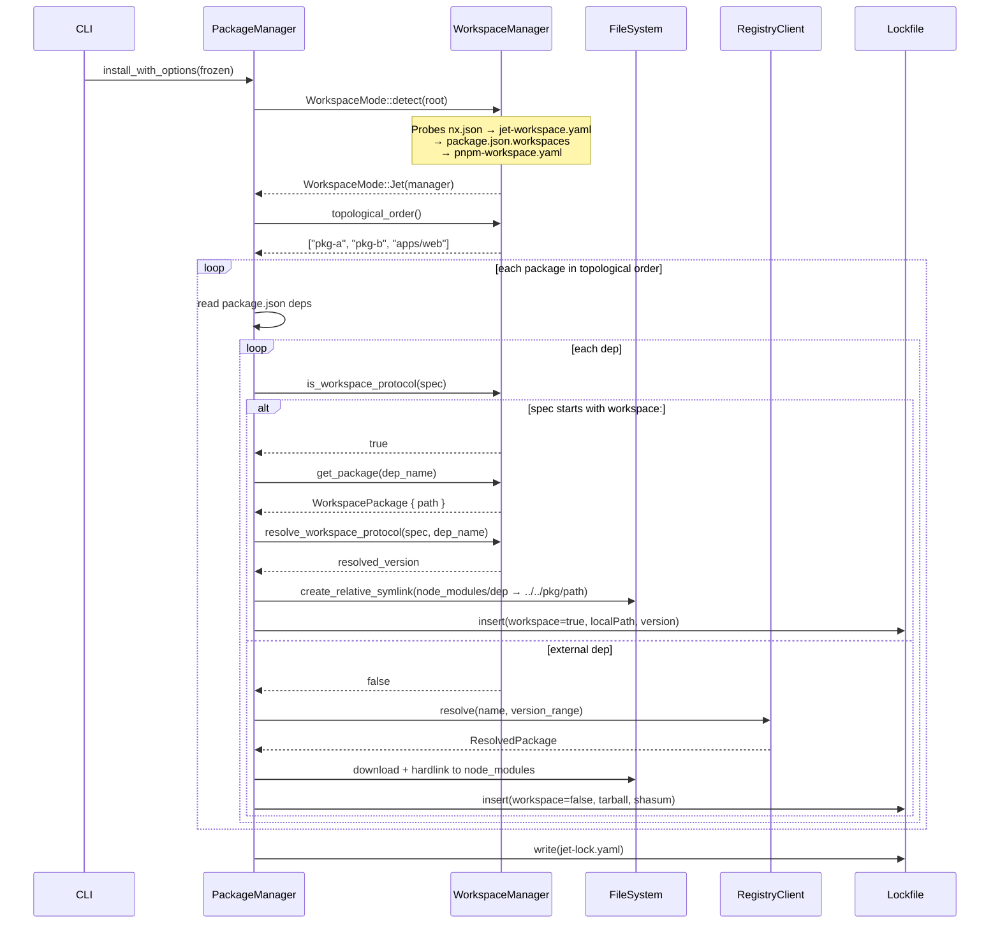
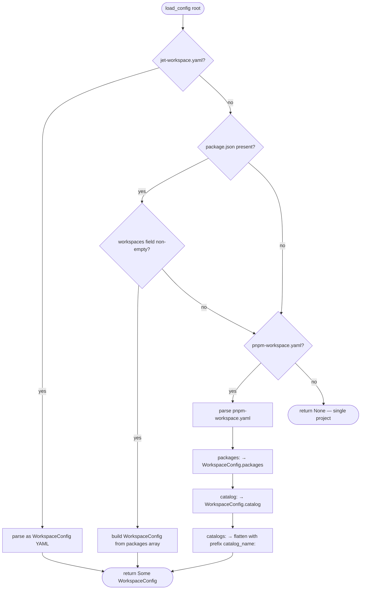
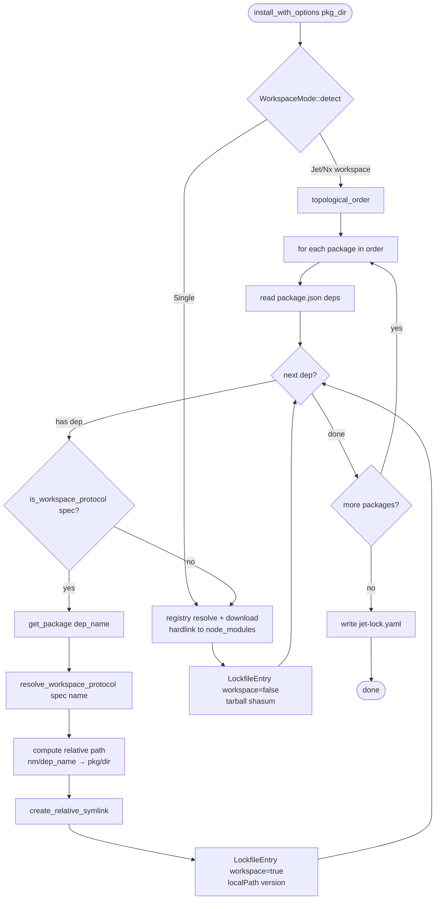

# Jet Workspace Protocol Spec

## Overview

Extend `cclab-jet`'s package manager with pnpm-style workspace support across three subsystems:

**1. pnpm-workspace.yaml Discovery** — `WorkspaceManager::load_config()` gains a third config source. Detection priority (highest wins): `jet-workspace.yaml` → `package.json.workspaces` → `pnpm-workspace.yaml`. The pnpm file is parsed for `packages:` (glob patterns), `catalog:` (default catalog), and `catalogs:` (named catalogs). Catalog entries are merged into `WorkspaceConfig.catalog` so the existing catalog API is reused without changes.

**2. Workspace Protocol Symlinks** — `PackageManager::install_with_options()` detects workspace mode via `WorkspaceMode::detect()`, classifies each direct dep as workspace-protocol or external via `WorkspaceManager::is_workspace_protocol()`, and for `workspace:*` / `workspace:^` / `workspace:~` deps skips registry resolution entirely — instead computing a **relative symlink** from `node_modules/<pkg-name>` to the workspace package's directory (relative, like pnpm). Recursive install iterates all workspace packages in topological order via `WorkspaceManager::topological_order()`, installing each package's external deps normally.

**3. Lockfile Traceability** — `LockfileEntry` gains `workspace: bool` and `local_path: Option<String>` (serde renamed `localPath`) so workspace packages are fully traceable in `jet-lock.yaml`. `Lockfile::is_valid()` bypasses the store-presence check for entries where `workspace == true`.

The existing `WorkspaceManager::resolve_workspace_protocol()` and `is_workspace_protocol()` utilities are reused without modification.
## Requirements

### R1: pnpm-workspace.yaml Detection
`WorkspaceManager::load_config()` must check for `pnpm-workspace.yaml` at the workspace root as a third, lowest-priority config source. Priority order: `jet-workspace.yaml` (highest) → `package.json.workspaces` → `pnpm-workspace.yaml` (lowest). If a higher-priority source resolves, `pnpm-workspace.yaml` is not read.

### R2: pnpm-workspace.yaml Parsing
When `pnpm-workspace.yaml` is selected:
- `packages:` → `WorkspaceConfig.packages` (glob patterns array)
- `catalog:` → `WorkspaceConfig.catalog` (dep_name → version_range, default catalog)
- `catalogs:` → merged into `WorkspaceConfig.catalog` with key prefix `<catalog_name>:` (e.g. `default:react`)

### R3: Workspace Protocol Classification
In `PackageManager::install_with_options()`, after loading the workspace, classify each dependency spec via `WorkspaceManager::is_workspace_protocol()`. Specs beginning with `workspace:` are workspace deps; all others are external.

### R4: Relative Symlink Creation
For each workspace dep (R3): resolve the target `WorkspacePackage.path` via `WorkspaceManager::get_package(dep_name)`, compute a relative path from `{project_dir}/node_modules/{dep_name}` to the workspace package's absolute directory, and create a relative symlink. If the symlink already points to the correct target, skip (idempotent). No tarball is downloaded or extracted.

### R5: Recursive Workspace Install
When workspace mode is detected at the root, iterate all workspace packages in topological order (via `WorkspaceManager::topological_order()`). For each package, invoke `install_with_options()` scoped to that package's directory. Workspace-protocol deps are handled via symlink (R4); external deps use the standard registry flow. A single `jet install` at root installs everything.

### R6: Lockfile Workspace Entries
Workspace packages must be recorded in `jet-lock.yaml` using `LockfileEntry` with:
- `workspace: true`
- `local_path: <relative_path_from_root>` (serde `localPath`; relative from lockfile location to workspace package dir)
- `version: <version_from_workspace_package_json>` (actual version, resolved by `resolve_workspace_protocol()`)

`Lockfile::is_valid()` must skip the store-presence check for entries where `workspace == true`.
## Scenarios

### S1: pnpm-workspace.yaml Discovery Fallback
- **GIVEN** a workspace root containing only `pnpm-workspace.yaml` (no `jet-workspace.yaml`, no `package.json.workspaces`)
- **WHEN** `WorkspaceManager::discover(root)` is called
- **THEN** workspace packages are discovered from `pnpm-workspace.yaml`'s `packages:` patterns

### S2: Higher-Priority Source Wins
- **GIVEN** a workspace root with both `jet-workspace.yaml` and `pnpm-workspace.yaml`
- **WHEN** `WorkspaceManager::discover(root)` is called
- **THEN** `jet-workspace.yaml` is used and `pnpm-workspace.yaml` is not read

### S3: Catalog Version Resolved from pnpm-workspace.yaml
- **GIVEN** `pnpm-workspace.yaml` with `catalog: { react: "^18.0.0" }`
- **WHEN** `WorkspaceManager::catalog_version("react")` is called
- **THEN** it returns `"^18.0.0"`

### S4: workspace:* Creates Relative Symlink, No Download
- **GIVEN** a monorepo with `apps/web` depending on `packages/ui` via `"workspace:*"`
- **WHEN** `jet install` runs at the workspace root
- **THEN** `apps/web/node_modules/ui` is a relative symlink pointing to `../../../packages/ui`
- **AND** no tarball is downloaded for `ui`

### S5: workspace:^ and workspace:~ Version Range Symlinks
- **GIVEN** `packages/server` with `"@acme/shared": "workspace:^"` where `packages/shared` is at version `2.3.1`
- **WHEN** workspace install runs
- **THEN** the symlink is created and the lockfile records `version: ^2.3.1`

### S6: Recursive Install from Root Covers All Packages
- **GIVEN** a workspace with packages `apps/web`, `packages/ui`, `packages/utils` each having external deps
- **WHEN** `jet install` runs at the workspace root
- **THEN** each package's `node_modules/` contains its external deps
- **AND** cross-package workspace deps are symlinks, not extracted tarballs

### S7: Lockfile Records Workspace Entry with Traceability
- **GIVEN** workspace install completes for dep `ui` at `packages/ui@1.5.0` via `workspace:*`
- **WHEN** `jet-lock.yaml` is written
- **THEN** the entry contains `workspace: true`, `localPath: packages/ui`, `version: 1.5.0`

### S8: Acceptance Criterion
- **GIVEN** a project with `pnpm-workspace.yaml` listing `packages/*` and a root `package.json` dep `"my-lib": "workspace:*"` pointing to `packages/my-lib`
- **WHEN** `jet install` runs
- **THEN** `node_modules/my-lib` is a symlink to `../packages/my-lib` (relative)
- **AND** `my-lib` is absent from any tarball download log
## Diagrams

### Interaction
<!-- type: interaction lang: mermaid -->
<!-- TODO -->

### Logic
<!-- type: logic lang: mermaid -->
<!-- TODO -->

### Dependencies
<!-- type: dependency lang: mermaid -->
<!-- TODO -->

### State Machine
<!-- type: state-machine lang: mermaid -->
<!-- TODO -->

### Data Model
<!-- type: db-model lang: mermaid -->
<!-- TODO -->

## API Spec

### REST API
<!-- type: rest-api lang: yaml -->
<!-- TODO -->

### RPC API
<!-- type: rpc-api lang: json -->
<!-- TODO -->

### Async API
<!-- type: async-api lang: yaml -->
<!-- TODO -->

### CLI
<!-- type: cli lang: yaml -->
<!-- TODO -->

### Schema
<!-- type: schema lang: json -->
<!-- TODO -->

### Config
<!-- type: config lang: json -->
<!-- TODO -->

## Test Plan

### Unit Tests (workspace.rs)
- `test_pnpm_workspace_yaml_discovery`: create tempdir with only `pnpm-workspace.yaml`; assert `WorkspaceManager::discover()` returns `Some` with correct packages
- `test_jet_workspace_yaml_priority`: create tempdir with both `jet-workspace.yaml` and `pnpm-workspace.yaml`; assert `jet-workspace.yaml` is used
- `test_pnpm_catalog_default`: parse `pnpm-workspace.yaml` with `catalog: { react: "^18.0.0" }`; assert `catalog_version("react") == Some("^18.0.0")`
- `test_pnpm_catalogs_named`: parse `pnpm-workspace.yaml` with `catalogs: { default: { react: "^18" } }`; assert merged into catalog map

### Unit Tests (lockfile.rs)
- `test_lockfile_workspace_entry_roundtrip`: create `LockfileEntry` with `workspace: true`, `local_path: Some("packages/ui")`, serialize to YAML and deserialize; assert fields preserved
- `test_lockfile_is_valid_skips_workspace`: call `is_valid()` on lockfile with a workspace entry; assert true without checking store

### Integration Tests (tests/workspace_protocol.rs)
- `test_workspace_star_symlink`: monorepo fixture with `pnpm-workspace.yaml` + two packages; run `install_with_options`; assert `node_modules/dep` is a symlink pointing to relative workspace path
- `test_workspace_caret_resolution`: workspace dep `workspace:^` on package@2.3.1; assert lockfile records version `^2.3.1` and symlink created
- `test_recursive_workspace_install`: workspace root with 3 packages; assert all packages' external deps installed
- `test_no_registry_call_for_workspace_dep`: mock registry; assert workspace:* dep never calls `download_package`
- `test_lockfile_workspace_fields`: after install, read `jet-lock.yaml`; assert workspace entry has `workspace: true`, `localPath: packages/ui`, `version: 1.5.0`
## Changes

```yaml
files:
  - path: crates/cclab-jet/src/pkg_manager/workspace.rs
    action: MODIFY
    desc: |
      Extend load_config() with third detection source:
      after package.json.workspaces fallback, check pnpm-workspace.yaml;
      parse packages:/catalog:/catalogs: fields into WorkspaceConfig;
      flatten catalogs: map into catalog with key prefix '<catalog_name>:'

  - path: crates/cclab-jet/src/pkg_manager/mod.rs
    action: MODIFY
    desc: |
      In install_with_options(): detect workspace mode via WorkspaceMode::detect();
      split all_deps into workspace-protocol and external sets;
      for workspace deps: call create_relative_symlink(node_modules/<name>, abs_pkg_path);
      build LockfileEntry { workspace: true, local_path, version } for each;
      for external deps: existing registry resolve/download/hardlink flow unchanged;
      add recursive_workspace_install() helper: topological_order + per-package install_with_options();
      call recursive_workspace_install() when workspace root detected

  - path: crates/cclab-jet/src/pkg_manager/lockfile.rs
    action: MODIFY
    desc: |
      Add workspace: bool (default false, skip_serializing_if is_false) to LockfileEntry;
      add local_path: Option<String> (serde rename localPath, skip_serializing_if is_none);
      update from_resolved() to carry workspace + local_path from ResolvedPackage;
      update is_valid() to skip store.has_package() check when entry.workspace == true

  - path: crates/cclab-jet/src/pkg_manager/resolver.rs
    action: MODIFY
    desc: |
      Add workspace: bool and local_path: Option<String> fields to ResolvedPackage
      so workspace entries can be threaded through the resolve -> lockfile pipeline

  - path: crates/cclab-jet/tests/workspace_protocol.rs
    action: CREATE
    desc: |
      Integration tests using tempdir monorepo fixtures:
      - test_pnpm_workspace_yaml_discovery: pnpm-workspace.yaml with packages glob finds packages
      - test_jet_workspace_yaml_priority: jet-workspace.yaml wins over pnpm-workspace.yaml
      - test_catalog_resolution: catalog: entry returned by catalog_version()
      - test_workspace_star_symlink: workspace:* creates relative symlink, no tarball download
      - test_workspace_caret_semver: workspace:^ records ^<version> in lockfile
      - test_recursive_install: root jet install covers all packages
      - test_lockfile_workspace_entry: jet-lock.yaml entry has workspace=true + localPath
```
## Wireframe
<!-- type: wireframe lang: yaml -->

<!-- TODO -->

## Component
<!-- type: component lang: json -->

<!-- TODO -->

## Design Token
<!-- type: design-token lang: json -->

<!-- TODO -->

## Doc
<!-- type: doc lang: markdown -->

<!-- TODO -->


## Interaction



## State Machine

```mermaid
stateDiagram-v2
    [*] --> Detecting
    Detecting --> Sorting : workspace config found
    Detecting --> Resolving : WorkspaceMode::Single

    Sorting --> Classifying : topological_order() ready
    Classifying --> Symlinking : is_workspace_protocol() = true
    Classifying --> Resolving : is_workspace_protocol() = false
    Symlinking --> Recording : create_relative_symlink() done
    Resolving --> Recording : registry download + hardlink done
    Recording --> Classifying : more deps in current package
    Recording --> Classifying : next package in topo order
    Recording --> LockfileWrite : all packages complete
    LockfileWrite --> [*]
```

**State descriptions:**

| State | Description |
|-------|-------------|
| `Detecting` | `WorkspaceMode::detect(root)` probing config sources in priority order |
| `Sorting` | `WorkspaceManager::topological_order()` computing install order via Kahn's algorithm |
| `Classifying` | Per-dep: `is_workspace_protocol(spec)` branching to symlink vs registry path |
| `Symlinking` | Computing relative path and calling `create_relative_symlink()` |
| `Resolving` | Registry resolution + tarball download + hardlink into `node_modules/` |
| `Recording` | Building `LockfileEntry` (`workspace: bool`, `local_path`, `version`) and inserting into lockfile map |
| `LockfileWrite` | Serialising `Lockfile` to `jet-lock.yaml` via `serde_yaml` |


## Logic

### Config Source Detection (WorkspaceManager::load_config)



### Dep Classification and Install (install_with_options)




## Schema

```json
{
  "$schema": "http://json-schema.org/draft-07/schema#",
  "title": "JetWorkspaceProtocol",
  "description": "Schema additions for workspace protocol support in cclab-jet",
  "definitions": {
    "LockfileEntry": {
      "type": "object",
      "required": ["version", "resolution"],
      "properties": {
        "version": { "type": "string" },
        "resolution": { "$ref": "#/definitions/Resolution" },
        "workspace": {
          "type": "boolean",
          "default": false,
          "description": "NEW — true when entry is a local workspace package. is_valid() skips store-presence check."
        },
        "localPath": {
          "type": "string",
          "description": "NEW (serde rename localPath) — relative path from lockfile root to workspace package directory. Only present when workspace=true."
        },
        "dependencies": { "type": "object", "additionalProperties": { "type": "string" } },
        "peerDependencies": { "type": "object", "additionalProperties": { "type": "string" } },
        "bin": { "type": "object", "additionalProperties": { "type": "string" } },
        "hasInstallScript": { "type": "boolean", "default": false },
        "nestedIn": { "type": "string" }
      }
    },
    "Resolution": {
      "type": "object",
      "required": ["tarball", "shasum"],
      "properties": {
        "tarball": { "type": "string" },
        "shasum": { "type": "string" },
        "integrity": { "type": "string" }
      }
    },
    "PnpmWorkspaceYaml": {
      "type": "object",
      "description": "pnpm-workspace.yaml format — third-priority workspace config source",
      "properties": {
        "packages": {
          "type": "array",
          "items": { "type": "string" },
          "description": "Glob patterns → WorkspaceConfig.packages"
        },
        "catalog": {
          "type": "object",
          "additionalProperties": { "type": "string" },
          "description": "Default catalog: dep_name → version_range → merged into WorkspaceConfig.catalog"
        },
        "catalogs": {
          "type": "object",
          "additionalProperties": {
            "type": "object",
            "additionalProperties": { "type": "string" }
          },
          "description": "Named catalogs: catalog_name → { dep_name → version_range }. Entries merged into WorkspaceConfig.catalog with key prefix '<catalog_name>:'"
        }
      }
    },
    "ResolvedPackage": {
      "type": "object",
      "required": ["name", "version"],
      "description": "Extended with workspace fields to thread through resolve → lockfile pipeline",
      "properties": {
        "name": { "type": "string" },
        "version": { "type": "string" },
        "tarball_url": { "type": "string" },
        "shasum": { "type": "string" },
        "integrity": { "type": "string" },
        "workspace": {
          "type": "boolean",
          "default": false,
          "description": "NEW — set true for workspace:* deps; propagates to LockfileEntry.workspace"
        },
        "local_path": {
          "type": "string",
          "description": "NEW — workspace package dir relative to root; sourced from WorkspacePackage.path; propagates to LockfileEntry.localPath"
        }
      }
    }
  }
}
```

# Reviews
