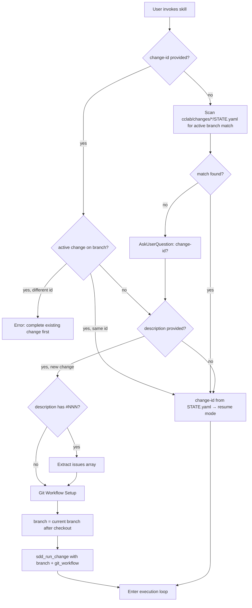
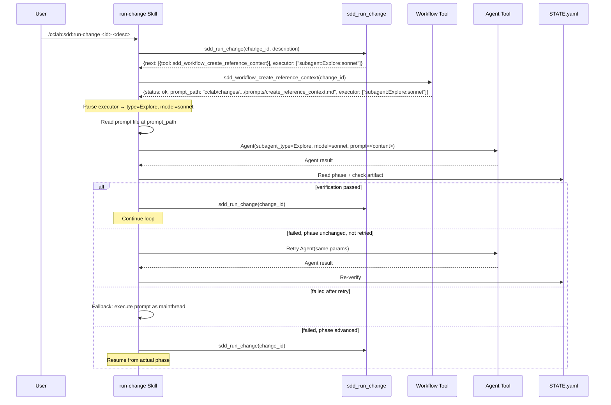

# /cclab:sdd:run-change Skill

A Claude Code skill that drives the SDD workflow by calling the `sdd_run_change` MCP tool in a loop. This spec defines both the template content (what to install) and the installation mechanics (how to install).

For the tool's OpenRPC definition and routing logic, see [tools/run-change.md](../tools/run-change.md).

## Template

```markdown
---
name: cclab:sdd:run-change
description: Unified sdd workflow - decide, plan, implement (stops before merge)
user-invocable: true
---

# /cclab:sdd:run-change

Calls `sdd_run_change` MCP tool in a loop. Each call returns the next workflow tool to call. Mainthread drives the loop and dispatches to agents when the workflow tool's `executor` field indicates a non-mainthread executor.

## Entry Point

Before calling `sdd_run_change`, resolve the change-id, extract issue references, and set up git workflow.

### 1. Change-ID Resolution

If the user provided a change-id, use it. Otherwise:

- Check `cclab/changes/` for existing change directories whose `STATE.yaml` has `branch` matching the current git branch AND `phase` is not terminal (`archived` or `rejected`).
  - Found → use that change's `change_id`. This is a **resume** (no description needed).
  - Not found → this is a **new change**. Use `AskUserQuestion` to ask for a change-id (should be descriptive of the change content, e.g. `add-auth-flow`).

**Constraint**: A branch can only have one active (non-terminal) change at a time. When starting a new change, if an active change already exists on the current branch, abort with an error telling the user to complete or archive the existing change first.

### 2. Issue Extraction

If the user provided a description, scan it for issue references:

- Match `#\d+` (e.g. `#272`, `#273`)
- Match full GitHub URLs (e.g. `github.com/.../issues/42`)
- Collect all matches into an `issues` array (e.g. `["#272", "#273"]`)

### 3. Git Workflow Setup (new change only)

Skip this step if resuming an existing change (no description).

1. Detect environment:
   - `git branch --show-current` → current branch
   - `git rev-parse --git-common-dir` → detect if in worktree (result ≠ `.git`)
2. Ask user (`AskUserQuestion`):
   - On `main`/`master`: `new_branch` (Recommended), `in_place`
   - On other branches: `in_place` (Recommended), `new_branch`
3. Execute:
   - `new_branch` → `git checkout -b cclab/{change-id}`
   - `in_place` → no action
4. Record `branch` = current branch name (after checkout if `new_branch`)
5. Pass `git_workflow` and `branch` to `sdd_run_change`

## Rules

1. **One change-id = one change.** NEVER split multiple issues into separate changes. Pass the full description as-is.
2. **Do NOT plan, interpret, or act on the description yourself.** Call `sdd_run_change` immediately after entry point resolution. The tool decides what to do.
3. **Follow the response literally.** Read `action`, `prompt`, and `executor` from the response:
   - `action: "complete"` → workflow done
   - `status: "implementation_complete"` → **STOP the loop**. Tell user to choose `/cclab:sdd:merge` or `/cclab:sdd:revise-artifact`
   - Other actions → check `executor` to decide who handles it (see Loop below)
4. **CLI commands only.** Do NOT use MCP tool calls.
5. **Never invoke `/cclab:sdd:merge` or `/cclab:sdd:revise-artifact` yourself.** Only the user can invoke these skills.

## Loop

1. Call `sdd_run_change(project_path=$PWD, change_id=<id>, description=<desc>, issues=<issues>, git_workflow=<workflow>, branch=<branch>)`
   - `description`, `issues`, `git_workflow`, `branch` only on first call (new change)
   - `init_change` is handled internally — no separate step needed
2. Read `next[0].tool` from the response → call the workflow tool (e.g. `sdd_workflow_create_reference_context`)
3. Workflow tool internally handles agent delegation (no need to check executor)
4. If executor is mainthread → follow prompt directly
5. Call `sdd_run_change` again
6. Repeat until `action: "complete"`

## Usage

` ` `
/cclab:sdd:run-change <change-id> "<description with #issue refs>"
/cclab:sdd:run-change <change-id>
/cclab:sdd:run-change
` ` `
```

## Installation

### R1 - Compile-Time Embedding

```yaml
id: R1
priority: high
status: draft
```

The template content (from `## Template` code fence above) MUST be embedded into the binary via `include_str!()` at compile time. The installer does NOT read from the filesystem at runtime.

### R2 - Installation Path

```yaml
id: R2
priority: high
status: draft
```

`cclab init` writes the template to `.claude/skills/cclab-sdd-run-change/SKILL.md`. The parent `.claude/skills/` directory is created if it does not exist.

### R3 - Deprecated Skill Cleanup

```yaml
id: R3
priority: medium
status: draft
```

Before installing, `cclab init` removes deprecated skill directories (e.g. `genesis-*` renamed skills). The deprecated list is maintained in `cli/init.rs`. Removal is silent if the directory does not exist.

## Diagrams

### Entry Point



### Execution Loop

```mermaid
flowchart TD
    A[Call sdd_run_change] --> B{action?}
    B -->|complete| F[Done]
    B -->|other| WF[Call workflow tool]
    WF --> ST{status?}
    ST -->|implementation_complete| STOP[STOP — prompt user]
    STOP --> U{User choice}
    U -->|/merge| MERGE[/cclab:sdd:merge]
    U -->|/revise-artifact| REV[/cclab:sdd:revise-artifact → run-change]
    ST -->|other| EX{executor?}
    EX -->|mainthread| C[Follow prompt directly]
    EX -->|agent| AG[Tool auto-executed agent, returned result]
    C --> A
    AG --> A
```


## Overview

Update the `/cclab:sdd:run-change` skill loop to handle `subagent:*` executor strings returned by workflow tools in `claude_subagents` mode. Currently the loop has two branches: mainthread (follow prompt directly) and agent (tool auto-executed, returned result). The change adds a third branch: `subagent:*` (skill parses executor, invokes Agent tool, verifies result).

### Executor Dispatch Branches (Skill Loop)

| Executor | Action | Who Dispatches |
|---|---|---|
| `["mainthread"]` | Follow prompt directly | Skill mainthread |
| `subagent:{type}:{model}` | Parse → read `prompt_path` → invoke Agent tool → verify | Skill mainthread |
| Other (`gemini:*`, `codex:*`, `claude-agent:*`) | Handled internally by workflow tool via `run_agent()` | Rust CLI (transparent to skill) |

### Key Design Decisions

1. **Skill is the Agent tool caller** — only the LLM mainthread can invoke the Claude Code Agent tool. Rust CLI cannot.
2. **Prompt comes from `prompt_path`** — skill reads the file at `prompt_path` (returned by workflow tool) and passes its content to the Agent tool `prompt` param.
3. **Verification after Agent returns** — skill checks STATE.yaml phase + artifact existence, same logic as `sdd_delegate_agent` but executed inline.
4. **Retry + fallback** — if Agent tool fails, retry once. If retry fails, fall back to mainthread execution.

### Template Loop Section Update

Replace steps 3-4 in the Loop section:

```
## Loop

1. Call `sdd_run_change(...)` 
2. Read `next[0].tool` → call the workflow tool
3. Read `executor` from workflow tool response:
   a. `executor[0] == "mainthread"` → follow prompt directly (read prompt_path, execute inline)
   b. `executor[0]` starts with `subagent:` → parse `subagent:{type}:{model}`, read prompt_path, invoke Agent tool:
      - `subagent_type` = second segment (e.g. `Explore`, `general-purpose`)
      - `model` = third segment (e.g. `sonnet`, `opus`)
      - Read prompt from `prompt_path` (relative to project root)
      - Invoke Agent tool with: description="SDD workflow task", prompt=<file content>, subagent_type, model
      - After Agent returns: verify STATE.yaml phase advanced + expected artifact exists
      - If verification fails and phase unchanged: retry once, then fallback to mainthread
      - If verification fails but phase advanced: continue (call sdd_run_change with actual state)
   c. Other executor → workflow tool already handled dispatch internally, proceed
4. Call `sdd_run_change` again
5. Repeat until `action: "complete"`
```


## Logic

```mermaid
flowchart TD
    A[Call sdd_run_change] --> B{action?}
    B -->|complete| DONE[Done]
    B -->|implementation_complete| STOP[STOP — prompt user]
    B -->|other| WF[Call workflow tool from next.tool]
    WF --> EX{executor[0]?}
    EX -->|mainthread| MT[Read prompt_path → execute inline]
    EX -->|subagent:*| PARSE[Parse subagent:type:model]
    EX -->|other| INTERNAL[Workflow tool handled dispatch internally]
    PARSE --> READ_PROMPT[Read file at prompt_path]
    READ_PROMPT --> AGENT[Invoke Agent tool with subagent_type + model + prompt]
    AGENT --> VERIFY{Verify STATE.yaml phase + artifact}
    VERIFY -->|passed| NEXT_ITER[Call sdd_run_change again]
    VERIFY -->|failed, phase unchanged| RETRY{retried?}
    RETRY -->|no| AGENT_RETRY[Retry Agent tool once]
    AGENT_RETRY --> VERIFY
    RETRY -->|yes| FALLBACK[Fallback: execute prompt as mainthread]
    FALLBACK --> NEXT_ITER
    VERIFY -->|failed, phase advanced| NEXT_ITER
    MT --> NEXT_ITER
    INTERNAL --> NEXT_ITER
    NEXT_ITER --> A
```


## Interaction




## Changes

```yaml
files:
  # Skill template — add subagent:* dispatch branch to loop
  - path: crates/cclab-sdd/src/skills/run_change.rs
    action: MODIFY
    desc: |
      Update the embedded skill template (include_str! content). Replace Loop steps 3-4
      with three-way executor dispatch: mainthread (inline), subagent:* (parse + Agent
      tool + verify), other (handled by workflow tool internally). Add verification
      instructions: read STATE.yaml phase, check expected artifact, handle retry/fallback.

  # Main spec update
  - path: cclab/specs/crates/cclab-sdd/skills/run-change.md
    action: MODIFY
    desc: |
      Update Loop section with three-way executor dispatch. Update Execution Loop
      flowchart to show subagent:* branch with parse/Agent/verify steps. Add
      verification instructions for subagent dispatch. Keep Entry Point unchanged.
```

# Reviews
