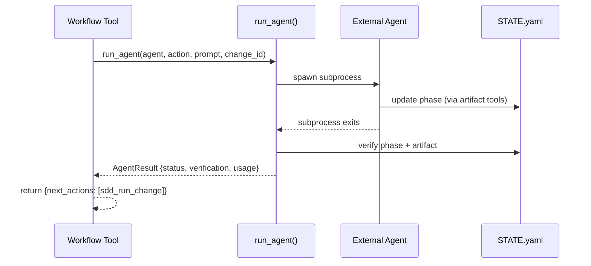
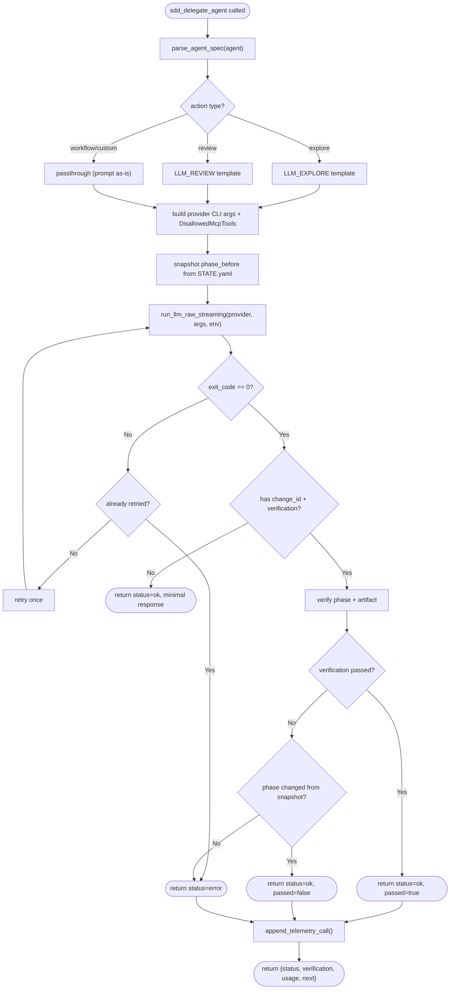
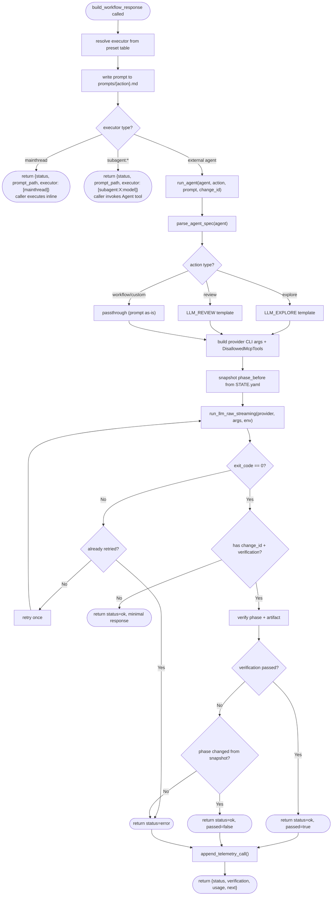
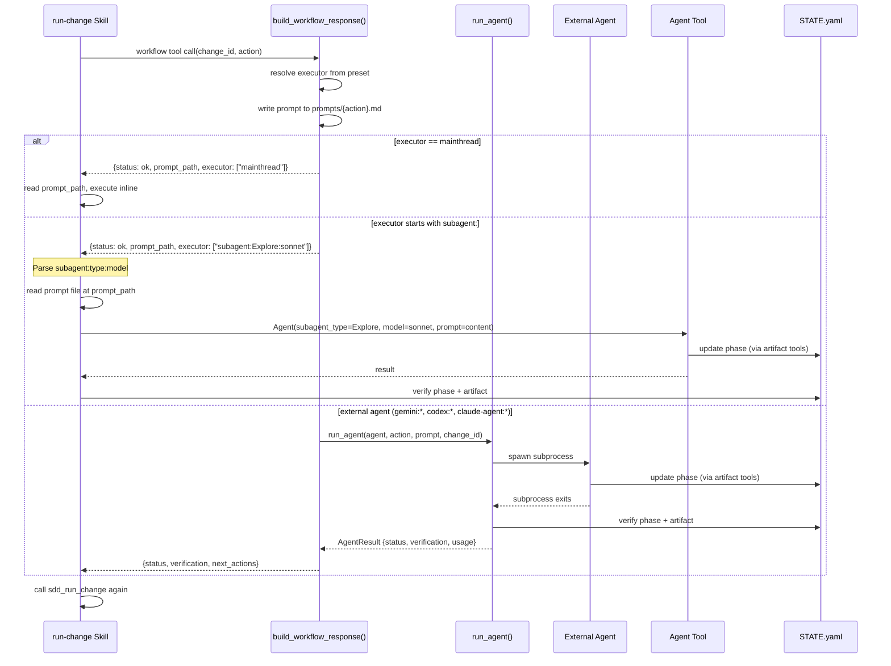

---
files:
  - mcp/tools/agent.rs
refs: [create-reference-context, review-reference-context, revise-reference-context, create-change-spec, review-change-spec, revise-change-spec, create-change-implementation, review-change-implementation, revise-change-implementation, create-change-merge]
id: subagent-workflow-dispatch
main_spec_ref: "crates/cclab-sdd/tools/utils/delegate-agent.md"
merge_strategy: extend
fill_sections: [overview, logic, interaction, changes]
filled_sections: [overview, logic, interaction, changes]
create_complete: true
---

# sdd_delegate_agent: Verified Agent Dispatch

`sdd_delegate_agent` is now an **internal function**, not a mainthread-facing tool.
Workflow tools call `run_agent()` directly instead of returning delegate instructions.

**Callers**: `/cclab:sdd:agent` skill (via MCP tool) and internally by workflow tools (via `run_agent()`). Agents cannot call `sdd_delegate_agent` — recursion blocked.
**Key invariant**: `run_agent()` never trusts agent output blindly. It checks STATE.yaml phase after agent finishes.

## OpenRPC Method Definition

```json
{
  "name": "sdd_delegate_agent",
  "summary": "Run a prompt against an LLM agent with post-execution verification",
  "params": [
    { "name": "project_path", "required": true, "schema": { "type": "string" } },
    { "name": "change_id", "required": true, "schema": { "type": "string", "pattern": "^[a-z0-9-]+$" } },
    {
      "name": "agent", "required": true,
      "schema": { "type": "string", "description": "provider:model_id (e.g. 'gemini:flash', 'codex:balanced', 'claude:fast')" }
    },
    {
      "name": "action", "required": true,
      "schema": {
        "type": "string",
        "enum": [
          "explore", "review", "custom",
          "restructure_input",
          "create_reference_context", "review_reference_context", "revise_reference_context",
          "create_change_spec", "review_change_spec", "revise_change_spec",
          "begin_implementation", "implement_spec", "implement_spec_with_codegen", "write_implementation_diff",
          "review_spec", "revise_spec", "spec_terminal_failure",
          "begin_merge", "resume_merge"
        ],
        "description": "The workflow action being delegated. Determines verification logic. 'explore' and 'review' use legacy templates; workflow actions use passthrough (prompt as-is from run_change)."
      }
    },
    { "name": "prompt", "required": false, "schema": { "type": "string", "description": "Inline prompt text. One of prompt or prompt_path is required." } },
    { "name": "prompt_path", "required": false, "schema": { "type": "string", "description": "Relative path to prompt file (e.g. cclab/changes/{id}/prompts/{action}.md). One of prompt or prompt_path is required." } }
  ],
  "result": {
    "name": "result",
    "schema": {
      "type": "object",
      "required": ["status", "change_id", "action", "verification"],
      "properties": {
        "status": { "type": "string", "enum": ["ok", "error"] },
        "change_id": { "type": "string" },
        "action": { "type": "string" },
        "verification": {
          "type": "object",
          "required": ["passed", "expected_phase", "actual_phase"],
          "properties": {
            "passed": { "type": "boolean" },
            "expected_phase": { "type": "string" },
            "actual_phase": { "type": "string" },
            "expected_artifact": { "type": "string" },
            "artifact_exists": { "type": "boolean" }
          }
        },
        "usage": {
          "type": "object",
          "properties": {
            "tokens_in": { "type": "integer" },
            "tokens_out": { "type": "integer" },
            "duration_ms": { "type": "integer" },
            "cost_usd": { "type": "number" }
          }
        },
        "next": { "type": "array", "items": { "type": "object", "required": ["tool"], "properties": { "tool": { "type": "string" }, "args": { "type": "object" } } } }
      }
    }
  }
}
```

## Prompt Resolution

One of `prompt` or `prompt_path` must be provided:

| Source | Behavior |
|--------|----------|
| `prompt` (inline) | Used as-is. For `explore`/`review`/`custom` actions. |
| `prompt_path` (file) | Read from `{project_root}/{prompt_path}`. Standard for workflow actions — workflow tools write prompts to `prompts/{action}.md`. |

Workflow tools always write prompts to files and return `prompt_path` in their response. This keeps tool responses small and consistent regardless of prompt size.

## Action Routing

| Action Type | Template | change_id Required |
|-------------|----------|--------------------|
| `explore` | LLM_EXPLORE (legacy) | No |
| `review` | LLM_REVIEW (legacy) | No |
| Workflow actions | Passthrough (prompt as-is) | Yes |
| `custom` | Passthrough | No |

Workflow actions use passthrough because `run_change` already provides fully-formed prompts with all necessary context.

## Verification Table

After agent finishes, `sdd_delegate_agent` loads STATE.yaml and checks phase + artifact existence.

| action | expected_phase | expected_artifact |
|--------|---------------|-------------------|
| `create_reference_context` | `reference_context_created` or `reference_context_revised` | `reference_context.md` |
| `review_reference_context` | `reference_context_reviewed` | _(none)_ |
| `revise_reference_context` | `reference_context_revised` | _(none)_ |
| `create_change_spec` | `change_spec_created` | `specs/{spec_group}/{spec_id}.md` |
| `review_change_spec` | `change_spec_reviewed` | _(none)_ |
| `revise_change_spec` | `change_spec_revised` | `specs/{spec_group}/{spec_id}.md` |
| `begin_implementation` | `change_implementation_created` | _(none)_ |
| `implement_spec` / `implement_spec_with_codegen` | `change_implementation_created` | _(none)_ |
| `write_implementation_diff` | `change_implementation_created` | `implementation.md` |
| `review_spec` | `change_implementation_reviewed` | `implementation.md` |
| `revise_spec` | `change_implementation_revised` | _(none)_ |
| `begin_merge` / `resume_merge` | `change_merge_created` | _(none)_ |
| `explore` | _(no verification)_ | _(none)_ |
| `review` | _(no verification)_ | _(none)_ |
| `custom` | _(no verification)_ | _(none)_ |

## Sequence Diagram



## Behavior Flowchart



## Recursion Prevention

Agents cannot call `sdd_delegate_agent`. Enforced per-provider:

| Provider | Mechanism |
|----------|-----------|
| Claude | `--disallowedTools mcp__cclab-mcp__sdd_delegate_agent` |
| Codex | `--config mcp_servers.cclab-mcp.disabled_tools=["sdd_delegate_agent"]` |
| Gemini | `.gemini/settings.json` excludeTools |

## Error Recovery

### Agent Failure — Retry + Fallback Chain

When agent exits with non-zero code or times out, `sdd_delegate_agent` retries once:

1. **Retry once** with the same agent (transient failure: rate limit, network timeout)
2. If retry fails, return `status: "error"` — mainthread caller tries next agent in `executor` chain
3. If all agents fail, **mainthread executes directly** using the `prompt`

```
executor: ["gemini:flash", "codex:balanced", "mainthread"]
         ↓ fail           ↓ fail              ↓ always works
    retry gemini:flash → try codex:balanced → mainthread executes
```

Do NOT retry if the agent ran successfully but produced incorrect output (verification failed) — see next section.

### Verification Failure — Partial Progress Handling

When `verification.passed = false` (agent ran but didn't produce expected artifact/phase):

| Scenario | `actual_phase` | Response | Recovery |
|----------|---------------|----------|----------|
| No state change | Same as `phase_before` | `status: "error"` | Treat as agent failure — caller tries next agent |
| Phase advanced partially | Different from expected | `status: "ok", passed: false` | Resume from `actual_phase` via `sdd_run_change` |
| Wrong artifact | Expected phase reached | `status: "ok", passed: false` | Re-run `sdd_run_change` |

**Key principle**: never retry blindly when state has changed. The state machine is the source of truth — call `sdd_run_change` to get the correct next action from the current state.

### Concurrent Access

`sdd_delegate_agent` spawns a subprocess that shares filesystem access with mainthread. STATE.yaml writes are atomic (write-to-temp + rename) to prevent corruption. However, only one agent should run per change at a time — concurrent agents on the same `change_id` may produce conflicting state updates.

## Side Effects

### By MCP tools the agent calls

| STATE.yaml field | Value |
|-----------------|-------|
| `phase` | Set by `sdd_write_artifact` (create/revise/review actions) |
| `revision_counts.*` | Incremented on revise actions |
| `updated_at` | ISO 8601 |

### By sdd_delegate_agent itself (post-verification)

| STATE.yaml field | Value |
|-----------------|-------|
| `telemetry.calls[]` | Append: `{step, model, tokens_in, tokens_out, cost_usd, duration_ms, timestamp}` |
| `telemetry.total_tokens_in` | Accumulate |
| `telemetry.total_tokens_out` | Accumulate |
| `telemetry.total_cost_usd` | Accumulate |

`step` = the `action` param (e.g. `"create_reference_context"`), `model` = resolved model name from agent spec.


## Overview

Add `subagent:*` dispatch branch to `build_workflow_response()`. Currently two branches exist: mainthread (return prompt_path + executor to caller) and external agent (call `run_agent()` internally). The `subagent:*` branch routes like mainthread — returns prompt_path + executor to the caller skill — because only the LLM mainthread can invoke the Claude Code Agent tool.

### Dispatch Branches in `build_workflow_response()`

| Executor Pattern | Branch | Action |
|---|---|---|
| `["mainthread"]` | Return to caller | Caller reads prompt_path, executes inline |
| `subagent:*` | Return to caller | Caller parses `subagent:{type}:{model}`, reads prompt_path, invokes Agent tool |
| Other (`gemini:*`, `codex:*`, `claude-agent:*`) | Call `run_agent()` | Rust CLI spawns external subprocess, verifies, returns result |

### Key Design Decisions

1. **`run_agent()` is NOT modified** — `subagent:*` executors never reach `run_agent()`. The routing decision happens in `build_workflow_response()` before `run_agent()` is called.
2. **Same return shape as mainthread** — both mainthread and subagent branches return `{status, prompt_path, executor, next_actions: []}`. The skill differentiates by checking `executor[0]`.
3. **Verification moves to skill** — for `subagent:*`, STATE.yaml phase + artifact verification is performed by the mainthread skill after Agent tool returns, not by `run_agent()`.
4. **Routing logic** — `is_subagent = executor.iter().any(|e| e.starts_with("subagent:"))`. If `is_mainthread_only || is_subagent`, return to caller. Otherwise, call `run_agent()`.

### `build_workflow_response()` Routing

```rust
let is_mainthread_only = executor.len() == 1 && executor[0] == "mainthread";
let is_subagent = executor.iter().any(|e| e.starts_with("subagent:"));

if is_mainthread_only || is_subagent {
    // Return prompt_path + executor to caller (mainthread skill dispatches)
} else {
    // Call run_agent() internally (Rust CLI dispatches external subprocess)
}
```


## Logic

### Updated Behavior Flowchart

`build_workflow_response()` now has three branches. The subagent branch exits early (like mainthread) without calling `run_agent()`.



### Routing Decision Logic

```mermaid
flowchart TD
    Input["executor array from preset"] --> IsMT{executor == [mainthread]?}
    IsMT -->|yes| ReturnDirect(["return to caller — mainthread executes"])
    IsMT -->|no| IsSub{any element starts with subagent:?}
    IsSub -->|yes| ReturnDirect
    IsSub -->|no| RunAgent(["call run_agent() — Rust CLI dispatch"])
```


## Interaction

### Updated Sequence Diagram

Shows three dispatch paths through `build_workflow_response()`. The subagent path returns to the skill (like mainthread) instead of calling `run_agent()`.




## Changes

```yaml
files:
  # build_workflow_response() — add subagent:* routing branch
  - path: crates/cclab-sdd/src/tools/workflow_common.rs
    action: MODIFY
    desc: |
      Add third dispatch branch in build_workflow_response(): when executor starts with
      "subagent:", return prompt_path + executor to caller (like mainthread) instead of
      calling run_agent(). Add is_subagent check:
        let is_subagent = executor.iter().any(|e| e.starts_with("subagent:"));
        if is_mainthread_only || is_subagent { return response } else { run_agent() }
      No changes to run_agent() itself — subagent:* never reaches it.

  # Main spec update — delegate-agent.md
  - path: cclab/specs/crates/cclab-sdd/tools/utils/delegate-agent.md
    action: MODIFY
    desc: |
      Update Behavior Flowchart to show three-branch dispatch at build_workflow_response()
      level: mainthread (return), subagent:* (return), external (run_agent). Update
      Sequence Diagram to show subagent path returning to skill instead of calling
      run_agent(). Add routing logic documentation with is_subagent check.
```

# Reviews
