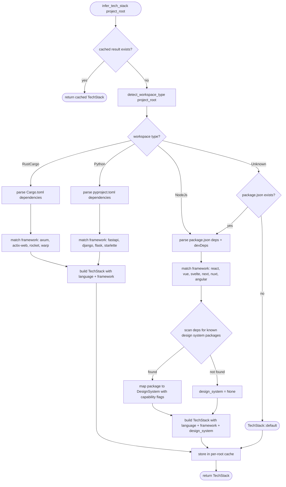

# Tech Stack Inference

## Overview

<!-- type: overview lang: markdown -->

Auto-detect project tech stack from manifest files to drive section optionality and wireframe behavior. No user-maintained config — SDD reads what is already in the project.

| Aspect | Detail |
|--------|--------|
| Input | Project root manifest files: `package.json`, `Cargo.toml`, `pyproject.toml` |
| Output | `TechStack` struct consumed by section-optionality-filter and wireframe generator |
| Extends | `detect_workspace_type()` in `cli/init.rs` (scope-resolution spec) |
| Trigger | Called once per workflow run during reference_context phase, before spec_plan construction |

### Detection layers

| Layer | Source file | Extracted info |
|-------|------------|----------------|
| Language | Any manifest | `rust`, `python`, `javascript`, `typescript` |
| Framework | Manifest dependencies section | `react`, `vue`, `svelte`, `axum`, `actix`, `django`, `flask`, `fastapi` |
| Design system | `package.json` dependencies | library name + `provides_tokens` + `provides_components` capability flags |

### Known design system registry

| Package | Library ID | `provides_tokens` | `provides_components` |
|---------|-----------|-------------------|----------------------|
| `@mui/material` | `mui` | true | true |
| `antd` | `antd` | false | true |
| `@chakra-ui/react` | `chakra` | true | true |
| `@mantine/core` | `mantine` | true | true |
| `vuetify` | `vuetify` | true | true |
| `@angular/material` | `angular-material` | true | true |
| (none detected) | — | false | false |

### Constraint

- Detection is **read-only** — never writes to manifest files
- Result is deterministic for a given project root (no network, no user prompts)
- Extends `WorkspaceType` detection, does not duplicate it — reuses the same manifest probing order
- Consumed downstream via `TechStack` struct, never serialized to config.toml
## Requirements

<!-- type: requirements lang: markdown -->

| ID | Requirement |
|----|-------------|
| REQ-1 | `infer_tech_stack(project_root: &Path) -> TechStack` reads manifest files in priority order: `Cargo.toml` → `pyproject.toml` → `package.json`. First match determines primary language. Multiple manifests may coexist (e.g., Rust project with JS tooling). |
| REQ-2 | Framework detection parses the dependencies section of the matched manifest. For `package.json`: `dependencies` + `devDependencies`. For `Cargo.toml`: `[dependencies]`. For `pyproject.toml`: `[project.dependencies]` or `[tool.poetry.dependencies]`. |
| REQ-3 | Design system detection scans `package.json` dependencies against a hardcoded registry of known packages (e.g., `@mui/material` → `mui`). Each registry entry maps to `provides_tokens: bool` and `provides_components: bool` capability flags. |
| REQ-4 | If no known design system package is found in dependencies, `TechStack.design_system` is `None`. Downstream consumers (section-optionality-filter) treat `None` as "all frontend sections required". |
| REQ-5 | The known design system registry is a `const` array in source code (not config). Adding a new design system requires a code change — this is intentional to keep the registry reviewed and tested. |
| REQ-6 | `TechStack` struct is defined in `models/tech_stack.rs` with fields: `language: Option<Language>`, `framework: Option<String>`, `design_system: Option<DesignSystem>`. `DesignSystem` has `library: String`, `provides_tokens: bool`, `provides_components: bool`. |
| REQ-7 | Detection reuses `detect_workspace_type()` result — `WorkspaceType::NodeJs` triggers `package.json` parsing for design system; other types skip design system detection entirely. |
| REQ-8 | Result is cached per `project_root` within a workflow run. Subsequent calls return the cached value without re-reading files. |
| REQ-9 | All file reads are fallible — missing or malformed manifest files produce `None` for the corresponding field, never errors. Detection is best-effort. |
## Scenarios

<!-- type: scenarios lang: markdown -->

### Scenario: React project with MUI design system

- **GIVEN** `package.json` exists with `dependencies: { "react": "^18", "@mui/material": "^5" }`
- **WHEN** `infer_tech_stack(project_root)` is called
- **THEN** returns `TechStack { language: JavaScript, framework: "react", design_system: Some(DesignSystem { library: "mui", provides_tokens: true, provides_components: true }) }`

### Scenario: React project with Antd (no token support)

- **GIVEN** `package.json` exists with `dependencies: { "react": "^18", "antd": "^5" }`
- **WHEN** `infer_tech_stack(project_root)` is called
- **THEN** returns `TechStack { language: JavaScript, framework: "react", design_system: Some(DesignSystem { library: "antd", provides_tokens: false, provides_components: true }) }`

### Scenario: React project without design system

- **GIVEN** `package.json` exists with `dependencies: { "react": "^18" }` (no design system package)
- **WHEN** `infer_tech_stack(project_root)` is called
- **THEN** returns `TechStack { language: JavaScript, framework: "react", design_system: None }`

### Scenario: Rust backend project

- **GIVEN** `Cargo.toml` exists with `[dependencies]` containing `axum = "0.7"`
- **AND** no `package.json` exists
- **WHEN** `infer_tech_stack(project_root)` is called
- **THEN** returns `TechStack { language: Rust, framework: "axum", design_system: None }`
- **AND** design system detection is skipped (not NodeJs workspace)

### Scenario: Python project with FastAPI

- **GIVEN** `pyproject.toml` exists with `[project.dependencies]` containing `fastapi`
- **WHEN** `infer_tech_stack(project_root)` is called
- **THEN** returns `TechStack { language: Python, framework: "fastapi", design_system: None }`

### Scenario: No manifest files found

- **GIVEN** project root contains no `Cargo.toml`, `pyproject.toml`, or `package.json`
- **WHEN** `infer_tech_stack(project_root)` is called
- **THEN** returns `TechStack { language: None, framework: None, design_system: None }`

### Scenario: Malformed package.json

- **GIVEN** `package.json` exists but contains invalid JSON
- **WHEN** `infer_tech_stack(project_root)` is called
- **THEN** returns `TechStack { language: None, framework: None, design_system: None }`
- **AND** no error is propagated (best-effort detection)

### Scenario: Multiple manifests — Rust monorepo with JS tooling

- **GIVEN** both `Cargo.toml` (with `[workspace]`) and `package.json` exist
- **WHEN** `infer_tech_stack(project_root)` is called
- **THEN** primary `language` is `Rust` (Cargo.toml takes priority)
- **AND** design system detection still runs on `package.json` (secondary scan)

### Scenario: Cached result on second call

- **GIVEN** `infer_tech_stack(project_root)` was already called in this workflow run
- **WHEN** called again with the same `project_root`
- **THEN** returns cached `TechStack` without re-reading manifest files

### Scenario: Design system in devDependencies

- **GIVEN** `package.json` has `devDependencies: { "@chakra-ui/react": "^2" }` but not in `dependencies`
- **WHEN** `infer_tech_stack(project_root)` is called
- **THEN** returns `TechStack` with `design_system: Some(DesignSystem { library: "chakra", ... })`
- **AND** `devDependencies` is scanned equally with `dependencies`
## Diagrams

### Interaction
<!-- type: interaction lang: mermaid -->
<!-- TODO -->

### Logic
<!-- type: logic lang: mermaid -->
<!-- TODO -->

### Dependencies
<!-- type: dependency lang: mermaid -->
<!-- TODO -->

### State Machine
<!-- type: state-machine lang: mermaid -->
<!-- TODO -->

### Data Model
<!-- type: db-model lang: mermaid -->
<!-- TODO -->

## API Spec

### REST API
<!-- type: rest-api lang: yaml -->
<!-- TODO -->

### RPC API
<!-- type: rpc-api lang: json -->
<!-- TODO -->

### Async API
<!-- type: async-api lang: yaml -->
<!-- TODO -->

### CLI
<!-- type: cli lang: yaml -->
<!-- TODO -->

### Schema
<!-- type: schema lang: json -->
<!-- TODO -->

### Config
<!-- type: config lang: json -->
<!-- TODO -->

## Test Plan

<!-- type: test-plan lang: markdown -->

```mermaid
requirementDiagram

    requirement REQ1 {
        id: REQ-1
        text: infer_tech_stack reads manifests in priority order
        risk: medium
        verifyMethod: test
    }
    requirement REQ2 {
        id: REQ-2
        text: Framework detection parses dependency sections
        risk: medium
        verifyMethod: test
    }
    requirement REQ3 {
        id: REQ-3
        text: Design system detection scans package.json against registry
        risk: high
        verifyMethod: test
    }
    requirement REQ4 {
        id: REQ-4
        text: No design system found returns None
        risk: low
        verifyMethod: test
    }
    requirement REQ5 {
        id: REQ-5
        text: Registry is const array in source
        risk: low
        verifyMethod: inspection
    }
    requirement REQ6 {
        id: REQ-6
        text: TechStack struct defined in models/tech_stack.rs
        risk: low
        verifyMethod: inspection
    }
    requirement REQ7 {
        id: REQ-7
        text: Reuses detect_workspace_type result
        risk: medium
        verifyMethod: test
    }
    requirement REQ8 {
        id: REQ-8
        text: Cached per project_root within workflow run
        risk: medium
        verifyMethod: test
    }
    requirement REQ9 {
        id: REQ-9
        text: Missing or malformed manifest returns None fields
        risk: medium
        verifyMethod: test
    }

    element TC_react_mui {
        type: test
        docref: models/tech_stack.rs
        text: package.json with react + @mui/material returns JS/react/mui with tokens+components
    }
    element TC_react_antd {
        type: test
        docref: models/tech_stack.rs
        text: package.json with react + antd returns JS/react/antd with components only
    }
    element TC_react_no_ds {
        type: test
        docref: models/tech_stack.rs
        text: package.json with react only returns JS/react/None design_system
    }
    element TC_rust_axum {
        type: test
        docref: models/tech_stack.rs
        text: Cargo.toml with axum returns Rust/axum/None, skips DS detection
    }
    element TC_python_fastapi {
        type: test
        docref: models/tech_stack.rs
        text: pyproject.toml with fastapi returns Python/fastapi/None
    }
    element TC_no_manifest {
        type: test
        docref: models/tech_stack.rs
        text: Empty project root returns TechStack::default (all None)
    }
    element TC_malformed_json {
        type: test
        docref: models/tech_stack.rs
        text: Invalid package.json returns TechStack::default without error
    }
    element TC_cache_hit {
        type: test
        docref: models/tech_stack.rs
        text: Second call with same project_root returns cached value without file reads
    }
    element TC_devdeps {
        type: test
        docref: models/tech_stack.rs
        text: Design system in devDependencies is detected equally
    }
    element TC_multi_manifest {
        type: test
        docref: models/tech_stack.rs
        text: Rust monorepo with package.json detects Rust language + JS design system
    }
    element TC_workspace_reuse {
        type: test
        docref: cli/init.rs
        text: infer_tech_stack calls detect_workspace_type internally
    }

    TC_react_mui - verifies -> REQ1
    TC_react_mui - verifies -> REQ3
    TC_react_antd - verifies -> REQ3
    TC_react_no_ds - verifies -> REQ4
    TC_rust_axum - verifies -> REQ1
    TC_rust_axum - verifies -> REQ2
    TC_rust_axum - verifies -> REQ7
    TC_python_fastapi - verifies -> REQ1
    TC_python_fastapi - verifies -> REQ2
    TC_no_manifest - verifies -> REQ9
    TC_malformed_json - verifies -> REQ9
    TC_cache_hit - verifies -> REQ8
    TC_devdeps - verifies -> REQ2
    TC_devdeps - verifies -> REQ3
    TC_multi_manifest - verifies -> REQ1
    TC_multi_manifest - verifies -> REQ7
    TC_workspace_reuse - verifies -> REQ7
```
## Changes

<!-- type: changes lang: yaml -->

```yaml
_sdd:
  id: tech-stack-inference-changes
  refs:
    - $ref: "#tech-stack-detect"
    - $ref: "change-spec-section-optionality#section-optionality-filter"
changes:
  - path: crates/cclab-sdd/src/models/tech_stack.rs
    action: create
    description: "Define TechStack, DesignSystem, Language structs. Define DESIGN_SYSTEM_REGISTRY const array. Define FRAMEWORK_RULES const arrays per language."
  - path: crates/cclab-sdd/src/models/mod.rs
    action: modify
    description: "Add pub mod tech_stack and re-export TechStack, DesignSystem"
  - path: crates/cclab-sdd/src/services/tech_stack_service.rs
    action: create
    description: "Implement infer_tech_stack(project_root) -> TechStack. Parse manifests, detect framework + design system. Thread-safe cache via OnceLock or DashMap."
  - path: crates/cclab-sdd/src/services/mod.rs
    action: modify
    description: "Add pub mod tech_stack_service and re-export infer_tech_stack"
  - path: crates/cclab-sdd/src/services/spec_service.rs
    action: modify
    description: "Call infer_tech_stack in resolve_section_rules() and pass TechStack to the optionality filter (from change-spec-section-optionality spec)"
  - path: cclab/specs/crates/cclab-sdd/logic/tech-stack-inference.md
    action: create
    description: "New main spec — merge target for this change spec"
```
## Wireframe
<!-- type: wireframe lang: yaml -->

<!-- TODO -->

## Component
<!-- type: component lang: json -->

<!-- TODO -->

## Design Token
<!-- type: design-token lang: json -->

<!-- TODO -->

## Doc
<!-- type: doc lang: markdown -->

<!-- TODO -->


## Logic

<!-- type: logic lang: mermaid -->

Tech stack inference algorithm — called once per workflow run, cached per project root.



### Framework detection rules

```yaml
framework_rules:
  rust:
    - match: "axum"
      framework: axum
    - match: "actix-web"
      framework: actix
    - match: "rocket"
      framework: rocket
    - match: "warp"
      framework: warp
  python:
    - match: "fastapi"
      framework: fastapi
    - match: "django"
      framework: django
    - match: "flask"
      framework: flask
    - match: "starlette"
      framework: starlette
  javascript:
    - match: "react|react-dom|next"
      framework: react
    - match: "vue|nuxt"
      framework: vue
    - match: "svelte|@sveltejs/kit"
      framework: svelte
    - match: "@angular/core"
      framework: angular
```

### Design system registry (const)

```yaml
design_system_registry:
  - package: "@mui/material"
    library: mui
    provides_tokens: true
    provides_components: true
  - package: "antd"
    library: antd
    provides_tokens: false
    provides_components: true
  - package: "@chakra-ui/react"
    library: chakra
    provides_tokens: true
    provides_components: true
  - package: "@mantine/core"
    library: mantine
    provides_tokens: true
    provides_components: true
  - package: "vuetify"
    library: vuetify
    provides_tokens: true
    provides_components: true
  - package: "@angular/material"
    library: angular-material
    provides_tokens: true
    provides_components: true
```


## Config

<!-- type: config lang: json -->

Output data model for `infer_tech_stack()`. This is a runtime struct, not a config file — `TechStack` is never serialized to `config.toml`.

```json
{
  "$schema": "https://json-schema.org/draft/2020-12/schema",
  "$id": "tech-stack",
  "title": "TechStack",
  "description": "Inferred project tech stack — read-only, computed from manifest files",
  "type": "object",
  "properties": {
    "language": {
      "description": "Primary programming language detected from manifest",
      "enum": ["rust", "python", "javascript", "typescript", null]
    },
    "framework": {
      "description": "Detected web/app framework (first match from dependency scan)",
      "type": ["string", "null"],
      "examples": ["react", "vue", "svelte", "angular", "axum", "actix", "django", "fastapi"]
    },
    "design_system": {
      "description": "Detected design system library and its capabilities. Null when no known design system found.",
      "oneOf": [
        { "$ref": "#/$defs/DesignSystem" },
        { "type": "null" }
      ]
    }
  },
  "additionalProperties": false,
  "$defs": {
    "DesignSystem": {
      "type": "object",
      "description": "Known design system library with capability flags",
      "properties": {
        "library": {
          "type": "string",
          "description": "Canonical library identifier from the design system registry",
          "examples": ["mui", "antd", "chakra", "mantine", "vuetify", "angular-material"]
        },
        "provides_tokens": {
          "type": "boolean",
          "description": "True if the library ships a complete design token system (colors, spacing, typography). When true, the design-token section type becomes optional."
        },
        "provides_components": {
          "type": "boolean",
          "description": "True if the library provides a full component set (buttons, inputs, layouts). When true, the component section type becomes optional."
        }
      },
      "required": ["library", "provides_tokens", "provides_components"],
      "additionalProperties": false
    },
    "DesignSystemRegistryEntry": {
      "type": "object",
      "description": "One entry in the const DESIGN_SYSTEM_REGISTRY array",
      "properties": {
        "package": {
          "type": "string",
          "description": "npm package name to match in dependencies/devDependencies"
        },
        "library": { "type": "string" },
        "provides_tokens": { "type": "boolean" },
        "provides_components": { "type": "boolean" }
      },
      "required": ["package", "library", "provides_tokens", "provides_components"]
    }
  }
}
```

# Reviews
