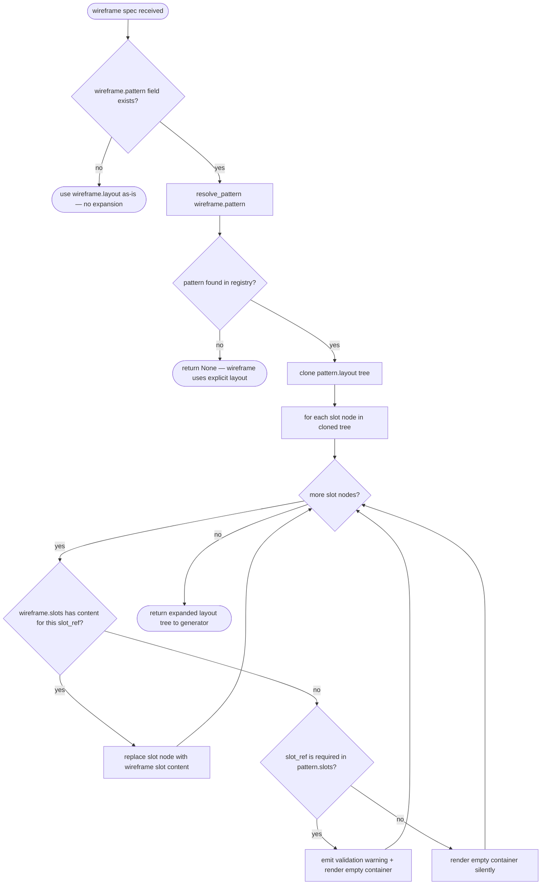
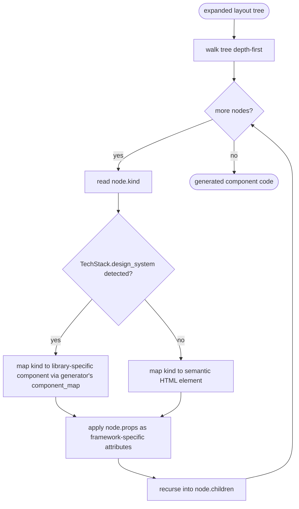

# Ux Pattern Library

## Overview

<!-- type: overview lang: markdown -->

Define the extension point for a design-system-agnostic UX pattern library. Patterns are abstract layout recipes (e.g., `dashboard-with-drawer`, `crud-table`, `form-with-stepper`) that wireframe specs can reference by ID instead of describing full layout structure.

| Aspect | Detail |
|--------|--------|
| Purpose | Decouple wireframe spec authoring from component library choice |
| Trigger | `wireframe` section references a `pattern` by ID |
| Consumer | `SpecIRGenerator` implementations (ReactGenerator, etc.) |
| Data source | Built-in `PATTERN_REGISTRY` (const array, extensible later) |
| Status | Extension point spec only — implementation deferred |

### Design intent

When `tech_stack.design_system` is detected with UX pattern support, wireframe sections can use shorthand:

```yaml
page: order-list
pattern: dashboard-with-drawer
slots:
  main:
    component: DataTable
    props: { columns: [id, customer, amount, status] }
```

The pattern resolver expands `dashboard-with-drawer` into a full layout tree with named slots. The generator then translates abstract layout nodes into library-specific components (MUI `Drawer` + `AppBar`, Antd `Layout.Sider` + `Layout.Header`, etc.).

### Scope boundary

- This spec defines: pattern format, pattern registry interface, slot system, resolution algorithm
- This spec does NOT define: specific pattern content (deferred), generator mapping rules (per-generator specs), wireframe YAML DSL changes (wireframe spec)
## Requirements

<!-- type: requirements lang: markdown -->

| ID | Requirement |
|----|-------------|
| REQ-1 | Each UX pattern is defined by a `UxPattern` struct with fields: `id: String` (kebab-case, unique), `name: String` (human-readable), `description: String`, `slots: Vec<PatternSlot>`, `layout: Vec<PatternNode>`. The `layout` tree uses abstract node kinds — not library-specific components. |
| REQ-2 | `PatternSlot` defines a named insertion point: `name: String` (unique within pattern), `required: bool`, `description: String`. Slots are referenced in `PatternNode` children via `kind: "slot"` with `slot_ref` pointing to the slot name. |
| REQ-3 | `PatternNode` represents a layout tree node: `kind: String` (abstract element kind — `container`, `sidebar`, `header`, `footer`, `main`, `nav`, `drawer`, `toolbar`, `slot`), `label: Option<String>`, `props: HashMap<String, Value>` (static props like width, position), `children: Vec<PatternNode>`. |
| REQ-4 | `PATTERN_REGISTRY` is a `const` or `lazy_static` array of `UxPattern` definitions. Adding a new pattern requires a code change (same principle as design system registry in tech-stack-inference). |
| REQ-5 | `resolve_pattern(pattern_id: &str) -> Option<&UxPattern>` looks up a pattern by ID from the registry. Returns `None` if not found — callers handle the fallback (expand wireframe layout explicitly). |
| REQ-6 | Pattern resolution expands a wireframe's `pattern` field into a full `layout` tree. Named slots in the expanded tree are filled with the wireframe's `slots` content map. Unfilled required slots produce a validation warning. Unfilled optional slots are rendered as empty containers. |
| REQ-7 | Generators (`SpecIRGenerator` implementations) receive the expanded layout tree — they never see the pattern ID. Translation from abstract node kinds to library-specific components is the generator's responsibility (e.g., `drawer` → MUI `Drawer` / Antd `Layout.Sider`). |
| REQ-8 | The pattern library is independent of `TechStack` detection. Any project can use patterns regardless of detected design system. However, when `design_system` is detected, the generator can make smarter component choices during translation. |
| REQ-9 | Extension point for external pattern sources (deferred): the `resolve_pattern` function will accept an optional `PatternSource` trait object that can provide patterns beyond the built-in registry. Interface defined now, implementation deferred. |
## Scenarios

<!-- type: scenarios lang: markdown -->

### Scenario: Wireframe references a known pattern with all slots filled

- **GIVEN** `PATTERN_REGISTRY` contains pattern `dashboard-with-drawer` with slots `[main (required), drawer (optional)]`
- **AND** wireframe spec has `pattern: dashboard-with-drawer` with `slots: { main: { component: DataTable, ... }, drawer: { component: FilterPanel, ... } }`
- **WHEN** `resolve_pattern("dashboard-with-drawer")` is called and slots are filled
- **THEN** returns expanded layout tree: `[toolbar, drawer(FilterPanel), main(DataTable)]`
- **AND** generator receives the expanded tree with abstract node kinds

### Scenario: Wireframe references a known pattern with optional slot unfilled

- **GIVEN** `PATTERN_REGISTRY` contains pattern `dashboard-with-drawer` with slots `[main (required), drawer (optional)]`
- **AND** wireframe spec has `pattern: dashboard-with-drawer` with `slots: { main: { component: DataTable } }` (drawer omitted)
- **WHEN** pattern is resolved and slots are filled
- **THEN** returns expanded layout tree with `drawer` slot rendered as empty container
- **AND** no validation warning is produced (slot is optional)

### Scenario: Wireframe references a known pattern with required slot missing

- **GIVEN** `PATTERN_REGISTRY` contains pattern `crud-table` with slots `[table (required), actions (required)]`
- **AND** wireframe spec has `pattern: crud-table` with `slots: { table: { ... } }` (actions missing)
- **WHEN** pattern is resolved and slots are filled
- **THEN** returns expanded layout tree with `actions` slot rendered as empty container
- **AND** a validation warning is emitted: `required slot 'actions' in pattern 'crud-table' was not filled`

### Scenario: Wireframe references an unknown pattern

- **GIVEN** `PATTERN_REGISTRY` does not contain pattern `custom-wizard`
- **WHEN** `resolve_pattern("custom-wizard")` is called
- **THEN** returns `None`
- **AND** wireframe falls back to explicit layout (no expansion, wireframe's `layout` field used directly)

### Scenario: Wireframe has no pattern field

- **GIVEN** wireframe spec has no `pattern` field (only `layout` array)
- **WHEN** wireframe is processed by the generator
- **THEN** no pattern resolution occurs — `layout` is used as-is
- **AND** behavior is identical to current wireframe processing (backward compatible)

### Scenario: Generator translates abstract nodes to MUI components

- **GIVEN** expanded layout tree contains `{ kind: "drawer", props: { position: "left", width: 240 } }`
- **AND** `TechStack.design_system.library` is `"mui"`
- **WHEN** `ReactGenerator` processes the layout tree
- **THEN** generates `<Drawer variant="permanent" sx={{ width: 240 }}>` (MUI-specific)

### Scenario: Generator translates abstract nodes to Antd components

- **GIVEN** expanded layout tree contains `{ kind: "drawer", props: { position: "left", width: 240 } }`
- **AND** `TechStack.design_system.library` is `"antd"`
- **WHEN** `ReactGenerator` processes the layout tree
- **THEN** generates `<Layout.Sider width={240}>` (Antd-specific)

### Scenario: External pattern source provides custom pattern (deferred)

- **GIVEN** a `PatternSource` trait implementation is registered
- **AND** it provides a pattern `company-dashboard` not in the built-in registry
- **WHEN** `resolve_pattern("company-dashboard")` is called with the external source
- **THEN** the external source's pattern is returned
- **AND** built-in registry is checked first (external is fallback)
## Diagrams

### Interaction
<!-- type: interaction lang: mermaid -->
<!-- TODO -->

### Logic
<!-- type: logic lang: mermaid -->
<!-- TODO -->

### Dependencies
<!-- type: dependency lang: mermaid -->
<!-- TODO -->

### State Machine
<!-- type: state-machine lang: mermaid -->
<!-- TODO -->

### Data Model
<!-- type: db-model lang: mermaid -->
<!-- TODO -->

## API Spec

### REST API
<!-- type: rest-api lang: yaml -->
<!-- TODO -->

### RPC API
<!-- type: rpc-api lang: json -->
<!-- TODO -->

### Async API
<!-- type: async-api lang: yaml -->
<!-- TODO -->

### CLI
<!-- type: cli lang: yaml -->
<!-- TODO -->

### Schema
<!-- type: schema lang: json -->
<!-- TODO -->

### Config
<!-- type: config lang: json -->
<!-- TODO -->

## Test Plan
<!-- type: test-plan lang: markdown -->

<!-- TODO -->

## Changes

<!-- type: changes lang: yaml -->

```yaml
_sdd:
  id: ux-pattern-library-changes
  refs:
    - $ref: "#pattern-resolve"
    - $ref: "#ux-pattern-library"
    - $ref: "tech-stack-inference#tech-stack-detect"
changes:
  - path: crates/cclab-sdd/src/generate/patterns/mod.rs
    action: create
    description: "Define UxPattern, PatternSlot, PatternNode, SlotContent structs. Define PatternSource trait (extension point, deferred impl). Implement resolve_pattern() lookup."
  - path: crates/cclab-sdd/src/generate/patterns/registry.rs
    action: create
    description: "Define PATTERN_REGISTRY const array with initial empty set. Pattern definitions will be added in a future change."
  - path: crates/cclab-sdd/src/generate/patterns/resolver.rs
    action: create
    description: "Implement expand_pattern() — clone layout tree, fill slots from wireframe content map, emit warnings for unfilled required slots."
  - path: crates/cclab-sdd/src/generate/mod.rs
    action: modify
    description: "Add pub mod patterns and re-export UxPattern, PatternSlot, PatternNode, resolve_pattern, expand_pattern"
  - path: crates/cclab-sdd/src/generate/generators/react.rs
    action: modify
    description: "Add component_map for abstract node kinds to MUI/Antd/HTML elements. Update render_jsx_body to use component_map when TechStack.design_system is available."
  - path: crates/cclab-sdd/src/generate/spec_ir/types.rs
    action: modify
    description: "Extend WireframeSpec with optional pattern: Option<String> and slots: HashMap<String, SlotContent> fields"
  - path: cclab/specs/crates/cclab-sdd/generate/ux-pattern-library.md
    action: create
    description: "New main spec — merge target for this change spec"
```
## Wireframe
<!-- type: wireframe lang: yaml -->

<!-- TODO -->

## Component
<!-- type: component lang: json -->

<!-- TODO -->

## Design Token
<!-- type: design-token lang: json -->

<!-- TODO -->

## Doc
<!-- type: doc lang: markdown -->

<!-- TODO -->


## Schema

<!-- type: schema lang: json -->

Data model for UX pattern definitions, slots, and layout nodes.

```json
{
  "$schema": "https://json-schema.org/draft/2020-12/schema",
  "$id": "ux-pattern-library",
  "title": "UX Pattern Library",
  "description": "Design-system-agnostic layout pattern definitions for wireframe shorthand",
  "type": "object",
  "$defs": {
    "UxPattern": {
      "type": "object",
      "description": "A reusable layout recipe that wireframe specs can reference by ID",
      "properties": {
        "id": {
          "type": "string",
          "pattern": "^[a-z][a-z0-9-]*$",
          "description": "Unique kebab-case identifier (e.g., dashboard-with-drawer)"
        },
        "name": {
          "type": "string",
          "description": "Human-readable pattern name"
        },
        "description": {
          "type": "string",
          "description": "Brief description of the layout pattern's purpose"
        },
        "slots": {
          "type": "array",
          "items": { "$ref": "#/$defs/PatternSlot" },
          "description": "Named insertion points where wireframe content is placed"
        },
        "layout": {
          "type": "array",
          "items": { "$ref": "#/$defs/PatternNode" },
          "description": "Top-level layout tree using abstract node kinds"
        }
      },
      "required": ["id", "name", "slots", "layout"],
      "additionalProperties": false
    },
    "PatternSlot": {
      "type": "object",
      "description": "A named insertion point in the pattern's layout tree",
      "properties": {
        "name": {
          "type": "string",
          "description": "Slot name (unique within pattern), referenced by PatternNode kind=slot"
        },
        "required": {
          "type": "boolean",
          "default": false,
          "description": "If true, wireframe must fill this slot or a validation warning is emitted"
        },
        "description": {
          "type": "string",
          "description": "What content this slot expects"
        }
      },
      "required": ["name"],
      "additionalProperties": false
    },
    "PatternNode": {
      "type": "object",
      "description": "A node in the abstract layout tree",
      "properties": {
        "kind": {
          "type": "string",
          "enum": ["container", "sidebar", "header", "footer", "main", "nav", "drawer", "toolbar", "slot", "split-pane", "tabs", "grid", "stack"],
          "description": "Abstract element kind — generators translate to library-specific components"
        },
        "slot_ref": {
          "type": "string",
          "description": "When kind=slot, references the PatternSlot.name to fill here"
        },
        "label": {
          "type": "string",
          "description": "Optional display label"
        },
        "props": {
          "type": "object",
          "additionalProperties": true,
          "description": "Static layout props (width, position, direction, etc.) — generator maps to framework-specific props"
        },
        "children": {
          "type": "array",
          "items": { "$ref": "#/$defs/PatternNode" },
          "default": [],
          "description": "Child nodes (recursive)"
        }
      },
      "required": ["kind"],
      "additionalProperties": false,
      "if": { "properties": { "kind": { "const": "slot" } } },
      "then": { "required": ["kind", "slot_ref"] }
    },
    "PatternSource": {
      "type": "object",
      "description": "Extension point trait interface — external pattern providers (deferred implementation)",
      "properties": {
        "name": {
          "type": "string",
          "description": "Source identifier (e.g., 'builtin', 'company-patterns')"
        },
        "priority": {
          "type": "integer",
          "default": 0,
          "description": "Resolution priority — lower wins. Built-in registry has priority 0."
        }
      },
      "required": ["name"]
    },
    "SlotContent": {
      "type": "object",
      "description": "Wireframe-provided content to fill a pattern slot",
      "properties": {
        "component": {
          "type": "string",
          "description": "Component name to render in this slot"
        },
        "props": {
          "type": "object",
          "additionalProperties": true,
          "description": "Props passed to the component in this slot"
        },
        "children": {
          "type": "array",
          "items": { "$ref": "#/$defs/PatternNode" },
          "description": "Nested layout within the slot"
        }
      },
      "required": ["component"]
    }
  }
}
```


## Logic

<!-- type: logic lang: mermaid -->

Pattern resolution algorithm — expands wireframe `pattern` field into a full layout tree with slots filled.



### Generator translation (downstream)



### Abstract node kind to component mapping (per generator)

```yaml
node_kind_mapping:
  mui:
    drawer: "Drawer variant='permanent'"
    toolbar: "Toolbar"
    sidebar: "Drawer variant='permanent'"
    header: "AppBar position='static'"
    nav: "List (navigation)"
    container: "Box"
    main: "Box component='main'"
    footer: "Box component='footer'"
    split-pane: "Grid container"
    tabs: "Tabs + TabPanel"
    grid: "Grid container"
    stack: "Stack"
  antd:
    drawer: "Layout.Sider"
    toolbar: "Layout.Header (inner)"
    sidebar: "Layout.Sider"
    header: "Layout.Header"
    nav: "Menu"
    container: "Layout"
    main: "Layout.Content"
    footer: "Layout.Footer"
    split-pane: "Row + Col"
    tabs: "Tabs + Tabs.TabPane"
    grid: "Row + Col"
    stack: "Space direction='vertical'"
  html:
    drawer: "aside"
    toolbar: "div role='toolbar'"
    sidebar: "aside"
    header: "header"
    nav: "nav"
    container: "div"
    main: "main"
    footer: "footer"
    split-pane: "div style='display:flex'"
    tabs: "div role='tablist'"
    grid: "div style='display:grid'"
    stack: "div style='display:flex;flex-direction:column'"
```

# Reviews
