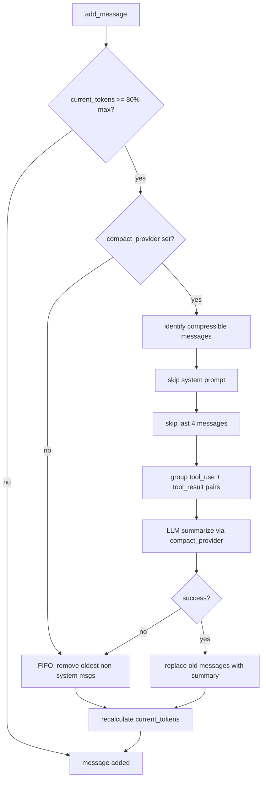
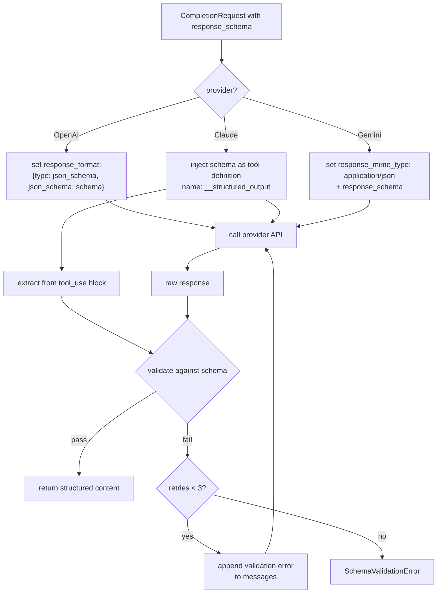
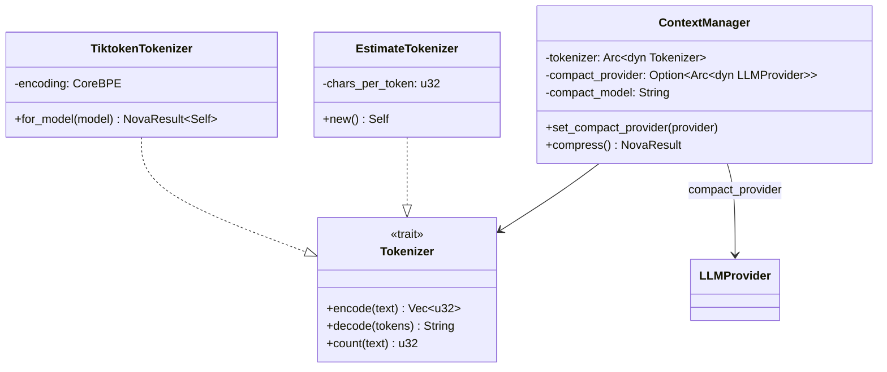

# Cclab Agent P0 Spec

## Overview

This change implements three foundational (P0) capabilities for cclab-agent:

### 1. Accurate Token Counting (#786)
Replace the `text.len() / 4` heuristic in `ContextManager` with precise BPE tokenization via `tiktoken-rs`. Adds public APIs: `count_tokens()`, `count_message_tokens()`, `truncate()`, and `estimate_cost()`. For Claude models (no public tokenizer), use API-reported `input_tokens`/`output_tokens` from responses, with `chars/4` as pre-request fallback.

### 2. Smart Auto-Compact (#876)
Upgrade `ContextManager::compress()` from FIFO message deletion to intelligent LLM-based summarization. Key improvements:
- **LLM summarization**: Summarize old messages via a configurable low-cost model (default: Haiku) instead of deleting them
- **Tool-call pairing**: Ensure `tool_use`/`tool_result` messages are always kept or removed as pairs
- **Priority-aware retention**: System prompt always kept, recent N messages kept, middle conversation compressed first
- **Threshold trigger**: Auto-compact at 80% of model's context window

### 3. Structured Output (#792)
Add `response_schema` parameter to the completion API enabling JSON-structured responses. Support both raw JSON Schema dicts and `cclab.schema` BaseModel classes (auto-converted to JSON Schema). Provider-specific implementation:
- **OpenAI**: `response_format: { type: "json_schema", json_schema: {...} }`
- **Claude**: Tool-use with single tool as schema extractor
- **Gemini**: `response_mime_type: "application/json"` + schema

Auto-retry on malformed output with validation error feedback, default `max_retries=3`.

### Dependency Order
```
#786 (token counting) → #876 (auto-compact depends on accurate counting)
#792 (structured output) — independent, parallel track
```
#786 (token counting) → #876 (auto-compact depends on accurate counting)
#792 (structured output) — independent, parallel track
```
#786 (token counting) → #876 (auto-compact depends on accurate counting)
#792 (structured output) — independent, parallel track
```

## Requirements

### R1: Token Counting (#786)
- Implement `count_tokens(text, model) -> int` and `count_message_tokens(messages, model) -> int`
- Support tokenizers: OpenAI (cl100k_base, o200k_base), Claude, Gemini
- Implement `truncate(text, max_tokens, model) -> str` for safe truncation
- Implement `estimate_cost(tokens, model) -> float` for cost estimation
- Use tiktoken-rs or Rust BPE tokenizer, expose via PyO3
- Replace existing `text.len() / 4` estimation in context.rs

### R2: Smart Auto-Compact (#876)
- Upgrade ContextManager compress() from FIFO deletion to intelligent summarization
- Use accurate token counting from #786 (replaces len/4 estimation)
- LLM-based summarization: summarize old messages instead of deleting, configurable model (e.g. Haiku)
- Tool call pairing protection: ensure tool_use/tool_result are kept or removed as pairs
- Priority-aware retention: system prompt always kept, recent N messages kept, middle conversation compressed first
- Preserve key context (decisions, variables, goals) during compression

### R3: Structured Output (#792)
- Add `response_schema` parameter to agent.generate() that accepts JSON Schema or cclab.schema BaseModel
- Provider-specific implementation:
  - OpenAI: use `response_format: { type: "json_schema", json_schema: {...} }`
  - Claude: use tool-use with single tool as schema extractor
  - Gemini: use `response_mime_type: "application/json"` + schema
- Auto-retry on malformed JSON output (configurable max_retries)
- Validate response against schema before returning
- Return typed dict matching the schema
## Scenarios

### Token Counting

**S1: Count tokens for OpenAI model**
- Given: text = "Hello, world!" and model = "gpt-4o"
- When: `count_tokens(text, "gpt-4o")` is called
- Then: returns exact BPE token count via o200k_base tokenizer

**S2: Count tokens for Claude model (pre-request)**
- Given: text = "Hello, world!" and model = "claude-sonnet-4-20250514"
- When: `count_tokens(text, model)` is called
- Then: returns `text.len() / 4` as heuristic estimate

**S3: Truncate text at token boundary**
- Given: text with 1000 tokens, max_tokens = 500, model = "gpt-4o"
- When: `truncate(text, 500, "gpt-4o")` is called
- Then: returned text decodes to exactly ≤500 tokens, no partial UTF-8

**S4: ContextManager uses accurate counting**
- Given: ContextManager with max_tokens=128000
- When: messages are added
- Then: `current_tokens` reflects BPE count (not len/4) for OpenAI models

### Smart Auto-Compact

**S5: LLM summarization on threshold**
- Given: ContextManager at 82% capacity with compact_provider set
- When: `add_message()` is called
- Then: `compress()` triggers, sends old messages to compact_provider for summarization, replaces them with summary message

**S6: Tool-call pairing protection**
- Given: messages contain [assistant+tool_use, tool+tool_result] pairs
- When: compress() selects messages for removal
- Then: both tool_use and tool_result are removed/summarized together, never split

**S7: Fallback to FIFO when no compact_provider**
- Given: ContextManager without compact_provider
- When: compress() triggers
- Then: falls back to existing FIFO deletion behavior

**S8: System prompt and recent messages preserved**
- Given: 50 messages with system prompt
- When: compress() triggers
- Then: system prompt and last 4 messages are never removed/summarized

### Structured Output

**S9: OpenAI structured output**
- Given: CompletionRequest with response_schema and model="gpt-4o"
- When: OpenAIProvider.complete() is called
- Then: request includes `response_format: { type: "json_schema" }`, response is validated against schema

**S10: Claude structured output via tool-use**
- Given: CompletionRequest with response_schema and model="claude-sonnet-4-20250514"
- When: ClaudeProvider.complete() is called
- Then: schema is injected as single tool definition, result extracted from tool_use block

**S11: Auto-retry on malformed JSON**
- Given: LLM returns invalid JSON on first attempt
- When: validation fails
- Then: re-sends request with error feedback appended, up to 3 retries

**S12: Schema validation passes**
- Given: response_schema requires `{"person": string, "company": string}`
- When: LLM returns `{"person": "John", "company": "Google"}`
- Then: validation passes, response.content contains the valid JSON string
## Diagrams

### Smart Auto-Compact Flow



### Structured Output — Provider Dispatch



### Token Counting — Class Diagram


## API Spec

N/A — internal Rust crate APIs only, no HTTP/RPC endpoints.

## Test Plan

### Unit Tests

| Test | Covers | Scenario |
|------|--------|----------|
| `test_count_tokens_openai` | R1 | S1: BPE count for gpt-4o matches tiktoken |
| `test_count_tokens_claude_fallback` | R5 | S2: Claude uses chars/4 heuristic |
| `test_count_message_tokens` | R2 | Count across multiple messages with role overhead |
| `test_truncate_at_boundary` | R3 | S3: Truncated text ≤ max_tokens, valid UTF-8 |
| `test_estimate_cost` | R4 | Cost calculation for known model pricing |
| `test_compress_with_summarization` | R10, R15 | S5: LLM summarization replaces old messages |
| `test_compress_tool_pairing` | R12 | S6: tool_use/tool_result removed as pairs |
| `test_compress_fallback_fifo` | R17 | S7: Fallback when no compact_provider |
| `test_compress_preserves_system_and_recent` | R13 | S8: System + last 4 always kept |
| `test_compact_threshold_80pct` | R14 | Triggers at 80% capacity |
| `test_structured_output_openai` | R21 | S9: response_format injected |
| `test_structured_output_claude` | R22 | S10: Schema as tool definition |
| `test_structured_output_gemini` | R23 | Gemini response_mime_type set |
| `test_schema_validation_pass` | R24 | S12: Valid JSON passes validation |
| `test_schema_validation_retry` | R25 | S11: Retry with error feedback |
| `test_schema_validation_error` | R26 | SchemaValidationError after max retries |

### Integration Tests

| Test | Covers |
|------|--------|
| `test_agent_run_with_accurate_tokens` | R7: End-to-end agent run uses BPE counting |
| `test_agent_auto_compact_full_cycle` | R10-R17: Long conversation triggers compact + summarization |
| `test_agent_structured_output_e2e` | R20-R25: Agent returns validated structured JSON |
## Changes

### New Files

| File | Purpose |
|------|---------|
| `src/tokenizer.rs` | `Tokenizer` trait + `TiktokenTokenizer` + `EstimateTokenizer` |
| `src/structured.rs` | Schema validation, retry logic, provider-specific schema injection |

### Modified Files

| File | Changes |
|------|---------|
| `Cargo.toml` | Add deps: `tiktoken-rs`, `jsonschema` |
| `src/lib.rs` | Export new modules: `tokenizer`, `structured` |
| `src/context.rs` | Replace `estimate_tokens()` with `Tokenizer`; add `compact_provider`, `compact_model`; rewrite `compress()` with LLM summarization + tool-call pairing |
| `src/types.rs` | (no changes expected — `TokenUsage`, `Message` already sufficient) |
| `src/llm/provider.rs` | Add `response_schema: Option<Value>` to `CompletionRequest` |
| `src/llm/claude.rs` | Map `response_schema` → tool definition injection + extract from tool_use |
| `src/llm/openai.rs` | Map `response_schema` → `response_format` field |
| `src/llm/gemini.rs` | Map `response_schema` → `response_mime_type` + schema |
| `src/error.rs` | Add `SchemaValidationError(String)` variant |
| `src/agents/coding.rs` | Add `compact_model` to `CodingAgentConfig`, pass `compact_provider` to ContextManager |
| `src/agents/analyst.rs` | Add `compact_model` to `AnalystAgentConfig`, pass `compact_provider` to ContextManager |
# Reviews