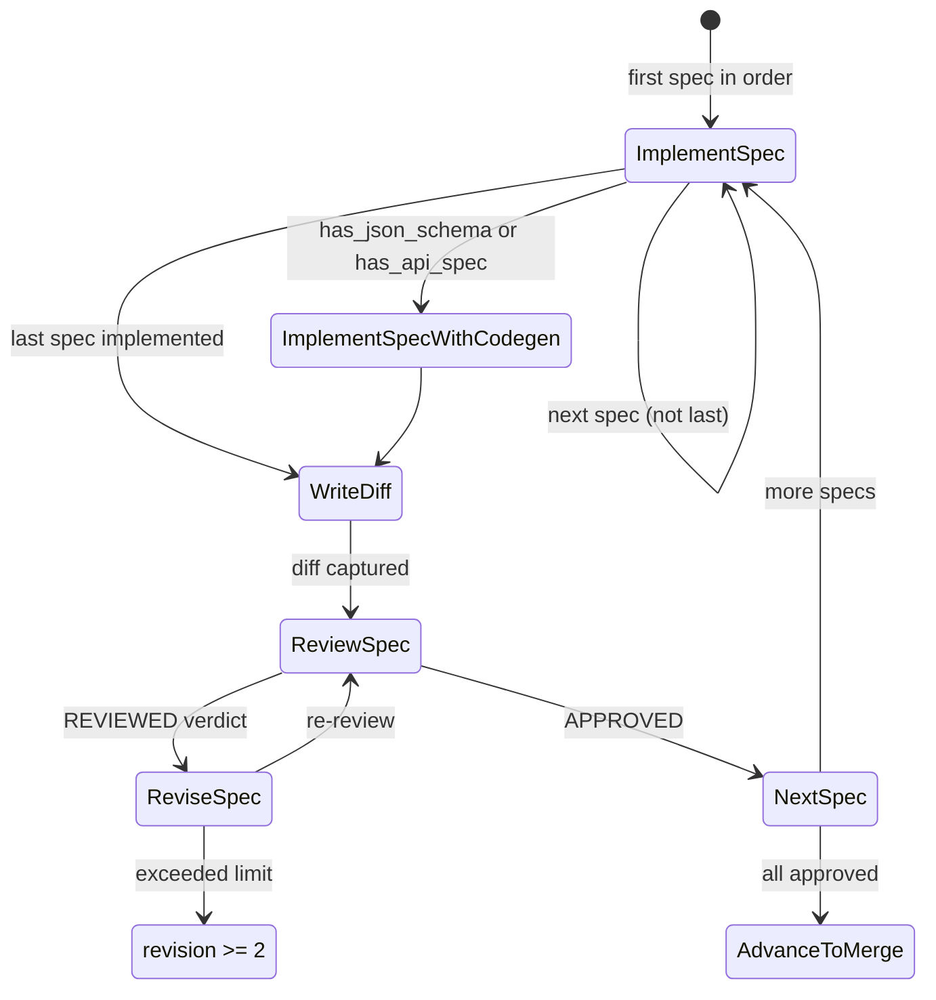
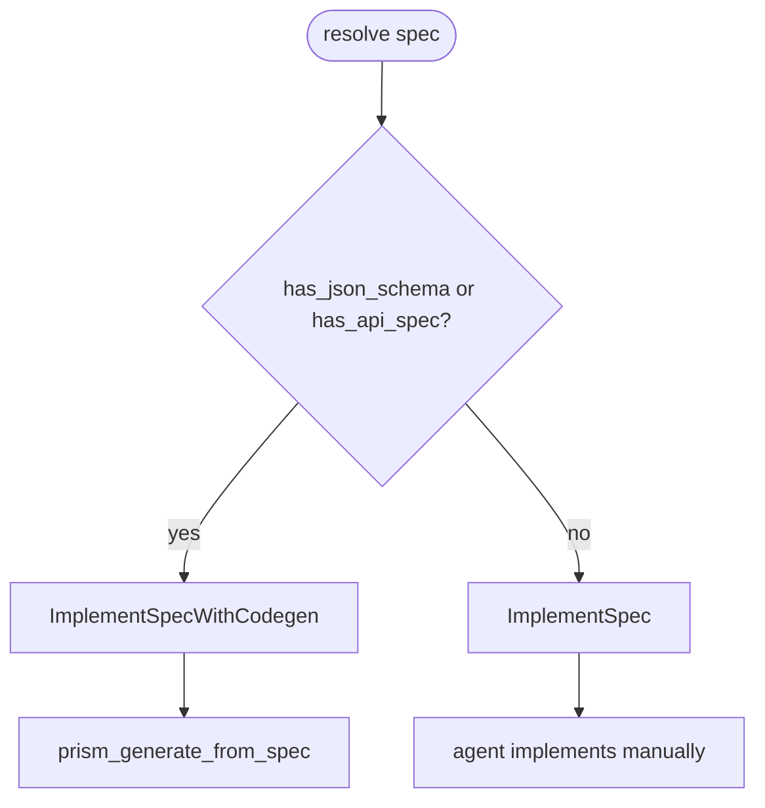
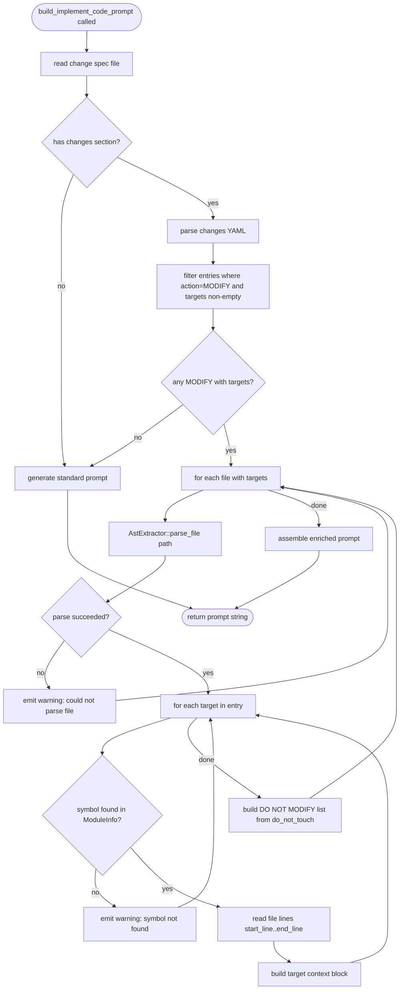

# Implementation

## Phase Transition

```yaml
from: ChangeSpecReviewed (APPROVED) | ChangeImplementationReviewed | ChangeImplementationRevised
to: ChangeImplementationCreated | ChangeImplementationReviewed | ChangeImplementationRevised
terminal: all specs approved → ChangeMergeCreated
executor: [mainthread]
crr: true  # per-spec CRR cycle
max_revisions_per_spec: 2  # terminal failure on exceed
```

## Sub-State Machine



### ImplSubState enum

```yaml
ImplSubState:
  NoSpecs: "No change specs found — error"
  ImplementSpec: "Implement code for a spec (is_first flag for begin prompt)"
  ImplementSpecWithCodegen: "Spec eligible for codegen path"
  WriteDiff: "All specs implemented — capture git diff"
  ReviewSpec: "Review implementation for a spec"
  ReviseSpec: "Fix review issues for a spec"
  TerminalFailure: "Spec exceeded revision limit (max 2)"
  AdvanceToMerge: "All specs implemented and approved"
```

## Spec Execution Order

Kahn's algorithm on `refs:` frontmatter — topological sort of spec DAG.

```yaml
# From change_impl/common.rs
function: build_spec_execution_order
input: groups/{group_id}/specs/ (Path)
output: Vec<String>  # ordered spec ids
```

## Codegen Routing



## Prompt Templates

### BeginImplementation (first spec)

```markdown
# Task: Implement change '{{change_id}}'

Read all approved specs and implement them in dependency order.

1. Read specs: `groups/{{group_id}}/specs/*.md`
2. Read requirements: `groups/{{group_id}}/requirements.md`
3. Implement ALL tasks following layer order: data → logic → integration → testing
4. Maintain code quality: tests, error handling, documentation
```

### ImplementSpec (per-spec)

```markdown
# Task: Implement spec '{{spec_id}}'

Read the spec and implement the code changes it describes.

{{#if revision_count > 0}}
## Previous Review Feedback
Read the review in implementation.md and address all issues.
{{/if}}

## Steps
1. Read spec: `changes/{{change_id}}/groups/{{group_id}}/specs/{{spec_id}}.md`
2. Implement code changes
3. Run tests to verify
```

### WriteDiff

```markdown
# Task: Capture implementation diff

Run `git diff` and write the result to implementation.md via
`sdd_artifact_create_change_implementation(diff=..., summary=...)`.
```

### ReviewSpec (code review)

```markdown
# Task: Review implementation of '{{spec_id}}'

## Checklist

1. Requirements: all spec requirements implemented
2. Tests: adequate coverage, passing
3. Security: no OWASP vulnerabilities
4. Best practices: idiomatic code, proper error handling
5. Performance: no obvious bottlenecks

## Verdict

- APPROVED: implementation matches spec
- REVIEWED: issues found (HIGH/MEDIUM/LOW severity)
- REJECTED: fundamentally wrong approach
```

### ReviseSpec

```markdown
# Task: Fix review issues for '{{spec_id}}'

1. Read review in implementation.md (`## Review: {{spec_id}}`)
2. Fix all HIGH severity issues
3. Fix MEDIUM issues if feasible
4. Run tests after fixes
```

### TerminalFailure

```markdown
# Spec '{{spec_id}}' exceeded revision limit ({{revisions}}/2)

This spec has failed review {{revisions}} times. Options:
1. Skip this spec and continue with remaining specs
2. Manually fix the issues
3. Reject the change
```

## Revision Tracking

Per-spec revision tracking via `STATE.yaml`:

```yaml
task_revisions:
  auth-api: 1
  db-migration: 0
current_task_id: auth-api
```

- `MAX_SPEC_REVISIONS = 2`
- Terminal failure triggers when `task_revisions[spec_id] >= 2`
- Terminal failure resets `task_revisions` and phase to allow retry

## Inline Review Format

Reviews written as `## Review: {spec_id}` sections in `implementation.md`:

```markdown
## Review: auth-api

**Verdict:** APPROVED
**Summary:** Implementation matches spec requirements.

### Checklist
- [x] Requirements coverage
- [x] Test coverage
- [x] Security review
```

## Side Effects

| Action | STATE.yaml change |
|--------|-------------------|
| Begin implementation | `phase → ChangeImplementationCreated`, `current_task_id` set |
| Write diff | `implementation.md` created with git diff |
| Review (APPROVED) | Mark spec done in inline reviews |
| Review (REVIEWED) | `phase → ChangeImplementationReviewed` |
| Revise | `phase → ChangeImplementationRevised`, `task_revisions.{spec_id} += 1` |
| Terminal failure | Log warning, skip spec or halt |
| All specs approved | `phase → ChangeMergeCreated` (via advance) |


## Overview

<!-- type: overview lang: markdown -->

Enrich the implementation prompt with lens-extracted code context for MODIFY targets.

| Aspect | Detail |
|--------|--------|
| Target | `build_implement_code_prompt` in create_change_impl.rs, `Symbol` in fillback/ast.rs |
| Current | Implementation prompt tells agent to read spec and implement — no extracted code context, agent reads whole files |
| New | Parse `targets` + `do_not_touch` from changes section, call lens AST to extract symbol source ranges, inject extracted code into prompt |
| Scope | create_change_impl.rs prompt builder + fillback/ast.rs Symbol.end_line + common_change_impl.rs parser |

### Current behavior

The `build_implement_code_prompt` function generates a prompt with:
1. Spec path reference
2. Generic instructions ("read spec, implement code, run tests")
3. No awareness of which functions/types need modification

Agent must read entire source files and determine modification targets from prose descriptions.

### New behavior

When a change spec has a `changes` section with `targets`, the prompt builder:
1. Parses targets from the changes section YAML
2. For each MODIFY file with targets, calls `AstExtractor::parse_file()` to resolve symbols
3. Extracts source code for matched symbols using `start_line..end_line`
4. Injects per-target context blocks into the prompt:
   - Current source code of the target symbol
   - Change instruction from the target's `change` field
   - Position/anchor guidance if specified
5. Appends a DO NOT MODIFY section listing `do_not_touch` symbols with their line ranges

### Constraints

- Requires `end_line` on `Symbol` (currently only `line` / start_line exists)
- Falls back to current behavior if changes section has no targets or lens extraction fails
- Only applies to `ImplementSpec` prompts (not BeginImplementation, WriteDiff, Review, Revise)
- Target resolution is best-effort: unresolved symbols emit a warning in the prompt, not an error
- Source extraction reads the file from disk at prompt-build time (not from git)


## Logic

<!-- type: logic lang: mermaid -->

Prompt enrichment pipeline — runs inside `build_implement_code_prompt` when change spec has targets.



### Symbol matching rules

```yaml
match_rules:
  - target_type: function
    match: "Symbol where kind=Function and name matches target.name"
  - target_type: struct
    match: "Symbol where kind=Struct and name matches target.name"
  - target_type: enum
    match: "Symbol where kind=Enum and name matches target.name"
  - target_type: trait
    match: "Symbol where kind=Interface and name matches target.name"
  - target_type: impl
    match: "Symbol where kind=Class and name matches target.name"
  - target_type: method
    match: "Symbol where kind=Function and name matches ImplName::target.name"
```

### Enriched prompt template (per-target block)

```markdown
### Target: {{target.type}} `{{target.name}}` in `{{file.path}}`

**Change**: {{target.change}}
{{#if target.position}}**Position**: {{target.position}}{{/if}}
{{#if target.anchor}} relative to `{{target.anchor}}`{{/if}}

**Current code** (lines {{start_line}}-{{end_line}}):
~~~{{lang}}
{{extracted_source}}
~~~
```

### DO NOT MODIFY block template

```markdown
## DO NOT MODIFY

The following symbols must not be changed:
{{#each do_not_touch_entries}}
- `{{name}}` in `{{file_path}}` (lines {{start_line}}-{{end_line}})
{{/each}}
```

### Function signatures

```yaml
functions:
  - name: parse_changes_targets
    location: tools/create_change_impl.rs
    input: spec_content (String)
    output: "Result<Vec<FileChangeEntry>>"
    description: "Parse changes section YAML from spec markdown, extract FileChangeEntry list"

  - name: resolve_target_symbols
    location: tools/create_change_impl.rs
    input: "file_path (Path), targets (Vec<ChangeTarget>), project_root (Path)"
    output: "Vec<ResolvedTarget>"
    description: "Call AstExtractor for file, match targets against symbols, extract source ranges"

  - name: build_enriched_context
    location: tools/create_change_impl.rs
    input: "resolved_targets (Vec<ResolvedTarget>), do_not_touch (Vec<ResolvedSymbol>)"
    output: String
    description: "Format resolved targets and DNT list into markdown prompt sections"
```

### Data types

```yaml
FileChangeEntry:
  path: String
  action: String  # CREATE | MODIFY | DELETE
  description: Option<String>
  targets: Vec<ChangeTarget>
  do_not_touch: Vec<String>

ChangeTarget:
  type: String  # function | struct | enum | trait | impl | method
  name: String
  change: String
  anchor: Option<String>
  position: Option<String>  # before | after | replace | append

ResolvedTarget:
  target: ChangeTarget
  file_path: String
  start_line: usize
  end_line: usize
  source_code: String
  lang: String  # rs | py | ts | go — inferred from file extension

ResolvedSymbol:
  name: String
  file_path: String
  start_line: usize
  end_line: usize
```


## Changes

<!-- type: changes lang: yaml -->

```yaml
_sdd:
  id: lens-impl-prompt-changes
  refs:
    - $ref: "changes-section-schema#enhanced-changes-section-schema"
changes:
  - path: crates/cclab-sdd/src/fillback/ast.rs
    action: MODIFY
    description: "Add end_line field to Symbol for full source range extraction"
    targets:
      - type: struct
        name: Symbol
        change: "Add pub end_line: Option<usize> field"
        position: append
    do_not_touch:
      - SymbolKind
      - ModuleInfo
      - AstExtractor

  - path: crates/cclab-sdd/src/fillback/ast.rs
    action: MODIFY
    description: "Populate end_line from tree-sitter node end position in all language extractors"
    targets:
      - type: method
        name: "AstExtractor::extract_rust_symbols"
        change: "Set end_line from node.end_position().row + 1 for each Symbol construction"
      - type: method
        name: "AstExtractor::extract_python_symbols"
        change: "Set end_line from node.end_position().row + 1 for each Symbol construction"
      - type: method
        name: "AstExtractor::extract_typescript_symbols"
        change: "Set end_line from node.end_position().row + 1 for each Symbol construction"
      - type: method
        name: "AstExtractor::extract_go_symbols"
        change: "Set end_line from node.end_position().row + 1 for each Symbol construction"

  - path: crates/cclab-sdd/src/tools/create_change_impl.rs
    action: MODIFY
    description: "Add changes target parsing and lens-enriched prompt building"
    targets:
      - type: function
        name: parse_changes_targets
        change: "New function — parse changes section YAML from spec markdown, return Vec<FileChangeEntry>"
        position: after
        anchor: build_write_diff_prompt
      - type: function
        name: resolve_target_symbols
        change: "New function — call AstExtractor::parse_file for a file path, match targets against symbols by name+kind, extract source lines"
        position: after
        anchor: parse_changes_targets
      - type: function
        name: build_enriched_context
        change: "New function — format resolved targets and do_not_touch into markdown prompt blocks"
        position: after
        anchor: resolve_target_symbols
      - type: function
        name: build_implement_code_prompt
        change: "Integrate lens enrichment — after generating base prompt, call parse_changes_targets + resolve + build_enriched_context and append result"
    do_not_touch:
      - build_implement_tests_prompt
      - build_codegen_prompt
      - build_write_diff_prompt
      - auto_populate_impl_baseline

  - path: cclab/specs/crates/cclab-sdd/logic/implement-task.md
    action: MODIFY
    description: "Add lens-enriched prompt section documenting the new ImplementSpec prompt template with target context"
    section: "Prompt Templates § ImplementSpec"
    targets:
      - type: function
        name: "ImplementSpec template"
        change: "Extend template to include optional enriched context blocks (per-target source + DO NOT MODIFY list) when changes section has targets"
```

# Reviews
