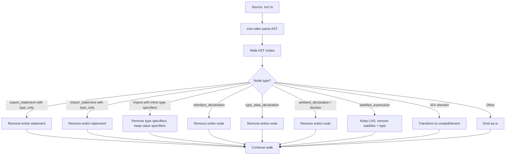
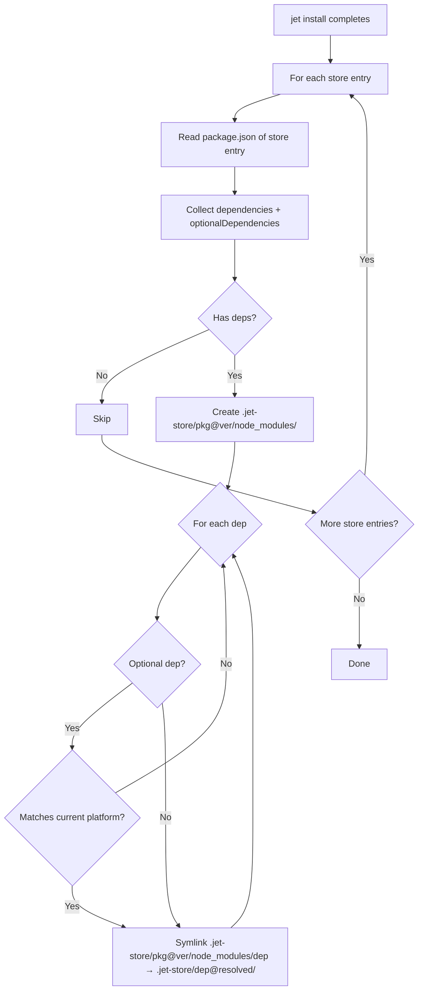

# Jet Dev Server V2 Spec

## Overview

<!-- type: overview lang: markdown -->
Overhaul Jet dev server to reliably serve modern React/TypeScript projects. Four interrelated issues block end-to-end `cclab jet dev` on real-world projects:

1. **CJS→ESM pre-bundling** (#1089) — Replace line-based `require()` flattening with bundler-based per-dependency pre-bundling into `node_modules/.jet/`
2. **AST-based TypeScript type stripping** (#1090) — Move all TS-only syntax removal into `transform_tsx()` AST pass; eliminate brittle line-based post-filter
3. **Node.js builtin polyfills** (#1091) — Generate browser-compatible polyfills for `crypto`, `url`, `buffer`, `path`, etc. as standalone ESM files via importmap
4. **Store nested node_modules** (#1092) — Create pnpm-style nested `node_modules/` inside `.jet-store/{pkg}@{ver}/` entries so transitive deps resolve correctly

### Current State

| Component | File | Done | Missing |
|-----------|------|------|---------|
| Pre-bundling | `dev_server/mod.rs` | Line-based `flatten_cjs()` + require inlining | Bundler-based per-dep ESM output, importmap injection |
| TS transform | `transform/transform_tsx.rs` | `type_annotation`, `type_arguments`, `interface_declaration` | `export type`, `import type`, inline `type`, `declare`, `satisfies` |
| Polyfills | `dev_server/mod.rs` | Empty stubs (`export default {}`) | Real polyfills for crypto/url/buffer/path/events/process |
| Store resolution | `pkg_manager/store.rs` | Flat symlink from store to `node_modules/` | Nested node_modules for each store entry's deps |

### Acceptance

- `cclab jet dev` on `create-react-app` renders without errors
- All `@cclab/ui` components serve without syntax errors
- `cclab jet install` + `npx vite` works (esbuild/rollup resolve)
- `react`, `react-dom`, `axios`, `date-fns` pre-bundle correctly
## Requirements

<!-- type: requirements lang: markdown -->
### R1: Bundler-Based CJS→ESM Pre-Bundling (#1089)

Replace `pre_bundle_cjs_deps()` / `flatten_cjs()` with per-dependency bundler invocation:
- Scan `package.json` `dependencies` for CJS packages (no `"module"` or `"exports"."import"` field)
- For each CJS dep, create virtual entry: `export * from '{dep}'; export { default } from '{dep}';`
- Resolve entry points via `crate::resolver` (handle `"exports"` map conditions: `import` > `require` > `default`)
- Bundle with `crate::bundler::Bundler` (handles require→import conversion, tree-shaking)
- Write output to `node_modules/.jet/{name}.mjs`
- Support subpath exports: `react/jsx-runtime` → `node_modules/.jet/react_jsx-runtime.mjs`
- Auto-discover transitive CJS deps not in direct `dependencies`
- Handle scoped packages: `@tanstack/react-query` → `node_modules/.jet/@tanstack__react-query.mjs`
- Resolve `process.env.NODE_ENV` to `'development'` in dev mode
- Detect and break circular `require()` between packages
- Cache: invalidate when `package.json` or lockfile changes (mtime check)
- Performance: startup < 3s for ~20 CJS deps

### R2: AST-Based TypeScript Type Stripping (#1090)

Extend `transform_tsx()` in `transform_tsx.rs` to handle all TS-only syntax:

| Syntax | Current | Required |
|--------|---------|----------|
| `export type { Foo }` | Unhandled (passes through) | Remove entire statement |
| `import type { Foo }` | Unhandled | Remove entire statement |
| `import { type Foo, Bar }` | Unhandled | Remove `type Foo`, keep `Bar` |
| `import { type Foo }` | Unhandled | Remove entire statement (empty import) |
| `export interface Foo { ... }` | Interface removed but `export` keyword remains | Remove entire export + interface |
| `type Foo = string` | Handled by `type_alias_declaration` | Verify works |
| `declare function foo(): void` | Unhandled | Remove entire statement |
| `x satisfies Type` | Unhandled | Keep `x`, remove `satisfies Type` |
| `as const` | Keep (valid JS) | No change |

- Remove line-based post-filter from `serve_root_file()` in `dev_server/mod.rs`
- No false positives: `type` as JS identifier must be preserved
- Multi-line interface/type declarations (10+ lines) must be fully removed

### R3: Browser-Compatible Node.js Builtin Polyfills (#1091)

Generate polyfill files at pre-bundle time as standalone ESM in `node_modules/.jet/`:

| Builtin | Polyfill Strategy | Output File |
|---------|-------------------|-------------|
| `crypto` | `window.crypto` + `crypto.subtle` (Web Crypto API) | `.jet/polyfill-crypto.mjs` |
| `url` | `URL` + `URLSearchParams` (native browser) | `.jet/polyfill-url.mjs` |
| `buffer` | `Uint8Array`-based implementation | `.jet/polyfill-buffer.mjs` |
| `path` | Pure JS path-browserify equivalent | `.jet/polyfill-path.mjs` |
| `events` | `EventEmitter` polyfill (pure JS) | `.jet/polyfill-events.mjs` |
| `util` | Partial: `inspect`, `promisify` | `.jet/polyfill-util.mjs` |
| `querystring` | `URLSearchParams` wrapper | `.jet/polyfill-querystring.mjs` |
| `process` | `{ env: { NODE_ENV: 'development' }, browser: true }` | `.jet/polyfill-process.mjs` |
| `stream` | Web Streams API wrapper | `.jet/polyfill-stream.mjs` |

Stub-only builtins (log warning on import): `fs`, `child_process`, `cluster`, `net`, `tls`, `dgram`, `worker_threads`, `v8`, `vm`, `dns`

- Only generate polyfills for builtins actually imported by pre-bundled deps
- Inject importmap mapping bare specifiers to `.jet/polyfill-{name}.mjs`
- Warning log: `[jet] Warning: 'fs' imported by 'some-package' — stubbed (no browser equivalent)`

### R4: Pnpm-Style Nested Store Node Modules (#1092)

Create nested `node_modules/` inside each `.jet-store/{pkg}@{ver}/` entry:
- After extracting package to store, read its `dependencies` from `package.json`
- For each dependency, create symlink: `.jet-store/A@1.0/node_modules/B` → `.jet-store/B@2.0/`
- Handle `optionalDependencies`: filter by current platform (`os`, `cpu` fields)
- Handle `peerDependencies`: symlink to the version resolved in the project root
- Scoped packages: `.jet-store/vite@5.4/node_modules/@rollup/rollup-darwin-arm64` → correct store entry
- Rebuild nested node_modules when any dependency version changes
- Node.js resolution compatibility: `require('B')` from inside `A` resolves via `A/node_modules/B`
## Scenarios

<!-- type: scenarios lang: markdown -->
### S1: CJS Package Pre-Bundled on Startup (R1)

**Given** a React project with `react`, `react-dom`, `axios` in `package.json` dependencies
**When** `cclab jet dev` starts
**Then** `node_modules/.jet/react.mjs`, `react-dom.mjs`, `axios.mjs` are generated as valid ESM
**And** importmap in `index.html` maps `react` → `/node_modules/.jet/react.mjs`
**And** startup completes in < 3s

### S2: Subpath Export Pre-Bundled (R1)

**Given** source code imports `react/jsx-runtime`
**When** pre-bundling runs
**Then** `node_modules/.jet/react_jsx-runtime.mjs` is generated
**And** `import 'react/jsx-runtime'` resolves to the pre-bundled file

### S3: Pre-Bundle Cache Hit (R1)

**Given** pre-bundling completed on a previous `jet dev` startup
**And** `package.json` and lockfile have not changed
**When** `cclab jet dev` starts again
**Then** pre-bundling is skipped entirely
**And** server starts in < 500ms

### S4: Export Type Statement Stripped (R2)

**Given** a `.tsx` file containing `export type { Props } from './types'`
**When** `transform_tsx()` processes it
**Then** the statement is removed entirely from output
**And** no `type` keyword remains in the emitted JavaScript

### S5: Inline Type Import Stripped (R2)

**Given** `import { type ClassValue, clsx } from 'clsx'`
**When** `transform_tsx()` processes it
**Then** output is `import { clsx } from 'clsx'`

### S6: Type-Only Import Removed Entirely (R2)

**Given** `import { type Foo } from './foo'`
**When** `transform_tsx()` processes it
**Then** the entire import statement is removed (empty import)

### S7: Declare Statement Stripped (R2)

**Given** `declare function fetchData(): Promise<void>`
**When** `transform_tsx()` processes it
**Then** the statement is removed entirely

### S8: Satisfies Operator Stripped (R2)

**Given** `const config = { port: 3000 } satisfies ServerConfig`
**When** `transform_tsx()` processes it
**Then** output is `const config = { port: 3000 }`

### S9: Crypto Polyfill Works in Browser (R3)

**Given** a dependency imports `crypto` for `randomUUID()`
**When** served by `jet dev`
**Then** `crypto` resolves to `.jet/polyfill-crypto.mjs`
**And** `crypto.randomUUID()` returns a valid UUID string

### S10: Stub Builtin Logs Warning (R3)

**Given** a dependency imports `fs`
**When** pre-bundling detects the import
**Then** console logs `[jet] Warning: 'fs' imported by '{package}' — stubbed (no browser equivalent)`
**And** `.jet/polyfill-fs.mjs` exports an empty object

### S11: Polyfill Only Generated When Needed (R3)

**Given** no dependency imports `stream`
**When** pre-bundling completes
**Then** `node_modules/.jet/polyfill-stream.mjs` is NOT generated

### S12: Vite Runs After Jet Install (R4)

**Given** `cclab jet install` completed in a project with vite as a dependency
**When** `npx vite` is executed
**Then** vite starts without `ERR_MODULE_NOT_FOUND` for esbuild or rollup
**And** `.jet-store/vite@5.4/node_modules/esbuild` symlink exists

### S13: Transitive Dep Resolves from Store (R4)

**Given** package A depends on package B, both installed in `.jet-store/`
**When** code inside A calls `require('B')`
**Then** Node.js resolves B via `.jet-store/A@1.0/node_modules/B` symlink

### S14: Platform-Specific Optional Deps (R4)

**Given** `@rollup/rollup-darwin-arm64` is an optionalDependency of rollup
**And** installing on macOS ARM64
**When** nested node_modules are created for rollup
**Then** `.jet-store/rollup@4.0/node_modules/@rollup/rollup-darwin-arm64` is linked
**And** `@rollup/rollup-linux-x64` is NOT linked
## Diagrams

### Interaction
<!-- type: interaction lang: mermaid -->
<!-- TODO -->

### Logic
<!-- type: logic lang: mermaid -->
<!-- TODO -->

### Dependencies
<!-- type: dependency lang: mermaid -->
<!-- TODO -->

### State Machine
<!-- type: state-machine lang: mermaid -->
<!-- TODO -->

### Data Model
<!-- type: db-model lang: mermaid -->
<!-- TODO -->

## API Spec

### REST API
<!-- type: rest-api lang: yaml -->
<!-- TODO -->

### RPC API
<!-- type: rpc-api lang: json -->
<!-- TODO -->

### Async API
<!-- type: async-api lang: yaml -->
<!-- TODO -->

### CLI
<!-- type: cli lang: yaml -->
<!-- TODO -->

### Schema
<!-- type: schema lang: json -->
<!-- TODO -->

### Config
<!-- type: config lang: json -->
<!-- TODO -->

## Test Plan

<!-- type: test-plan lang: markdown -->

### Unit Tests — R1: CJS→ESM Pre-Bundling

#### T1: CJS Package Produces Valid ESM

**Given** `react` (CJS) in `package.json` dependencies with no `"module"` or `"exports"."import"` field
**When** `prebundle_deps()` runs
**Then** `node_modules/.jet/react.mjs` is written
**And** file content starts with valid ESM syntax (`export` or `import` statements)
**And** file is parseable by tree-sitter as JavaScript module

#### T2: ESM Package Skipped — module Field

**Given** `date-fns` with `"module": "src/index.js"` field in its `package.json`
**When** `is_cjs_package()` checks it
**Then** returns `false`
**And** no `.jet/date-fns.mjs` file is created

#### T3: ESM Package Skipped — exports.import Field

**Given** a package with `"exports": { ".": { "import": "./dist/esm/index.js" } }` in `package.json`
**When** `is_cjs_package()` checks it
**Then** returns `false`

#### T4: Subpath Export Bundled

**Given** `react/jsx-runtime` imported in source code
**When** pre-bundling runs
**Then** `node_modules/.jet/react_jsx-runtime.mjs` exists
**And** file exports `jsx` and `jsxs` named exports

#### T5: Scoped Package Pre-Bundled

**Given** `@tanstack/react-query` (CJS) in `package.json` dependencies
**When** `prebundle_deps()` runs
**Then** `node_modules/.jet/@tanstack__react-query.mjs` is written as valid ESM

#### T6: Pre-Bundle Cache Hit

**Given** `.jet/` cache from previous run
**And** `package.json` mtime unchanged
**And** lockfile mtime unchanged
**When** `check_cache_valid()` runs
**Then** returns `true`
**And** `prebundle_deps()` skips bundling entirely

#### T7: Pre-Bundle Cache Invalidation on package.json Change

**Given** `.jet/` cache from previous run
**When** `package.json` mtime is newer than cache
**Then** `check_cache_valid()` returns `false`
**And** re-bundling occurs

#### T8: Pre-Bundle Cache Invalidation on Lockfile Change

**Given** `.jet/` cache from previous run
**When** lockfile mtime is newer than cache
**Then** `check_cache_valid()` returns `false`

#### T9: Importmap Generated From Pre-Bundled Deps

**Given** 3 pre-bundled deps: `react`, `react-dom`, `axios`
**When** `build_importmap()` runs
**Then** output JSON has `"imports"` object
**And** maps `"react"` → `"/node_modules/.jet/react.mjs"`
**And** maps `"react-dom"` → `"/node_modules/.jet/react-dom.mjs"`
**And** maps `"axios"` → `"/node_modules/.jet/axios.mjs"`

#### T10: Importmap Injected Into HTML

**Given** `index.html` content without an importmap
**And** built importmap JSON
**When** `inject_importmap_html()` runs
**Then** output contains `<script type="importmap">` in `<head>`
**And** importmap JSON is embedded inside the script tag

#### T11: Importmap Injection Idempotent

**Given** `index.html` already containing `<script type="importmap">`
**When** `inject_importmap_html()` runs
**Then** existing importmap is replaced (not duplicated)
**And** output contains exactly one `<script type="importmap">` block

#### T12: Virtual ESM Entry Created Correctly

**Given** CJS package `axios` with main entry `index.js`
**When** `create_virtual_entry('axios')` runs
**Then** output contains `export * from 'axios'`
**And** output contains `export { default } from 'axios'`

#### T13: process.env.NODE_ENV Resolved in Dev Mode

**Given** a CJS dependency source containing `process.env.NODE_ENV`
**When** bundler processes it during pre-bundling
**Then** output contains `'development'` literal replacing `process.env.NODE_ENV`

#### T14: Circular CJS Require Detected

**Given** package A requires package B and package B requires package A
**When** `prebundle_deps()` processes both
**Then** circular dependency is detected
**And** bundler handles it without infinite loop or crash

#### T15: Transitive CJS Deps Auto-Discovered

**Given** `react-dom` (direct dep) depends on `scheduler` (CJS, not in direct deps)
**When** `prebundle_deps()` runs
**Then** `scheduler` is auto-discovered as transitive CJS dep
**And** `node_modules/.jet/scheduler.mjs` is generated

#### T16: Exports Map Condition Resolution

**Given** a package with `"exports": { ".": { "import": "./esm.js", "require": "./cjs.js", "default": "./index.js" } }`
**When** resolver evaluates entry point
**Then** `import` condition is preferred over `require` over `default`

### Unit Tests — R2: AST-Based TypeScript Type Stripping

#### T17: Strip export type Statement

**Given** `export type { Foo } from './foo'\nexport const bar = 1;`
**When** `transform_tsx()` processes it
**Then** output contains `export const bar = 1`
**And** output does not contain `export type`

#### T18: Strip import type Statement

**Given** `import type { Config } from './config'\nconst x = 1;`
**When** `transform_tsx()` processes it
**Then** entire import line removed
**And** output contains `const x = 1`

#### T19: Strip Inline Type Import Specifier

**Given** `import { type ClassValue, clsx } from 'clsx'`
**When** `transform_tsx()` processes it
**Then** output is `import { clsx } from 'clsx'`

#### T20: Remove Empty Type-Only Import

**Given** `import { type Foo } from './foo'`
**When** `transform_tsx()` processes it
**Then** entire import statement removed from output (empty import eliminated)

#### T21: Strip Multi-Line Interface (Short)

**Given** `export interface Props {\n  name: string\n  age: number\n}\nexport const x = 1;`
**When** `transform_tsx()` processes it
**Then** output contains `export const x = 1`
**And** output does not contain `interface` keyword
**And** output does not contain orphan `export` keyword on its own line

#### T22: Strip Multi-Line Interface (10+ Lines)

**Given** an exported interface with 12 properties spanning 14 lines followed by `const y = 2;`
**When** `transform_tsx()` processes it
**Then** entire interface block (all 14 lines) is removed
**And** output contains `const y = 2`
**And** no orphan `export` or `{` or `}` from the interface remains

#### T23: Strip Standalone Interface (No Export)

**Given** `interface InternalProps {\n  id: number\n}\nconst y = 2;`
**When** `transform_tsx()` processes it
**Then** output contains `const y = 2`
**And** output does not contain `interface`

#### T24: Strip Declare Function

**Given** `declare function fetchData(): Promise<void>`
**When** `transform_tsx()` processes it
**Then** statement removed entirely from output

#### T25: Strip Declare Module

**Given** `declare module '*.css' {\n  const styles: Record<string, string>\n  export default styles\n}`
**When** `transform_tsx()` processes it
**Then** entire declare block removed

#### T26: Strip Declare Const

**Given** `declare const __DEV__: boolean;\nconst x = 1;`
**When** `transform_tsx()` processes it
**Then** `declare const __DEV__: boolean` removed
**And** `const x = 1` preserved

#### T27: Strip Declare Global Block

**Given** `declare global {\n  interface Window {\n    __APP__: any\n  }\n}\nconst a = 1;`
**When** `transform_tsx()` processes it
**Then** entire `declare global` block removed
**And** `const a = 1` preserved

#### T28: Strip Satisfies Expression

**Given** `const cfg = { port: 3000 } satisfies Config`
**When** `transform_tsx()` processes it
**Then** output is `const cfg = { port: 3000 }`

#### T29: Preserve `type` as JS Identifier

**Given** `const type = 'primary';\nif (type === 'primary') { run(); }`
**When** `transform_tsx()` processes it
**Then** output preserves both lines unchanged (no false-positive removal)

#### T30: Preserve `as const` Expression

**Given** `const COLORS = ['red', 'blue'] as const;`
**When** `transform_tsx()` processes it
**Then** output preserves `as const` (valid JS with TypeScript semantics, not type-only)

#### T31: Strip Type Alias Declaration

**Given** `type UserId = string;\nconst id: UserId = '123';`
**When** `transform_tsx()` processes it
**Then** `type UserId = string` removed
**And** `const id = '123'` preserved (annotation stripped separately)

#### T32: Mixed Import — Value and Type Specifiers

**Given** `import { useState, type Dispatch, useEffect, type SetStateAction } from 'react'`
**When** `transform_tsx()` processes it
**Then** output is `import { useState, useEffect } from 'react'`

#### T33: Line-Based Post-Filter Removed From serve_root_file

**Given** `serve_root_file()` in `dev_server/mod.rs` previously applied line-based type filtering
**When** the modified `serve_root_file()` is called with a `.tsx` file
**Then** no line-based type filtering occurs
**And** `transform_tsx()` handles all TS stripping

### Unit Tests — R3: Node.js Builtin Polyfills

#### T34: Detect Builtin Import via require()

**Given** pre-bundled `axios` source contains `require('url')`
**When** `detect_builtin_imports()` scans all pre-bundled output
**Then** `url` is in the returned set of detected builtins

#### T35: Detect node: Prefixed Builtin Import

**Given** pre-bundled source contains `require('node:crypto')`
**When** `detect_builtin_imports()` scans it
**Then** `crypto` is in the returned set (prefix stripped)

#### T36: Crypto Polyfill Exports Web Crypto API

**Given** `crypto` detected as imported builtin
**When** `generate_polyfill('crypto')` runs
**Then** output ESM file re-exports `globalThis.crypto`
**And** includes `randomUUID()` method
**And** file is valid ESM (parseable)

#### T37: Buffer Polyfill Exports Uint8Array-Based Implementation

**Given** `buffer` detected as imported builtin
**When** `generate_polyfill('buffer')` runs
**Then** output ESM exports a `Buffer` class
**And** `Buffer.from()` and `Buffer.alloc()` are available

#### T38: Process Polyfill Contains NODE_ENV

**Given** `process` detected as imported builtin
**When** `generate_polyfill('process')` runs
**Then** output ESM exports `{ env: { NODE_ENV: 'development' }, browser: true }`

#### T39: Path Polyfill Exports POSIX Path Functions

**Given** `path` detected as imported builtin
**When** `generate_polyfill('path')` runs
**Then** output ESM exports `join`, `resolve`, `dirname`, `basename`, `extname`

#### T40: Events Polyfill Exports EventEmitter

**Given** `events` detected as imported builtin
**When** `generate_polyfill('events')` runs
**Then** output ESM exports `EventEmitter` class
**And** class has `on`, `emit`, `removeListener` methods

#### T41: Url Polyfill Exports Browser-Native URL

**Given** `url` detected as imported builtin
**When** `generate_polyfill('url')` runs
**Then** output ESM re-exports `URL` and `URLSearchParams` from global scope

#### T42: Stub Builtin Exports Empty Object

**Given** `fs` detected as imported builtin
**When** `generate_stub('fs')` runs
**Then** output ESM exports `{}` as default
**And** file is valid ESM

#### T43: Stub Builtin Emits Warning Log

**Given** `fs` imported by package `some-lib`
**When** stub polyfill is generated
**Then** stub content includes `console.warn("[jet] Warning: 'fs' imported by 'some-lib' — stubbed (no browser equivalent)")`

#### T44: Unused Builtin Not Generated

**Given** no dependency imports `dgram`
**When** `detect_builtin_imports()` returns detected set
**Then** `dgram` is NOT in the set
**And** `node_modules/.jet/polyfill-dgram.mjs` is NOT created

#### T45: Polyfill Importmap Entries Generated

**Given** `crypto` and `url` detected as imported builtins
**When** `build_importmap()` runs (including polyfill entries)
**Then** importmap contains `"crypto"` → `"/node_modules/.jet/polyfill-crypto.mjs"`
**And** importmap contains `"url"` → `"/node_modules/.jet/polyfill-url.mjs"`

#### T46: node: Prefix Mapped in Importmap

**Given** `crypto` detected as imported builtin
**When** `build_importmap()` runs
**Then** importmap contains both `"crypto"` and `"node:crypto"` mapping to same polyfill path

### Unit Tests — R4: Store Nested Node Modules

#### T47: Nested Node Modules Directory Created

**Given** `vite@5.4` in store with `esbuild` as dependency
**When** `create_nested_node_modules()` runs for vite
**Then** `.jet-store/vite@5.4/node_modules/` directory exists
**And** `.jet-store/vite@5.4/node_modules/esbuild` is a symlink
**And** symlink target is `.jet-store/esbuild@{resolved_ver}/`

#### T48: Platform Filter Skips Wrong Platform

**Given** `@rollup/rollup-linux-x64` with `"os": ["linux"]` in `package.json`
**And** `current_platform()` returns `("darwin", "arm64")`
**When** `matches_platform()` checks it
**Then** returns `false`
**And** dep is NOT symlinked

#### T49: Platform Filter Accepts Matching Platform

**Given** `@rollup/rollup-darwin-arm64` with `"os": ["darwin"]`, `"cpu": ["arm64"]`
**And** `current_platform()` returns `("darwin", "arm64")`
**When** `matches_platform()` checks it
**Then** returns `true`

#### T50: Platform Filter — os Only (No cpu)

**Given** a package with `"os": ["darwin"]` and no `"cpu"` field
**And** `current_platform()` returns `("darwin", "arm64")`
**When** `matches_platform()` checks it
**Then** returns `true` (cpu not constrained)

#### T51: Scoped Package Nested Correctly

**Given** rollup depends on `@rollup/rollup-darwin-arm64`
**When** nested node_modules created for rollup
**Then** `.jet-store/rollup@4.0/node_modules/@rollup/rollup-darwin-arm64` exists as valid symlink
**And** parent directory `.jet-store/rollup@4.0/node_modules/@rollup/` is created

#### T52: Peer Dependencies Symlinked to Root Resolution

**Given** package `react-dom@18.2` has `peerDependencies: { "react": "^18.0" }`
**And** project root resolves `react@18.2.0`
**When** `create_nested_node_modules()` runs for `react-dom`
**Then** `.jet-store/react-dom@18.2/node_modules/react` → `.jet-store/react@18.2.0/`

#### T53: Package Without Dependencies Skipped

**Given** `is-odd@1.0` in store with empty `dependencies` in `package.json`
**When** `create_nested_node_modules()` runs for it
**Then** no `node_modules/` directory created inside `.jet-store/is-odd@1.0/`

#### T54: Nested Modules Rebuilt on Version Change

**Given** `.jet-store/A@1.0/node_modules/B` → `.jet-store/B@2.0/` from previous install
**And** `B` resolution changed to `B@3.0`
**When** `create_nested_node_modules()` runs for A
**Then** symlink updated: `.jet-store/A@1.0/node_modules/B` → `.jet-store/B@3.0/`

### Integration Tests

#### T55: E2E — jet dev Startup Pre-Bundles and Serves

**Given** a React project with `react`, `react-dom` in dependencies
**And** `src/App.tsx` with JSX + TypeScript types
**When** `cclab jet dev` starts
**Then** pre-bundling completes without error
**And** importmap injected into served `index.html`
**And** `GET /src/App.tsx` returns valid JavaScript (no TS syntax)
**And** startup completes in < 3s

#### T56: E2E — Second Startup Uses Cache

**Given** `cclab jet dev` previously ran and produced `.jet/` cache
**And** `package.json` and lockfile unchanged
**When** `cclab jet dev` starts again
**Then** pre-bundling is skipped
**And** server starts in < 500ms

#### T57: E2E — jet install Creates Nested Node Modules for Vite

**Given** a project with `vite` as dependency
**When** `cclab jet install` completes
**Then** `.jet-store/vite@{ver}/node_modules/esbuild` symlink exists and points to valid store entry
**And** `npx vite --help` runs without `ERR_MODULE_NOT_FOUND`

#### T58: E2E — @cclab/ui Components Serve Without Errors

**Given** a project importing `@cclab/ui` components with complex TypeScript types
**When** dev server serves the component files
**Then** all `export type`, `interface`, and `declare` statements are stripped
**And** JSX transforms to valid JavaScript
**And** no TypeScript syntax errors in browser console

#### T59: E2E — ~20 CJS Deps Pre-Bundle Under 3s

**Given** a project with 20 CJS dependencies (react, react-dom, axios, lodash, moment, etc.)
**When** `cclab jet dev` runs pre-bundling from cold cache
**Then** all 20 deps produce valid `.mjs` files in `.jet/`
**And** total pre-bundling time < 3s

### Regression Tests

#### T60: Old Code Paths Removed

**Given** `dev_server/mod.rs` after modifications
**When** checking for removed functions
**Then** `pre_bundle_cjs_deps()` does not exist
**And** `flatten_cjs()` does not exist
**And** `extract_require_path()` does not exist
**And** line-based type post-filter in `serve_root_file()` does not exist

#### T61: No Duplicate Importmap on Refresh

**Given** dev server is running and has injected importmap into `index.html`
**When** browser refreshes and `index.html` is re-served
**Then** response contains exactly one `<script type="importmap">` tag
## Changes

<!-- type: changes lang: yaml -->
```yaml
files:
  # ── R1: CJS→ESM Pre-Bundling ──────────────────────────────────────────────
  - path: crates/cclab-jet/src/dev_server/prebundle.rs
    action: CREATE
    desc: >
      PreBundler: scan package.json deps, detect CJS packages (no module/exports.import),
      create virtual ESM entries, invoke crate::bundler per dep, write to node_modules/.jet/.
      Cache invalidation via mtime check on package.json + lockfile.
      Functions: prebundle_deps(), is_cjs_package(), create_virtual_entry(),
      write_prebundled(), check_cache_valid().

  - path: crates/cclab-jet/src/dev_server/importmap.rs
    action: CREATE
    desc: >
      ImportMap generation: build JSON importmap from pre-bundled deps + polyfills.
      Maps bare specifiers to .jet/ paths. Inject into index.html <head> as
      <script type="importmap">. Functions: build_importmap(), inject_importmap_html().

  - path: crates/cclab-jet/src/dev_server/mod.rs
    action: MODIFY
    desc: >
      Remove pre_bundle_cjs_deps(), flatten_cjs(), extract_require_path().
      Add PreBundler::prebundle_deps() call on startup before server listen.
      Inject importmap into serve_index_html() response.
      Remove line-based TS type post-filter from serve_root_file().

  # ── R2: AST-Based TypeScript Type Stripping ────────────────────────────────
  - path: crates/cclab-jet/src/transform/transform_tsx.rs
    action: MODIFY
    desc: >
      Extend should_skip_node() and walk logic to handle:
      - export_statement with type modifier → remove entire statement
      - import_statement with type modifier → remove entire statement
      - import_specifier with type modifier (inline) → remove specifier, keep others
      - ambient_declaration (declare keyword) → remove entire statement
      - satisfies_expression → emit LHS only, drop satisfies + type
      - Ensure export + interface_declaration combo removes the export keyword too.

  # ── R3: Node.js Builtin Polyfills ──────────────────────────────────────────
  - path: crates/cclab-jet/src/dev_server/polyfills.rs
    action: CREATE
    desc: >
      PolyfillGenerator: detect which Node.js builtins are imported by pre-bundled deps.
      Generate .jet/polyfill-{name}.mjs for each referenced builtin.
      Polyfill builtins: crypto, url, buffer, path, events, util, querystring, process, stream.
      Stub builtins (warning): fs, child_process, cluster, net, tls, dgram, worker_threads, v8, vm, dns.
      Functions: detect_builtin_imports(), generate_polyfill(), generate_stub().
      Polyfill content embedded as const strings (minimal browser-compatible implementations).

  # ── R4: Store Nested Node Modules ──────────────────────────────────────────
  - path: crates/cclab-jet/src/pkg_manager/store.rs
    action: MODIFY
    desc: >
      Add create_nested_node_modules() to StoreManager:
      - After install_package(), read extracted package.json for dependencies + optionalDependencies
      - Create .jet-store/{pkg}@{ver}/node_modules/ directory
      - For each dep, symlink to .jet-store/{dep}@{resolved}/ 
      - Filter optionalDependencies by current platform (os, cpu fields)
      - Handle scoped packages in nested paths
      Call from link_package() or as post-install step.

  - path: crates/cclab-jet/src/pkg_manager/mod.rs
    action: MODIFY
    desc: >
      Wire create_nested_node_modules() into install flow.
      After all packages extracted to store, iterate store entries
      and create nested symlinks before linking to project node_modules/.

  - path: crates/cclab-jet/src/pkg_manager/platform.rs
    action: CREATE
    desc: >
      Platform detection for optional dependency filtering.
      Functions: current_platform() -> (os, cpu), matches_platform(pkg_json) -> bool.
      Read os/cpu fields from package.json to decide whether to install optional dep.
```
## Wireframe
<!-- type: wireframe lang: yaml -->

<!-- TODO -->

## Component
<!-- type: component lang: json -->

<!-- TODO -->

## Design Token
<!-- type: design-token lang: json -->

<!-- TODO -->

## Doc
<!-- type: doc lang: markdown -->

<!-- TODO -->


## Logic

<!-- type: logic lang: mermaid -->
```mermaid
flowchart TD
    A[jet dev startup] --> B[Read package.json deps]
    B --> C{Cache valid?\nmtime check}
    C -->|Yes| Z[Start HTTP server]
    C -->|No| D[Scan each dependency]

    D --> E{Has module/exports.import?}
    E -->|Yes: already ESM| F[Skip]
    E -->|No: CJS| G[Create virtual ESM entry]

    G --> H[Resolve via crate::resolver]
    H --> I[Bundle with crate::bundler]
    I --> J[Write .jet/{name}.mjs]

    J --> K{Imports Node.js builtins?}
    K -->|Yes| L{Has browser polyfill?}
    L -->|Yes| M[Generate .jet/polyfill-{name}.mjs]
    L -->|No| N[Generate stub + log warning]
    K -->|No| O[Continue]

    M --> O
    N --> O
    F --> O
    O --> P{More deps?}
    P -->|Yes| D
    P -->|No| Q[Build importmap]
    Q --> R[Inject importmap into index.html]
    R --> Z
```

#### TypeScript Transform Pipeline (R2)



#### Store Nested Node Modules (R4)


# Reviews
