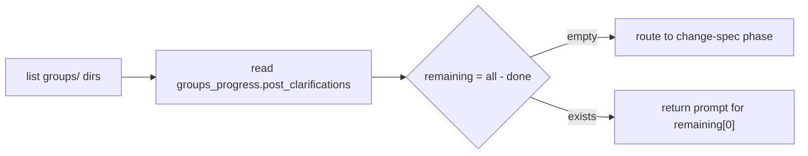

# Post-Clarifications

## Phase Transition

```yaml
from: PostClarificationsCreated
to: ChangeSpecCreated  # via run_change routing after all groups done
executor: [mainthread]
crr: false  # create-only, no review/revise
progress_key: groups_progress.post_clarifications
```

## Group Processing

Same breadth-first pattern as pre-clarifications. One group per call.



## Prompt Template

```markdown
# Task: Post-Clarifications for group '{{group_id}}'

Read all context gathered so far and identify contradictions or gaps.

## Context Sources (read all 4)

1. `sdd_read_artifact(scope="user_input")`
2. `sdd_read_artifact(scope="pre_clarifications", group_id="{{group_id}}")`
3. `sdd_read_artifact(scope="reference_context", group_id="{{group_id}}")`
4. Read the group's `requirements.md`

## Analysis

1. **Contradiction mining**: Compare requirements against referenced specs.
   - Does any requirement conflict with an existing spec?
   - Do different referenced specs contradict each other?
2. **Assumption surfacing**: What implicit assumptions need explicit confirmation?
3. **Skip-fast decision**: If no contradictions and no ambiguities → skip

## Output

- If contradictions found: ask user to resolve, then call `sdd_artifact_create_post_clarifications`
- If no contradictions: call `sdd_artifact_create_post_clarifications` with `skipped: true`
```

## Artifact Schema

### Input params

```json
{
  "group_id": { "type": "string", "required": true },
  "skipped": { "type": "boolean", "description": "true if no contradictions found" },
  "questions": {
    "type": "array",
    "items": {
      "type": "object",
      "required": ["topic", "question", "answer"],
      "properties": {
        "topic": { "type": "string" },
        "question": { "type": "string" },
        "answer": { "type": "string" }
      }
    }
  },
  "contradictions": {
    "type": "array",
    "items": {
      "type": "object",
      "required": ["spec_id", "requirement", "conflict", "resolution"],
      "properties": {
        "spec_id": { "type": "string" },
        "requirement": { "type": "string" },
        "conflict": { "type": "string" },
        "resolution": { "type": "string" }
      }
    }
  }
}
```

### Output file

```
cclab/changes/{change_id}/groups/{group_id}/post_clarifications.md
```

Two variants:

**Skipped** (no contradictions):
```yaml
---
status: skipped
group_id: {group_id}
---
No contradictions found. Proceeding to spec creation.
```

**Clarified** (contradictions resolved):
```yaml
---
status: clarified
group_id: {group_id}
---
## Contradictions

### {spec_id}: {requirement}
**Conflict:** {conflict}
**Resolution:** {resolution}

## Additional Questions

### {topic}
**Q:** {question}
**A:** {answer}
```

## Side Effects

| Action | STATE.yaml change |
|--------|-------------------|
| `sdd_artifact_create_post_clarifications` | Appends group_id to `groups_progress.post_clarifications` |
| All groups done | run_change routes to `sdd_workflow_create_change_spec` |


# Reviews
