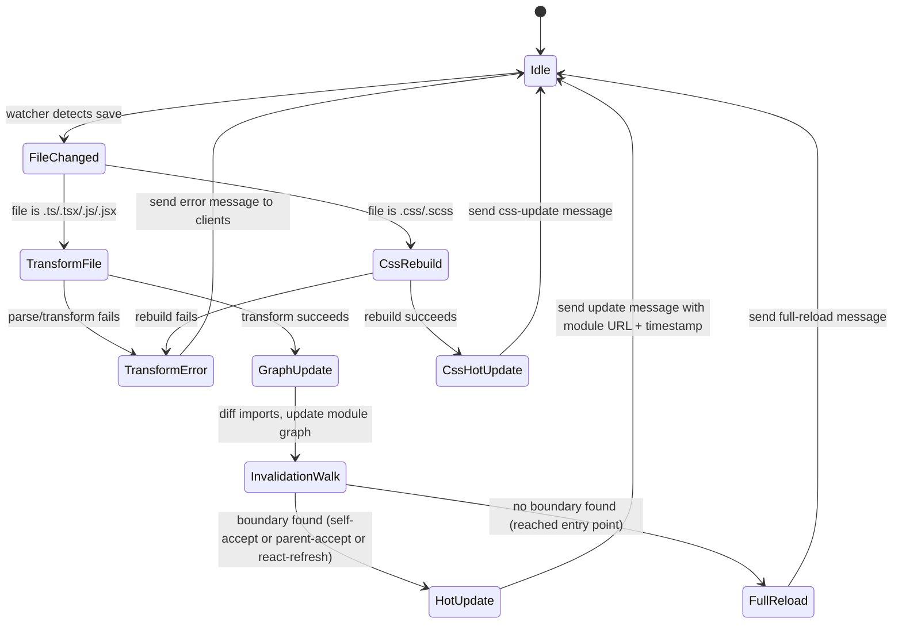
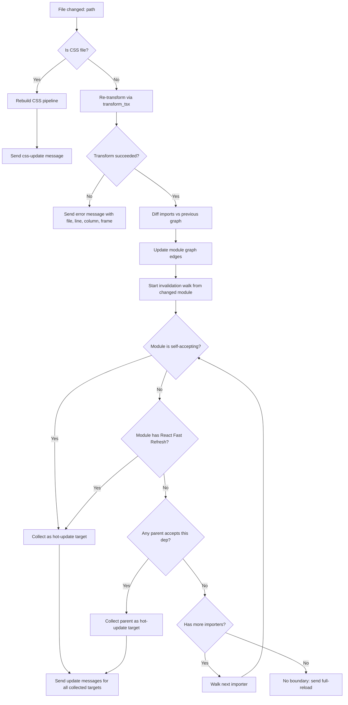
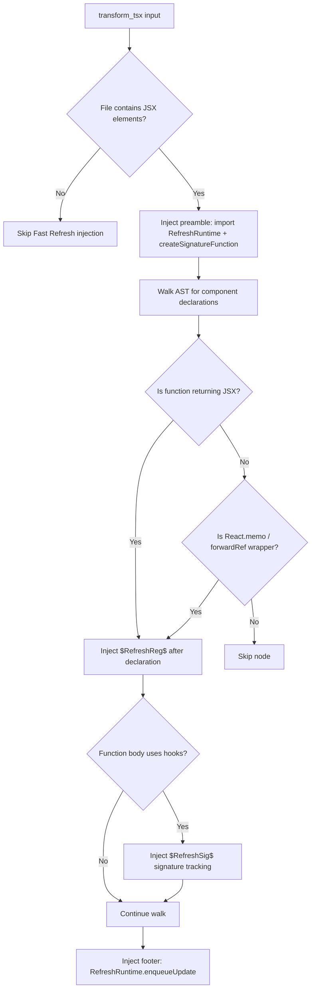
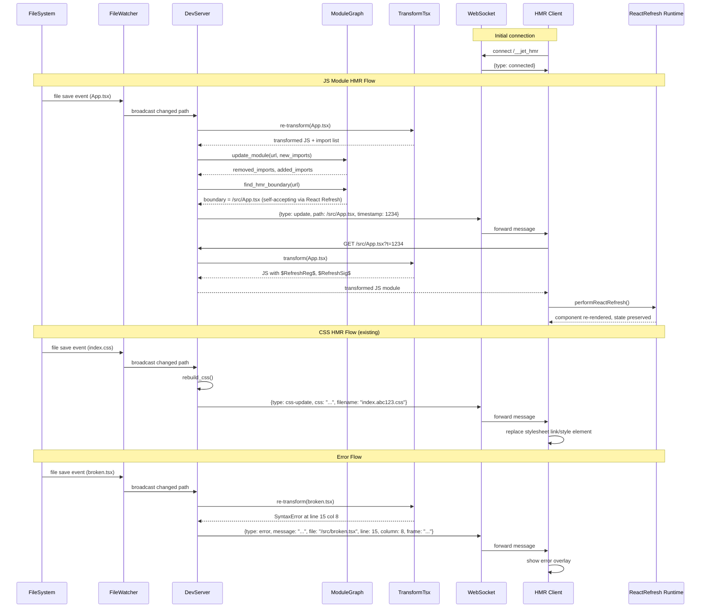

# Jet Hmr Validation Spec

## Overview

Add JavaScript module-level HMR to the Jet dev server. Currently, all JS/TS file changes trigger `window.location.reload()` via the `/__jet_hmr` WebSocket — no state preservation.

This change replaces full-reload with granular hot module replacement:

| Component | Current | Target |
|-----------|---------|--------|
| JS update handling | `window.location.reload()` in HMR client | Module re-import via timestamp-busted dynamic `import()`, run `accept` callbacks |
| Module graph | None | Server-side import dependency DAG built from `transform_tsx` / bundler output |
| `import.meta.hot` API | Not implemented | Vite-compatible: `accept`, `dispose`, `prune`, `invalidate`, `data` |
| React Fast Refresh | Not implemented | AST-based `$RefreshReg$` / `$RefreshSig$` injection in `transform_tsx.rs` |
| HMR boundary detection | None | Walk module graph upward — hot-update at boundary, full-reload if none found |
| Error overlay | None | Browser overlay on syntax/transform errors, auto-dismiss on fix |
| CSS HMR | Working (`CssUpdate` message) | Preserved as-is |

### Scope

- **#1118**: JS module HMR — `import.meta.hot` API, module graph, React Fast Refresh, error overlay
- **#1119**: Validate end-to-end on `projects/conductor/fe` — dashboard renders, `@cclab/ui` components display, API proxy works, CSS/Tailwind renders, component HMR preserves state

### Acceptance

- Edit a React component in Conductor FE → component updates without full page reload, state preserved
- CSS HMR continues to work (no regression)
- No `Unexpected token` errors in browser console
- Error overlay appears on syntax error, disappears when fixed
## Requirements

### R1: import.meta.hot API (#1118)

Inject `import.meta.hot` object into every served `.ts`/`.tsx`/`.js`/`.jsx` module during dev. Vite-compatible API surface:

| Method | Signature | Behavior |
|--------|-----------|----------|
| `accept()` | `(cb?: (mod) => void) => void` | Self-accepting — re-run module, call `cb` with new exports |
| `accept(deps, cb)` | `(deps: string[], cb: (mods) => void) => void` | Accept specific dependencies |
| `dispose(cb)` | `(cb: (data) => void) => void` | Cleanup before module is replaced; `data` persists to next version |
| `prune(cb)` | `(cb: () => void) => void` | Called when module is removed from graph |
| `invalidate()` | `() => void` | Force propagation to parent — this module cannot self-accept |
| `data` | `object` | Persistent data object across HMR updates |

- `import.meta.hot` is `undefined` in production builds (tree-shaken via dead code elimination)
- Client runtime manages per-module accept/dispose/prune registrations keyed by module URL

### R2: Server-Side Module Graph (#1118)

Track import dependencies as a directed graph:
- **Build**: Parse `import`/`export` statements from `transform_tsx` output; record edges `importer → imported`
- **Update on file change**: Re-transform the changed file, diff its imports, update graph edges
- **Invalidation walk**: On file change, walk graph upward from changed module. Stop at first module with `accept` handler (HMR boundary). If no boundary found before reaching root entry, trigger full reload.
- **Scope**: Only tracks project source files (not `node_modules` — pre-bundled deps are immutable during dev session)

### R3: HMR Client Runtime (#1118)

Replace current `generate_hmr_client()` IIFE with a full HMR runtime injected into `index.html`:
- Maintain module registry: `Map<string, { accept, dispose, prune, data }>`
- On `update` WebSocket message: fetch new module via `import(url + '?t=' + timestamp)`, execute accept callbacks, call dispose on old version
- On `full-reload` message: `window.location.reload()`
- On `css-update` message: replace `<link>` or `<style>` element (existing behavior preserved)
- On `error` message: show error overlay
- On `prune` message: call prune callback, remove module from registry
- Reconnection with exponential backoff (1s, 2s, 4s, max 30s)

### R4: React Fast Refresh Integration (#1118)

Inject React Fast Refresh instrumentation in `transform_tsx.rs` AST pass:
- Detect React component declarations: functions returning JSX, `React.memo()`, `React.forwardRef()`
- Inject `$RefreshReg$(ComponentName, 'ComponentName')` after each component declaration
- Detect hooks usage (`useState`, `useEffect`, etc.) and inject `$RefreshSig$()` signature tracking
- Inject runtime preamble at module top: `import RefreshRuntime from '/@react-refresh'; const $RefreshSig$ = RefreshRuntime.createSignatureFunctionForTransform;`
- Inject footer: `RefreshRuntime.enqueueUpdate()` if module contains components
- Only inject for `.tsx`/`.jsx` files containing JSX elements or React component patterns
- The `/@react-refresh` endpoint serves a bundled `react-refresh/runtime` module

### R5: HMR Boundary Detection (#1118)

Determine update strategy per file change:

| Condition | Action |
|-----------|--------|
| Changed module has `import.meta.hot.accept()` | Hot update — re-import module, run callback |
| Changed module has React components (R4 injected) | Hot update via Fast Refresh |
| Parent module has `accept(dep)` for changed module | Hot update parent |
| No boundary found walking to entry point | Full page reload |
| `.css` file changed | CSS hot replacement (existing) |

Propagation: walk `importers` edges upward. At each node, check for accept handler. If found, collect that node as update target. If a node has no handler and no importers, it is the entry — full reload.

### R6: Error Overlay (#1118)

Display syntax and transform errors as a browser overlay:
- Render on `error` HMR message with: file path, line/column, error message, code frame
- Auto-dismiss when a subsequent successful `update` message arrives
- Style: dark semi-transparent backdrop, monospace font, red error highlight
- Click-to-dismiss and Escape key to close
- Stack on multiple errors (newest on top)

### R7: Conductor FE Validation (#1119)

End-to-end validation on `projects/conductor/fe`:

| Check | Criteria |
|-------|----------|
| `cclab jet install` | Completes without error |
| `cclab jet dev` starts | Server binds, no crash |
| Dashboard renders | `http://localhost:PORT/` shows Conductor dashboard |
| `@cclab/ui` components | All UI components render without import errors |
| API proxy | Requests to `/api/*` proxy to backend |
| CSS/Tailwind | Styles applied correctly |
| Console | No `Unexpected token`, no module resolution errors |
| HMR | Edit React component → hot update, state preserved |
| CSS HMR | Edit CSS/Tailwind → style updates without reload |
## Scenarios

### S1: Self-Accepting Module Hot Update (R1, R3)

**Given** a module with `import.meta.hot.accept()` is served by `jet dev`
**When** the module's source file is saved with changes
**Then** server sends `{"type":"update","path":"/src/App.tsx","timestamp":...}` via WebSocket
**And** client re-imports the module with cache-busting query `?t={timestamp}`
**And** the accept callback runs with new module exports
**And** no page reload occurs

### S2: React Component HMR with State Preservation (R4, R5)

**Given** `jet dev` serves a React `.tsx` file containing a `Counter` component with `useState`
**And** the counter has been clicked to value 5
**When** the component's JSX return value is edited and saved
**Then** the component re-renders with the new JSX
**And** the counter state remains at 5
**And** `$RefreshReg$` and `$RefreshSig$` calls are present in the served JS

### S3: CSS HMR Preserved (R3)

**Given** `jet dev` is running with CSS hot replacement working
**When** a CSS file is edited and saved
**Then** `CssUpdate` HMR message is sent (existing behavior)
**And** styles update without page reload
**And** no regression from JS HMR changes

### S4: No Boundary — Full Reload (R5)

**Given** a utility module with no `import.meta.hot.accept()` and no React components
**And** its importer chain up to the entry point has no accept handlers
**When** the utility module is edited and saved
**Then** server detects no HMR boundary in the module graph
**And** sends `{"type":"full-reload","reason":"no HMR boundary for /src/utils.ts"}` via WebSocket
**And** client executes `window.location.reload()`

### S5: Syntax Error Shows Overlay (R6)

**Given** `jet dev` is running and serving a React app
**When** a `.tsx` file is saved with a syntax error (e.g., unclosed JSX tag)
**Then** server sends `{"type":"error","message":"...","file":"...","line":...,"column":...}` via WebSocket
**And** client displays a dark overlay with the error details and code frame
**And** the previous working page remains underneath

### S6: Syntax Error Fix Dismisses Overlay (R6)

**Given** the error overlay is currently displayed
**When** the syntax error is fixed and the file is saved
**Then** server sends a successful `update` message
**And** the error overlay is automatically dismissed
**And** the module is hot-updated normally

### S7: Dependency Accept — Parent Handles Update (R1, R5)

**Given** module A imports module B
**And** module A has `import.meta.hot.accept(['./B'], (newB) => { ... })`
**When** module B is edited and saved
**Then** module B is re-imported
**And** module A's accept callback runs with new B exports
**And** module A is NOT re-imported (only B is fetched)

### S8: Dispose Callback Runs Before Update (R1, R3)

**Given** a module registered `import.meta.hot.dispose((data) => { clearInterval(timer); data.savedState = state; })`
**When** the module is hot-updated
**Then** the dispose callback runs before the new module executes
**And** `import.meta.hot.data.savedState` is available in the new module instance

### S9: Module Graph Update on Import Change (R2)

**Given** module A imports B and C
**When** module A is edited to remove `import B` and add `import D`
**Then** module graph removes edge A→B and adds edge A→D
**And** if B has no other importers, it becomes an orphan (prune candidate)

### S10: Conductor FE End-to-End (R7)

**Given** `cclab jet install` has completed on `projects/conductor/fe`
**When** `cclab jet dev` is started
**Then** server starts without crash
**And** `http://localhost:PORT/` renders the Conductor dashboard
**And** `@cclab/ui` components display correctly
**And** `/api/*` requests proxy to the backend
**And** CSS/Tailwind styles are applied
**And** browser console has no `Unexpected token` or module resolution errors

### S11: Conductor FE Component HMR (R4, R7)

**Given** `jet dev` is running on Conductor FE and dashboard is rendered
**When** a React component in `src/` is edited (e.g., change button text)
**Then** the component updates in the browser without full reload
**And** application state (route, form inputs, scroll position) is preserved

### S12: WebSocket Reconnection (R3)

**Given** `jet dev` is running and HMR client is connected
**When** the WebSocket connection drops (server restart)
**Then** client attempts reconnection with exponential backoff (1s, 2s, 4s, ...)
**And** on successful reconnection, triggers a full reload to sync state
## Diagrams

### Interaction
<!-- type: interaction lang: mermaid -->
<!-- TODO -->

### Logic
<!-- type: logic lang: mermaid -->
<!-- TODO -->

### Dependencies
<!-- type: dependency lang: mermaid -->
<!-- TODO -->

### State Machine
<!-- type: state-machine lang: mermaid -->
<!-- TODO -->

### Data Model
<!-- type: db-model lang: mermaid -->
<!-- TODO -->

## API Spec

### REST API
<!-- type: rest-api lang: yaml -->
<!-- TODO -->

### RPC API
<!-- type: rpc-api lang: json -->
<!-- TODO -->

### Async API
<!-- type: async-api lang: yaml -->
<!-- TODO -->

### CLI
<!-- type: cli lang: yaml -->
<!-- TODO -->

### Schema
<!-- type: schema lang: json -->
<!-- TODO -->

### Config
<!-- type: config lang: json -->
<!-- TODO -->

## Test Plan

### Unit Tests — R1: import.meta.hot API

#### T1: import.meta.hot Injected in Dev Mode

**Given** a `.tsx` file with no `import.meta.hot` usage
**When** `transform_tsx()` processes it in dev mode
**Then** output contains `import.meta.hot` runtime setup code
**And** `import.meta.hot.accept`, `dispose`, `data` are defined

#### T2: import.meta.hot Not Injected in Prod Build

**Given** a `.tsx` file with `if (import.meta.hot) { ... }` guard
**When** processed in production mode
**Then** `import.meta.hot` references are not injected
**And** the conditional block is dead code (tree-shakeable)

#### T3: Self-Accept Registration

**Given** a module calls `import.meta.hot.accept((mod) => { ... })`
**When** HMR client processes the module
**Then** module is registered as self-accepting in client module map
**And** callback is stored for later invocation

#### T4: Dependency Accept Registration

**Given** a module calls `import.meta.hot.accept(['./dep'], ([newDep]) => { ... })`
**When** HMR client processes the module
**Then** `./dep` is registered as accepted dependency
**And** callback is stored keyed by dep URL

### Unit Tests — R2: Module Graph

#### T5: Graph Built From Imports

**Given** module A imports B and C
**When** `module_graph.add_module("/src/A.tsx", ["/src/B.tsx", "/src/C.tsx"])` is called
**Then** `graph["/src/A.tsx"].imports` contains B and C
**And** `graph["/src/B.tsx"].importers` contains A
**And** `graph["/src/C.tsx"].importers` contains A

#### T6: Graph Update Removes Stale Edges

**Given** module A previously imported B and C
**When** A is re-transformed and now only imports C and D
**Then** edge A→B is removed, B's importers no longer contains A
**And** edge A→D is added, D's importers contains A
**And** edge A→C remains unchanged

#### T7: Invalidation Walk Finds Self-Accept Boundary

**Given** module B is self-accepting
**And** module A imports B (A is not self-accepting)
**When** `find_hmr_boundary("/src/B.tsx")` is called
**Then** returns `["/src/B.tsx"]` as update targets
**And** does NOT return A

#### T8: Invalidation Walk Propagates to Parent

**Given** module C is not self-accepting, has no React components
**And** module B imports C and has `accept(['./C'], ...)`
**When** `find_hmr_boundary("/src/C.tsx")` is called
**Then** returns `["/src/B.tsx"]` (parent that accepts C)

#### T9: Invalidation Walk Returns FullReload

**Given** module chain: entry → A → B → C
**And** none of entry, A, B, C have accept handlers or React components
**When** `find_hmr_boundary("/src/C.tsx")` is called
**Then** returns empty (no boundary found)
**And** server sends full-reload message

### Unit Tests — R4: React Fast Refresh

#### T10: Component Declaration Gets $RefreshReg$

**Given** `.tsx` file with `export function App() { return <div/> }`
**When** `transform_tsx()` processes it in dev mode
**Then** output contains `$RefreshReg$(App, "App")`

#### T11: Arrow Component Gets $RefreshReg$

**Given** `.tsx` file with `const App = () => <div/>`
**When** `transform_tsx()` processes it
**Then** output contains `$RefreshReg$(App, "App")`

#### T12: Hook Usage Gets $RefreshSig$

**Given** component using `useState` and `useEffect`
**When** `transform_tsx()` processes it
**Then** output contains `$RefreshSig$()` call
**And** signature includes hook call order fingerprint

#### T13: Non-Component Function Skipped

**Given** `.tsx` file with `function calculateTotal(items) { return items.reduce(...) }`
**When** `transform_tsx()` processes it
**Then** no `$RefreshReg$` is injected for `calculateTotal`

#### T14: React.memo Wrapped Component Detected

**Given** `const MemoApp = React.memo(function App() { return <div/> })`
**When** `transform_tsx()` processes it
**Then** `$RefreshReg$` is injected for the inner component

#### T15: Preamble and Footer Injected

**Given** a `.tsx` file with at least one React component
**When** `transform_tsx()` processes it in dev mode
**Then** output starts with `import RefreshRuntime from '/@react-refresh'`
**And** output ends with `RefreshRuntime.enqueueUpdate()`

### Unit Tests — R6: Error Overlay

#### T16: Error Message Contains Code Frame

**Given** a syntax error at line 15, column 8 in `App.tsx`
**When** server constructs the error HMR message
**Then** `frame` field contains surrounding source lines with error marker
**And** `line` is 15 and `column` is 8

### Integration Tests — R7: Conductor FE

#### T17: Jet Install Succeeds

**Given** `projects/conductor/fe` with `package.json`
**When** `cclab jet install` is run
**Then** exits with code 0
**And** `node_modules/` is populated

#### T18: Jet Dev Starts Without Crash

**Given** `cclab jet install` completed
**When** `cclab jet dev` is started
**Then** server binds to port and logs ready message
**And** process does not crash within 10 seconds

#### T19: Dashboard Renders

**Given** `jet dev` is running
**When** browser navigates to `http://localhost:PORT/`
**Then** HTTP 200 response with HTML content
**And** `<div id="root">` contains rendered React components

#### T20: No Console Errors

**Given** `jet dev` is running and dashboard is loaded
**When** browser console is checked
**Then** no `Unexpected token` errors
**And** no `ERR_MODULE_NOT_FOUND` errors
**And** no unhandled `SyntaxError` exceptions
## Changes

```yaml
files:
  # Module Graph (R2)
  - path: crates/cclab-jet/src/dev_server/module_graph.rs
    action: CREATE
    desc: "ModuleGraph struct: directed graph of ModuleGraphNode entries. Methods: add_module, update_module (diff imports), find_hmr_boundary (invalidation walk), remove_module. Keyed by URL path."

  # HMR Protocol Extension (R1, R5)
  - path: crates/cclab-jet/src/dev_server/hmr.rs
    action: MODIFY
    desc: "Add Prune variant to HmrMessage enum. Add HmrUpdateResult enum {HotUpdate{targets}, FullReload{reason}}. Add method determine_update(path, module_graph) that runs invalidation walk and returns HmrUpdateResult."

  # HMR Client Runtime (R1, R3, R6)
  - path: crates/cclab-jet/src/dev_server/hmr_client.rs
    action: CREATE
    desc: "Full HMR client runtime as embedded JS string. Replaces generate_hmr_client() IIFE. Implements: import.meta.hot API (accept/dispose/prune/invalidate/data), module registry Map, WebSocket message handlers (update/css-update/full-reload/error/prune), dynamic import() with cache-busting, error overlay DOM creation and dismissal, exponential backoff reconnection."

  # React Fast Refresh Integration (R4)
  - path: crates/cclab-jet/src/transform/transform_tsx.rs
    action: MODIFY
    desc: "Add React Fast Refresh injection: detect component declarations (functions returning JSX, React.memo, forwardRef), inject $RefreshReg$ after each. Detect hooks usage, inject $RefreshSig$ signature tracking. Add preamble (import RefreshRuntime) and footer (enqueueUpdate) when components detected. Gated on dev_mode flag."

  # React Refresh Runtime Endpoint (R4)
  - path: crates/cclab-jet/src/dev_server/react_refresh.rs
    action: CREATE
    desc: "Serve /@react-refresh endpoint: bundled react-refresh/runtime as ESM module. Exports createSignatureFunctionForTransform, register, performReactRefresh, enqueueUpdate."

  # Dev Server Integration (R1, R2, R3, R5)
  - path: crates/cclab-jet/src/dev_server/mod.rs
    action: MODIFY
    desc: "Replace generate_hmr_client() call with hmr_client.rs runtime injection into index.html (not bundle.js). Add ModuleGraph to DevServer state. In file watcher task: on JS/TS change, re-transform file, update module graph, run boundary detection, send appropriate HMR message. Add /@react-refresh route. Extract import list from transform_tsx output for graph building. Add import.meta.hot injection to serve_root_file transform pipeline."

  # Watcher Enhancement (R2)
  - path: crates/cclab-jet/src/dev_server/watcher.rs
    action: MODIFY
    desc: "No structural change — watcher already broadcasts changed paths. May need to add debouncing (50ms) to avoid duplicate events from editors that save-then-rename."

  # Dev Server Module Declaration
  - path: crates/cclab-jet/src/dev_server/mod.rs
    action: MODIFY
    desc: "Add mod declarations for module_graph, hmr_client, react_refresh submodules."
```
## Wireframe
<!-- type: wireframe lang: yaml -->

<!-- TODO -->

## Component
<!-- type: component lang: json -->

<!-- TODO -->

## Design Token
<!-- type: design-token lang: json -->

<!-- TODO -->

## Doc
<!-- type: doc lang: markdown -->

<!-- TODO -->


## Schema

```json
{
  "$schema": "https://json-schema.org/draft/2020-12/schema",
  "title": "HMR Protocol Messages",
  "description": "WebSocket message types for /__jet_hmr endpoint",
  "oneOf": [
    {
      "type": "object",
      "properties": {
        "type": { "const": "connected" }
      },
      "required": ["type"]
    },
    {
      "type": "object",
      "properties": {
        "type": { "const": "update" },
        "path": { "type": "string", "description": "Module URL path, e.g. /src/App.tsx" },
        "timestamp": { "type": "integer", "description": "Unix milliseconds for cache-busting" },
        "acceptedBy": { "type": "string", "description": "Module URL that accepted this update (if boundary is a parent)" }
      },
      "required": ["type", "path", "timestamp"]
    },
    {
      "type": "object",
      "properties": {
        "type": { "const": "css-update" },
        "css": { "type": "string", "description": "Full CSS content" },
        "filename": { "type": "string", "description": "Hashed CSS filename" },
        "timestamp": { "type": "integer" }
      },
      "required": ["type", "css", "filename", "timestamp"]
    },
    {
      "type": "object",
      "properties": {
        "type": { "const": "full-reload" },
        "reason": { "type": "string" }
      },
      "required": ["type", "reason"]
    },
    {
      "type": "object",
      "properties": {
        "type": { "const": "error" },
        "message": { "type": "string" },
        "file": { "type": "string" },
        "line": { "type": "integer" },
        "column": { "type": "integer" },
        "frame": { "type": "string", "description": "Code frame with error context" }
      },
      "required": ["type", "message"]
    },
    {
      "type": "object",
      "properties": {
        "type": { "const": "prune" },
        "paths": { "type": "array", "items": { "type": "string" } }
      },
      "required": ["type", "paths"]
    }
  ]
}
```

```json
{
  "$schema": "https://json-schema.org/draft/2020-12/schema",
  "title": "ModuleGraphNode",
  "description": "Server-side module graph node",
  "type": "object",
  "properties": {
    "url": { "type": "string", "description": "Module URL path (e.g. /src/App.tsx)" },
    "file": { "type": "string", "description": "Absolute filesystem path" },
    "imports": {
      "type": "array",
      "items": { "type": "string" },
      "description": "URLs of modules this module imports"
    },
    "importers": {
      "type": "array",
      "items": { "type": "string" },
      "description": "URLs of modules that import this module"
    },
    "is_self_accepting": { "type": "boolean", "description": "Module called import.meta.hot.accept() with no deps" },
    "accepted_deps": {
      "type": "array",
      "items": { "type": "string" },
      "description": "URLs of deps accepted via import.meta.hot.accept(deps, cb)"
    },
    "has_react_refresh": { "type": "boolean", "description": "Module contains React Fast Refresh instrumentation" },
    "last_transform_timestamp": { "type": "integer" }
  },
  "required": ["url", "file", "imports", "importers"]
}
```


## State Machine




## Logic



### React Fast Refresh Injection Logic




## Interaction



# Reviews
