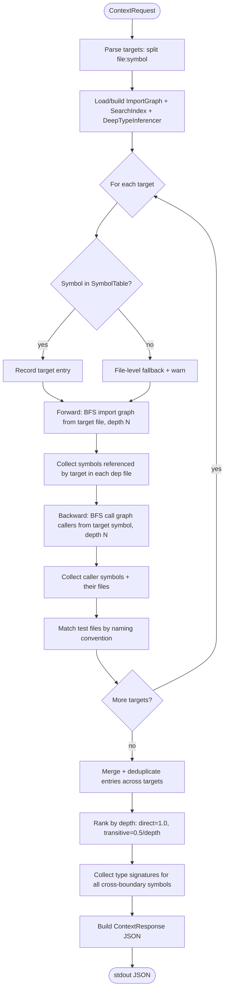

# Agent Context Builder

## Overview

Smart file selection for AI task execution. Combines import graph forward traversal, call graph backward traversal, and test file detection to produce a minimal, ranked context set for an agent working on a given symbol or file.

| Attribute | Value |
|-----------|-------|
| Crate | cclab-sdd (post lens dissolution) |
| Module | `context_builder` (new top-level module) |
| Interface | CLI-only (`cclab sdd context`) — no MCP |
| Issue | #946 |
| Depends on | ImportGraph (graph/), CallGraphIndex (search/query), DeepTypeInferencer (types/deep_inference), SymbolTable (semantic/) |
## Requirements

### Functional

| ID | Requirement | Source |
|----|-------------|--------|
| R1 | Accept one or more targets in `file:symbol` format (e.g. `src/services/user.py:get_user`) | #946 AC |
| R2 | Accept configurable `depth` parameter (default 2) controlling traversal hops | #946 AC |
| R3 | Follow import graph **forward** from target — collect transitive dependencies up to depth | #946 algorithm |
| R4 | Follow call graph **backward** from target — collect all callers up to depth | #946 algorithm |
| R5 | Detect test files covering target symbols via naming conventions (`test_*.py`, `*_test.go`, `*.test.ts`, `*_test.rs`) | #946 algorithm |
| R6 | Collect cross-boundary type signatures for all referenced symbols via DeepTypeInferencer | #946 AC |
| R7 | Output three ranked categories: `must_read` (forward deps), `may_affect` (backward callers + tests), `type_context` (signatures) | #946 output |
| R8 | Each entry in `must_read`/`may_affect` includes `path`, `reason`, and `symbols` list | #946 output |
| R9 | Rank results by relevance (direct deps > transitive deps; callers > callers-of-callers) | #946 algorithm |
| R10 | Support Python, TypeScript, Rust, Go | #946 AC |

### Non-Functional

| ID | Requirement |
|----|-------------|
| NF1 | CLI-only interface — no MCP tool exposure (clarification Q2) |
| NF2 | Module lives at `src/context_builder/` after lens dissolution (not under `lens/`) |
| NF3 | Reuse existing ImportGraph, CallGraphIndex, DeepTypeInferencer — no new graph structures |
| NF4 | Output must be JSON-serializable for machine consumption |
## Scenarios

### S1: Single Python symbol — forward + backward + tests

| Step | Action | Expected |
|------|--------|----------|
| 1 | `cclab sdd context src/services/user.py:get_user --depth 2` | Parse target as file=`src/services/user.py`, symbol=`get_user` |
| 2 | Forward traversal (depth 2) | `must_read` includes `src/models/user.py` (depth 1, imported by target), `src/db/connection.py` (depth 1, called by get_user) |
| 3 | Backward traversal (depth 2) | `may_affect` includes `src/api/routes.py` (depth 1, calls get_user) |
| 4 | Test detection | `may_affect` includes `tests/test_user.py` (naming convention match) |
| 5 | Type context | `type_context` contains signatures for `User`, `get_session` |

### S2: Multiple targets

| Step | Action | Expected |
|------|--------|----------|
| 1 | `cclab sdd context src/a.py:foo src/b.py:bar` | Parse two targets |
| 2 | Union of traversals | `must_read` merges deps of both; `may_affect` merges callers of both |
| 3 | Deduplication | Files appearing in both target traversals listed once with combined symbols |

### S3: Depth 0 — target-only

| Step | Action | Expected |
|------|--------|----------|
| 1 | `cclab sdd context src/a.py:foo --depth 0` | No traversal beyond target |
| 2 | Output | `must_read` = target file only; `may_affect` = empty; `type_context` = target symbol signature only |

### S4: Unresolvable symbol

| Step | Action | Expected |
|------|--------|----------|
| 1 | `cclab sdd context src/a.py:nonexistent` | Symbol not in SymbolTable |
| 2 | Graceful degradation | `must_read` = target file (file-level fallback); warning in stderr |

### S5: TypeScript project

| Step | Action | Expected |
|------|--------|----------|
| 1 | `cclab sdd context src/index.ts:App --depth 1` | Import graph resolves `.ts`/`.tsx` extensions |
| 2 | Test detection | Matches `*.test.ts`, `*.spec.ts` naming conventions |
## Diagrams

### Interaction
<!-- type: interaction lang: mermaid -->
<!-- TODO -->

### Logic
<!-- type: logic lang: mermaid -->
<!-- TODO -->

### Dependencies
<!-- type: dependency lang: mermaid -->
<!-- TODO -->

### State Machine
<!-- type: state-machine lang: mermaid -->
<!-- TODO -->

### Data Model
<!-- type: db-model lang: mermaid -->
<!-- TODO -->

## API Spec

### REST API
<!-- type: rest-api lang: yaml -->
<!-- TODO -->

### RPC API
<!-- type: rpc-api lang: json -->
<!-- TODO -->

### Async API
<!-- type: async-api lang: yaml -->
<!-- TODO -->

### CLI
<!-- type: cli lang: yaml -->
<!-- TODO -->

### Schema
<!-- type: schema lang: json -->
<!-- TODO -->

### Config
<!-- type: config lang: json -->
<!-- TODO -->

## Test Plan

### Unit Tests

| Test | File | Validates |
|------|------|-----------|
| `test_forward_traversal_depth_1` | `traversal.rs` | Forward BFS stops at depth 1, returns direct imports only (R3) |
| `test_forward_traversal_depth_2` | `traversal.rs` | Forward BFS returns transitive imports at depth 2 (R3) |
| `test_backward_traversal_callers` | `traversal.rs` | Backward BFS finds direct callers of symbol (R4) |
| `test_backward_traversal_depth_limit` | `traversal.rs` | Backward BFS respects depth limit (R4, R2) |
| `test_detect_python_tests` | `test_detection.rs` | Matches `test_*.py` and `*_test.py` patterns (R5, R10) |
| `test_detect_typescript_tests` | `test_detection.rs` | Matches `*.test.ts` and `*.spec.ts` patterns (R5, R10) |
| `test_detect_rust_tests` | `test_detection.rs` | Matches `tests/*.rs` (R5, R10) |
| `test_detect_go_tests` | `test_detection.rs` | Matches `*_test.go` (R5, R10) |
| `test_ranking_by_depth` | `mod.rs` | Direct deps score > transitive deps score (R9) |
| `test_type_context_collection` | `mod.rs` | Cross-boundary symbols have type signatures in output (R6) |
| `test_unresolvable_symbol_fallback` | `mod.rs` | Falls back to file-level context when symbol not found (S4) |
| `test_multiple_targets_merge` | `mod.rs` | Entries from multiple targets are merged and deduplicated (S2) |
| `test_depth_zero` | `mod.rs` | Depth 0 returns target only, no traversal (S3) |

### Integration Tests

| Test | Validates |
|------|-----------|
| `test_cli_context_python_project` | End-to-end: `cclab sdd context` on fixture Python project produces valid JSON with must_read/may_affect/type_context (R7, NF1, NF4) |
| `test_cli_context_json_output` | Output is valid JSON matching ContextResponse schema (NF4) |
## Changes

```yaml
changes:
  - action: create
    path: crates/cclab-sdd/src/context_builder/mod.rs
    description: >
      New module root. Re-exports ContextBuilder, ContextRequest, ContextResponse.
      Orchestrates the build_context() pipeline: parse targets → load indices → forward traversal → backward traversal → test detection → type collection → rank → serialize.
    requirements: [R1, R2, R3, R4, R5, R6, R7, R8, R9]

  - action: create
    path: crates/cclab-sdd/src/context_builder/traversal.rs
    description: >
      Forward and backward BFS traversal functions.
      forward_traverse(import_graph, start_file, depth) -> Vec<ContextEntry>.
      backward_traverse(call_graph, start_symbol, depth) -> Vec<ContextEntry>.
    requirements: [R3, R4, R9]

  - action: create
    path: crates/cclab-sdd/src/context_builder/test_detection.rs
    description: >
      Test file detection by naming conventions per language.
      detect_test_files(project_files, target_file, language) -> Vec<ContextEntry>.
    requirements: [R5, R10]

  - action: create
    path: crates/cclab-sdd/src/context_builder/types.rs
    description: >
      ContextTarget, ContextRequest, ContextEntry, ContextResponse, ContextStats structs.
      Derives Serialize, Deserialize.
    requirements: [R1, R7, R8, NF4]

  - action: modify
    path: crates/cclab-sdd/src/lib.rs
    description: "Add `pub mod context_builder;` declaration"
    requirements: [NF2]

  - action: modify
    path: crates/cclab-sdd-cli/src/commands.rs
    description: >
      Add `context` subcommand: `cclab sdd context <targets...> [--depth N]`.
      Parses file:symbol args, calls ContextBuilder::build_context(), prints JSON to stdout.
    requirements: [R1, R2, NF1]
```
## Wireframe
<!-- type: wireframe lang: yaml -->

<!-- TODO -->

## Component
<!-- type: component lang: json -->

<!-- TODO -->

## Design Token
<!-- type: design-token lang: json -->

<!-- TODO -->

## Doc
<!-- type: doc lang: markdown -->

<!-- TODO -->


## Schema

```json
{
  "$schema": "https://json-schema.org/draft/2020-12/schema",
  "definitions": {
    "ContextTarget": {
      "type": "object",
      "required": ["file", "symbol"],
      "properties": {
        "file": { "type": "string", "description": "Relative path from project root" },
        "symbol": { "type": "string", "description": "Symbol name (function, class, method)" }
      }
    },
    "ContextRequest": {
      "type": "object",
      "required": ["targets"],
      "properties": {
        "targets": {
          "type": "array",
          "items": { "$ref": "#/definitions/ContextTarget" },
          "minItems": 1
        },
        "depth": { "type": "integer", "minimum": 0, "default": 2 }
      }
    },
    "ContextEntry": {
      "type": "object",
      "required": ["path", "reason", "symbols"],
      "properties": {
        "path": { "type": "string", "description": "Relative file path" },
        "reason": {
          "type": "string",
          "enum": ["target", "imported_by_target", "called_by_target", "transitive_dep", "calls_target", "transitive_caller", "test_file"]
        },
        "symbols": {
          "type": "array",
          "items": { "type": "string" },
          "description": "Relevant symbols in this file"
        },
        "depth": { "type": "integer", "description": "Hop distance from target" }
      }
    },
    "ContextResponse": {
      "type": "object",
      "required": ["must_read", "may_affect", "type_context"],
      "properties": {
        "must_read": {
          "type": "array",
          "items": { "$ref": "#/definitions/ContextEntry" },
          "description": "Files the agent must read (target + forward deps)"
        },
        "may_affect": {
          "type": "array",
          "items": { "$ref": "#/definitions/ContextEntry" },
          "description": "Files that may be affected (backward callers + tests)"
        },
        "type_context": {
          "type": "object",
          "additionalProperties": { "type": "string" },
          "description": "Map of symbol name → type signature string"
        },
        "stats": {
          "type": "object",
          "properties": {
            "targets_resolved": { "type": "integer" },
            "targets_unresolved": { "type": "integer" },
            "files_scanned": { "type": "integer" },
            "time_ms": { "type": "integer" }
          }
        }
      }
    }
  }
}
```


## Logic



### Test File Detection Rules

| Language | Convention | Pattern |
|----------|------------|---------|
| Python | `test_` prefix or `_test` suffix | `test_{name}.py`, `{name}_test.py`, `tests/test_{name}.py` |
| TypeScript | `.test.` or `.spec.` infix | `{name}.test.ts`, `{name}.spec.tsx` |
| Rust | Same file `#[cfg(test)]` or `tests/` dir | `tests/{name}.rs`, inline `mod tests` |
| Go | `_test` suffix | `{name}_test.go` |

### Ranking Formula

```yaml
score:
  target: 1.0
  depth_1_dep: 0.8
  depth_2_dep: 0.4
  depth_N_dep: 0.8 / (2 ^ (N-1))
  test_file: 0.7  # always high regardless of depth
sort: descending by score
```

# Reviews
