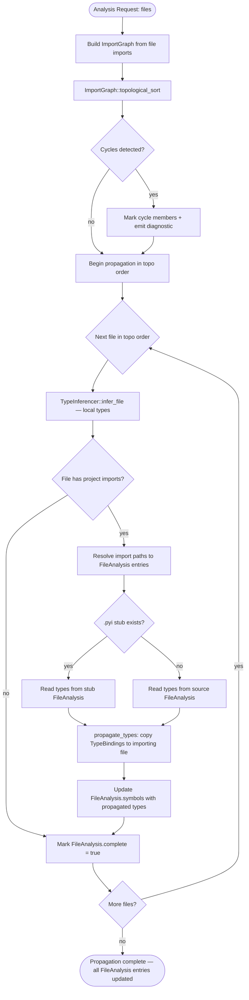
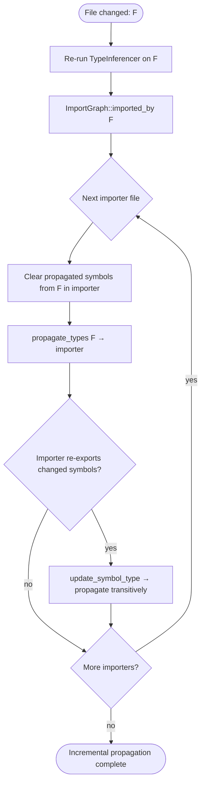
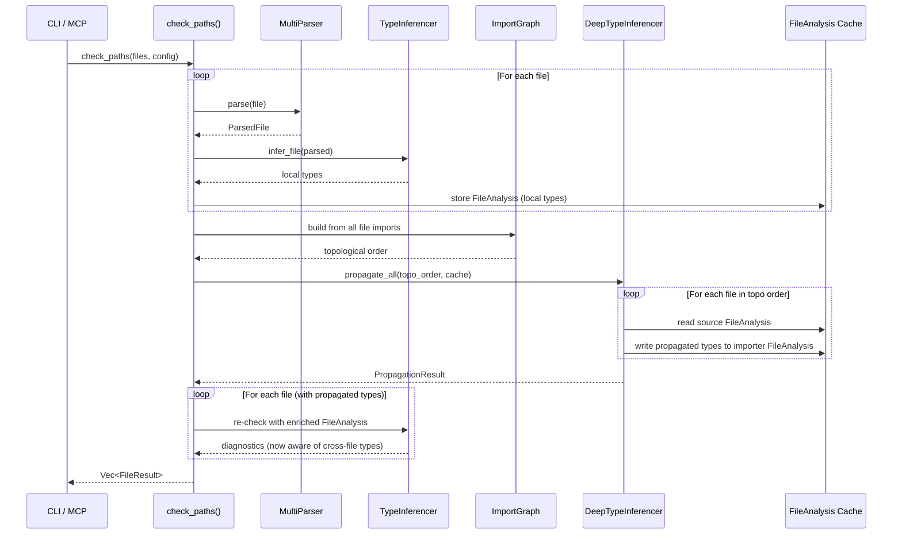

# Type Inference Pipeline

## Overview

Cross-file type propagation pipeline that wires `DeepTypeInferencer::propagate_types()` into the analysis flow. After per-file inference completes, runs type propagation in topological order via `ImportGraph`, caches propagated types in daemon `FileAnalysis` entries, and ensures `lens_type_at`/`lens_hover` return resolved types instead of `Type::Unknown` for imported symbols.

| Attribute | Value |
|-----------|-------|
| Crate | cclab-sdd (post lens dissolution) |
| Module | `type_inference` (renamed from `lens/types/`, top-level after dissolution) |
| Interface | Internal pipeline — consumed by check, type_at, hover, diagnostics |
| Issue | #944 |
| Depends on | DeepTypeInferencer (deep_inference), ImportGraph (deep_inference), TypeInferencer (infer), TypeChecker (check), FileAnalysis (deep_inference), ModuleGraph (modules), AnalysisCache (cache) |
| Language priority | Python first, then Rust, TypeScript, Go |
## Requirements

### Functional

| ID | Requirement | Source |
|----|-------------|--------|
| R1 | After per-file type inference completes, invoke `DeepTypeInferencer::propagate_types()` for each import edge | #944 proposed fix §1 |
| R2 | Run cross-file propagation in topological order via `ImportGraph::topological_sort()` — dependencies analyzed before dependents | #944 proposed fix §2 |
| R3 | Cache propagated types in daemon's `FileAnalysis.symbols` entries so subsequent queries read resolved types | #944 proposed fix §3 |
| R4 | `type_at` queries on imported symbols return the propagated type from the source module, not `Type::Unknown` | #944 AC §1 |
| R5 | `hover` queries on imported symbols return the propagated type signature | #944 AC §1 |
| R6 | Support Python `from X import Y` and `import X` patterns — resolve module path to file, extract exported symbol types | #944 AC §4 |
| R7 | Support Python `.pyi` stub files as type source when present alongside `.py` files | #944 scope |
| R8 | Invalidate propagated types when a dependency file changes — re-propagate from changed file through reverse import edges | #944 AC §3 |
| R9 | Handle circular imports gracefully — use `ImportGraph::topological_sort()` cycle detection, mark cycle members as `Type::Unknown` with diagnostic | #944 scope |
| R10 | Wire `DeepTypeInferencer` into `check_paths()` / `check_file()` pipeline so diagnostics benefit from cross-file types | #944 impact |

### Non-Functional

| ID | Requirement |
|----|-------------|
| NF1 | Module lives at `src/type_inference/` after lens dissolution (not under `lens/types/`) |
| NF2 | Reuse existing `DeepTypeInferencer`, `ImportGraph`, `TypeInferencer` — no new inference engine |
| NF3 | Propagation must not re-parse source files — read from `FileAnalysis` cache |
| NF4 | Python-first: full coverage for Python import patterns; Rust/TS/Go wiring deferred to follow-up |
| NF5 | No MCP interface changes — propagation is transparent to existing tool callers |
## Scenarios

### S1: Python `from X import Y` — imported function type resolved

| Step | Action | Expected |
|------|--------|----------|
| 1 | Project has `db.py` defining `def get_user(id: int) -> User` and `handler.py` with `from db import get_user` | Both files indexed in FileAnalysis |
| 2 | Per-file inference runs on both files | `db.py` has `get_user: Callable[[int], User]`; `handler.py` has `get_user: Type::Unknown` |
| 3 | ImportGraph built | Edge: `handler.py` → `db.py` |
| 4 | Topological sort | Order: `db.py`, `handler.py` |
| 5 | `propagate_types(db.py, handler.py, ["get_user"])` | `handler.py` FileAnalysis now has `get_user: Callable[[int], User]` |
| 6 | `type_at(handler.py, get_user call site)` | Returns `Callable[[int], User]` (not `Type::Unknown`) |

### S2: Python `import X` — module-level access

| Step | Action | Expected |
|------|--------|----------|
| 1 | `handler.py` has `import db` then `db.get_user(id)` | Import recorded as module-level |
| 2 | Propagation | `handler.py` receives all exported symbols from `db.py` |
| 3 | `type_at(handler.py, db.get_user)` | Returns `Callable[[int], User]` via attribute resolution on module type |

### S3: Transitive propagation — A imports B imports C

| Step | Action | Expected |
|------|--------|----------|
| 1 | `c.py` defines `class Config`; `b.py` has `from c import Config`; `a.py` has `from b import Config` | Three-file chain |
| 2 | Topological sort | Order: `c.py`, `b.py`, `a.py` |
| 3 | Propagation pass 1 | `b.py` gets `Config` type from `c.py` |
| 4 | Propagation pass 2 | `a.py` gets `Config` type from `b.py` (which already has the resolved type) |
| 5 | `type_at(a.py, Config usage)` | Returns `Instance{name: "Config", ...}` |

### S4: Circular import — graceful degradation

| Step | Action | Expected |
|------|--------|----------|
| 1 | `a.py` imports from `b.py`; `b.py` imports from `a.py` | Cycle detected by ImportGraph |
| 2 | Topological sort | Cycle members identified, sorted with best-effort ordering |
| 3 | Propagation | Symbols in cycle retain locally-inferred types; cross-cycle imports remain `Type::Unknown` |
| 4 | Diagnostic | Warning: "circular import between a.py and b.py — cross-file types unavailable" |

### S5: Stub file (.pyi) takes precedence

| Step | Action | Expected |
|------|--------|----------|
| 1 | `db.py` exists alongside `db.pyi` with richer type annotations | Both detected |
| 2 | Propagation source selection | `db.pyi` types preferred over `db.py` types |
| 3 | `type_at(handler.py, get_user)` | Returns type from stub, not from runtime source |

### S6: Dependency file changes — cache invalidation

| Step | Action | Expected |
|------|--------|----------|
| 1 | `db.py` is modified: `get_user` return type changes from `User` to `Optional[User]` | File change detected |
| 2 | Re-analyze `db.py` | FileAnalysis updated with new type |
| 3 | Invalidation via reverse import edges | All files importing from `db.py` (e.g. `handler.py`) marked for re-propagation |
| 4 | Re-propagation | `handler.py` gets `get_user: Callable[[int], Optional[User]]` |

### S7: No cross-file imports — pipeline is a no-op

| Step | Action | Expected |
|------|--------|----------|
| 1 | Single file with no imports from project files | ImportGraph has no edges for this file |
| 2 | Propagation | Skipped — no work to do |
| 3 | `type_at` | Returns locally-inferred types as before |
## Diagrams

### Interaction
<!-- type: interaction lang: mermaid -->
<!-- TODO -->

### Logic
<!-- type: logic lang: mermaid -->
<!-- TODO -->

### Dependencies
<!-- type: dependency lang: mermaid -->
<!-- TODO -->

### State Machine
<!-- type: state-machine lang: mermaid -->
<!-- TODO -->

### Data Model
<!-- type: db-model lang: mermaid -->
<!-- TODO -->

## API Spec

### REST API
<!-- type: rest-api lang: yaml -->
<!-- TODO -->

### RPC API
<!-- type: rpc-api lang: json -->
<!-- TODO -->

### Async API
<!-- type: async-api lang: yaml -->
<!-- TODO -->

### CLI
<!-- type: cli lang: yaml -->
<!-- TODO -->

### Schema
<!-- type: schema lang: json -->
<!-- TODO -->

### Config
<!-- type: config lang: json -->
<!-- TODO -->

## Test Plan

### Unit Tests

| Test | File | Validates |
|------|------|-----------|
| `test_propagate_from_import_y` | `propagation.rs` | `from db import get_user` propagates `Callable[[int], User]` to importing file (R1, R6, S1) |
| `test_propagate_import_module` | `propagation.rs` | `import db` propagates all exported symbols as module-level binding (R6, S2) |
| `test_propagation_topological_order` | `propagation.rs` | Files analyzed in dependency order — leaf modules first (R2) |
| `test_transitive_propagation` | `propagation.rs` | A→B→C chain: A gets type originally defined in C after two propagation passes (R1, R2, S3) |
| `test_circular_import_detection` | `deep_inference.rs` | Cycle between A↔B detected, cycle members returned, no infinite loop (R9, S4) |
| `test_circular_import_fallback` | `deep_inference.rs` | Symbols in cycle retain local types, cross-cycle imports are `Type::Unknown` (R9, S4) |
| `test_stub_file_preference` | `propagation.rs` | When `db.pyi` exists alongside `db.py`, propagation uses stub types (R7, S5) |
| `test_cache_stores_propagated_types` | `cache.rs` | After propagation, FileAnalysis.symbols contains entries with `is_propagated = true` (R3) |
| `test_invalidation_on_dependency_change` | `cache.rs` | Changing source file clears propagated bindings in all importers (R8, S6) |
| `test_repropagate_after_invalidation` | `propagation.rs` | After invalidation + re-propagation, importers get updated types (R8, S6) |
| `test_no_imports_no_propagation` | `propagation.rs` | File with no project imports: propagation is skipped, no performance cost (S7) |
| `test_propagation_stats` | `propagation.rs` | PropagationResult.stats correctly counts files_analyzed, symbols_propagated, cycles_detected (schema) |
| `test_relative_import_resolution` | `imports.rs` | `from .utils import helper` resolves within package directory (R6) |
| `test_star_import_propagation` | `propagation.rs` | `from db import *` propagates all `__all__` or non-underscore symbols (R6) |
| `test_propagated_binding_flag` | `deep_inference.rs` | Propagated TypeBindings have `is_propagated = true`, local ones have `false` (R3) |

### Integration Tests

| Test | Validates |
|------|-----------|
| `test_type_at_imported_symbol` | `type_at` on imported symbol returns resolved type from source module, not `Type::Unknown` (R4, S1) |
| `test_hover_imported_symbol` | `hover` on imported symbol returns type signature from source module (R5) |
| `test_check_with_propagation_diagnostics` | `check_paths` on multi-file project produces diagnostics that reference cross-file types (R10) |
| `test_pipeline_python_fixture` | End-to-end: fixture Python project with imports, propagation runs, all `type_at` queries return resolved types (R1-R6, NF4) |
| `test_pipeline_no_reparse` | Propagation reads from FileAnalysis cache, does not trigger file re-reads (NF3) |
## Changes

```yaml
changes:
  - action: modify
    path: crates/cclab-sdd/src/type_inference/deep_inference.rs
    description: >
      Add `propagate_all(&mut self, cache: &mut HashMap<PathBuf, FileAnalysis>)` method to DeepTypeInferencer.
      Iterates files in topological order, calls propagate_types() for each import edge.
      Add `is_propagated: bool` field to TypeBinding.
      Add `propagation_complete: bool` field to FileAnalysis.
    requirements: [R1, R2, R3]

  - action: modify
    path: crates/cclab-sdd/src/type_inference/deep_inference.rs
    description: >
      Enhance propagate_types() to prefer .pyi stub types over .py source types.
      When resolving from_file, check if a stub FileAnalysis exists at {from_file_stem}.pyi.
    requirements: [R7]

  - action: modify
    path: crates/cclab-sdd/src/type_inference/deep_inference.rs
    description: >
      Add `invalidate_and_repropagate(&mut self, changed_file: &PathBuf)` method.
      Clears propagated symbols from changed_file in all importers via reverse_edges.
      Re-runs propagate_types() for affected edges.
      Calls update_symbol_type() for transitive cascading.
    requirements: [R8]

  - action: modify
    path: crates/cclab-sdd/src/type_inference/deep_inference.rs
    description: >
      Enhance topological_sort() cycle detection to return cycle members list.
      Add `detect_cycles() -> Vec<Vec<PathBuf>>` to ImportGraph.
      Cycle member files get a diagnostic warning attached to their FileAnalysis.
    requirements: [R9]

  - action: create
    path: crates/cclab-sdd/src/type_inference/propagation.rs
    description: >
      New module: PropagationPipeline orchestrator.
      `fn run_propagation(files: &[PathBuf], cache: &mut AnalysisCache) -> PropagationResult`.
      Builds ImportGraph from FileAnalysis imports, runs topological sort, invokes DeepTypeInferencer::propagate_all().
      Returns PropagationResult with stats and cycle info.
    requirements: [R1, R2, R3, R9, NF2]

  - action: modify
    path: crates/cclab-sdd/src/type_inference/mod.rs
    description: >
      Add `pub mod propagation;` declaration.
      Re-export PropagationPipeline, PropagationResult, PropagationStats.
    requirements: [NF2]

  - action: modify
    path: crates/cclab-sdd/src/type_inference/imports.rs
    description: >
      Enhance ImportResolver to resolve Python import patterns to file paths.
      Support `from X import Y`, `import X`, relative imports, `__init__.py` packages.
      Return resolved file path + imported symbol names for propagation.
    requirements: [R6]

  - action: modify
    path: crates/cclab-sdd/src/check_pipeline.rs
    description: >
      Wire propagation into check_paths():
      1. After per-file inference loop, call PropagationPipeline::run_propagation().
      2. Re-run type checking on files with propagated types for improved diagnostics.
      This is the new top-level module after lens dissolution (replaces lens/mod.rs check_paths).
    requirements: [R4, R5, R10]

  - action: modify
    path: crates/cclab-sdd/src/type_inference/cache.rs
    description: >
      Extend AnalysisCache to track propagation_complete per file.
      Add invalidate_propagation(file: &PathBuf) method that clears propagated bindings
      for the file and all transitive importers.
    requirements: [R3, R8, NF3]

  - action: modify
    path: crates/cclab-sdd/src/lib.rs
    description: "Ensure `pub mod type_inference;` and `pub mod check_pipeline;` exist (post dissolution)"
    requirements: [NF2]
```
## Wireframe
<!-- type: wireframe lang: yaml -->

<!-- TODO -->

## Component
<!-- type: component lang: json -->

<!-- TODO -->

## Design Token
<!-- type: design-token lang: json -->

<!-- TODO -->

## Doc
<!-- type: doc lang: markdown -->

<!-- TODO -->


## Schema

```json
{
  "$schema": "https://json-schema.org/draft/2020-12/schema",
  "definitions": {
    "PropagationRequest": {
      "type": "object",
      "required": ["files"],
      "properties": {
        "files": {
          "type": "array",
          "items": { "type": "string" },
          "description": "File paths to include in cross-file propagation"
        },
        "changed_files": {
          "type": "array",
          "items": { "type": "string" },
          "description": "Files that changed (for incremental re-propagation). If empty, full propagation."
        }
      }
    },
    "PropagatedType": {
      "type": "object",
      "required": ["symbol", "type_str", "source_file"],
      "properties": {
        "symbol": { "type": "string", "description": "Symbol name as imported" },
        "type_str": { "type": "string", "description": "Resolved type signature string" },
        "source_file": { "type": "string", "description": "File where symbol is originally defined" },
        "source_line": { "type": "integer", "minimum": 1, "description": "Line in source file" },
        "is_stub": { "type": "boolean", "description": "True if type came from .pyi stub" }
      }
    },
    "PropagationResult": {
      "type": "object",
      "required": ["propagated", "stats"],
      "properties": {
        "propagated": {
          "type": "object",
          "description": "Map of target_file → list of propagated types",
          "additionalProperties": {
            "type": "array",
            "items": { "$ref": "#/definitions/PropagatedType" }
          }
        },
        "cycles": {
          "type": "array",
          "items": {
            "type": "array",
            "items": { "type": "string" }
          },
          "description": "Detected import cycles (list of file path lists)"
        },
        "stats": { "$ref": "#/definitions/PropagationStats" }
      }
    },
    "PropagationStats": {
      "type": "object",
      "required": ["files_analyzed", "symbols_propagated", "cycles_detected"],
      "properties": {
        "files_analyzed": { "type": "integer", "minimum": 0 },
        "symbols_propagated": { "type": "integer", "minimum": 0 },
        "cycles_detected": { "type": "integer", "minimum": 0 },
        "stubs_used": { "type": "integer", "minimum": 0 },
        "time_ms": { "type": "integer", "minimum": 0 }
      }
    },
    "FileAnalysis": {
      "type": "object",
      "required": ["path", "symbols", "complete"],
      "description": "Extended FileAnalysis with propagated type tracking",
      "properties": {
        "path": { "type": "string" },
        "symbols": {
          "type": "object",
          "description": "Map of symbol name → TypeBinding (includes both local and propagated)",
          "additionalProperties": { "$ref": "#/definitions/TypeBinding" }
        },
        "imports": {
          "type": "array",
          "items": { "$ref": "#/definitions/ImportInfo" }
        },
        "complete": { "type": "boolean" },
        "propagation_complete": { "type": "boolean", "description": "True after cross-file propagation has run" }
      }
    },
    "TypeBinding": {
      "type": "object",
      "required": ["ty", "symbol", "source_file"],
      "properties": {
        "ty": { "type": "string", "description": "Type enum variant (serialized)" },
        "symbol": { "type": "string" },
        "source_file": { "type": "string" },
        "line": { "type": "integer", "minimum": 0 },
        "is_exported": { "type": "boolean" },
        "is_propagated": { "type": "boolean", "description": "True if this binding came from cross-file propagation" },
        "dependencies": { "type": "array", "items": { "type": "string" } }
      }
    },
    "ImportInfo": {
      "type": "object",
      "required": ["module"],
      "properties": {
        "module": { "type": "string", "description": "Module path being imported" },
        "names": {
          "type": "array",
          "items": { "type": "string" },
          "description": "Specific names imported (null = import all)"
        },
        "alias": { "type": "string", "description": "Import alias if any" }
      }
    }
  }
}
```


## Logic



### Incremental Re-Propagation (on file change)



### Integration Point: check_paths Pipeline



### Import Resolution Rules (Python)

| Import Pattern | Resolution | Propagated Symbols |
|----------------|------------|--------------------|
| `from X import Y` | Resolve `X` to file, extract `Y` | Specific: `[Y]` |
| `from X import Y as Z` | Resolve `X` to file, extract `Y` | Specific: `[Y]` (aliased as `Z` in target) |
| `from X import *` | Resolve `X` to file, extract all `__all__` or non-underscore | All exported |
| `import X` | Resolve `X` to file/package | Module-level binding (attribute access resolves lazily) |
| `from . import X` | Relative: resolve within package | Specific: `[X]` |
| `from .X import Y` | Relative: resolve `X` within package, extract `Y` | Specific: `[Y]` |

# Reviews
