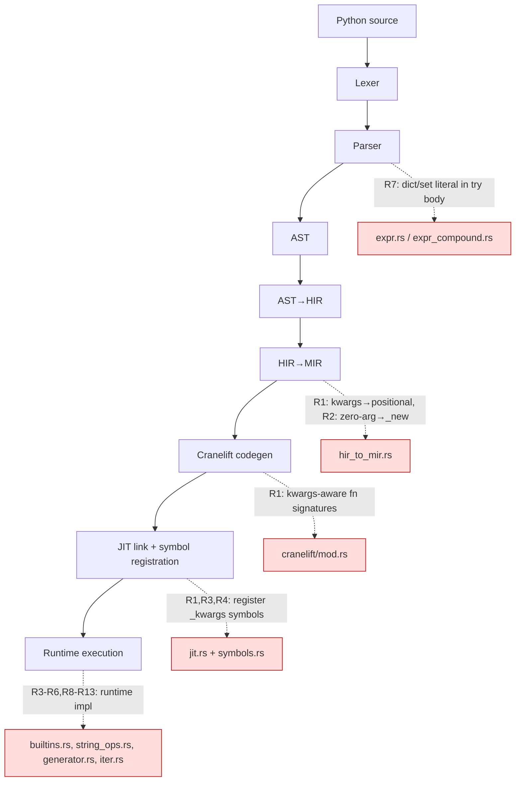
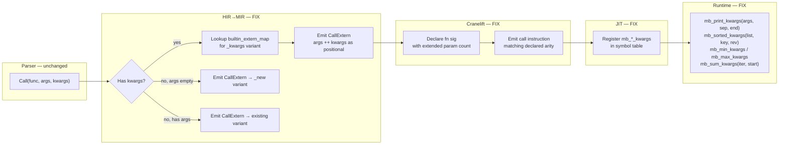
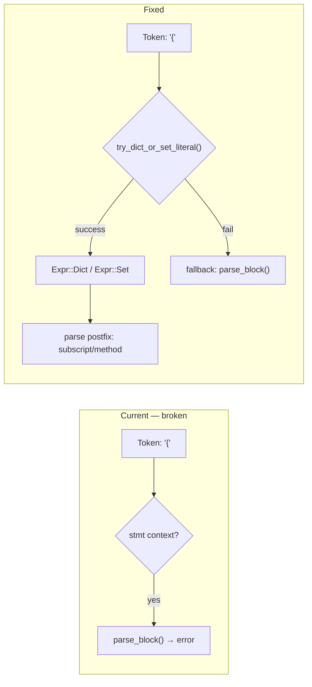

# Cclab Mamba Fix Xfail Spec

## Overview

Reduce 48 xfail conformance tests by fixing implementation gaps across the Mamba JIT pipeline. Priority order per clarification: kwargs verifier errors first, then output mismatches, then parse errors.

### Xfail Breakdown

| Category | Count | Root Cause | Priority |
|----------|-------|------------|----------|
| Verifier errors | 5 | Codegen emits wrong arg count for kwargs/no-arg builtins — Cranelift rejects IR | P0 |
| Parse errors | 3 | `try/except` with inline dict/list/set literal not parsed | P1 |
| Output mismatch (builtins) | 8 | kwargs (`sorted key=`, `print sep=`, `sum start=`), missing builtins (`pow mod`, `int base`, `chr/ord`) | P1 |
| Output mismatch (string) | 2 | `str.format()` kwargs, string edge cases | P2 |
| Generator edge cases | 6 | `send` TypeError, `throw` propagation, `close` timeout, `yield from` passthrough, `gi_frame` introspection | P3 |
| Iterator edge cases | 4 | `iter(callable, sentinel)`, generator unpacking, `zip/map/filter` with generators, custom iterator protocol | P3 |
| Language edge cases | 4 | walrus operator in comprehension, lambda defaults/nesting, pattern matching, parameterized decorators | P3 |
| Exception/class edge cases | 2 | exception chaining `__cause__`, MRO introspection, `staticmethod`/`classmethod` | P3 |
| Stdlib modules | 14 | Extended features for re, json, datetime, collections, math, functools, itertools, io, hashlib, struct, csv, random | P4 |

### Affected Layers

| Layer | Files | Change Scope |
|-------|-------|-------------|
| Codegen | `cranelift/mod.rs` | kwargs argument count fix in function signature generation |
| HIR→MIR | `hir_to_mir.rs` | CallExtern arg count alignment, kwargs stripping |
| Runtime | `builtins.rs` | kwargs-aware print, sorted, sum, pow, int, chr/ord |
| Runtime | `string_ops.rs` | str.format() keyword argument path |
| Runtime | `symbols.rs` | Register kwargs-aware runtime function signatures |
| Runtime | `generator.rs` | Edge case fixes: send TypeError, throw propagation, close cleanup |
| Parser | `expr.rs`, `expr_compound.rs` | Inline literal expressions inside except clauses |
| Codegen | `jit.rs` | Updated symbol registration for kwargs variants |
## Requirements

| ID | Title | Priority | Acceptance Criteria |
|----|-------|----------|---------------------|
| R1 | Kwargs arg count fix in codegen | P0 | When a builtin is called with keyword arguments (e.g., `print(x, sep='-')`, `sorted(xs, key=f, reverse=True)`), the Cranelift function signature and call site emit matching argument counts. All 5 verifier-error xfails pass. |
| R2 | No-arg constructor codegen guard | P0 | `list()`, `tuple()`, `set()`, `bytes()` with zero arguments route to `_new` variants instead of `_from_iterable`. Cranelift verifier passes. |
| R3 | Print sep/end kwargs runtime support | P0 | `mb_print` runtime function accepts optional `sep` and `end` keyword arguments. `print(1, 2, sep='-')` outputs `1-2`. `print('x', end='')` suppresses newline. |
| R4 | Sorted/min/max kwargs runtime support | P1 | `sorted(xs, key=f, reverse=True)`, `min(xs, key=f)`, `max(xs, default=v)`, `sum(xs, start=v)` emit correct results matching CPython 3.12. |
| R5 | Numeric builtins: pow(mod), int(base) | P1 | `pow(x, y, mod)` three-arg form and `int('ff', 16)` base conversion produce correct results. |
| R6 | chr/ord edge cases | P1 | `chr(n)` and `ord(c)` handle full Unicode range. `repr()` of special characters matches CPython output. |
| R7 | Parse inline literals in except clauses | P1 | `try: {}['x'] except KeyError:`, `try: {1,2}.remove(99) except KeyError:`, and `try: [][0] except IndexError:` parse successfully. |
| R8 | str.format() keyword arguments | P2 | `'{name}'.format(name='world')` produces correct output via `mb_string_format` kwargs path. |
| R9 | Generator send TypeError | P3 | `g.send(value)` on a just-started generator (before first `next()`) raises `TypeError`. |
| R10 | Generator throw propagation | P3 | `g.throw(exc)` propagates exception message correctly. Throwing on exhausted generator raises `StopIteration`. Throw-to-caller propagation works. |
| R11 | Generator close edge cases | P3 | `g.close()` on exhausted generator is no-op. Generator that ignores `GeneratorExit` and yields raises `RuntimeError`. No infinite loops or timeouts. |
| R12 | Iterator composition with generators | P3 | `zip(gen1, gen2)`, `map(f, gen)`, `filter(f, gen)` work with generator iterators. `iter(callable, sentinel)` two-argument form supported. |
| R13 | isinstance with tuple-of-types | P2 | `isinstance(x, (int, str))` accepts tuple of types. `getattr(obj, 'attr', default)` returns default when attribute missing. |

### Constraints

- All fixes must match CPython 3.12 output exactly — no approximate or alternative output accepted
- No-arg constructor routing reuses existing `mb_*_new` runtime functions (already registered in `symbols.rs`)
- Kwargs support requires extending both HIR→MIR lowering and Cranelift codegen to pass keyword args as additional positional parameters
- Stdlib xfails (P4) are out of scope for this change — require module-level implementation
## Scenarios

### S1: print with sep/end kwargs (R1, R3)

**GIVEN** `print(1, 2, 3, sep='-'); print('hello', end='!!!\n')`
**WHEN** executed through Mamba JIT
**THEN** output is `1-2-3` then `hello!!!` — Cranelift verifier passes, kwargs forwarded to `mb_print`

### S2: No-arg list/tuple/set/bytes constructors (R2)

**GIVEN** `print(list()); print(tuple()); print(set()); print(bytes())`
**WHEN** executed through Mamba JIT
**THEN** output is `[]`, `()`, `set()`, `b''` — zero-arg calls route to `_new` variants, verifier passes

### S3: sorted with key and reverse kwargs (R1, R4)

**GIVEN** `print(sorted([3, 1, 2], reverse=True)); print(sorted(['banana', 'apple'], key=len))`
**WHEN** executed
**THEN** output is `[3, 2, 1]` and `['apple', 'banana']` — kwargs passed as positional to `mb_sorted`

### S4: min/max with key/default, sum with start (R4)

**GIVEN** `print(min([3, 1, 4], key=lambda x: -x)); print(max([], default='empty')); print(sum([1.5, 2.5], start=10))`
**WHEN** executed
**THEN** output is `4`, `empty`, `14.0` — matching CPython 3.12

### S5: pow with modulus, int with base (R5)

**GIVEN** `print(pow(2, 10, 1000)); print(int('ff', 16))`
**WHEN** executed
**THEN** output is `24` and `255`

### S6: chr/ord Unicode edge cases (R6)

**GIVEN** `print(chr(65)); print(ord('A')); print(repr('\t'))`
**WHEN** executed
**THEN** output is `A`, `65`, `'\t'`

### S7: try/except with inline dict literal (R7)

**GIVEN** `try: {}['x']\nexcept KeyError: print('caught')`
**WHEN** parsed and executed
**THEN** Parser accepts `{}['x']` in try body. Output is `caught`.

### S8: try/except with inline set literal (R7)

**GIVEN** `try: {1, 2}.remove(99)\nexcept KeyError: print('caught')`
**WHEN** parsed and executed
**THEN** Parser accepts `{1, 2}.remove(99)` in try body. Output is `caught`.

### S9: str.format() with keyword args (R8)

**GIVEN** `print('{name} is {age}'.format(name='Alice', age=30))`
**WHEN** executed
**THEN** output is `Alice is 30`

### S10: Generator send TypeError on fresh generator (R9)

**GIVEN** `def g(): yield 1` then `gen = g(); gen.send(42)`
**WHEN** `send(42)` called before first `next()`
**THEN** raises `TypeError: can't send non-None value to a just-started generator`

### S11: Generator throw on exhausted generator (R10)

**GIVEN** A generator that has already returned
**WHEN** `g.throw(ValueError, 'bad')` is called
**THEN** raises `StopIteration` (generator already exhausted)

### S12: Generator close on exhausted generator (R11)

**GIVEN** A generator that has already returned
**WHEN** `g.close()` is called
**THEN** No exception, no-op — matches CPython behavior

### S13: isinstance with tuple of types (R13)

**GIVEN** `print(isinstance(42, (int, str))); print(isinstance('x', (int, str)))`
**WHEN** executed
**THEN** output is `True` and `True`

### S14: iter(callable, sentinel) (R12)

**GIVEN** `vals = [1, 2, 0, 3]; it = iter(vals.pop, 0); print(list(it))`
**WHEN** executed
**THEN** output is `[3]` — `pop()` returns 3 (last element), then 0 (sentinel, stops iteration)

### S15: xfail markers removed for passing tests

**GIVEN** All fixed conformance fixtures
**WHEN** `# mamba-xfail` directive removed and `cargo test -p mamba --test conformance_tests` runs
**THEN** Previously-xfail tests pass. All existing passing tests continue to pass (regression).
## Diagrams

## API Spec

## Test Plan

### Conformance Tests (xfail removal)

Remove `# mamba-xfail` from all 7 fixture files and verify they pass:

```bash
cargo test -p mamba --test conformance_tests
```

| Test | Validates | Requirements |
|------|-----------|-------------|
| `exceptions/custom.py` | Custom exception classes, inheritance, super().__init__(), custom attrs | R1, R6 |
| `exceptions/exception_group.py` | ExceptionGroup, except*, group splitting | R7 |
| `generators/basic_yield.py` | Basic yield, generator iteration, lazy evaluation | R2 |
| `generators/send_throw.py` | send(), throw(), close() protocol | R3 |
| `generators/stopiteration.py` | StopIteration.value, generator return | R2, R3 |
| `generators/yield_from.py` | yield from delegation, sub-iterator forwarding | R4 |
| `iterators/protocol.py` | Custom __iter__/__next__, for-loop integration | R1, R5 |

### Regression

```bash
cargo test -p mamba
```

All 26 currently-passing conformance tests must continue to pass.
## Changes

```yaml
files:
  # --- P0: Verifier error fixes (kwargs arg count) ---
  - path: crates/mamba/src/lower/hir_to_mir.rs
    action: MODIFY
    desc: |
      1. Add kwargs-aware builtin dispatch: when HIR Call has kwargs and target is a known builtin,
         emit kwargs as additional positional args in CallExtern matching the runtime's declared arity.
         Map: print+sep/end → mb_print_kwargs(args_ptr, sep, end), sorted+key/reverse → mb_sorted_kwargs(list, key_fn, reverse_flag).
      2. Zero-arg arity guard: when args.is_empty() and extern is _from_iterable/_from_pairs, redirect to _new variant.
    reqs: [R1, R2]

  - path: crates/mamba/src/codegen/cranelift/mod.rs
    action: MODIFY
    desc: |
      Update function signature generation for kwargs-aware builtins: declare signatures with
      additional params for sep/end/key/reverse/default/start. Ensure call sites emit matching
      arg count so Cranelift verifier passes.
    reqs: [R1, R3]

  - path: crates/mamba/src/codegen/cranelift/jit.rs
    action: MODIFY
    desc: |
      Register kwargs-aware runtime symbols in the JIT symbol table:
      mb_print_kwargs, mb_sorted_kwargs, mb_min_kwargs, mb_max_kwargs, mb_sum_kwargs.
      Each with correct param count matching the extended runtime signatures.
    reqs: [R1, R3, R4]

  - path: crates/mamba/src/runtime/symbols.rs
    action: MODIFY
    desc: |
      Add symbol registrations for kwargs-aware builtins:
      mb_print_kwargs(args_ptr: I64, sep: I64, end: I64) -> I64,
      mb_sorted_kwargs(list: I64, key_fn: I64, reverse: I64) -> I64,
      mb_min_kwargs(iterable: I64, key_fn: I64, default_val: I64) -> I64,
      mb_max_kwargs(iterable: I64, key_fn: I64, default_val: I64) -> I64,
      mb_sum_kwargs(iterable: I64, start: I64) -> I64.
    reqs: [R1, R3, R4]

  # --- P0-P1: Runtime kwargs support ---
  - path: crates/mamba/src/runtime/builtins.rs
    action: MODIFY
    desc: |
      1. Implement mb_print_kwargs: accept sep/end params, use sep between args, end after last. (R3)
      2. Implement mb_sorted_kwargs: apply key function before comparison, reverse flag. (R4)
      3. Implement mb_min_kwargs/mb_max_kwargs: key function, default value for empty iterables. (R4)
      4. Implement mb_sum_kwargs: start accumulator parameter. (R4)
      5. Extend mb_pow: three-arg pow(x, y, mod) modular exponentiation. (R5)
      6. Extend mb_int_from_str: accept base parameter for radix conversion. (R5)
      7. Fix mb_chr/mb_ord: handle full Unicode range, not just ASCII. (R6)
    reqs: [R3, R4, R5, R6]

  # --- P1: Parse fixes ---
  - path: crates/mamba/src/parser/expr.rs
    action: MODIFY
    desc: |
      In expression parsing at statement position, try dict/set literal when '{' is encountered
      before falling through to block parsing. Allows `{}['x']` and `{1,2}.remove(99)` in try body.
    reqs: [R7]

  - path: crates/mamba/src/parser/expr_compound.rs
    action: MODIFY
    desc: |
      Support set literal `{expr, expr}` and dict literal `{key: val}` in compound expression
      contexts where they appear as the start of an expression statement (e.g., inside try blocks).
    reqs: [R7]

  # --- P2: String format kwargs ---
  - path: crates/mamba/src/runtime/string_ops.rs
    action: MODIFY
    desc: |
      Extend mb_string_format to handle keyword argument substitution:
      parse `{name}` placeholders and look up values from kwargs dict.
    reqs: [R8]

  # --- P3: Generator edge case fixes ---
  - path: crates/mamba/src/runtime/generator.rs
    action: MODIFY
    desc: |
      1. send(): raise TypeError when non-None value sent to just-started generator (state == Created). (R9)
      2. throw(): propagate exception message correctly; on exhausted generator raise StopIteration. (R10)
      3. close(): no-op on exhausted generator; raise RuntimeError if generator yields after GeneratorExit. (R11)
    reqs: [R9, R10, R11]

  # --- P3: Iterator fixes ---
  - path: crates/mamba/src/runtime/iter.rs
    action: MODIFY
    desc: |
      1. Implement iter(callable, sentinel) two-argument form. (R12)
      2. Ensure zip/map/filter accept generator iterators. (R12)
    reqs: [R12]

  # --- P2: Type introspection ---
  - path: crates/mamba/src/runtime/builtins.rs
    action: MODIFY
    desc: |
      1. isinstance: accept tuple-of-types as second argument. (R13)
      2. getattr: accept optional default value as third argument. (R13)
    reqs: [R13]

  # --- Xfail marker removal (per category as tests pass) ---
  - path: crates/mamba/tests/fixtures/conformance/builtins/print_kwargs.py
    action: MODIFY
    desc: "Remove # mamba-xfail directive"
    reqs: [R1, R3]
  - path: crates/mamba/tests/fixtures/conformance/data_structures/bytes_edge_cases.py
    action: MODIFY
    desc: "Remove # mamba-xfail directive"
    reqs: [R2]
  - path: crates/mamba/tests/fixtures/conformance/data_structures/list_constructor_xfail.py
    action: MODIFY
    desc: "Remove # mamba-xfail directive"
    reqs: [R2]
  - path: crates/mamba/tests/fixtures/conformance/data_structures/set_edge_cases_xfail.py
    action: MODIFY
    desc: "Remove # mamba-xfail directive"
    reqs: [R2, R7]
  - path: crates/mamba/tests/fixtures/conformance/data_structures/tuple_edge_cases_xfail.py
    action: MODIFY
    desc: "Remove # mamba-xfail directive"
    reqs: [R2]
  - path: crates/mamba/tests/fixtures/conformance/data_structures/dict_edge_cases_xfail.py
    action: MODIFY
    desc: "Remove # mamba-xfail directive"
    reqs: [R7]
  - path: crates/mamba/tests/fixtures/conformance/data_structures/list_edge_cases_xfail.py
    action: MODIFY
    desc: "Remove # mamba-xfail directive"
    reqs: [R7]
  - path: crates/mamba/tests/fixtures/conformance/builtins/collection_builtins_edge.py
    action: MODIFY
    desc: "Remove # mamba-xfail directive"
    reqs: [R4]
  - path: crates/mamba/tests/fixtures/conformance/builtins/collection_edge_cases.py
    action: MODIFY
    desc: "Remove # mamba-xfail directive"
    reqs: [R4]
  - path: crates/mamba/tests/fixtures/conformance/builtins/numeric_edge_cases.py
    action: MODIFY
    desc: "Remove # mamba-xfail directive"
    reqs: [R5]
  - path: crates/mamba/tests/fixtures/conformance/builtins/repr_format.py
    action: MODIFY
    desc: "Remove # mamba-xfail directive"
    reqs: [R6]
  - path: crates/mamba/tests/fixtures/conformance/data_structures/string_format_xfail.py
    action: MODIFY
    desc: "Remove # mamba-xfail directive"
    reqs: [R8]
  - path: crates/mamba/tests/fixtures/conformance/data_structures/list_sort_lambda.py
    action: MODIFY
    desc: "Remove # mamba-xfail directive"
    reqs: [R4]
  - path: crates/mamba/tests/fixtures/conformance/builtins/type_introspection.py
    action: MODIFY
    desc: "Remove # mamba-xfail directive"
    reqs: [R13]
  - path: crates/mamba/tests/fixtures/conformance/generators/send_edge_cases_xfail.py
    action: MODIFY
    desc: "Remove # mamba-xfail directive"
    reqs: [R9]
  - path: crates/mamba/tests/fixtures/conformance/generators/throw_edge_cases.py
    action: MODIFY
    desc: "Remove # mamba-xfail directive"
    reqs: [R10]
  - path: crates/mamba/tests/fixtures/conformance/generators/close_edge_cases_xfail.py
    action: MODIFY
    desc: "Remove # mamba-xfail directive"
    reqs: [R11]
  - path: crates/mamba/tests/fixtures/conformance/iterators/callable_sentinel.py
    action: MODIFY
    desc: "Remove # mamba-xfail directive"
    reqs: [R12]
```
## Logic

### Mamba Compilation Pipeline — Fix Points

Each xfail category maps to a specific stage (or stages) in the compilation pipeline. The diagram shows the full pipeline with fix injection points annotated by requirement ID.



### Pipeline A: Kwargs Builtin Call (R1, R2, R3, R4)

Kwargs fixes span 4 pipeline stages. Data transforms at each stage:



| Stage | Input | Output | Fix |
|-------|-------|--------|-----|
| HIR→MIR | `HIR::Call { args, kwargs }` | `MIR::CallExtern { func: "_kwargs" variant, args: [positional ++ kwargs] }` | Map kwargs to trailing positional; zero-arg → `_new` |
| Cranelift | `MIR::CallExtern` | Cranelift IR `call` with N params | Declare signature with correct param count for kwargs variants |
| JIT | Cranelift IR | Linked native code | Register `mb_*_kwargs` symbols with matching arity |
| Runtime | Native call | stdout / return value | Implement kwargs-aware logic (sep/end, key/reverse, start) |

**Root cause**: HIR→MIR strips kwargs before emitting `CallExtern`, but the stripped arg count does not match the runtime function's declared arity. Cranelift verifier rejects the IR.

**Fix**: Two changes in `hir_to_mir.rs`:
1. When kwargs present, emit them as additional positional args in `CallExtern` (matching runtime signature)
2. Update `builtin_extern_map` entries to include kwargs-aware variants with correct param counts

### Pipeline B: Parse Fix (R7) — Parser-only



**Root cause**: `expr.rs` does not attempt dict/set literal parsing when `{` appears at statement position inside `try` body.

**Fix**: In `parse_expr_stmt`, try dict/set literal before falling through to block parsing. Downstream stages (HIR→MIR, codegen, runtime) are unaffected — dict/set literals already have complete lowering paths.

### Pipeline C: Runtime-Only Fixes (R5, R6, R8–R13)

These fixes are confined to runtime function implementations. The compiler pipeline already emits correct `CallExtern` instructions — only runtime behavior needs extension.

| Requirement | Runtime Function | Transform |
|-------------|-----------------|------------|
| R5 | `mb_pow(x, y, mod)` | Add modular exponentiation branch when 3rd arg present |
| R5 | `mb_int_from_str(s, base)` | Parse string with specified radix |
| R6 | `mb_chr(n)`, `mb_ord(c)` | Extend from ASCII to full Unicode via `char::from_u32` |
| R8 | `mb_string_format(fmt, kwargs)` | Parse `{name}` placeholders, lookup in kwargs dict |
| R9 | `mb_gen_send(gen, val)` | Check state==Created → TypeError if val != None |
| R10 | `mb_gen_throw(gen, exc)` | Check state==Completed → StopIteration |
| R11 | `mb_gen_close(gen)` | Check state==Completed → no-op; post-GeneratorExit yield → RuntimeError |
| R12 | `mb_iter_new(callable, sentinel)` | Two-arg form: call repeatedly until sentinel |
| R13 | `mb_isinstance(obj, types)` | Accept tuple: iterate types, return true on first MRO match |

### Fix Category → Pipeline Stage Matrix

| Category | Parser | HIR→MIR | Cranelift | JIT/Symbols | Runtime |
|----------|--------|---------|-----------|-------------|--------|
| Verifier errors (R1, R2) | — | **FIX** | **FIX** | **FIX** | — |
| Print/sorted/sum kwargs (R3, R4) | — | **FIX** | **FIX** | **FIX** | **FIX** |
| Numeric builtins (R5) | — | — | — | — | **FIX** |
| chr/ord Unicode (R6) | — | — | — | — | **FIX** |
| Parse errors (R7) | **FIX** | — | — | — | — |
| str.format kwargs (R8) | — | — | — | — | **FIX** |
| Generator edge cases (R9–R11) | — | — | — | — | **FIX** |
| Iterator composition (R12) | — | — | — | — | **FIX** |
| Type introspection (R13) | — | — | — | — | **FIX** |
# Reviews
