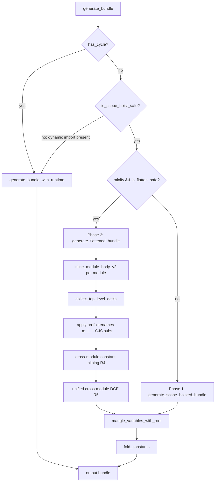

# Scope Hoisting

## Overview

<!-- type: overview lang: markdown -->

Scope hoisting (module concatenation) for jet AOT build. Inlines single-importer modules into their parent scope, eliminating per-module wrapper overhead and enabling cross-module dead code elimination.

### Current State

| Component | File | Status |
|-----------|------|--------|
| Phase 1 (IIFE wrappers) | `bundler/scope_hoist.rs` `generate_scope_hoisted_bundle` | Complete |
| Phase 2 (true flattening) | `bundler/scope_hoist.rs` `generate_flattened_bundle` | Complete |
| Safety checks | `is_scope_hoist_safe`, `is_flatten_safe` | Complete |
| CJS substitution | `inline_module_body` / `inline_module_body_v2` | Complete |
| Prefix renaming | `collect_top_level_decls` + `apply_renames_in_module_body` | Complete |
| Cross-module constant inlining (R4) | — | Not implemented |
| Unified cross-module DCE (R5) | — | Not implemented |
| `sideEffects` gating for inlining | `bundler/tree_shake.rs` | Exists for tree shaking, not wired to scope hoist |

### Target State

- **R4**: Cross-module constant inlining — propagate immutable bindings across module boundaries in the flattened scope
- **R5**: Unified cross-module DCE — after flattening, eliminate unused exports and dead functions across the merged scope
- **sideEffects integration**: Use `sideEffects: false` from `package.json` to identify safe inlining candidates; exclude modules with side effects
- **Circular dependency exclusion**: Modules in SCC groups remain wrapped (already handled by `has_cycle` check)
- **Bundle size target**: react-bench output ≤ 195 KB (within 2% of Vite's ~192 KB), down from ~206.8 KB

### Pipeline Position

```
build_graph → transform_modules → define → DCE → tree_shake → scope_hoist → mangle → fold → output
                                                                    ↑
                                                              THIS CHANGE
```

### Constraints

- Dynamic `import()` targets always produce separate chunks (already handled)
- `eval()` / `with` / `arguments[]` modules bail out to Phase 1 wrappers
- Circular dependency groups use runtime module system
- All existing tests must pass — no behavior change
## Requirements

<!-- type: requirements lang: markdown -->

### R1: Module Concatenation

```yaml
id: R1
priority: high
status: implemented
```

Inline modules with a single importer into the parent scope, removing `__jet__.define`/`__jet__.require` wrappers. Phase 1 wraps each module in `!function(module,exports,require){...}()`. Phase 2 inlines the body directly into the outer IIFE.

Implementation: `generate_scope_hoisted_bundle` (Phase 1), `generate_flattened_bundle` (Phase 2) in `bundler/scope_hoist.rs`.

### R2: True Module Flattening

```yaml
id: R2
priority: high
status: implemented
```

Merge module bodies into a single function scope. CJS globals are substituted: `module` → `_m{i}`, `exports` → `_m{i}e`, `require` → `_r`. Modules using `eval()`, `with`, or `arguments[]` bail out to Phase 1 wrappers.

Implementation: `inline_module_body_v2` in `bundler/scope_hoist.rs`.

### R3: Prefix-based Renaming

```yaml
id: R3
priority: high
status: implemented
```

All top-level `var`/`let`/`const`/`function`/`class` declarations are renamed with `_m{i}_` prefix (e.g., `_m0_workInProgress`) to prevent collisions in the flattened scope. The whole-bundle `mangle_variables_with_root` pass then compresses these to 1-2 byte identifiers.

Implementation: `collect_top_level_decls` + `apply_renames_in_module_body` in `bundler/scope_hoist.rs`.

### R4: Cross-module Constant Inlining

```yaml
id: R4
priority: medium
status: draft
```

After flattening, identify immutable bindings (`const` declarations with literal initializers) and propagate their values to all usage sites across module boundaries. This enables subsequent DCE to eliminate dead branches that depend on cross-module constants.

Candidate pattern:
```js
// Module A (flattened)
var _m1_MODE = "production";
// Module B (flattened)
if (_m1_MODE !== "production") { /* dead */ }
```

After inlining: `if ("production" !== "production") { /* dead */ }` → removed by DCE.

### R5: Unified Cross-module DCE

```yaml
id: R5
priority: medium
status: draft
```

After flattening and constant inlining, perform dead code elimination across the merged scope:
1. Remove unused prefixed exports (`_m{i}e.unusedFn`) where no reference exists
2. Remove unreferenced top-level functions/variables (prefixed names with zero references)
3. Constant-fold branches using inlined constants from R4

Must compose with existing per-module `dce.rs` pass (which runs before scope hoisting).

### R6: sideEffects Integration

```yaml
id: R6
priority: medium
status: draft
```

Wire `sideEffects: false` from `package.json` (already parsed in `tree_shake.rs`) into the scope hoisting eligibility check. Modules from packages declaring `sideEffects: false` are safe to inline even if static analysis cannot prove absence of side effects.

Modules with side effects must never be inlined — they retain their wrapper boundary.

### R7: Bundle Size Target

```yaml
id: R7
priority: high
status: draft
```

React-bench bundle size ≤ 195 KB (within 2% of Vite's ~192 KB). Current: ~206.8 KB. Target reduction: ~12 KB (~5.7%) through R4 + R5 + R6.

Benchmark: `examples/react-bench/` built with `cclab jet build --minify`.
## Scenarios

<!-- type: scenarios lang: markdown -->

### S1: Bundle Size Target (R7)

1. Build `examples/react-bench/` with `cclab jet build --minify`
2. Measure output JS bundle size
3. Assert: size ≤ 195 KB (within 2% of Vite's ~192 KB)
4. Assert: existing react-bench functionality is unchanged (app renders correctly)

### S2: Single-Importer Module Inlining (R1, R2)

1. Given module B is imported only by module A
2. Given module B has `sideEffects: false` or is statically side-effect-free
3. When building with `--minify`
4. Then module B's body is inlined into the flat scope (no separate `!function` wrapper)
5. Then module B's top-level vars are prefixed with `_m{i}_` (R3)

### S3: Circular Dependency Exclusion

1. Given modules A → B → C → A form a cycle
2. When building
3. Then the bundle falls back to runtime module system (`generate_bundle_with_runtime`)
4. Then all modules retain `__jet__.define`/`__jet__.require` wrappers
5. Then the app functions correctly (circular refs resolved at runtime)

### S4: Cross-module Constant Inlining (R4)

1. Given module A exports `const MODE = "production"`
2. Given module B uses `if (MODE !== "production") { debugSetup(); }`
3. When building with scope hoisting + R4
4. Then the condition is constant-folded and the dead branch is removed
5. Then `debugSetup` function is eliminated if no other references exist (R5)

### S5: Dynamic Import Exclusion

1. Given module A uses `import('./lazy-chunk')`
2. When building
3. Then `is_scope_hoist_safe` returns `false`
4. Then the bundle uses runtime module system (not scope hoisting)
5. Then lazy-chunk is emitted as a separate file

### S6: Unsafe Module Bailout (eval/with/arguments)

1. Given module A contains `eval('code')`
2. When building with `--minify`
3. Then `is_flatten_safe` returns `false`
4. Then Phase 2 flattening falls back to Phase 1 IIFE wrappers
5. Then the module code executes correctly (eval has access to its own scope)

### S7: Variable Collision Avoidance (R3)

1. Given module 0 declares `var count = 0`
2. Given module 1 declares `var count = 10`
3. When flattened into a single scope
4. Then module 0 has `_m0_count` and module 1 has `_m1_count`
5. Then after mangling, both are compressed to distinct short identifiers
6. Then runtime behavior is identical to wrapped execution

### S8: Side Effects Module Preservation (R6)

1. Given module A has side effects (writes to DOM, global state)
2. Given module A's package.json does NOT have `sideEffects: false`
3. When building
4. Then module A is never inlined into parent scope
5. Then module A retains its wrapper boundary
6. Then side effects execute in correct order
## Diagrams

### Interaction
<!-- type: interaction lang: mermaid -->
<!-- TODO -->

### Logic
<!-- type: logic lang: mermaid -->
<!-- TODO -->

### Dependencies
<!-- type: dependency lang: mermaid -->
<!-- TODO -->

### State Machine
<!-- type: state-machine lang: mermaid -->
<!-- TODO -->

### Data Model
<!-- type: db-model lang: mermaid -->
<!-- TODO -->

## API Spec

### REST API
<!-- type: rest-api lang: yaml -->
<!-- TODO -->

### RPC API
<!-- type: rpc-api lang: json -->
<!-- TODO -->

### Async API
<!-- type: async-api lang: yaml -->
<!-- TODO -->

### CLI
<!-- type: cli lang: yaml -->
<!-- TODO -->

### Schema
<!-- type: schema lang: json -->
<!-- TODO -->

### Config
<!-- type: config lang: json -->
<!-- TODO -->

## Test Plan
<!-- type: test-plan lang: markdown -->

<!-- TODO -->

## Changes

<!-- type: changes lang: yaml -->

```yaml
files:
  # R4: Cross-module constant inlining
  - path: crates/cclab-jet/src/bundler/scope_hoist.rs
    action: MODIFY
    desc: |
      Add `inline_cross_module_constants(code: &str) -> String` function.
      After `generate_flattened_bundle` produces the merged output, scan for
      `var _m{i}_NAME = <literal>;` patterns where the initializer is a string,
      number, or boolean literal. Replace all references to `_m{i}_NAME` with
      the literal value. Remove the now-unused `var` declaration.
      Only applies to `const`-declared bindings (tracked via
      `collect_top_level_decls` extended to record declaration kind).

  # R5: Unified cross-module DCE
  - path: crates/cclab-jet/src/bundler/scope_hoist.rs
    action: MODIFY
    desc: |
      Add `eliminate_unused_exports(code: &str) -> String` function.
      After constant inlining, scan the flattened bundle for `_m{i}e.NAME`
      assignment sites. If `_m{i}e.NAME` has zero read references in the
      entire bundle, remove the assignment statement. Then remove any
      prefixed variable declarations (`var _m{i}_NAME`) that have zero
      remaining references.

  # R6: sideEffects integration
  - path: crates/cclab-jet/src/bundler/scope_hoist.rs
    action: MODIFY
    desc: |
      Add `is_side_effect_free(module: &CompiledModule, graph: &ModuleGraph) -> bool`.
      Check if the module's package.json has `sideEffects: false`.
      Wire into `generate_flattened_bundle` eligibility: modules with side
      effects retain their IIFE wrapper even when other modules are flattened.

  # Pipeline integration
  - path: crates/cclab-jet/src/bundler/mod.rs
    action: MODIFY
    desc: |
      After `generate_flattened_bundle` call, apply the new post-processing
      pipeline: `inline_cross_module_constants` → `eliminate_unused_exports`
      before passing to `mangle_variables_with_root`. Update the
      `simulate_prod_pipeline` test helper to include the new steps.

  # Extended declaration tracking
  - path: crates/cclab-jet/src/bundler/scope_hoist.rs
    action: MODIFY
    desc: |
      Extend `collect_top_level_decls` to return `Vec<(String, DeclKind)>`
      where `DeclKind` is `Var | Let | Const | Function | Class`.
      Only `Const` bindings with literal initializers are candidates for R4.
      Update `inline_module_body_v2` to use the new return type.

  # Tests
  - path: crates/cclab-jet/src/bundler/scope_hoist.rs
    action: MODIFY
    desc: |
      Add unit tests:
      - `test_inline_cross_module_constants_string`: verify string literal propagation
      - `test_inline_cross_module_constants_number`: verify number literal propagation
      - `test_eliminate_unused_exports`: verify dead export removal
      - `test_eliminate_unused_prefixed_vars`: verify dead variable removal
      - `test_side_effect_module_not_flattened`: verify side-effect module retains wrapper

  - path: crates/cclab-jet/src/bundler/mod.rs
    action: MODIFY
    desc: |
      Update `simulate_prod_pipeline` to include constant inlining and DCE steps.
      Add integration test: `test_phase2_pipeline_with_cross_module_dce`
      verifying end-to-end size reduction through the full pipeline.
```
## Wireframe
<!-- type: wireframe lang: yaml -->

<!-- TODO -->

## Component
<!-- type: component lang: json -->

<!-- TODO -->

## Design Token
<!-- type: design-token lang: json -->

<!-- TODO -->

## Doc
<!-- type: doc lang: markdown -->

<!-- TODO -->


## Logic

<!-- type: logic lang: mermaid -->



# Reviews
