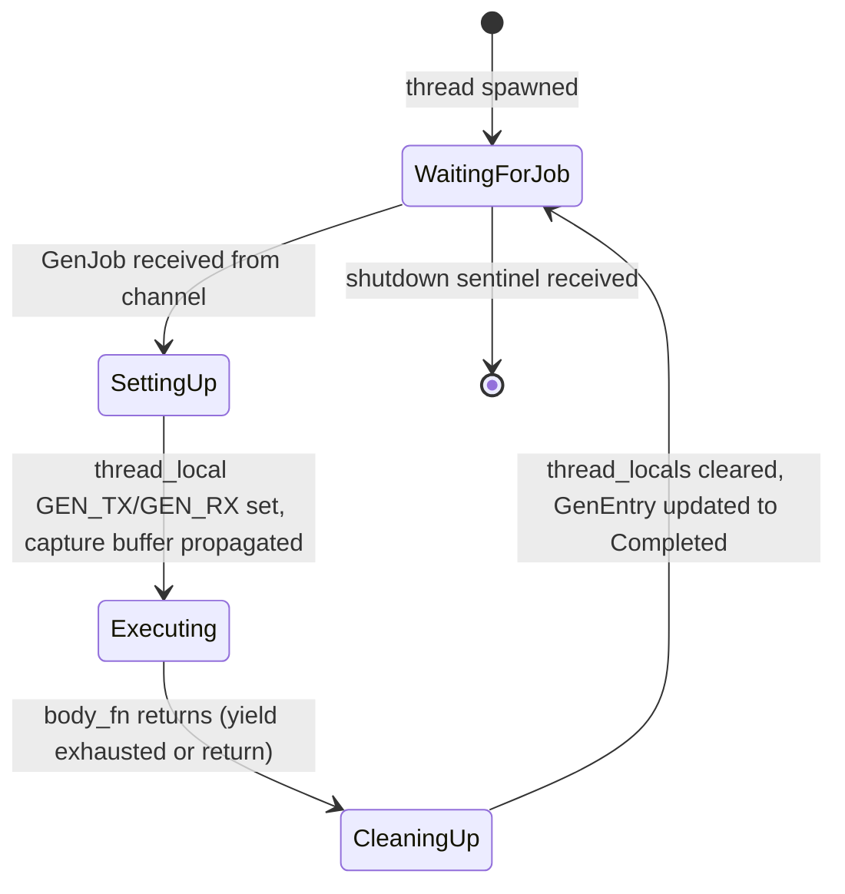
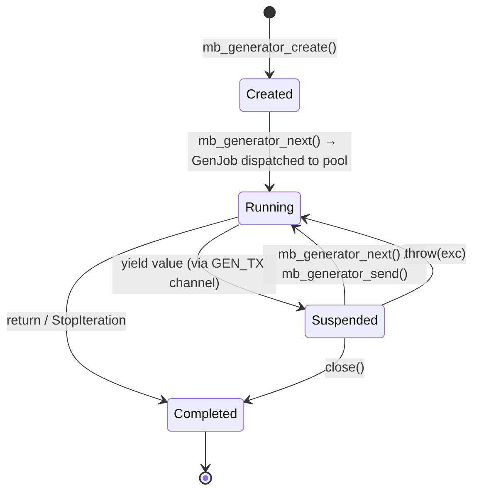

# Generator Thread Pool Design

## Overview

Replace per-generator `thread::spawn` in `generator.rs` with a lazy-initialized pool of 2–4 long-lived worker threads (`GenPool`). After ~130 sequential generator thread spawn/join cycles on macOS aarch64, cumulative pthread lifecycle operations corrupt process state, causing EXC_BAD_ACCESS code=257 (PAC failure) when JIT-compiled code executes. Thread counts stay at 2 (threads ARE joined) and `mem::forget` of JIT modules does not help — the root cause is pthread churn, not JIT page freeing.

**Architecture**: `GenPool` is a `OnceLock<Arc<GenPoolInner>>` singleton. `GenPoolInner` holds a fixed-size vector of worker threads and a shared `crossbeam_channel::Sender<GenJob>` job queue. Each worker loops on `receiver.recv()`, setting up per-task `thread_local!` state (`GEN_TX`, `GEN_RX`, shared capture buffer) before executing the generator body closure.

**Key invariants**:
- Generator state machine (Created → Running → Suspended → Completed) is unchanged (generator.md R1–R5)
- `alloc_gen_id` switches from `thread_local! Cell<u64>` to `AtomicU64` for global uniqueness across pool workers
- Generator registry moves from `thread_local! GENERATORS` HashMap to a global `DashMap<u64, GenEntry>`, enabling `cleanup_all_generators()` to drain ALL generators regardless of creating thread
- Channel endpoints (`SyncSender`/`Receiver`) stored in global registry alongside generator state
- `cleanup_all_generators()` drains global registry, sends shutdown sentinel to pool workers, joins all worker threads — guaranteeing no worker is executing JIT code when `CraneliftJitBackend` drops
- Pool supports concurrent generators (nested comprehensions like `[[j for j in range(3)] for i in range(3)]`) — workers execute independently, communicating via per-generator channels

Follows thread-safe runtime spec patterns: `OnceLock<Arc<...>>` init (R5), `AtomicU64` counters (R7), No-GIL design (R3).

Issue: #1114
## Requirements

| ID | Title | Priority | Acceptance Criteria |
|----|-------|----------|---------------------|
| R1 | GenPool singleton with lazy initialization | P0 | `GEN_POOL: OnceLock<Arc<GenPoolInner>>` initialized on first `mb_generator_create()` call. Pool creates 2–4 worker threads. No overhead for tests that don't use generators |
| R2 | Worker thread job loop | P0 | Each worker loops on `crossbeam_channel::Receiver<GenJob>::recv()`. Per-job: sets `thread_local! GEN_TX`/`GEN_RX` to job-provided channel endpoints, sets shared capture buffer, calls `body_fn(args)`, clears thread-locals after completion |
| R3 | Global generator registry | P0 | Replace `thread_local! GENERATORS: RefCell<HashMap<u64, ThreadedGen>>` with `static GENERATOR_REGISTRY: LazyLock<DashMap<u64, GenEntry>>`. All generator lookups (`mb_generator_next`, `mb_generator_send`, `mb_generator_yield_value`) use global registry. Enables cleanup from any thread |
| R4 | Atomic generator ID allocation | P0 | Replace `thread_local! Cell<u64>` counter with `static NEXT_GEN_ID: AtomicU64`. `alloc_gen_id()` uses `fetch_add(1, Ordering::Relaxed)`. Guarantees unique IDs across pool workers |
| R5 | Global channel registry | P0 | Replace `thread_local! PENDING_CHANNELS` with entries in `GENERATOR_REGISTRY`. Each `GenEntry` stores `SyncSender`/`Receiver` endpoints alongside `GeneratorState`. Any thread can route send/throw/next to the correct generator |
| R6 | cleanup_all_generators() drains global state | P0 | Iterates `GENERATOR_REGISTRY`, drops all entries (closing channels, which unblocks workers waiting on recv). Sends shutdown sentinel via job channel. Joins all pool worker threads. Must complete before `CraneliftJitBackend` drops |
| R7 | mb_* extern C signatures unchanged | P1 | `mb_generator_create`, `mb_generator_next`, `mb_generator_send`, `mb_generator_yield_value` keep same `extern "C"` signatures. JIT symbol table wiring unchanged |
| R8 | Concurrent generators within single test | P1 | Multiple generators (e.g., nested list comprehensions) execute concurrently on different pool workers. Workers are independent — no shared mutable state between concurrent generator executions except through channel protocol |
| R9 | GC-compatible pool design | P2 | Pool workers do not block future STW GC safepoint integration. Worker threads are joinable (not detached). Generator args are cloned per-worker (no shared MbValue mutation). Design does not preclude adding safepoint checks at yield/resume points |

### Constraints

- Generator state machine semantics (generator.md R1–R5) are unchanged — this is purely an implementation-level threading change
- Pool size fixed at compile time or config constant (2–4 threads); no dynamic scaling
- `thread_local! GEN_TX`/`GEN_RX` pattern preserved within worker threads — only the scope of setup changes (per-job instead of per-thread lifetime)
- `cleanup_all_generators()` → pool shutdown is the synchronization barrier for JIT memory safety
## Scenarios

### S1: Generator stress test — 200+ iterations without crash (R1, R2, R6)

**GIVEN** a test that creates 200+ generators sequentially (each yields once and completes)
**WHEN** executed on macOS aarch64 with JIT backend
**THEN** all generators complete without SIGBUS/SIGSEGV/EXC_BAD_ACCESS; pool reuses the same 2–4 worker threads throughout

### S2: Basic generator yield/next through pool (R1, R2, R3, R7)

**GIVEN** `def gen(): yield 1; yield 2; yield 3`
**WHEN** `list(gen())` is called with pool-dispatched execution
**THEN** returns `[1, 2, 3]`; generator state transitions Created→Running→Suspended→Running→Suspended→Running→Completed occur correctly via global registry

### S3: Generator send/throw through pool (R3, R5, R7)

**GIVEN** `def echo(): while True: v = yield; print(v)`
**WHEN** `g = echo(); next(g); g.send('hello')` executes with generator channels in global registry
**THEN** prints 'hello'; channel endpoints found via `GENERATOR_REGISTRY` regardless of caller thread

### S4: Nested list comprehension — concurrent generators (R1, R8)

**GIVEN** `[[j for j in range(3)] for i in range(3)]` — outer comprehension spawns inner comprehension generators
**WHEN** executed with GenPool (2+ workers)
**THEN** inner and outer generators run on separate pool workers concurrently; result is `[[0, 1, 2], [0, 1, 2], [0, 1, 2]]`; no deadlock from pool exhaustion

### S5: cleanup_all_generators() joins pool before JIT drop (R6)

**GIVEN** a conformance test that creates generators and calls `cleanup_all_generators()` before dropping `CraneliftJitBackend`
**WHEN** cleanup executes
**THEN** all generator registry entries are drained, shutdown sentinels sent to workers, all worker threads joined; no worker is executing JIT code when the backend drops

### S6: Lazy pool initialization — no overhead for non-generator tests (R1)

**GIVEN** a conformance test that does not use generators (e.g., `print('hello')`)
**WHEN** test completes
**THEN** `GEN_POOL` OnceLock is never initialized; no worker threads are spawned; `cleanup_all_generators()` is a no-op

### S7: Unique generator IDs across concurrent workers (R4)

**GIVEN** two pool workers creating generators concurrently via `mb_generator_create()`
**WHEN** both call `alloc_gen_id()` simultaneously
**THEN** each receives a unique ID from the `AtomicU64` counter; no ID collision in `GENERATOR_REGISTRY`

### S8: Existing generator conformance fixtures pass (R7, R8)

**GIVEN** generator fixtures: `generators/basic_yield.py`, `generators/send_throw.py`, `generators/yield_from.py`
**WHEN** executed after pool refactor
**THEN** all pass with identical output; no behavioral regression
## Diagrams

### Interaction
<!-- type: interaction lang: mermaid -->
<!-- TODO -->

### Logic
<!-- type: logic lang: mermaid -->
<!-- TODO -->

### Dependencies
<!-- type: dependency lang: mermaid -->
<!-- TODO -->

### State Machine
<!-- type: state-machine lang: mermaid -->
<!-- TODO -->

### Data Model
<!-- type: db-model lang: mermaid -->
<!-- TODO -->

## API Spec

### REST API
<!-- type: rest-api lang: yaml -->
<!-- TODO -->

### RPC API
<!-- type: rpc-api lang: json -->
<!-- TODO -->

### Async API
<!-- type: async-api lang: yaml -->
<!-- TODO -->

### CLI
<!-- type: cli lang: yaml -->
<!-- TODO -->

### Schema
<!-- type: schema lang: json -->
<!-- TODO -->

### Config
<!-- type: config lang: json -->
<!-- TODO -->

## Test Plan

| Test | Type | Covers | Description |
|------|------|--------|-------------|
| `test_generator_stress_200_iterations` | integration | S1, R1, R2 | Create 200+ generators sequentially (each yields once), verify no crash. Validates pool thread reuse eliminates pthread churn |
| `test_basic_yield_through_pool` | conformance | S2, R3, R7 | Run `generators/basic_yield.py` fixture, verify output unchanged after pool refactor |
| `test_send_throw_through_pool` | conformance | S3, R5, R7 | Run `generators/send_throw.py` fixture, verify send/throw protocol works via global registry |
| `test_nested_list_comprehension` | conformance | S4, R8 | Run `list_comprehension.py` with `[[j for j in range(3)] for i in range(3)]`, verify `[[0, 1, 2], [0, 1, 2], [0, 1, 2]]`. Remove xfail once passing |
| `test_yield_from_through_pool` | conformance | S8, R7 | Run `generators/yield_from.py` fixture, verify delegation works through pool |
| `test_cleanup_joins_all_workers` | unit | S5, R6 | Call `cleanup_all_generators()` after creating generators; assert pool workers are joined (no dangling threads). Verify `GENERATOR_REGISTRY` is empty after cleanup |
| `test_no_pool_for_non_generator_test` | unit | S6, R1 | Run a test with no generators; assert `GEN_POOL` OnceLock is not initialized |
| `test_unique_gen_ids_concurrent` | unit | S7, R4 | Spawn 10 threads each calling `alloc_gen_id()` 100 times; collect all IDs; assert no duplicates |
| `test_multi_threaded_conformance_suite` | integration | S1, S8, R6 | Run full conformance suite with `cargo test -p mamba --test conformance_tests` (default multi-threaded); verify no SIGBUS on aarch64 |

### Regression watchlist

- All existing generator conformance fixtures must pass unchanged
- `--test-threads=1` mode must still work (single-threaded = one worker active at a time, no contention)
- GC tests (`gc.rs`) must not be affected — pool workers don't interact with GC state in this change
## Changes

```yaml
files:
  - path: crates/mamba/src/runtime/generator.rs
    action: MODIFY
    desc: |
      Major refactor — replace per-generator thread::spawn with GenPool.

      Remove:
      - thread_local! GENERATORS: RefCell<HashMap<u64, ThreadedGen>>
      - thread_local! PENDING_CHANNELS: RefCell<HashMap<u64, ...>>
      - thread_local! Cell<u64> gen_id counter
      - thread::spawn in ensure_started()

      Add:
      - static GEN_POOL: OnceLock<Arc<GenPoolInner>>
      - static GENERATOR_REGISTRY: LazyLock<DashMap<u64, GenEntry>>
      - static NEXT_GEN_ID: AtomicU64
      - struct GenPoolInner { workers: Vec<JoinHandle<()>>, sender: crossbeam_channel::Sender<GenJob> }
      - struct GenJob { gen_id: u64, body_fn: u64, args: Vec<MbValue>, tx: SyncSender<MbValue>, rx: Receiver<MbValue>, capture: Option<Arc<Mutex<SharedCapture>>> }
      - struct GenEntry { state: GeneratorState, tx: SyncSender<MbValue>, rx: Receiver<MbValue> }
      - fn init_pool() -> Arc<GenPoolInner> — spawns 2-4 worker threads, each looping on receiver.recv()
      - Worker loop: recv GenJob → set thread_local GEN_TX/GEN_RX/SHARED_CAPTURE → call body_fn(args) → clear thread_locals → update GenEntry state to Completed

      Modify:
      - alloc_gen_id(): NEXT_GEN_ID.fetch_add(1, Ordering::Relaxed)
      - mb_generator_create(): GEN_POOL.get_or_init(init_pool); insert GenEntry into GENERATOR_REGISTRY
      - ensure_started(): send GenJob to pool via GEN_POOL sender (instead of thread::spawn)
      - mb_generator_next/send/yield_value: lookup via GENERATOR_REGISTRY (instead of thread_local GENERATORS)
      - cleanup_all_generators(): drain GENERATOR_REGISTRY, send shutdown sentinels, join all pool workers

  - path: crates/mamba/src/conformance/mod.rs
    action: MODIFY
    desc: |
      No changes to cleanup_all_generators() call site — it already calls the function before
      CraneliftJitBackend drops. The function's internal behavior changes (global registry drain +
      pool shutdown) but the call site remains identical.

  - path: crates/mamba/Cargo.toml
    action: MODIFY
    desc: |
      Add dependencies:
      - crossbeam-channel (for bounded/unbounded MPMC job queue)
      - dashmap (for concurrent generator registry)
      Both are already used elsewhere in cclab workspace.
```
## Wireframe
<!-- type: wireframe lang: yaml -->

<!-- TODO -->

## Component
<!-- type: component lang: json -->

<!-- TODO -->

## Design Token
<!-- type: design-token lang: json -->

<!-- TODO -->

## Doc
<!-- type: doc lang: markdown -->

<!-- TODO -->


## State Machine

### GenPool Lifecycle

```mermaid
stateDiagram-v2
    [*] --> Uninitialized: process start

    Uninitialized --> Active: first mb_generator_create() → OnceLock::get_or_init()
    note right of Active: 2-4 worker threads spawned,\njob channel created

    state Active {
        Idle --> Processing: GenJob received via channel
        Processing --> Idle: body_fn completes, thread-locals cleared
    }

    Active --> ShuttingDown: cleanup_all_generators() called
    ShuttingDown --> Joined: shutdown sentinels sent, workers joined
    Joined --> [*]: pool dropped
```

### Worker Thread Per-Job Lifecycle



### Generator State (unchanged from generator.md)



# Reviews
