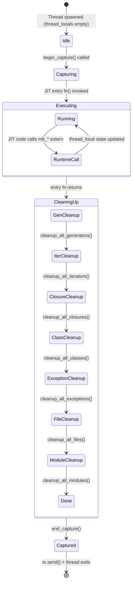

# Sigbus Runtime Thread Safety Fix

## Overview

The Mamba runtime stores per-execution state in 20+ `thread_local!` statics across `closure.rs` (CLOSURES, CELLS, GLOBAL_NAMESPACE), `generator.rs` (GENERATORS, GEN_TX, GEN_CAPTURE_BUF, PENDING_CHANNELS, LAST_STOP_VALUE), `class.rs` (CLASS_REGISTRY, LAST_RAISED_INSTANCE, ABSTRACT_METHODS), `exception.rs` (CURRENT_EXCEPTION, EXCEPTION_HANDLERS), `iter.rs` (ITERATORS), `file_io.rs` (FILES), `module.rs` (MODULES), and `output.rs` (CAPTURE_BUF). The conformance runner (`run_and_capture`) spawns a new OS thread per test for JIT execution but only calls `cleanup_all_generators()` after entry returns — closures, classes, iterators, exceptions, file handles, and modules are never explicitly cleaned up.

While `thread::spawn` creates fresh thread_local state per thread and drops it on exit, the lack of explicit cleanup means: (1) accumulated runtime objects (open file handles, registered classes, closures) remain alive for the full execution duration with no deterministic teardown order, (2) generator cleanup may reference stale closure/iterator state if cleanup ordering is wrong, and (3) the pattern is not safe if execution ever moves to a thread pool.

Fix: add per-module `cleanup_*()` functions that reset each thread_local to its default state. Add a centralized `cleanup_all_runtime_state()` entry point that calls them in safe dependency order (generators first, then iterators, closures, classes, exceptions, files, modules). Update `run_and_capture()` to call `cleanup_all_runtime_state()` instead of only `cleanup_all_generators()`. This complements the `JIT_LOCK` serialization (sigbus-jit-concurrency-fix) by ensuring each test's runtime context is fully torn down.

Issue: #1114
## Requirements

| ID | Title | Priority | Acceptance Criteria |
|----|-------|----------|---------------------|
| R1 | Per-module cleanup functions | P0 | Each runtime module with thread_local! state exports a public `cleanup_*()` function that resets its thread_local statics to default: `cleanup_all_closures()` (closure.rs), `cleanup_all_classes()` (class.rs), `cleanup_all_iterators()` (iter.rs), `cleanup_all_exceptions()` (exception.rs), `cleanup_all_files()` (file_io.rs), `cleanup_all_modules()` (module.rs). Each function clears/resets its thread_local HashMap/Vec/Option to empty state |
| R2 | Centralized runtime cleanup entry point | P0 | A `cleanup_all_runtime_state()` function exists in a `runtime/cleanup.rs` module (or `runtime/mod.rs`) that calls all per-module cleanup functions in safe dependency order: generators → iterators → closures → classes → exceptions → files → modules. Single call site for all runtime teardown |
| R3 | Conformance runner calls full cleanup | P0 | `run_and_capture()` calls `cleanup_all_runtime_state()` instead of only `cleanup_all_generators()`. Cleanup runs after JIT entry returns and before `end_capture()`, in the spawned execution thread |
| R4 | Cleanup is panic-safe | P1 | Each per-module cleanup function catches panics (or uses `RefCell::try_borrow_mut`) so a failure in one module's cleanup does not prevent other modules from being cleaned up. `cleanup_all_runtime_state()` calls each cleanup in sequence, not short-circuiting on error |
| R5 | Deterministic cleanup ordering | P1 | Generators are cleaned up first (they may hold references to closures/iterators). Iterators second (they may reference collections). Then closures, classes, exceptions, files, modules. This ordering prevents use-after-cleanup of cross-module references |

### Constraints

- Cleanup functions only reset thread_local! state — they do not touch global synchronized state (GC, symbol table)
- File handle cleanup must call `drop()` / close on any open `MbFile` handles to avoid fd leaks
- Generator cleanup (`cleanup_all_generators()`) already exists — it is reused, not reimplemented
- This spec does NOT migrate thread_local! to global state — that is the scope of the main thread-safe-runtime spec (R5, R6, R7)
- Cleanup functions are `pub(crate)` — not part of the public API
## Scenarios

### S1: Full runtime cleanup after conformance test execution (R2, R3)

**GIVEN** a conformance test that creates closures, classes, iterators, and generators during execution
**WHEN** the JIT entry function returns in the spawned thread
**THEN** `cleanup_all_runtime_state()` resets all thread_local statics — CLOSURES, CELLS, GLOBAL_NAMESPACE, CLASS_REGISTRY, ITERATORS, GENERATORS, CURRENT_EXCEPTION, EXCEPTION_HANDLERS, FILES, MODULES are all empty after cleanup

### S2: Cleanup ordering prevents use-after-free (R5)

**GIVEN** a test where a generator holds a reference to a closure, and the closure holds a reference to an iterator
**WHEN** `cleanup_all_runtime_state()` runs
**THEN** generators are cleaned up first (releasing closure references), then iterators, then closures — no cleanup function accesses already-cleared state from another module

### S3: File handles are closed during cleanup (R1, R5)

**GIVEN** a test that opens files via `open()` and does not explicitly close them
**WHEN** `cleanup_all_files()` runs as part of `cleanup_all_runtime_state()`
**THEN** all `MbFile` handles in the FILES thread_local are dropped/closed, releasing file descriptors

### S4: Cleanup is panic-safe (R4)

**GIVEN** a test where one module's thread_local state is in an inconsistent state (e.g., a RefCell is already borrowed)
**WHEN** `cleanup_all_runtime_state()` attempts to clean that module
**THEN** the cleanup for that module is skipped (via `try_borrow_mut` or panic catch), and subsequent modules are still cleaned up successfully

### S5: Conformance runner uses centralized cleanup (R3)

**GIVEN** the spawned thread in `run_and_capture()`
**WHEN** execution completes (success or panic recovery)
**THEN** `cleanup_all_runtime_state()` is called instead of `cleanup_all_generators()` — the old call is replaced, not duplicated

### S6: Multi-threaded conformance passes with runtime cleanup (R2, R3)

**GIVEN** `cargo test -p mamba --test conformance_tests` with default thread count
**WHEN** combined with JIT_LOCK serialization (sigbus-jit-concurrency-fix)
**THEN** each test's runtime state is fully torn down before the next test starts; no SIGBUS, no state leakage between tests
## Diagrams

### Interaction
<!-- type: interaction lang: mermaid -->
<!-- TODO -->

### Logic
<!-- type: logic lang: mermaid -->
<!-- TODO -->

### Dependencies
<!-- type: dependency lang: mermaid -->
<!-- TODO -->

### State Machine
<!-- type: state-machine lang: mermaid -->
<!-- TODO -->

### Data Model
<!-- type: db-model lang: mermaid -->
<!-- TODO -->

## API Spec

### REST API
<!-- type: rest-api lang: yaml -->
<!-- TODO -->

### RPC API
<!-- type: rpc-api lang: json -->
<!-- TODO -->

### Async API
<!-- type: async-api lang: yaml -->
<!-- TODO -->

### CLI
<!-- type: cli lang: yaml -->
<!-- TODO -->

### Schema
<!-- type: schema lang: json -->
<!-- TODO -->

### Config
<!-- type: config lang: json -->
<!-- TODO -->

## Test Plan
<!-- type: test-plan lang: markdown -->

<!-- TODO -->

## Changes

```yaml
files:
  - path: crates/mamba/src/runtime/closure.rs
    action: MODIFY
    desc: "Add `pub(crate) fn cleanup_all_closures()` that clears CLOSURES, CELLS, and GLOBAL_NAMESPACE thread_locals. Use `CLOSURES.with(|c| c.try_borrow_mut().map(|mut m| m.clear()))` pattern (try_borrow_mut for panic safety). Same for CELLS and GLOBAL_NAMESPACE."
  - path: crates/mamba/src/runtime/class.rs
    action: MODIFY
    desc: "Add `pub(crate) fn cleanup_all_classes()` that clears CLASS_REGISTRY, LAST_RAISED_INSTANCE, and ABSTRACT_METHODS thread_locals. CLASS_REGISTRY and ABSTRACT_METHODS: clear HashMap. LAST_RAISED_INSTANCE: set to None."
  - path: crates/mamba/src/runtime/iter.rs
    action: MODIFY
    desc: "Add `pub(crate) fn cleanup_all_iterators()` that clears the ITERATORS thread_local HashMap."
  - path: crates/mamba/src/runtime/exception.rs
    action: MODIFY
    desc: "Add `pub(crate) fn cleanup_all_exceptions()` that sets CURRENT_EXCEPTION to None and clears EXCEPTION_HANDLERS Vec."
  - path: crates/mamba/src/runtime/file_io.rs
    action: MODIFY
    desc: "Add `pub(crate) fn cleanup_all_files()` that drains the FILES thread_local HashMap (dropping MbFile handles which closes fds) and clears it."
  - path: crates/mamba/src/runtime/module.rs
    action: MODIFY
    desc: "Add `pub(crate) fn cleanup_all_modules()` that clears the MODULES thread_local HashMap."
  - path: crates/mamba/src/runtime/mod.rs
    action: MODIFY
    desc: "Add `pub(crate) fn cleanup_all_runtime_state()` that calls cleanup functions in dependency order: cleanup_all_generators() (generator.rs, already exists), cleanup_all_iterators(), cleanup_all_closures(), cleanup_all_classes(), cleanup_all_exceptions(), cleanup_all_files(), cleanup_all_modules(). Each call is independent — no short-circuit on individual failure."
  - path: crates/mamba/src/conformance/mod.rs
    action: MODIFY
    desc: "In `run_and_capture()`'s spawned thread, replace `cleanup_all_generators()` with `crate::runtime::cleanup_all_runtime_state()`. The call site remains between JIT entry return and `end_capture(prev)`. Update the import from `use crate::runtime::generator::cleanup_all_generators` to `use crate::runtime::cleanup_all_runtime_state`."
```
## Wireframe
<!-- type: wireframe lang: yaml -->

<!-- TODO -->

## Component
<!-- type: component lang: json -->

<!-- TODO -->

## Design Token
<!-- type: design-token lang: json -->

<!-- TODO -->

## Doc
<!-- type: doc lang: markdown -->

<!-- TODO -->


## State Machine



# Reviews
