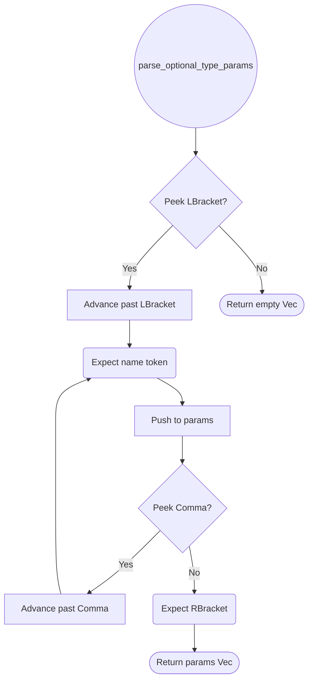

# Statement Parsing

## Overview

This change modifies the compound statement parsing logic in R2 to fix issue #1112: dict/set literals (`{}`, `{1,2}`) inside `try` block bodies trigger a parse error.

### Bug

| Input | Expected | Actual |
|-------|----------|--------|
| `try:\n    d = {}['x']\nexcept KeyError:\n    pass` | Parses as `Try` with `Assign` body | Parse error on `{` |
| `try:\n    s = {1,2}.remove(99)\nexcept KeyError:\n    pass` | Parses as `Try` with `Assign` body | Parse error on `{` |

### Root Cause

The `{` token (LBrace) inside a try block body is mishandled during parsing. The parser or its interaction with the IndentProcessor's `paren_depth` tracking (which increments on `{` for implicit line continuation) causes the block structure to be corrupted when `{` appears as part of an expression inside compound statement bodies.

### Scope

- **Affected**: `parse_try` in `stmt_compound.rs`, `parse_block` in `stmt.rs` — compound statement body parsing when expressions contain brace-delimited literals
- **Not affected**: Single-line suites, other compound statements only if they share the same `parse_block` code path
## Requirements

### R1 - Simple Statement Parsing

```yaml
id: R1
priority: high
```

`parse_stmt()` dispatches on the leading token. Simple statements parsed in `stmt.rs`:

| Statement     | Syntax                        | Token Trigger |
|---------------|-------------------------------|---------------|
| Return        | `return expr`                 | `return`      |
| Import        | `import a.b.c`                | `import`      |
| From-Import   | `from a import b, c as d`     | `from`        |
| Pass          | `pass`                        | `pass`        |
| Break         | `break`                       | `break`       |
| Continue      | `continue`                    | `continue`    |
| VarDecl       | `x: int = 42`                 | ident + `:`   |
| Assign        | `x = expr` / `a, b = expr`   | ident + `=`   |
| AugAssign     | `x += expr`                   | ident + op=   |
| ExprStmt      | bare expression               | fallthrough   |

`parse_ident_stmt()` handles the ambiguous leading-expression case by parsing an expression first, then checking for `:` (var decl), `,` (tuple unpack), augmented assignment operators, or `=` (assignment). Chained assignment (`a = b = val`) is supported.

`parse_from_import()` handles relative imports (`from . import x`, `from .foo import bar`), wildcard (`from x import *`), parenthesized imports, and `as` aliases.

### R2 - Compound Statement Parsing

```yaml
id: R2
priority: high
```

Compound statements parsed in `stmt_compound.rs`:

| Statement      | Key Syntax                                  |
|----------------|---------------------------------------------|
| `if`           | `if cond: body elif cond: body else: body`  |
| `while`        | `while cond: body else: body`               |
| `for`          | `for a, b in iter: body else: body`         |
| `try`          | `try: body except E as e: body else: body finally: body` |
| `with`         | `with expr as name, expr2: body`            |
| `match`        | `match expr: case Pattern if guard: body`   |
| `class`        | `class C[T](Base): body`                    |
| `enum`         | `enum E: Variant(field: T)`                 |

`parse_block()` handles both single-line suites (`if x: pass`) and indented blocks (expect `INDENT`, collect statements until `DEDENT`). `for` and `while` support optional `else` clauses.

### R3 - Function and Class Definition Parsing with Decorators

```yaml
id: R3
priority: high
```

`parse_decorated()` collects `@decorator` expressions (parsing the expr after `@`), then dispatches to `parse_fn_def`, `parse_async_fn_def`, or `parse_class_def`.

Function definition parsing (`parse_fn_def`, `parse_async_fn_def`):
1. Consume `def` (and optional preceding `async`).
2. Parse function name via `expect_name`.
3. Parse optional type params via `parse_optional_type_params`.
4. Parse `(params)` via `parse_params` -- supports `self`, `*args`, `**kwargs`, `/` separator, bare `*`, default values, and optional type annotations.
5. Parse optional return type after `->`.
6. Parse body after `:`.

Class definition parsing (`parse_class_def`):
1. Consume `class`, parse name and optional type params.
2. Parse optional `(bases)` with keyword args skipped.
3. Parse body after `:`.

### R4 - PEP 695 Generic Syntax Parsing

```yaml
id: R4
priority: high
```

`parse_optional_type_params()` checks for `[`, then collects comma-separated identifiers until `]`:

- `def f[T](x: T) -> T:` -- `FnDef.type_params = ["T"]`
- `class Stack[T]:` -- `ClassDef.type_params = ["T"]`
- `type Alias[T] = list[T]` -- `TypeAlias.type_params = ["T"]`
- `enum Either[L, R]:` -- `EnumDef.type_params = ["L", "R"]`

### R5 - Soft Keyword Disambiguation

```yaml
id: R5
priority: medium
```

`match`, `type`, and `enum` are soft keywords that can also be used as identifiers. The parser uses lookahead to disambiguate:

- `type`: statement if followed by a name token; otherwise expression (`type(x)`).
- `match`: statement unless followed by `=`, `.`, `(`, or `,`.
- `enum`: statement if followed by a name token; otherwise expression.

`is_name_token()` allows `int`, `float`, `bool`, `str`, `list`, `dict`, `tuple`, `type`, `match`, `enum`, and `self` to be used as names in parameter lists, attributes, and imports.

## Acceptance Criteria

### Scenario: Parse If/Elif/Else

- **WHEN** `if a: x elif b: y else: z` is parsed (conceptually, across lines).
- **THEN** `If { condition: a, body: [x], elif_clauses: [(b, [y])], else_body: Some([z]) }`.

### Scenario: Parse Try/Except/Finally

- **WHEN** `try: f() except ValueError as e: handle(e) finally: cleanup()` is parsed.
- **THEN** `Try { body: [f()], handlers: [ExceptHandler { exc_type: ValueError, name: "e", body: [handle(e)] }], finally_body: Some([cleanup()]) }`.

### Scenario: Decorated Async Def with Type Params

- **WHEN** the following is parsed:
  ```
  @decorator
  async def process[T](data: T) -> T:
      return data
  ```
- **THEN** `AsyncFnDef { decorators: [Ident("decorator")], name: "process", type_params: ["T"], params: [Param("data", Named("T"))], return_ty: Named("T") }`.

### Scenario: Type Alias with Generics

- **WHEN** `type Result[T] = T | None` is parsed.
- **THEN** `TypeAlias { name: "Result", type_params: ["T"], value: Union([Named("T"), Named("None")]) }`.

### Scenario: From-Import with Alias

- **WHEN** `from os.path import join as pjoin, exists` is parsed.
- **THEN** `Import { module: ["os", "path"], names: Some([("join", Some("pjoin")), ("exists", None)]) }`.

## Diagrams

### Statement Dispatch

```mermaid
flowchart LR
    Start([parse_stmt]) --> Dispatch{token kind}
    Dispatch -->|@| parse_decorated
    Dispatch -->|def| parse_fn_def
    Dispatch -->|async| parse_async_stmt
    Dispatch -->|class| parse_class_def
    Dispatch -->|if/while/for| control_flow[parse_if/while/for]
    Dispatch -->|match/try/with| compound[parse_match/try/with]
    Dispatch -->|return/raise| simple[parse_return/raise]
    Dispatch -->|type/enum| soft_kw[lookahead disambiguation]
    Dispatch -->|other| parse_ident_stmt
```

### Type Parameters Parsing Flow




## Changes

```yaml
files:
  - path: crates/mamba/src/parser/stmt.rs
    action: MODIFY
    desc: |
      Fix `parse_block()` to correctly handle statements containing brace-delimited
      expressions (`{}`, `{1,2}`, `{k: v}`) inside compound statement bodies.
      The block termination logic (DEDENT/EOF check loop) must not be disrupted
      by LBrace tokens that are part of dict/set literal expressions within
      the block's statements. Ensure `parse_stmt()` dispatch correctly routes
      LBrace-leading expression statements through `parse_ident_stmt()`.
    reqs: [R2]

  - path: crates/mamba/src/parser/stmt_compound.rs
    action: MODIFY
    desc: |
      Fix `parse_try()` to correctly parse try blocks whose body contains
      dict/set literal expressions. The issue manifests when `parse_block()`
      is called for the try body and encounters `{` as part of an expression
      (e.g., `d = {}['x']` or `s = {1,2}.remove(99)`). Ensure the parser
      correctly delegates to the expression parser for brace expressions
      and does not confuse `{` with block-level syntax.

      Add test cases:
      1. `try: d = {}['x'] except KeyError: pass` — empty dict subscript in try body
      2. `try: s = {1,2}.remove(99) except KeyError: pass` — set method call in try body
      3. `try: x = {'a': 1}['a'] except: pass` — dict literal subscript in try body
      4. `try: {}  except: pass` — bare empty dict expression statement in try body
    reqs: [R2]
```

### Acceptance Criteria (New)

| ID | Input | Expected AST |
|----|-------|--------------|
| S-TRY-DICT-1 | `try:\n    d = {}['x']\nexcept KeyError:\n    pass` | `Try { body: [Assign { target: d, value: Subscript(DictLit([]), 'x') }], handlers: [ExceptHandler { exc_type: KeyError }] }` |
| S-TRY-DICT-2 | `try:\n    s = {1,2}.remove(99)\nexcept KeyError:\n    pass` | `Try { body: [Assign { target: s, value: MethodCall(SetLit([1,2]), 'remove', [99]) }], handlers: [ExceptHandler { exc_type: KeyError }] }` |
| S-TRY-DICT-3 | `try:\n    x = {'a': 1}['a']\nexcept:\n    pass` | `Try { body: [Assign { target: x, value: Subscript(DictLit([('a',1)]), 'a') }], handlers: [ExceptHandler { bare }] }` |
| S-TRY-DICT-4 | `if True:\n    d = {}\n    print(d)` | `If { body: [Assign { target: d, value: DictLit([]) }, ExprStmt(Call(print, [d]))] }` |

# Reviews
