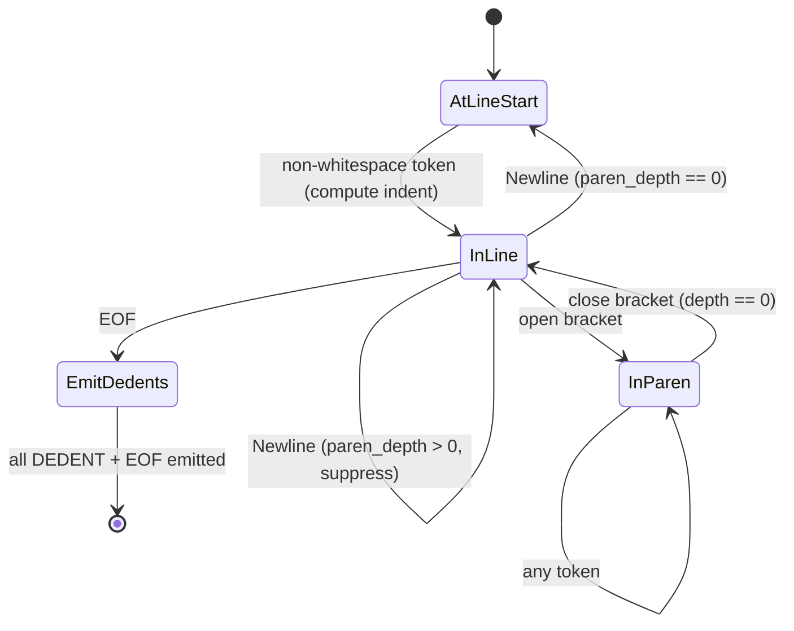

# Tokens and Indentation

## Overview

This specification defines the Mamba lexer, which transforms source text into a token stream suitable for parsing. The lexer uses the `logos` crate for high-performance regex-based tokenization, then applies an `IndentProcessor` post-pass to inject synthetic `INDENT`/`DEDENT` tokens for Python-style significant whitespace.

## Requirements

### R1 - Tokenization of Python 3.12 Syntax

```yaml
id: R1
priority: high
```

The lexer must recognize all Python 3.12 token kinds via `TokenKind` (derived with `logos::Logos`):

| Category      | Tokens                                                                 |
|---------------|------------------------------------------------------------------------|
| Keywords      | `def`, `return`, `if`, `elif`, `else`, `while`, `for`, `in`, `class`, `enum`, `match`, `case`, `import`, `from`, `as`, `and`, `or`, `not`, `True`, `False`, `None`, `pass`, `break`, `continue`, `self`, `try`, `except`, `finally`, `raise`, `with`, `async`, `await`, `yield`, `lambda`, `del`, `assert`, `global`, `nonlocal`, `is`, `type` |
| Type keywords | `int`, `float`, `bool`, `str`, `list`, `dict`, `tuple`                |
| Literals      | `Int(i64)`, `Float(f64)`, `Complex(f64)`, `Str`, `TripleStr`, `FStr`, `RawStr`, `ByteStr`, `Ellipsis` |
| Operators     | `+`, `-`, `*`, `/`, `//`, `%`, `**`, `=`, `==`, `!=`, `<`, `>`, `<=`, `>=`, `->`, `\|`, `?`, `+=`, `-=`, `*=`, `/=`, `//=`, `%=`, `**=`, `&`, `^`, `~`, `<<`, `>>`, `&=`, `\|=`, `^=`, `<<=`, `>>=`, `:=`, `@`, `@=` |
| Delimiters    | `(`, `)`, `[`, `]`, `{`, `}`, `:`, `,`, `.`, `;`                      |
| Synthetic     | `Indent`, `Dedent`, `Eof`, `Newline`, `Comment`, `Ident`              |

The `Token` struct stores `kind: TokenKind`, `start: u32`, `end: u32` (byte offsets). Integer literals support hex (`0x`), octal (`0o`), binary (`0b`), and underscore separators. Float literals support scientific notation (`1e10`).

### R2 - INDENT/DEDENT Generation

```yaml
id: R2
priority: high
```

The `IndentProcessor` converts raw tokens into an indentation-aware stream:

1. Maintains an `indent_stack` (initialized to `[0]`) and `paren_depth` counter.
2. Newlines inside parentheses/brackets/braces are suppressed (implicit line continuation).
3. At each line start (first non-whitespace token after a newline), computes the indent level as the column offset from the preceding newline.
4. If indent > current top: push level, emit `INDENT`.
5. If indent < current top: pop levels and emit `DEDENT` for each until the stack matches.
6. At EOF, emit remaining `DEDENT` tokens to close all open blocks, then emit `EOF`.
7. Comments are stripped entirely from the output.

### R3 - PEP 701 f-string Lexing

```yaml
id: R3
priority: medium
```

F-strings are lexed as a single `FStr(String)` token containing the raw content between `f"` and `"` (or `f'` and `'`). The lexer captures the template text including `{expr}` placeholders as-is. The parser is responsible for splitting the content into literal and expression parts. Both single and double quote delimiters are supported.

### R4 - String Literal Lexing

```yaml
id: R4
priority: high
```

The lexer supports the full range of Python string literal forms:

| Form         | Prefix | Token       | Escape Processing |
|--------------|--------|-------------|-------------------|
| Regular      | none   | `Str`       | Yes               |
| Triple-quoted| none   | `TripleStr` | Yes (multi-line)  |
| F-string     | `f`    | `FStr`      | Deferred to parser|
| Raw          | `r`    | `RawStr`    | No                |
| Byte         | `b`    | `ByteStr`   | Yes               |

Triple-quoted strings use custom callback functions (`lex_triple_dquote`, `lex_triple_squote`) that scan for the closing `"""` or `'''`, respecting backslash escapes within the body.

## Acceptance Criteria

### Scenario: Tokenize Simple Expression

- **WHEN** `lex_raw("x + 42", file_id)` is called.
- **THEN** the result contains tokens `[Ident, Plus, Int(42)]` with correct byte offsets.

### Scenario: INDENT/DEDENT from Nested Blocks

- **WHEN** the following source is lexed:
  ```
  if True:
      x = 1
      if True:
          y = 2
  ```
- **THEN** the token stream contains two `INDENT` tokens (at column 4 and column 8), and two `DEDENT` tokens at EOF to close both blocks.

### Scenario: Implicit Line Continuation

- **WHEN** the following source is lexed:
  ```
  x = (1 +
       2)
  ```
- **THEN** the newline between `1 +` and `2` does NOT produce a `Newline` token (suppressed by paren depth).

### Scenario: F-string Token

- **WHEN** `lex_raw("f\"hello {name}\"", file_id)` is called.
- **THEN** a single `FStr("hello {name}")` token is produced.

### Scenario: Triple-quoted String

- **WHEN** source containing `"""multi\nline"""` is lexed.
- **THEN** a single `TripleStr("multi\nline")` token is produced spanning the full range.

## Diagrams

### Lexer Pipeline


### IndentProcessor State Machine


