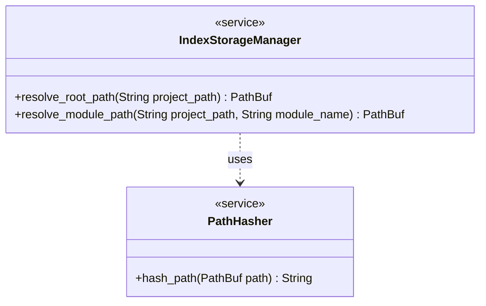

# Lens Index Storage & Resolution

## Overview

Rename the Lens index storage root from `{project_root}/.cclab/lens/` to `{project_root}/cclab/.index/`. The `.cclab/lens/` path was a hidden directory that conflicted with the project's `cclab/` convention for user-visible project metadata. The new path `cclab/.index/` aligns with the convention that `cclab/` is the project metadata root while `.index/` signals machine-generated content that should be gitignored.

| Aspect | Before | After |
|--------|--------|-------|
| Storage root | `{project_root}/.cclab/lens/` | `{project_root}/cclab/.index/` |
| Module index | `.cclab/lens/{module}.idx` | `cclab/.index/{module}.idx` |
| Daemon PID | `.cclab/lens/daemon.pid` | `cclab/.index/daemon.pid` |
| Daemon socket | `.cclab/lens/daemon.sock` | `cclab/.index/daemon.sock` |
| Cache dir | `.cclab/lens/cache/` | `cclab/.index/cache/` |
| Search index | `.cclab/lens/search_index/` | `cclab/.index/search_index/` |
| Lint rules | `.cclab/lens/rules.toml` | `cclab/.index/rules.toml` |
| .gitignore entry | `.cclab/lens/` | `cclab/.index/` |

### Affected files

| File | Scope |
|------|-------|
| `crates/cclab-sdd/src/storage.rs` | All 5 resolve functions + doc comments + all test assertions |
| `crates/cclab-sdd-cli/src/daemon.rs` | Import paths, `resolve_lens_storage` calls, error message strings |
| `crates/cclab-sdd/src/server/daemon.rs` | Doc comment referencing `.cclab/lens/daemon.sock` |
| `crates/cclab-sdd/src/search/mod.rs` | Doc comments referencing `.cclab/lens/` |
| `crates/cclab-sdd/src/lint/custom.rs` | Doc comments referencing `.cclab/lens/rules.toml` |
| `.gitignore` | Replace `.cclab/lens/` with `cclab/.index/` |
| `cclab/specs/crates/cclab-sdd/logic/lens-index-storage.md` | Update all path references in spec |
## Requirements

### R1 - Persistent Storage Path

```yaml
id: R1
priority: medium
status: draft
```

The system must resolve the persistent storage root for a project at `~/.cclab/projects/{path_hash}/lens/`, where `~` is the user's home directory.

### R2 - Path Canonicalization

```yaml
id: R2
priority: medium
status: draft
```

The project root path must be canonicalized (resolving symlinks and relative paths) before hashing to ensure that the same project always maps to the same storage location.

### R3 - Path Hashing

```yaml
id: R3
priority: medium
status: draft
```

The canonical project root path must be hashed using a stable algorithm (e.g., SHA256) to generate the `{path_hash}` segment of the storage path.

### R4 - Module Index Separation

```yaml
id: R4
priority: medium
status: draft
```

The storage structure must support separate index files or subdirectories for distinct modules defined in the project configuration, preventing conflicts in monorepos.

## Acceptance Criteria

### Scenario: Resolve New Project Path

- **WHEN** The index storage path is requested for a new project at `/user/dev/my-project`.
- **THEN** A unique SHA256 hash is generated from the canonical path and the directory `~/.cclab/projects/{hash}/lens/` is returned.

### Scenario: Resolve Existing Project Path

- **WHEN** The index storage path is requested again for the same project root.
- **THEN** The same hash and storage path are returned as the first request.

### Scenario: Module Sub-path Resolution

- **WHEN** The index path for a specific module named 'backend' is requested.
- **THEN** The returned path includes the module's identifier (e.g., `.../lens/backend.idx`).

## Diagrams

### Index Path Resolution Flow

```mermaid
flowchart TB
    start([Start: Resolve Path])
    canon[Canonicalize Project Root]
    hash[Compute SHA256 Hash]
    construct[Construct ~/.cclab/projects/{hash}/lens/]
    ensure[Ensure Directory Exists]
    end([Return PathBuf])
    start --> canon
    canon --> hash
    hash --> construct
    construct --> ensure
    ensure --> end
```

### Storage Components




## Changes

```yaml
_sdd:
  id: index-path-rename-changes
changes:
  - path: crates/cclab-sdd/src/storage.rs
    action: MODIFY
    description: "Rename .cclab/lens to cclab/.index in all path resolution functions, doc comments, and test assertions"
    targets:
      - type: function
        name: resolve_lens_storage
        change: "Replace `.join(\".cclab\").join(\"lens\")` with `.join(\"cclab\").join(\".index\")`. Update doc comment from `{project_root}/.cclab/lens/` to `{project_root}/cclab/.index/`. Update module-level doc comment similarly."
      - type: function
        name: resolve_module_index
        change: "Update doc comment from `.cclab/lens/{module_name}.idx` to `cclab/.index/{module_name}.idx`. No logic change — delegates to resolve_lens_storage."
      - type: function
        name: resolve_pid_file
        change: "Update doc comment from `.cclab/lens/daemon.pid` to `cclab/.index/daemon.pid`. No logic change."
      - type: function
        name: resolve_socket_path
        change: "Update doc comment from `.cclab/lens/daemon.sock` to `cclab/.index/daemon.sock`. No logic change."
      - type: function
        name: resolve_cache_dir
        change: "Update doc comment from `.cclab/lens/cache/` to `cclab/.index/cache/`. No logic change."
      - type: function
        name: test_resolve_lens_storage
        change: "Update assertion from `ends_with(\".cclab/lens\")` to `ends_with(\"cclab/.index\")`."
      - type: function
        name: test_resolve_module_index
        change: "Update assertion from `ends_with(\".cclab/lens/backend.idx\")` to `ends_with(\"cclab/.index/backend.idx\")`."
      - type: function
        name: test_resolve_pid_file
        change: "Update assertion from `ends_with(\".cclab/lens/daemon.pid\")` to `ends_with(\"cclab/.index/daemon.pid\")`."
      - type: function
        name: test_resolve_socket_path
        change: "Update assertion from `ends_with(\".cclab/lens/daemon.sock\")` to `ends_with(\"cclab/.index/daemon.sock\")`."
      - type: function
        name: test_resolve_cache_dir
        change: "Update assertion from `ends_with(\".cclab/lens/cache\")` to `ends_with(\"cclab/.index/cache\")`."
    do_not_touch:
      - resolve_module_index  # logic unchanged, only doc comment
      - resolve_pid_file      # logic unchanged
      - resolve_socket_path   # logic unchanged
      - resolve_cache_dir     # logic unchanged

  - path: crates/cclab-sdd-cli/src/daemon.rs
    action: MODIFY
    description: "Update storage path references and error messages from .cclab/lens to cclab/.index"
    targets:
      - type: function
        name: run_start
        change: "Update error context string from `Failed to create .cclab/lens/ directory` to `Failed to create cclab/.index/ directory`. Import paths and resolve function calls remain the same (they delegate to storage.rs)."
    do_not_touch:
      - run_stop
      - run_status
      - run_query

  - path: crates/cclab-sdd/src/server/daemon.rs
    action: MODIFY
    description: "Update doc comment for default_socket_path"
    targets:
      - type: function
        name: default_socket_path
        change: "Update doc comment from `{root}/.cclab/lens/daemon.sock` to `{root}/cclab/.index/daemon.sock`. Update fallback comment from `/tmp/cclab_lens-{hash}.sock` if applicable."

  - path: crates/cclab-sdd/src/search/mod.rs
    action: MODIFY
    description: "Update doc comments referencing .cclab/lens/ to cclab/.index/"
    targets:
      - type: function
        name: save_index
        change: "Update doc comment from `{dir}/.cclab/lens/search_index/` to `{dir}/cclab/.index/search_index/`."

  - path: crates/cclab-sdd/src/lint/custom.rs
    action: MODIFY
    description: "Update doc comments and path references from .cclab/lens/ to cclab/.index/"
    targets:
      - type: function
        name: "module doc comment"
        change: "Update all references from `.cclab/lens/rules.toml` to `cclab/.index/rules.toml` in module-level doc comments and the example block."

  - path: .gitignore
    action: MODIFY
    description: "Replace .cclab/lens/ gitignore entry with cclab/.index/"
    targets:
      - type: function
        name: "gitignore entry"
        change: "Replace line `.cclab/lens/` with `cclab/.index/`."

  - path: cclab/specs/crates/cclab-sdd/logic/lens-index-storage.md
    action: MODIFY
    description: "Update spec to reflect new cclab/.index/ storage path convention"
    section: "Overview, Requirements, Acceptance Criteria, Diagrams"
    targets:
      - type: function
        name: "Overview section"
        change: "Replace all `.cclab/lens/` references with `cclab/.index/` and update `~/.cclab/projects/{path_hash}/lens/` to `{project_root}/cclab/.index/`."
      - type: function
        name: "R1 requirement"
        change: "Update path from `~/.cclab/projects/{path_hash}/lens/` to `{project_root}/cclab/.index/`."
      - type: function
        name: "Acceptance Criteria scenarios"
        change: "Update path references from `.cclab/lens/` to `cclab/.index/` in all scenario THEN clauses."
      - type: function
        name: "Index Path Resolution Flow diagram"
        change: "Update Mermaid node text from `~/.cclab/projects/{hash}/lens/` to `{project_root}/cclab/.index/`."
```

# Reviews
