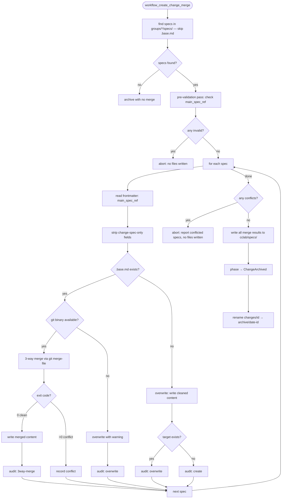

# Change Merge

## Phase Transition

```yaml
from: ChangeImplementationReviewed (all approved)
to: ChangeArchived
executor: [mainthread]
crr: false  # programmatic merge, no CRR
```

## Merge Logic

`sdd_workflow_create_change_merge` is **fully programmatic** — no agent needed.

```mermaid
flowchart TD
    Start([workflow_create_change_merge]) --> FindSpecs[find specs in changes/{id}/groups/*/specs/]
    FindSpecs --> Empty{specs found?}
    Empty -->|no| ArchiveEmpty[archive with no merge]
    Empty -->|yes| Loop[for each spec file]
    Loop --> ReadFM[read frontmatter: main_spec_ref]
    ReadFM --> UsePath[target = cclab/specs/main_spec_ref]
    UsePath --> Strip[strip change-spec-only frontmatter fields]
    Strip --> Write[write to cclab/specs/{target}]
    Write --> Loop
    Loop --> Done[all merged]
    Done --> Archive[phase → ChangeArchived]
    Archive --> Move[rename changes/{id} → archive/{date}-{id}]
```

## Frontmatter Stripping

Change-spec-only fields removed before writing to main specs:

```yaml
stripped_fields:
  - main_spec_ref      # only used for merge routing
  - merge_strategy     # only used during merge
  - create_complete    # internal marker
  - fill_sections      # internal tracking
  - filled_sections    # internal tracking
```

## Merge Strategy

From spec frontmatter `merge_strategy`:

| Strategy | Behavior |
|----------|----------|
| `new` | Create new file at `cclab/specs/{main_spec_ref}` |
| `update` | Overwrite existing file at `cclab/specs/{main_spec_ref}` |
| `extend` | Append new requirements/scenarios to existing spec at `cclab/specs/{main_spec_ref}` — preserves existing content, adds change-spec sections at the end |

## Archive

After merge:
- Phase set to `ChangeArchived`
- Tool moves change dir to `cclab/archive/{YYYYMMDD}-{change_id}` programmatically via `std::fs::rename`
- Response includes `archive_path` for caller reference

## Side Effects

| Action | STATE.yaml change |
|--------|-------------------|
| Merge all specs | Spec files written to `cclab/specs/` |
| Complete | `phase → ChangeArchived` |
| No specs to merge | `phase → ChangeArchived` (skip merge) |


## Overview

## Overview
<!-- type: overview lang: markdown -->

Add 3-way merge support to `create_change_merge` using `git merge-file`.

| Aspect | Detail |
|--------|--------|
| Target | `create_change_merge.rs` merge logic, `find_specs_to_merge()` filter, audit log |
| Current | Overwrite: change spec content replaces main spec unconditionally |
| New | 3-way merge when `.base.md` snapshot exists; fallback to overwrite when absent |
| Scope | Merge logic only — base snapshot creation is handled by `spec-prep-base-snapshot` spec |

### Current behavior

For each spec in `groups/*/specs/`, the merge tool reads `main_spec_ref` from frontmatter, strips change-spec-only fields, and overwrites `cclab/specs/{main_spec_ref}`. No conflict detection — last writer wins.

### New behavior

For each spec file during merge:

1. Check for `{spec_id}.base.md` alongside the change spec
2. If `.base.md` exists → 3-way merge:
   - **ours** = current `cclab/specs/{main_spec_ref}` (may have diverged since change started)
   - **base** = `.base.md` snapshot (state at change-init time)
   - **theirs** = cleaned change spec (frontmatter-stripped)
   - Invoke `git merge-file` on temp files, read result
   - Exit 0 → write merged content to `cclab/specs/{main_spec_ref}`
   - Exit >0 → conflict: abort entire merge, report conflicted specs
3. If no `.base.md` → fallback to current overwrite behavior (action:create or legacy changes)

### Constraints

- All-or-nothing: if any spec has conflicts, no specs are written (pre-validation pass extended)
- `find_specs_to_merge()` must skip `.base.md` files — they are merge artifacts, not content
- Audit log must distinguish `3way-merge`, `create`, `overwrite` actions
- `git` binary must be available on PATH; if not found, fall back to overwrite with warning


## Logic

## Merge Logic — 3-Way
<!-- type: logic lang: mermaid -->

Updated merge flowchart with 3-way merge branch.



### 3-way merge input mapping

| git merge-file arg | Source | Description |
|--------------------|--------|-------------|
| `ours` (file1) | `cclab/specs/{main_spec_ref}` | Current main spec on disk — may have diverged |
| `base` (file2) | `groups/{group}/specs/{spec_id}.base.md` | Snapshot taken at spec-preparation time |
| `theirs` (file3) | cleaned change spec content | Frontmatter-stripped change spec |

### Conflict handling

| Condition | Action |
|-----------|--------|
| `git merge-file` exit 0 | Clean merge — buffer result for write pass |
| `git merge-file` exit >0 | Conflict — record spec_id + conflict markers |
| Any conflicts after loop | Abort entire merge: no files written, report list |
| No conflicts | Proceed to write pass: all results written atomically |

### Audit log actions

| Action | When |
|--------|------|
| `create` | Target `cclab/specs/{main_spec_ref}` does not exist (new spec) |
| `overwrite` | Target exists, no `.base.md` (legacy/create fallback) |
| `3way-merge` | Target exists, `.base.md` present, clean merge |

### Two-pass architecture

The merge uses a **two-pass** approach for atomicity:

1. **Validation + merge pass**: iterate all specs, run 3-way merge or prepare overwrite content, collect results in memory. If any validation error or merge conflict, abort before writing.
2. **Write pass**: only reached if all specs pass. Write all results to `cclab/specs/`.


## Changes

## Changes
<!-- type: changes lang: yaml -->

```yaml
_sdd:
  id: merge-3way-changes
  refs:
    - $ref: "#merge-3way-flow"
changes:
  - path: crates/cclab-sdd/src/tools/create_change_merge.rs
    action: MODIFY
    description: "Add 3-way merge logic using git merge-file; extend two-pass architecture"
    targets:
      - type: function
        name: execute_workflow
        change: "After Strip step, check for .base.md sibling file. If present and git available, invoke git merge-file with temp files (ours=current main spec, base=.base.md, theirs=cleaned change spec). Buffer merge results. On conflict, record spec_id. After loop, abort if any conflicts. Otherwise proceed to write pass."
      - type: function
        name: merge_3way
        change: "New function: takes ours/base/theirs content strings, writes to tempdir, invokes git merge-file, returns Result<String> for clean merge or Err with conflict details"
        position: after
        anchor: execute_workflow
      - type: function
        name: find_git_binary
        change: "New function: locate git binary on PATH, return Option<PathBuf>"
        position: after
        anchor: merge_3way
    do_not_touch:
      - workflow_definition
      - build_archive_path

  - path: crates/cclab-sdd/src/workflow/helpers.rs
    action: MODIFY
    description: "Filter .base.md files from spec collection"
    targets:
      - type: function
        name: collect_spec_paths_into
        change: "Add filter: skip files ending with .base.md extension pattern"
    do_not_touch:
      - find_specs_to_merge
      - collect_spec_files
      - next_action
      - format_cli_command

  - path: crates/cclab-sdd/src/tools/create_change_merge.rs
    section: "Tests"
    action: MODIFY
    description: "Add tests for 3-way merge scenarios"
    targets:
      - type: function
        name: test_3way_merge_clean
        change: "New test: setup base + diverged main + change spec, verify clean merge produces expected content"
        position: after
        anchor: test_validation_aborts_before_write
      - type: function
        name: test_3way_merge_conflict
        change: "New test: setup conflicting content, verify merge aborts with conflict report"
        position: after
        anchor: test_3way_merge_clean
      - type: function
        name: test_base_md_skipped_by_find_specs
        change: "New test: verify .base.md files are not included in find_specs_to_merge() results"
        position: after
        anchor: test_3way_merge_conflict
      - type: function
        name: test_no_base_fallback_overwrite
        change: "New test: verify specs without .base.md use overwrite behavior (backward compat)"
        position: after
        anchor: test_base_md_skipped_by_find_specs
      - type: function
        name: test_audit_log_3way_merge
        change: "New test: verify audit log records '3way-merge' action for successful 3-way merges"
        position: after
        anchor: test_no_base_fallback_overwrite
```

# Reviews
