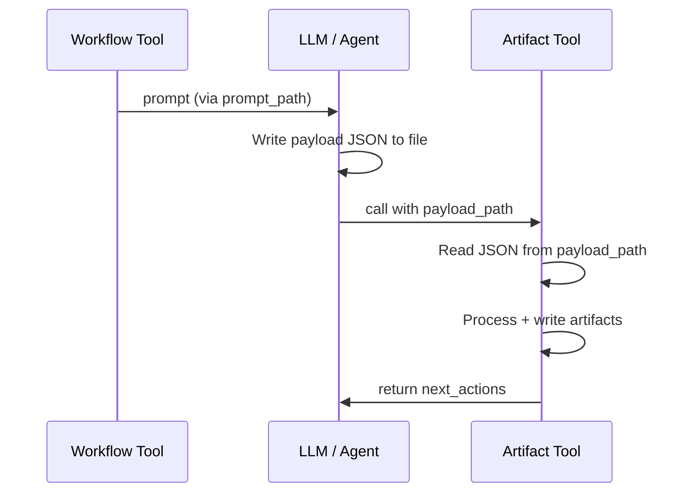

# Artifact Tools

Artifact tools (`sdd_artifact_*`) write structured data to the change directory.
All accept `payload_path` for passing large payloads via file.

## Payload Path Convention

All artifact tools accept large payloads **only** via `payload_path`.

```json
{
  "name": "payload_path",
  "required": true,
  "schema": { "type": "string" },
  "description": "Path to JSON file containing the payload (relative to project root or absolute)"
}
```

### Flow



### Payload file location

```
cclab/changes/{change_id}/payloads/{artifact_action}.json
```

### Rules

1. Artifact tool reads `payload_path`, parses JSON, merges with direct params (`project_path`, `change_id`)
2. Direct params (`project_path`, `change_id`, `group_id`, `spec_id`) override payload file values
3. `payload_path` is the **only** way to pass content params — inline content params are rejected
4. Payload files are ephemeral — tool may delete after successful processing

### CLI mapping

```
cclab sdd artifact <action> <change_id> <payload_path>
```

## sdd_artifact_restructure_input

```json
{
  "name": "sdd_artifact_restructure_input",
  "summary": "Write restructured groups with requirements + questions.",
  "params": [
    { "name": "project_path", "required": true, "schema": { "type": "string" } },
    { "name": "change_id", "required": true, "schema": { "type": "string" } },
    { "name": "payload_path", "required": true, "schema": { "type": "string" } }
  ],
  "x-payload-schema": {
    "type": "object",
    "required": ["groups"],
    "properties": {
      "groups": {
        "type": "array", "minItems": 1,
        "items": {
          "type": "object",
          "required": ["id", "issues", "requirements", "questions"],
          "properties": {
            "id": { "type": "string", "pattern": "^[a-z0-9-]+$" },
            "issues": { "type": "array", "items": { "type": "integer" } },
            "requirements": { "type": "string" },
            "questions": {
              "type": "array",
              "items": {
                "type": "object",
                "required": ["topic", "question"],
                "properties": {
                  "topic": { "type": "string" },
                  "question": { "type": "string" }
                }
              }
            }
          }
        }
      }
    }
  },
  "x-phase": "ChangeInited → InputRestructured"
}
```

## sdd_artifact_create_pre_clarifications

```json
{
  "name": "sdd_artifact_create_pre_clarifications",
  "summary": "Write answered Q&A for a group.",
  "params": [
    { "name": "project_path", "required": true, "schema": { "type": "string" } },
    { "name": "change_id", "required": true, "schema": { "type": "string" } },
    { "name": "group_id", "required": true, "schema": { "type": "string" } },
    { "name": "payload_path", "required": true, "schema": { "type": "string" } }
  ],
  "x-payload-schema": {
    "type": "object",
    "required": ["answers"],
    "properties": {
      "answers": {
        "type": "array", "minItems": 1,
        "items": {
          "type": "object",
          "required": ["topic", "answer"],
          "properties": {
            "topic": { "type": "string" },
            "answer": { "type": "string" },
            "follow_up_questions": { "type": "array", "items": { "type": "string" } }
          }
        }
      }
    }
  }
}
```

## sdd_artifact_create_reference_context

```json
{
  "name": "sdd_artifact_create_reference_context",
  "summary": "Write spec references for a group.",
  "params": [
    { "name": "project_path", "required": true, "schema": { "type": "string" } },
    { "name": "change_id", "required": true, "schema": { "type": "string" } },
    { "name": "group_id", "required": true, "schema": { "type": "string" } },
    { "name": "payload_path", "required": true, "schema": { "type": "string" } }
  ],
  "x-payload-schema": {
    "type": "object",
    "required": ["specs"],
    "properties": {
      "specs": {
        "type": "array", "minItems": 1,
        "items": {
          "type": "object",
          "required": ["spec_id", "spec_group", "relevance"],
          "properties": {
            "spec_id": { "type": "string" },
            "spec_group": { "type": "string" },
            "relevance": { "type": "string", "enum": ["high", "medium", "low"] },
            "key_requirements": { "type": "array", "items": { "type": "string" } }
          }
        }
      }
    }
  }
}
```

## sdd_artifact_review_reference_context

```json
{
  "name": "sdd_artifact_review_reference_context",
  "summary": "Write inline review for a group's reference context.",
  "params": [
    { "name": "project_path", "required": true, "schema": { "type": "string" } },
    { "name": "change_id", "required": true, "schema": { "type": "string" } },
    { "name": "group_id", "required": true, "schema": { "type": "string" } },
    { "name": "payload_path", "required": true, "schema": { "type": "string" } }
  ],
  "x-payload-schema": {
    "type": "object",
    "required": ["verdict", "summary"],
    "properties": {
      "verdict": { "type": "string", "enum": ["APPROVED", "REVIEWED"] },
      "summary": { "type": "string" },
      "checklist_results": {
        "type": "array",
        "items": { "type": "object", "required": ["item", "passed"], "properties": { "item": { "type": "string" }, "passed": { "type": "boolean" }, "note": { "type": "string" } } }
      },
      "issues": {
        "type": "array",
        "items": { "type": "object", "required": ["severity", "description"], "properties": { "severity": { "type": "string", "enum": ["HIGH", "MEDIUM", "LOW"] }, "description": { "type": "string" }, "recommendation": { "type": "string" } } }
      }
    }
  }
}
```

## sdd_artifact_revise_reference_context

```json
{
  "name": "sdd_artifact_revise_reference_context",
  "summary": "Rewrite reference context with corrected specs.",
  "params": [
    { "name": "project_path", "required": true, "schema": { "type": "string" } },
    { "name": "change_id", "required": true, "schema": { "type": "string" } },
    { "name": "group_id", "required": true, "schema": { "type": "string" } },
    { "name": "payload_path", "required": true, "schema": { "type": "string" } }
  ],
  "x-payload-schema": {
    "type": "object",
    "required": ["specs"],
    "properties": {
      "specs": { "type": "array", "minItems": 1, "items": { "type": "object", "required": ["spec_id", "spec_group", "relevance"] } }
    }
  }
}
```

## sdd_artifact_create_post_clarifications

```json
{
  "name": "sdd_artifact_create_post_clarifications",
  "summary": "Write post-clarifications (contradictions + skip-fast).",
  "params": [
    { "name": "project_path", "required": true, "schema": { "type": "string" } },
    { "name": "change_id", "required": true, "schema": { "type": "string" } },
    { "name": "group_id", "required": true, "schema": { "type": "string" } },
    { "name": "payload_path", "required": true, "schema": { "type": "string" } }
  ],
  "x-payload-schema": {
    "type": "object",
    "properties": {
      "skipped": { "type": "boolean" },
      "questions": { "type": "array", "items": { "type": "object", "required": ["topic", "question", "answer"] } },
      "contradictions": { "type": "array", "items": { "type": "object", "required": ["spec_id", "requirement", "conflict", "resolution"] } }
    }
  }
}
```

## sdd_artifact_create_change_spec

```json
{
  "name": "sdd_artifact_create_change_spec",
  "summary": "Write one section of a change spec. Called iteratively per section.",
  "params": [
    { "name": "project_path", "required": true, "schema": { "type": "string" } },
    { "name": "change_id", "required": true, "schema": { "type": "string" } },
    { "name": "spec_id", "required": true, "schema": { "type": "string" } },
    { "name": "payload_path", "required": true, "schema": { "type": "string" } }
  ],
  "x-payload-schema": {
    "type": "object",
    "required": ["section", "content"],
    "properties": {
      "section": { "type": "string", "enum": ["overview", "requirements", "scenarios", "diagrams", "api_spec", "test_plan", "changes"] },
      "content": { "type": "string", "description": "Markdown content for this section (after H2 heading)" },
      "fill_sections": { "type": "array", "items": { "type": "string" }, "description": "Sections to fill (set during analyze step)" },
      "main_spec_ref": { "type": "string", "description": "Target path in cclab/specs/ for merge" },
      "merge_strategy": { "type": "string", "enum": ["new", "append", "replace"] }
    }
  },
  "x-note": "Called once per section. See logic/change-spec.md for iterative flow."
}
```

## sdd_artifact_review_change_spec

```json
{
  "name": "sdd_artifact_review_change_spec",
  "summary": "Write inline review for a change spec.",
  "params": [
    { "name": "project_path", "required": true, "schema": { "type": "string" } },
    { "name": "change_id", "required": true, "schema": { "type": "string" } },
    { "name": "spec_id", "required": true, "schema": { "type": "string" } },
    { "name": "payload_path", "required": true, "schema": { "type": "string" } }
  ],
  "x-payload-schema": {
    "type": "object",
    "required": ["verdict", "summary"],
    "properties": {
      "verdict": { "type": "string", "enum": ["APPROVED", "REVIEWED", "REJECTED"] },
      "summary": { "type": "string" },
      "checklist_results": { "type": "array", "items": { "type": "object", "required": ["item", "passed"] } },
      "issues": { "type": "array", "items": { "type": "object", "required": ["severity", "description"] } }
    }
  }
}
```

## sdd_artifact_revise_change_spec

```json
{
  "name": "sdd_artifact_revise_change_spec",
  "summary": "Revise one section of a change spec based on review feedback.",
  "params": [
    { "name": "project_path", "required": true, "schema": { "type": "string" } },
    { "name": "change_id", "required": true, "schema": { "type": "string" } },
    { "name": "spec_id", "required": true, "schema": { "type": "string" } },
    { "name": "payload_path", "required": true, "schema": { "type": "string" } }
  ],
  "x-payload-schema": {
    "type": "object",
    "required": ["section", "content"],
    "properties": {
      "section": { "type": "string", "enum": ["overview", "requirements", "scenarios", "diagrams", "api_spec", "test_plan", "changes"] },
      "content": { "type": "string" }
    }
  }
}
```

## sdd_artifact_create_change_implementation

```json
{
  "name": "sdd_artifact_create_change_implementation",
  "summary": "Record implementation diff and summary.",
  "params": [
    { "name": "project_path", "required": true, "schema": { "type": "string" } },
    { "name": "change_id", "required": true, "schema": { "type": "string" } },
    { "name": "payload_path", "required": true, "schema": { "type": "string" } }
  ],
  "x-payload-schema": {
    "type": "object",
    "required": ["diff", "summary"],
    "properties": {
      "diff": { "type": "string", "description": "Full git diff content" },
      "summary": { "type": "string", "description": "Brief description of changes" }
    }
  }
}
```

## sdd_artifact_review_change_implementation

```json
{
  "name": "sdd_artifact_review_change_implementation",
  "summary": "Write inline review for implementation.",
  "params": [
    { "name": "project_path", "required": true, "schema": { "type": "string" } },
    { "name": "change_id", "required": true, "schema": { "type": "string" } },
    { "name": "payload_path", "required": true, "schema": { "type": "string" } }
  ],
  "x-payload-schema": {
    "type": "object",
    "required": ["verdict", "summary"],
    "properties": {
      "verdict": { "type": "string", "enum": ["APPROVED", "REVIEWED", "REJECTED"] },
      "summary": { "type": "string" },
      "checklist_results": { "type": "array" },
      "issues": { "type": "array" }
    }
  }
}
```

## sdd_artifact_revise_change_implementation

```json
{
  "name": "sdd_artifact_revise_change_implementation",
  "summary": "Record revised implementation diff.",
  "params": [
    { "name": "project_path", "required": true, "schema": { "type": "string" } },
    { "name": "change_id", "required": true, "schema": { "type": "string" } },
    { "name": "payload_path", "required": true, "schema": { "type": "string" } }
  ],
  "x-payload-schema": {
    "type": "object",
    "required": ["diff", "summary"],
    "properties": {
      "diff": { "type": "string" },
      "summary": { "type": "string" }
    }
  }
}
```


## Changes

Remove `merge_strategy` from `sdd_artifact_create_change_spec` payload schema. Actual merge behavior is always replace (write to path, create if absent, overwrite if exists) — the enum variants `new`, `append`, `replace` are dead code.

| Tool | Location | Change |
|------|----------|--------|
| `sdd_artifact_create_change_spec` | `x-payload-schema.properties` | Remove `merge_strategy` field (`{ "type": "string", "enum": ["new", "append", "replace"] }`) |

# Reviews
