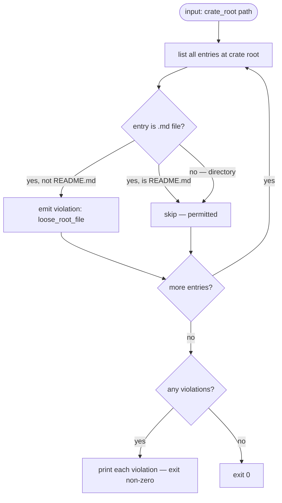
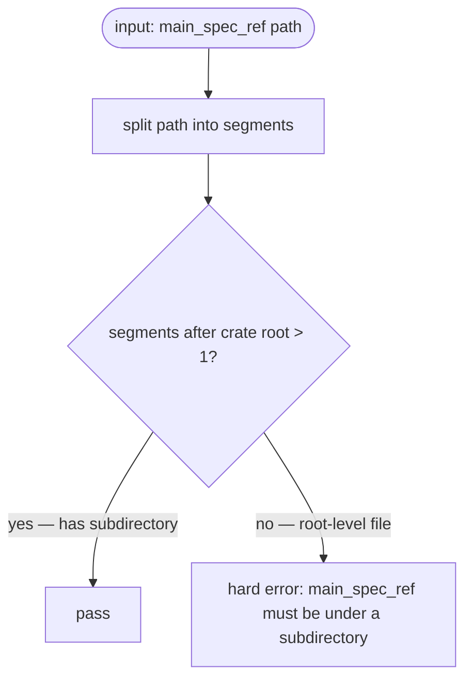
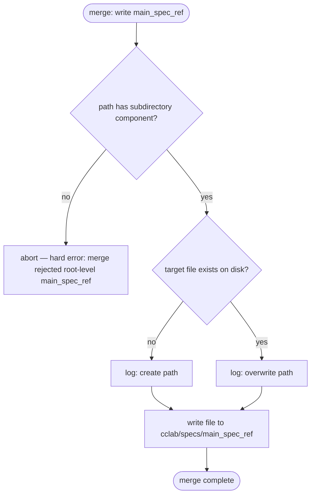

# Spec Structure Rules

## Overview

Defines the canonical inner-directory layout for `cclab/specs/{crate}/` and provides enforcement tooling to eliminate spec scatter — where spec files accumulate at the spec root rather than in domain subdirectories.

**Problem**: Agents generating `main_spec_ref` at spec root (e.g. `crates/cclab-sdd/my-spec.md`) cause flat file accumulation. The `pre_filter_specs` flat `read_dir` bug in `scope.rs` compounds this: root-level files appear in agent prompts; nested files are invisible, reinforcing root-placement behavior.

**Solution — three enforcement layers**:

| Layer | Mechanism | Gate |
|-------|-----------|------|
| Structure | `validate-spec-structure` lint command | On demand / CI |
| Planning | `main_spec_ref` path validation — no root-level targets | `spec_plan` phase |
| Merge | Merge-time path check + create/overwrite audit log | Before disk write |

**Canonical layout** for `cclab/specs/{crate}/`:

- `interfaces/mcp/` — OpenRPC tool definitions
- `interfaces/cli/` — CLI command trees
- `logic/` — State machines, business logic, algorithms
- `config/` — Configuration schemas
- `tools/utils/` — Utility tool specs
- `skills/` — Agent skill definitions
- `README.md` — Required crate overview (the only permitted root-level `.md` file)

`cclab sdd scaffold-spec {folder}` creates the canonical directory skeleton + `README.md` for a new crate. `cclab sdd validate-spec-structure {folder}` lints the root and exits non-zero on violations (hard error, no lenient mode).
## Requirements

| ID | Requirement |
|----|-------------|
| REQ-1 | Canonical spec layout for `cclab/specs/{crate}/` requires all spec `.md` files to reside under a named subdirectory. No loose `.md` files are permitted at the crate spec root except `README.md`. |
| REQ-2 | `cclab sdd scaffold-spec {folder}` creates the canonical directory skeleton for a crate spec root: subdirectories `interfaces/mcp/`, `interfaces/cli/`, `logic/`, `config/`, `tools/utils/`, `skills/` and `README.md` at the crate root. No `.gitkeep` or stub spec files are created. Command is idempotent — existing directories/files are not modified. |
| REQ-3 | `cclab sdd validate-spec-structure {folder}` lints a crate spec root against REQ-1. Violations are hard errors (exit non-zero). No lenient mode. Emits one violation line per offending file. |
| REQ-4 | `validate-spec-structure` violation kinds: `loose_root_file` — a `.md` file exists at crate root other than `README.md`. |
| REQ-5 | `main_spec_ref` path validation in `spec_plan` phase: any path whose parent is the crate spec root (i.e. `{scope}/{crate}/filename.md` with no subdirectory component) is rejected with a hard error. Pipeline blocks on violation. |
| REQ-6 | Merge-time validation mirrors REQ-5: before writing `cclab/specs/{main_spec_ref}`, verify the path has at least one subdirectory component under the crate root. Emit audit log entry `[merge] create {path}` or `[merge] overwrite {path}` before each write. |
| REQ-7 | Migration: move all existing loose root-level `.md` files in `cclab/specs/crates/cclab-sdd/` (`change-spec-logic.md`, `sdd-cli.md`, `sdd-codegen-testgen-spec.md`, `merge-lens-into-sdd-spec.md`) to appropriate subdirectories as part of this change. |
## Scenarios

### Scenario: scaffold-spec creates canonical skeleton

- **GIVEN** `cclab/specs/crates/my-crate/` does not exist
- **WHEN** `cclab sdd scaffold-spec crates/my-crate` is run
- **THEN** directories created: `interfaces/mcp/`, `interfaces/cli/`, `logic/`, `config/`, `tools/utils/`, `skills/`
- **AND** `README.md` written at crate root
- **AND** no stub `.md` spec files are created

### Scenario: scaffold-spec is idempotent

- **GIVEN** `cclab/specs/crates/my-crate/logic/` already exists
- **WHEN** `cclab sdd scaffold-spec crates/my-crate` is run again
- **THEN** existing directories and files are unchanged
- **AND** any missing canonical directories are created without error

### Scenario: validate-spec-structure passes clean root

- **GIVEN** `cclab/specs/crates/my-crate/` contains only `README.md` and `logic/state-machine.md`
- **WHEN** `cclab sdd validate-spec-structure crates/my-crate` is run
- **THEN** exits with code 0, no violations emitted

### Scenario: validate-spec-structure fails on loose root file

- **GIVEN** `cclab/specs/crates/my-crate/my-spec.md` exists at crate root (not in a subdirectory)
- **WHEN** `cclab sdd validate-spec-structure crates/my-crate` is run
- **THEN** exits non-zero
- **AND** emits: `loose_root_file: my-spec.md`

### Scenario: spec_plan rejects root-level main_spec_ref

- **GIVEN** spec_plan entry has `main_spec_ref: crates/cclab-sdd/my-feature.md` (no subdirectory component)
- **WHEN** spec_plan phase validation runs
- **THEN** pipeline blocks with hard error: `main_spec_ref must be under a subdirectory (got: crates/cclab-sdd/my-feature.md)`

### Scenario: spec_plan accepts valid subdirectory path

- **GIVEN** spec_plan entry has `main_spec_ref: crates/cclab-sdd/logic/my-feature.md`
- **WHEN** spec_plan phase validation runs
- **THEN** validation passes, pipeline continues

### Scenario: merge-time validation rejects root-level main_spec_ref

- **GIVEN** change spec has `main_spec_ref: crates/cclab-sdd/my-spec.md` (root-level)
- **WHEN** merge phase attempts to write the file
- **THEN** merge aborts with hard error: `merge rejected root-level main_spec_ref: crates/cclab-sdd/my-spec.md`

### Scenario: merge-time audit log records create vs overwrite

- **GIVEN** `main_spec_ref: crates/cclab-sdd/logic/new-spec.md` does not exist on disk
- **WHEN** merge writes the file
- **THEN** logs: `[merge] create crates/cclab-sdd/logic/new-spec.md`

- **GIVEN** `main_spec_ref: crates/cclab-sdd/logic/existing-spec.md` already exists on disk
- **WHEN** merge writes the file
- **THEN** logs: `[merge] overwrite crates/cclab-sdd/logic/existing-spec.md`
## Diagrams

### Interaction
<!-- type: interaction lang: mermaid -->
<!-- TODO -->

### Logic
<!-- type: logic lang: mermaid -->
<!-- TODO -->

### Dependencies
<!-- type: dependency lang: mermaid -->
<!-- TODO -->

### State Machine
<!-- type: state-machine lang: mermaid -->
<!-- TODO -->

### Data Model
<!-- type: db-model lang: mermaid -->
<!-- TODO -->

## API Spec

### REST API
<!-- type: rest-api lang: yaml -->
<!-- TODO -->

### RPC API
<!-- type: rpc-api lang: json -->
<!-- TODO -->

### Async API
<!-- type: async-api lang: yaml -->
<!-- TODO -->

### CLI
<!-- type: cli lang: yaml -->
<!-- TODO -->

### Schema
<!-- type: schema lang: json -->
<!-- TODO -->

### Config
<!-- type: config lang: json -->
<!-- TODO -->

## Test Plan
<!-- type: test-plan lang: markdown -->

<!-- TODO -->

## Changes
<!-- type: changes lang: yaml -->

<!-- TODO -->

## Wireframe
<!-- type: wireframe lang: yaml -->

<!-- TODO -->

## Component
<!-- type: component lang: json -->

<!-- TODO -->

## Design Token
<!-- type: design-token lang: json -->

<!-- TODO -->

## Doc
<!-- type: doc lang: markdown -->

<!-- TODO -->


## Schema


```json
{
  "$schema": "https://json-schema.org/draft/2020-12/schema",
  "$id": "spec-structure-rules",
  "title": "SpecStructureRules",
  "description": "Canonical layout rules for cclab/specs/{crate}/ directories",
  "definitions": {
    "CanonicalLayout": {
      "description": "Required directory structure under a crate spec root",
      "type": "object",
      "properties": {
        "required_root_files": {
          "type": "array",
          "const": ["README.md"],
          "description": "Files required at crate root. README.md is the only .md file allowed at root."
        },
        "canonical_subdirs": {
          "type": "array",
          "items": { "type": "string" },
          "default": ["interfaces/mcp", "interfaces/cli", "logic", "config", "tools/utils", "skills"],
          "description": "Standard subdirectories created by scaffold-spec. All spec .md files must live under a subdirectory."
        },
        "forbidden_root_patterns": {
          "type": "array",
          "const": ["*.md"],
          "description": "Glob patterns for files forbidden at crate root. Exception: required_root_files."
        }
      }
    },
    "MainSpecRefValidation": {
      "description": "Validation rule applied to main_spec_ref at spec_plan and merge time",
      "type": "object",
      "required": ["rule", "applies_at"],
      "properties": {
        "rule": {
          "const": "path_must_have_subdirectory",
          "description": "main_spec_ref must have at least 1 subdirectory component under the crate root. Paths like {scope}/{crate}/file.md are rejected."
        },
        "applies_at": {
          "type": "array",
          "items": { "type": "string", "enum": ["spec_plan", "merge"] }
        },
        "error_template": {
          "type": "string",
          "default": "main_spec_ref must be under a subdirectory (got: {path})"
        }
      }
    },
    "ValidationViolation": {
      "type": "object",
      "required": ["kind", "path"],
      "properties": {
        "kind": {
          "type": "string",
          "enum": ["loose_root_file"],
          "description": "loose_root_file: a .md file at crate root other than README.md"
        },
        "path": {
          "type": "string",
          "description": "Path of offending file relative to crate root"
        }
      }
    },
    "ScaffoldOutput": {
      "description": "What scaffold-spec creates for a new crate root",
      "type": "object",
      "required": ["directories", "root_files"],
      "properties": {
        "directories": {
          "type": "array",
          "items": { "type": "string" },
          "const": ["interfaces/mcp", "interfaces/cli", "logic", "config", "tools/utils", "skills"]
        },
        "root_files": {
          "type": "array",
          "const": ["README.md"]
        }
      }
    },
    "MergeAuditEntry": {
      "type": "object",
      "required": ["action", "path"],
      "properties": {
        "action": {
          "type": "string",
          "enum": ["create", "overwrite"],
          "description": "create: target did not exist on disk; overwrite: target existed"
        },
        "path": {
          "type": "string",
          "description": "main_spec_ref path written to disk"
        }
      }
    }
  }
}
```


## Logic


### validate-spec-structure Logic



### main_spec_ref Path Validation



### Merge-Time Validation and Audit




## CLI


```yaml
cclab sdd scaffold-spec:
  args:
    folder:
      type: string
      required: true
      description: "Crate spec root path relative to cclab/specs/ (e.g. crates/my-crate)"
  behavior:
    - Create canonical subdirectory skeleton under cclab/specs/{folder}/
    - Directories created: interfaces/mcp, interfaces/cli, logic, config, tools/utils, skills
    - Write README.md at cclab/specs/{folder}/README.md if absent
    - Idempotent: skip existing directories and files without error
    - No stub .md spec files created
  output: "Created {n} directories, wrote README.md" (or "Nothing to create" if fully idempotent)

cclab sdd validate-spec-structure:
  args:
    folder:
      type: string
      required: true
      description: "Crate spec root path relative to cclab/specs/ (e.g. crates/my-crate)"
  flags:
    --json:
      type: bool
      default: false
      description: "Emit violations as JSON array instead of text lines"
  behavior:
    - List all .md entries at cclab/specs/{folder}/ (non-recursive — root level only)
    - Violation: any .md file at root except README.md (kind: loose_root_file)
    - Print one violation line per offending file (or JSON object array if --json)
    - Exit 0 if no violations, exit 1 if any violations
    - Hard error mode — no warnings-only output
  violation_format:
    text: "loose_root_file: {filename}"
    json: "[{\"kind\": \"loose_root_file\", \"path\": \"{filename}\"}]"
```

# Reviews
