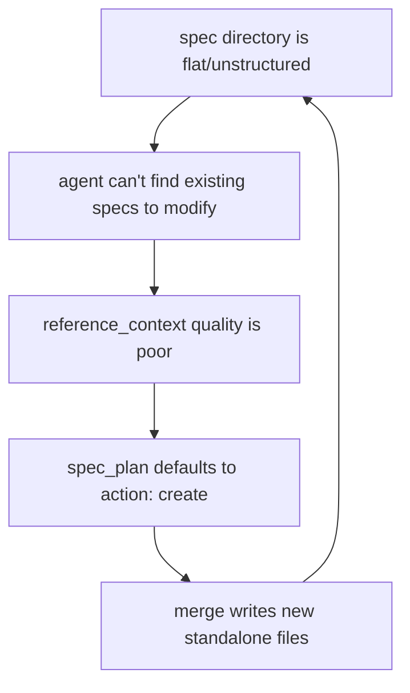

# #1039 — fix(sdd): enforce spec consolidation — prevent scattered specs after SDD lifecycle

## Problem

Spec directories degrade into scattered flat files after repeated SDD cycles. This is a self-reinforcing loop:



**Evidence:**

| Crate | Files | Root Loose | Scatter Rate |
|-------|-------|-----------|--------------|
| cclab-sdd | 59 | 4 | 7% ✅ |
| cclab-mamba | 88 | 7 | 8% ✅ |
| cclab-agent | 24 | 20 | 83% ❌ |
| cclab-runtime | 37 | 24 | 65% ❌ |
| cclab-jet | 11 | 11 | 100% ❌ |
| cclab-lens | 20 | 19 | 95% ❌ |

Well-structured crates (sdd, mamba) produce good reference_context with `action: modify`. Flat crates produce garbage — e.g., `jet-postcss-tailwind` reference_context was all `?` placeholders because the agent couldn't locate any relevant specs.

## Design Principle

> **Specs are the consolidated codebase mirror, not an append-only log.**
>
> New requirements UPDATE existing spec files. After SDD lifecycle completes, the spec directory should look as if written from scratch with full knowledge.

---

## Part 1: Canonical Directory Structure

The structure definition serves two purposes:
1. **New project onboarding** — SDD scaffolds the right structure from day 1
2. **Existing project migration** — break the scatter loop by restructuring first

### Layer 1: Scope Resolution — IMPLEMENTED

`config.toml` `[specs.scopes]` maps group → parent subdir. Single-product repos can skip this.

```
cclab/specs/
├── crates/{crate}/      # per-crate (Rust workspace)
└── projects/{project}/  # per-product (Conductor, DAS)
```

### Layer 2: Inner Structure — NOT ENFORCED

**Rules:**

| # | Rule |
|---|------|
| 1 | `interfaces/{type}/` is mandatory for external API surface — group by type (`mcp/`, `cli/`, `rest/`, `grpc/`, `ui/`, `async/`) |
| 2 | Other top-level folders organized by domain subsystem (`logic/`, `config/`, `generate/`, etc.) |
| 3 | No loose files at spec root (except README.md) |
| 4 | Each folder = one coherent subsystem — not a dumping ground |
| 5 | One spec file per domain concept — no duplicate coverage |
| 6 | Pure-logic crates (compilers, parsers) may omit `interfaces/` — use domain subdirs directly |

**Examples:**

```
# SDD (has interfaces + multiple subsystems)
cclab-sdd/
├── interfaces/
│   ├── tools/       # MCP tool contracts
│   └── cli/         # CLI commands
├── logic/           # Workflow state machine, phases
├── config/          # Config schemas
├── generate/        # Codegen subsystem
├── skills/          # Skill definitions
└── tools/utils/     # Utility tool specs

# New Python project (simple)
specs/
├── interfaces/
│   ├── rest/        # FastAPI endpoints
│   └── cli/         # CLI commands
├── logic/           # Business rules
└── config/          # App config

# Compiler (pure-logic, no interfaces)
cclab-mamba/
├── lexer/
├── parser/
├── codegen/
├── runtime/
└── types/
```

---

## Part 2: Lifecycle Enforcement

Breaking the scatter loop requires intervention at three points.

### A. Reference Context — spec discovery before planning

Root problem: agent doesn't know what specs already exist, so it can't target them.

Fix: before creating `spec_plan`, inject a **spec directory listing** into the reference_context prompt. Agent sees the existing structure and can make informed `modify` vs `create` decisions.

- Inject `cclab/specs/{crate}/` tree listing into the Create prompt
- Add prompt guidance: "If an existing spec covers this domain, use `action: modify` with that path. Only `action: create` for genuinely new subsystems."

### B. Spec Plan Validation — reject bad paths

When `spec_plan.yaml` is written, validate programmatically:
- `main_spec_ref` must target a subfolder (not spec root)
- If `action: create` but a similar-named spec exists in the same subfolder → warn

### C. Merge-Time — last gate

Before writing to `cclab/specs/`:
- Reject `main_spec_ref` that writes to spec root
- Log when creating a new file (vs overwriting existing) for audit

---

## Part 3: Dead Code — `merge_strategy`

`merge_strategy` (`new`, `append`, `extend`, `replace`) is dead. Actual merge behavior is always **replace** — write to `main_spec_ref` path, create if absent, overwrite if exists.

Remove from:
- `MergeStrategy` enum in `frontmatter.rs`
- Validation in `spec_service.rs`
- Skeleton template in `common_change_spec.rs`
- `strip_change_spec_fields` list
- Spec references in `change-spec.md`, `change-merge.md`, `artifact-tools.md`

---

## Tasks

### Structure
- [ ] Define canonical rules in `cclab/specs/crates/cclab-sdd/logic/spec-structure.md`
- [ ] `cclab sdd scaffold-spec {folder}` — scaffold canonical directory structure
- [ ] `cclab sdd validate-spec-structure` — lint specs against rules

### Lifecycle
- [ ] Inject spec directory listing into reference_context Create prompt
- [ ] Add prompt guidance for `modify` vs `create` decision
- [ ] Add `main_spec_ref` path validation in `spec_plan.rs`
- [ ] Add merge-time validation in `create_change_merge.rs`

### Dead Code
- [ ] Remove `merge_strategy` from code and specs

### Migration
- [ ] Incremental migration tool for existing scattered specs
- [ ] Fix cclab-sdd root-level loose files (4 files)
