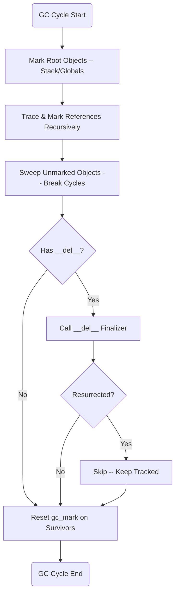

# Garbage Collection

## Overview

Cycle-detecting garbage collector for the Mamba runtime. Complements reference counting (see value-and-rc.md) by detecting and reclaiming objects involved in reference cycles. Uses a mark-sweep algorithm with container tracking, root scanning, and `__del__` finalizer integration.

## Source Files

| File | LOC | Responsibility |
|------|-----|----------------|
| `runtime/gc.rs` | 370 | Container tracking, mark-sweep, cycle detection, finalizers |

## Requirements

### R1 - Track Container Objects

```yaml
id: R1
priority: high
```

Track all heap-allocated container objects (lists, dicts, sets, instances) that can participate in reference cycles. Maintain a global container list that is updated on allocation and deallocation. Non-container types (int, float, str) are excluded from GC tracking.

### R2 - Mark-Sweep Collection Algorithm

```yaml
id: R2
priority: high
```

Provide a mark-sweep algorithm:

1. **Mark phase**: Start from root objects (stack frames, global variables). Set `gc_mark = true` on each root.
2. **Trace phase**: Recursively follow references from marked objects, marking all reachable objects.
3. **Sweep phase**: Iterate tracked containers. Any object with `gc_mark = false` is unreachable and can be freed.
4. **Reset phase**: Clear `gc_mark` on all surviving objects.

### R3 - Cycle Detection and Reclamation

```yaml
id: R3
priority: high
```

Correctly identify and reclaim objects that form reference cycles but are not reachable from any root. Example: two objects A and B where A references B and B references A, but no external reference exists to either.

### R4 - __del__ Finalizer Invocation

```yaml
id: R4
priority: medium
```

During sweep, before freeing an instance whose class defines `__del__`:
1. Call the `__del__` method on the instance.
2. If `__del__` creates a new external reference to the object (resurrection), skip collection for this cycle.
3. The resurrected object remains tracked for future GC cycles.

### R5 - Configurable Collection Thresholds

```yaml
id: R5
priority: medium
```

Support configurable thresholds that trigger automatic collection:
- `threshold_allocs`: Number of new container allocations before triggering GC.
- Manual trigger via `gc.collect()` builtin.
- Generational promotion (future): track object age across cycles.

## Acceptance Criteria

### Scenario: Reclaim reference cycle

- **GIVEN** Two objects A and B that reference each other but have no external references.
- **WHEN** The GC cycle is executed.
- **THEN** The GC identifies the cycle and reclaims both A and B.

### Scenario: Protect reachable objects

- **GIVEN** An object C reachable from a global variable.
- **WHEN** The GC cycle is executed.
- **THEN** The GC does NOT reclaim object C.

### Scenario: Finalizer invocation

- **GIVEN** An instance with `__del__` defined, part of an unreachable cycle.
- **WHEN** GC sweep reaches this instance.
- **THEN** `__del__` is called before deallocation.

### Scenario: Object resurrection

- **GIVEN** An instance whose `__del__` stores `self` in a global variable.
- **WHEN** GC sweep calls `__del__`.
- **THEN** The object is NOT freed; it remains tracked for future cycles.

## Known Issues

### KI-1: Auto-collection disabled — JIT codegen does not register GC roots

```yaml
id: KI-1
severity: P0
status: mitigated
affects: [R2, R3, R5]
```

Auto-collection is disabled (`GcState.enabled = false`) because the Cranelift JIT codegen does not register stack-allocated objects as GC roots. Without roots, `collect()` marks ALL tracked containers as unreachable and frees them — causing heap-use-after-free crashes in JIT code (see cranelift-jit.md KI-1).

**Impact:** Cyclic references are never reclaimed. For short-lived programs (conformance tests, REPL) this is acceptable. For long-running programs with cyclic data structures, memory will leak.

**To re-enable GC, the JIT codegen must:**
1. Call `gc_add_root()` for each container value stored in a local variable
2. Call `gc_remove_root()` when the variable goes out of scope
3. Or implement conservative stack scanning to discover roots automatically

Manual `gc.collect()` via the Python `gc` module still works IF roots are properly registered first.

## Diagrams

### Cycle-Detecting GC Flow


