# Mamba Refcount Jit Spec

## Overview

Implement CPython 3.12 reference counting semantics in Mamba's Cranelift JIT codegen. Currently, JIT-compiled code never emits `mb_retain`/`mb_release` calls — all heap objects (`MbObject`) allocated at compile time (string/bytes literals in `LoadConst`) or runtime (lists, dicts, tuples) are never freed, leaking indefinitely. The GC is disabled (`gc.rs enabled: false`) because JIT code does not register GC roots (see cranelift-jit.md KI-1, gc.md KI-1).

**Root cause**: The Cranelift backend (`emit_inst` in mod.rs, `emit_inst` in jit.rs) translates MIR instructions to Cranelift IR without any ownership tracking. `MirInst::Copy`, `StoreGlobal`, `StoreCell`, and `Terminator::Return` all transfer `MbValue` u64 values without retain/release calls. Compile-time `MbObject::new_str()`/`new_bytes()` allocations in `LoadConst` are embedded as `iconst` immediates and never freed when the backend drops.

**Approach (6 phases)**:

1. **JIT-callable retain/release wrappers** — Add `mb_retain_value(u64)` and `mb_release_value(u64)` extern C functions in `rc.rs` that take a raw `MbValue` u64, check `is_ptr()` (TAG_PTR=0), extract the pointer via `as_ptr()`, and call `mb_retain`/`mb_release`. Register these in `symbols.rs` via `runtime_symbols()`.

2. **Emit release at variable reassignment** — In `emit_inst` for `MirInst::Copy { dest, source }`, emit `mb_release_value(old_dest)` before overwriting `dest` with the new value, then emit `mb_retain_value(new_value)` after the copy. Same for `StoreGlobal` and `StoreCell`.

3. **Emit release at function return** — In `emit_terminator` for `Terminator::Return`, emit `mb_release_value` for all live local variables (from MIR function's VReg set) except the return value.

4. **Immortal refcount for compile-time constants** — Add `IMMORTAL_REFCOUNT: u32 = u32::MAX` in `rc.rs`. Set `header.rc = IMMORTAL_REFCOUNT` for all `MbObject::new_str()`/`new_bytes()` created during codegen (LoadConst). Guard `mb_retain`/`mb_release` to skip objects with `rc == IMMORTAL_REFCOUNT`.

5. **Track compile-time allocations** — Add `compile_time_objects: Vec<*mut MbObject>` to `CraneliftJitBackend`. Collect all `MbObject::new_str()`/`new_bytes()` pointers created during compilation. On `Drop`, release all tracked objects (after `free_memory()`).

6. **Re-enable GC** — With refcounting correct, set `GcState::new() { enabled: true }` and configure `threshold_allocs`. Cyclic garbage (lists referencing each other) is handled by the existing mark-sweep collector. Root scanning uses conservative stack scanning (future work).

Issue: #1129. Related: #1114, #653.
## Requirements

| ID | Title | Priority | Acceptance Criteria |
|----|-------|----------|---------------------|
| R1 | JIT-callable retain/release value wrappers | P0 | Add `pub unsafe extern "C" fn mb_retain_value(val: u64)` and `pub unsafe extern "C" fn mb_release_value(val: u64)` in `rc.rs`. Each reconstructs `MbValue` from the raw u64, checks `is_ptr()` (TAG_PTR=0), extracts the pointer via `as_ptr()`, and calls `mb_retain`/`mb_release`. Null-pointer and non-pointer values are no-ops. Register both in `runtime_symbols()` with signature `(I64) -> Void`. |
| R2 | Emit mb_release_value before variable reassignment | P0 | In Cranelift `emit_inst`, before a `MirInst::Copy { dest, source }` overwrites `dest`, emit a call to `mb_release_value(old_dest_value)` using the current value of the dest VReg. After storing the new value, emit `mb_retain_value(new_value)`. Same pattern for `StoreGlobal` (release old global value before storing new) and `StoreCell`. First assignment to an uninitialized VReg skips the release (VReg default is 0 = None, which `mb_release_value` handles as no-op since None is not TAG_PTR). |
| R3 | Emit mb_release_value at function return | P0 | In `emit_terminator` for `Terminator::Return`, before the `return_` instruction, emit `mb_release_value(var)` for every VReg in the function's local variable set EXCEPT the VReg being returned (if any). The returned value's ownership transfers to the caller. For `Terminator::Return(None)`, release all VRegs. |
| R4 | Immortal refcount for compile-time constants | P0 | Add `pub const IMMORTAL_REFCOUNT: u32 = u32::MAX` in `rc.rs`. Modify `MbObject::new_str()` and `MbObject::new_bytes()` to accept an optional `immortal: bool` parameter (or add `new_str_immortal`/`new_bytes_immortal` variants). When called from codegen `LoadConst`, use immortal refcount. Guard `mb_retain` to no-op when `rc == IMMORTAL_REFCOUNT`. Guard `mb_release` to no-op when `rc == IMMORTAL_REFCOUNT`. |
| R5 | Track and release compile-time allocations | P1 | Add `compile_time_objects: Vec<*mut MbObject>` field to `CraneliftJitBackend`. In `emit_inst` for `LoadConst::Str` and `LoadConst::Bytes`, push the raw `MbObject` pointer to this vec. In `Drop for CraneliftJitBackend`, after `module.free_memory()`, iterate `compile_time_objects` and call `mb_release(ptr)` for each (setting their rc to non-immortal first, or using `Box::from_raw` directly since they are owned by the backend). |
| R6 | Re-enable GC auto-collection | P2 | Set `GcState::new()` to `enabled: true`. Set `threshold_allocs` to a reasonable default (e.g., 700). With refcounting active, most objects are freed by `mb_release_value` before GC runs. GC only collects cyclic garbage. Root scanning deferred to future work — GC initially uses only tracked containers as approximate roots. |
| R7 | Emit mb_retain_value for function arguments | P1 | In `emit_inst` for `MirInst::Call` and `MirInst::CallExtern`, each argument passed to a function call should be retained by the callee and released at callee return. For the initial implementation, the caller retains arguments before the call and the callee releases them at return (via R3). This matches CPython's borrowed reference convention at call boundaries. |

### Constraints

- All retain/release calls operate on `u64` (NaN-boxed `MbValue`) — the JIT never works with raw `*mut MbObject` pointers directly
- NaN-boxing tag check must be done inside the wrapper functions, not inlined in Cranelift IR (avoid IR complexity; the branch predictor handles the common case efficiently)
- Immortal objects must NEVER be freed — `mb_release_value` on an immortal object is a guaranteed no-op
- The `MirInst::Copy` emit pattern works because VRegs default-initialize to 0 (MbValue representing None/0), and `mb_release_value(0)` is a no-op (tag != TAG_PTR)
- Phase ordering: R1 must land before R2/R3 (symbols must exist before emit). R4 must land before or with R2 (compile-time strings must be immortal before release is emitted). R5 is independent. R6 is last.
## Scenarios

### S1: Variable reassignment releases old heap object (R1, R2)

**GIVEN** JIT-compiled code: `x = "hello"; x = "world"`
**WHEN** the second assignment executes
**THEN** `mb_release_value` is called on the old value of `x` (the "hello" string MbValue). Since "hello" is a compile-time constant with IMMORTAL_REFCOUNT, the release is a no-op. For runtime-allocated objects (e.g., `x = [1,2]; x = [3,4]`), the old list's refcount decrements from 1 to 0 and is freed.

### S2: Function return releases local variables (R1, R3)

**GIVEN** JIT-compiled function:
```python
def foo():
    a = [1, 2, 3]
    b = "temp"
    return a
```
**WHEN** `foo()` returns
**THEN** `mb_release_value` is called for `b` (temp string) but NOT for `a` (return value — ownership transfers to caller). The list `a` survives with refcount=1.

### S3: Compile-time string constants use immortal refcount (R4)

**GIVEN** JIT compiles `LoadConst::Str("hello")` which calls `MbObject::new_str_immortal("hello")`
**WHEN** `mb_release_value` is called on the resulting MbValue
**THEN** The release is a no-op because `header.rc == IMMORTAL_REFCOUNT`. The string is never freed during program execution.

### S4: Non-pointer values skip retain/release (R1)

**GIVEN** JIT-compiled code: `x = 42; x = 99` (integer reassignment)
**WHEN** the `mb_release_value(old_x)` call executes
**THEN** `MbValue(old_x).is_ptr()` returns false (TAG_INT != TAG_PTR=0). The function returns immediately as a no-op. No pointer dereference occurs.

### S5: Compile-time allocations freed on backend drop (R5)

**GIVEN** A `CraneliftJitBackend` that compiled 50 string literals and 10 bytes literals during codegen
**WHEN** the backend is dropped
**THEN** `Drop::drop` calls `module.free_memory()` first, then iterates `compile_time_objects` (60 pointers) and frees each one. No memory leak from compile-time allocations.

### S6: GC collects cyclic garbage with refcounting active (R6)

**GIVEN** JIT-compiled code creates a self-referencing list: `a = []; a.append(a)`
**WHEN** `a` goes out of scope and `mb_release_value` decrements its refcount
**THEN** refcount drops to 1 (not 0) because of the self-reference. The GC cycle detects the unreachable cycle and frees `a`.

### S7: REPL session does not leak across iterations (R2, R3, R5)

**GIVEN** A REPL session executing 100 iterations, each creating lists and strings
**WHEN** each iteration completes and variables go out of scope
**THEN** non-immortal heap objects are freed by `mb_release_value` at return. Memory usage stays bounded (no monotonic growth).

### S8: Copy instruction retains new value (R1, R2)

**GIVEN** JIT-compiled MIR: `Copy { dest: v3, source: v1 }` where v1 holds a heap list
**WHEN** the copy instruction executes
**THEN** `mb_release_value(old_v3)` is called first, then `mb_retain_value(v1_value)` is called after the copy. The list's refcount increments from 1 to 2. Both `v1` and `v3` now own a reference.

### S9: Existing conformance tests pass with refcounting enabled (R1-R5)

**GIVEN** The full Mamba conformance test suite (200+ fixtures)
**WHEN** executed with JIT refcounting enabled
**THEN** All tests pass with identical output. No SIGBUS, SIGSEGV, or heap-use-after-free (verified with ASan). Memory usage per test is bounded.

### S10: Null pointer in mb_release_value is safe (R1)

**GIVEN** An uninitialized VReg with default value 0
**WHEN** `mb_release_value(0)` is called during function return cleanup
**THEN** `MbValue(0).is_ptr()` returns false (0 is not a valid NaN-boxed pointer — TAG_PTR requires the NaN prefix bits). The function is a no-op.
## Diagrams

### Interaction
<!-- type: interaction lang: mermaid -->
<!-- TODO -->

### Logic
<!-- type: logic lang: mermaid -->
<!-- TODO -->

### Dependencies
<!-- type: dependency lang: mermaid -->
<!-- TODO -->

### State Machine
<!-- type: state-machine lang: mermaid -->
<!-- TODO -->

### Data Model
<!-- type: db-model lang: mermaid -->
<!-- TODO -->

## API Spec

### REST API
<!-- type: rest-api lang: yaml -->
<!-- TODO -->

### RPC API
<!-- type: rpc-api lang: json -->
<!-- TODO -->

### Async API
<!-- type: async-api lang: yaml -->
<!-- TODO -->

### CLI
<!-- type: cli lang: yaml -->
<!-- TODO -->

### Schema
<!-- type: schema lang: json -->
<!-- TODO -->

### Config
<!-- type: config lang: json -->
<!-- TODO -->

## Test Plan

### Unit Tests (rc.rs)

| Test | Validates | Description |
|------|-----------|-------------|
| `test_immortal_refcount_constant` | R4 | `IMMORTAL_REFCOUNT == u32::MAX` |
| `test_new_str_immortal` | R4 | `MbObject::new_str_immortal("x")` creates object with `rc == IMMORTAL_REFCOUNT` |
| `test_new_bytes_immortal` | R4 | `MbObject::new_bytes_immortal(vec![1])` creates object with `rc == IMMORTAL_REFCOUNT` |
| `test_retain_value_int_noop` | R1 | `mb_retain_value(MbValue::from_int(42).to_bits())` — no crash, no state change |
| `test_release_value_int_noop` | R1 | `mb_release_value(MbValue::from_int(42).to_bits())` — no crash, no state change |
| `test_retain_value_none_noop` | R1 | `mb_retain_value(MbValue::none().to_bits())` — no crash |
| `test_release_value_zero_noop` | R1 | `mb_release_value(0)` — no crash (uninitialized VReg default) |
| `test_retain_value_heap_obj` | R1 | Creates heap list, calls `mb_retain_value`, verifies refcount incremented |
| `test_release_value_heap_obj` | R1 | Creates heap list with rc=2, calls `mb_release_value`, verifies refcount decremented |
| `test_retain_immortal_noop` | R4 | `mb_retain_value` on immortal string — rc stays at IMMORTAL_REFCOUNT |
| `test_release_immortal_noop` | R4 | `mb_release_value` on immortal string — rc stays at IMMORTAL_REFCOUNT, not freed |

### Integration Tests (jit_refcount_tests.rs)

| Test | Validates | Description |
|------|-----------|-------------|
| `test_jit_reassignment_releases` | R2, S1 | Compile `x = [1]; x = [2]`, verify first list freed |
| `test_jit_return_releases_locals` | R3, S2 | Compile function with locals, verify non-returned locals freed |
| `test_jit_string_literal_immortal` | R4, S3 | Compile code with string literals, verify they survive mb_release_value |
| `test_jit_compile_time_cleanup` | R5, S5 | Create and drop backend, verify compile_time_objects freed |
| `test_jit_copy_retains` | R2, S8 | Compile MIR Copy, verify refcount incremented for dest |

### Conformance Regression

| Test | Validates | Description |
|------|-----------|-------------|
| `conformance_suite_with_refcount` | S9 | Run full conformance test suite with refcounting enabled. All 200+ tests pass. No ASan errors |
| `conformance_suite_asan` | S9 | Run conformance suite under AddressSanitizer. Zero heap-use-after-free reports |

### Manual Verification

| Check | Validates | Description |
|-------|-----------|-------------|
| REPL memory stability | S7 | Run 100 REPL iterations creating lists/dicts, monitor RSS — must not grow monotonically |
| ASan full suite | S9 | `RUSTFLAGS="-Zsanitizer=address" cargo test` with JIT tests — zero reports |
## Changes

```yaml
files:
  - path: crates/mamba/src/runtime/rc.rs
    action: MODIFY
    desc: |
      Phase 1 + Phase 4: Add JIT-callable wrappers and immortal refcount.

      Add:
      - pub const IMMORTAL_REFCOUNT: u32 = u32::MAX
      - pub unsafe extern "C" fn mb_retain_value(val: u64)
          Reconstruct MbValue from u64, check is_ptr(), extract as_ptr(),
          check rc != IMMORTAL_REFCOUNT, then call mb_retain(ptr)
      - pub unsafe extern "C" fn mb_release_value(val: u64)
          Reconstruct MbValue from u64, check is_ptr(), extract as_ptr(),
          check rc != IMMORTAL_REFCOUNT, then call mb_release(ptr)
      - pub fn new_str_immortal(s: String) -> *mut MbObject
          Same as new_str but sets header.rc = AtomicU32::new(IMMORTAL_REFCOUNT)
      - pub fn new_bytes_immortal(data: Vec<u8>) -> *mut MbObject
          Same as new_bytes but sets header.rc = AtomicU32::new(IMMORTAL_REFCOUNT)

      Modify:
      - mb_retain(): add early return when rc.load() == IMMORTAL_REFCOUNT
      - mb_release(): add early return when rc.load() == IMMORTAL_REFCOUNT

  - path: crates/mamba/src/runtime/symbols.rs
    action: MODIFY
    desc: |
      Phase 1: Register mb_retain_value and mb_release_value in runtime_symbols().

      Add two entries:
      - rt_sym!("mb_retain_value", rc::mb_retain_value, [I64], Void)
      - rt_sym!("mb_release_value", rc::mb_release_value, [I64], Void)

  - path: crates/mamba/src/codegen/cranelift/mod.rs
    action: MODIFY
    desc: |
      Phase 2 + Phase 3: Emit retain/release calls in shared codegen.

      Modify emit_inst:
      - MirInst::Copy { dest, source }: Before def_var(dest, source_val),
        read old value with use_var(dest) and emit call mb_release_value(old).
        After def_var, emit call mb_retain_value(source_val).
      - MirInst::StoreGlobal: Emit mb_release_value on old global value
        before calling mb_global_set_id. Requires loading old value first
        via mb_global_get_id.
      - MirInst::StoreCell: Emit mb_release_value on old cell value
        before calling mb_cell_set. Requires loading old via mb_cell_get.
      - MirInst::LoadConst::Str / Bytes: Use MbObject::new_str_immortal()
        and new_bytes_immortal() instead of new_str()/new_bytes().

      Modify emit_terminator:
      - Terminator::Return(Some(vreg)): Before return_, iterate all
        VRegs in vars except vreg and emit mb_release_value(var) for each.
      - Terminator::Return(None): Before return_, iterate all VRegs
        and emit mb_release_value(var) for each.

      Note: emit_terminator signature needs access to the extern_funcs
      HashMap (for mb_release_value FuncId) and the module (for
      declare_func_in_func). This may require refactoring to pass
      additional context or moving terminator emission into the
      CraneliftBackend method.

  - path: crates/mamba/src/codegen/cranelift/jit.rs
    action: MODIFY
    desc: |
      Phase 2 + Phase 3 + Phase 5: Same retain/release emission plus
      compile-time allocation tracking.

      Add field:
      - compile_time_objects: Vec<*mut MbObject> to CraneliftJitBackend

      Modify emit_inst (jit.rs has its own emit_inst):
      - Same Copy/StoreGlobal/StoreCell retain/release pattern as mod.rs
      - LoadConst::Str / Bytes: Use new_str_immortal()/new_bytes_immortal(),
        push ptr to self.compile_time_objects
      - GetAttr / SetAttr string constants: Use new_str_immortal(),
        push ptr to self.compile_time_objects

      Modify emit_terminator calls:
      - Same return-time release pattern as mod.rs

      Modify Drop:
      - After module.free_memory(), iterate compile_time_objects and
        force-free each (set rc to 1 then call mb_release, or use
        Box::from_raw directly since these are backend-owned)

  - path: crates/mamba/src/runtime/gc.rs
    action: MODIFY
    desc: |
      Phase 6: Re-enable GC auto-collection.

      Modify GcState::new():
      - Set enabled: true (was false since KI-1 mitigation)
      - Set threshold: 700 (existing constant)

      Note: This change is gated on Phases 1-4 being correct.
      May need to land separately after validation.

  - path: crates/mamba/tests/jit_refcount_tests.rs
    action: CREATE
    desc: |
      New test file for JIT refcount verification.

      Tests:
      - test_string_literal_immortal: verify new_str_immortal sets IMMORTAL_REFCOUNT
      - test_retain_release_value_noop_for_int: mb_retain_value/mb_release_value
        with integer MbValue is no-op
      - test_retain_release_value_for_heap_obj: refcount increments/decrements
      - test_immortal_skip: mb_release_value on immortal obj is no-op
      - test_variable_reassignment_frees: compile and run reassignment code,
        verify old object freed (via refcount check or ASan)
      - test_function_return_releases_locals: compile function with locals,
        verify only return value survives
```
## Wireframe
<!-- type: wireframe lang: yaml -->

<!-- TODO -->

## Component
<!-- type: component lang: json -->

<!-- TODO -->

## Design Token
<!-- type: design-token lang: json -->

<!-- TODO -->

## Doc
<!-- type: doc lang: markdown -->

<!-- TODO -->


## Logic

```mermaid
flowchart TB
    subgraph emit_inst["emit_inst — MIR Instruction Translation"]
        LoadConst["LoadConst::Str / Bytes"]
        LoadConst -->|"MbObject::new_str_immortal()"| ImmortalObj["Set rc=IMMORTAL_REFCOUNT"]
        ImmortalObj -->|"Track in compile_time_objects"| Iconst["builder.ins().iconst(val)"]

        CopyInst["Copy { dest, source }"]
        CopyInst --> ReadOld["old = builder.use_var(dest)"]
        ReadOld --> EmitRelease1["call mb_release_value(old)"]
        EmitRelease1 --> DoStore["builder.def_var(dest, source_val)"]
        DoStore --> EmitRetain1["call mb_retain_value(source_val)"]

        StoreGlobal["StoreGlobal { name, value }"]
        StoreGlobal --> EmitRelease2["call mb_release_value(old_global)"]
        EmitRelease2 --> DoStoreGlobal["call mb_global_set_id(name, value)"]
    end

    subgraph emit_term["emit_terminator — Block Terminator"]
        ReturnSome["Return(Some(vreg))"]
        ReturnSome --> ReleaseLocals1["for each local VReg != vreg:\n  call mb_release_value(var)"]
        ReleaseLocals1 --> DoReturn1["builder.ins().return_"]

        ReturnNone["Return(None)"]
        ReturnNone --> ReleaseLocals2["for each local VReg:\n  call mb_release_value(var)"]
        ReleaseLocals2 --> DoReturn2["builder.ins().return_"]
    end

    subgraph wrappers["rc.rs — JIT-Callable Wrappers"]
        RV["mb_retain_value(val: u64)"]
        RV --> CheckPtr1{"MbValue(val).is_ptr()?"}
        CheckPtr1 -->|No| Noop1["return"]
        CheckPtr1 -->|Yes| CheckImm1{"rc == IMMORTAL?"}
        CheckImm1 -->|Yes| Noop1
        CheckImm1 -->|No| DoRetain["mb_retain(ptr)"]

        RelV["mb_release_value(val: u64)"]
        RelV --> CheckPtr2{"MbValue(val).is_ptr()?"}
        CheckPtr2 -->|No| Noop2["return"]
        CheckPtr2 -->|Yes| CheckImm2{"rc == IMMORTAL?"}
        CheckImm2 -->|Yes| Noop2
        CheckImm2 -->|No| DoRelease["mb_release(ptr)"]
        DoRelease --> CheckZero{"rc == 0?"}
        CheckZero -->|Yes| Free["gc_untrack + drop"]
        CheckZero -->|No| Done["return"]
    end
```

