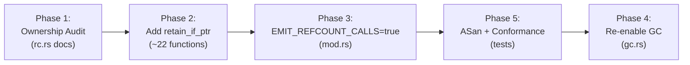
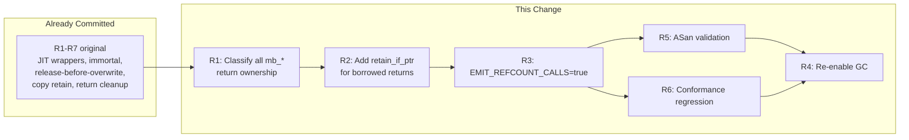

# Mamba Refcount Jit Spec

## Overview

Audit all mb_* runtime functions for return ownership semantics and fix borrowed-reference returns so that `EMIT_REFCOUNT_CALLS` can be enabled.

**Status**: JIT refcount infrastructure is committed (immortal refcount, `mb_retain_value`/`mb_release_value` wrappers, release-before-overwrite for all dest-writing instructions, Copy retain, return cleanup, container retain-on-store, cascading release-on-free). `EMIT_REFCOUNT_CALLS = false` in `mod.rs` — enabling causes heap-use-after-free.

**Root cause**: Runtime functions have mixed return ownership semantics. Some return **new references** (caller owns, rc=1): `mb_list_new()`, `mb_dict_new()`, `mb_str_concat()`. Others return **borrowed references** (container still owns, no incref): `mb_list_getitem()`, `mb_dict_getitem()`, `mb_getattr()`. When the JIT releases ALL local variables at function return (R3), borrowed references are released → rc drops to 0 → freed while container still holds the pointer → use-after-free.

**Fix**: For each mb_* function that returns `MbValue` → classify as new or borrowed reference. For borrowed references, add `mb_retain` on the returned value inside the runtime function body so callers always receive an **owned reference**. This matches CPython's convention where all public C API functions return new references (borrowing is only an internal optimization).

**Scope**:
1. Classify ~120 `mb_*` runtime functions (builtins, string_ops, list_ops, dict_ops, tuple_ops, iter, generator, closure, class, module, exception, async_rt)
2. Add `rc::retain_if_ptr(val)` calls for borrowed-reference returns
3. Set `EMIT_REFCOUNT_CALLS = true` in `codegen/cranelift/mod.rs`
4. Re-enable GC in `gc.rs` (`enabled: true`)
5. Verify with ASan — zero heap-use-after-free reports

Issue: #1129. Related: #1114, #653.
## Requirements

| ID | Title | Priority | Acceptance Criteria |
|----|-------|----------|---------------------|
| R1 | Classify all mb_* runtime functions returning MbValue | P0 | Create an ownership audit table covering every `mb_*` function registered in `runtime_symbols()` that returns `MbValue` (~80 functions). Classify each as: **new** (allocates or creates new MbObject, caller owns) or **borrowed** (returns pointer from existing container/global, container still owns). Document in `rc.rs` module-level comment. |
| R2 | Add retain_if_ptr for borrowed-reference returns | P0 | For each function classified as **borrowed** in R1, add `rc::retain_if_ptr(result)` before returning so the caller always receives an owned reference with rc incremented. Affected functions include: `mb_list_getitem`, `mb_dict_getitem`, `mb_tuple_getitem`, `mb_seq_getitem`, `mb_getattr`, `mb_global_get`, `mb_global_get_id`, `mb_cell_get`, `mb_closure_get_capture`, `mb_module_getattr`, `mb_import_from`, `mb_next`, `mb_next_raise`, `mb_generator_yield_value`, `mb_coroutine_get_local`, `mb_property_get`, `mb_super_getattr`, `mb_getattr_default`, `mb_dict_get`, `mb_dict_setdefault`, `mb_catch_exception`, `mb_catch_exception_instance`. |
| R3 | Enable EMIT_REFCOUNT_CALLS flag | P0 | Set `const EMIT_REFCOUNT_CALLS: bool = true` in `codegen/cranelift/mod.rs`. All JIT-compiled code now emits retain/release calls. Existing release-before-overwrite, Copy retain, and return cleanup logic activates. |
| R4 | Re-enable GC auto-collection | P1 | Set `GcState::new()` to `enabled: true` in `gc.rs`. Keep `threshold: 700`. With refcounting active, GC only collects cyclic garbage. |
| R5 | ASan validation — zero heap-use-after-free | P0 | Run full conformance test suite under AddressSanitizer with `EMIT_REFCOUNT_CALLS = true`. Zero heap-use-after-free, double-free, or use-after-scope reports. |
| R6 | No functional regression | P0 | All existing conformance tests (200+ fixtures) pass with identical output when `EMIT_REFCOUNT_CALLS = true`. No SIGBUS, SIGSEGV. |

### Constraints

- `retain_if_ptr(val: MbValue) -> MbValue` already exists in `rc.rs` — it checks `is_ptr()`, extracts `as_ptr()`, checks `rc != IMMORTAL_REFCOUNT`, then calls `mb_retain(ptr)`. Returns the same MbValue unchanged.
- Functions that return non-pointer MbValues (ints, bools, floats, None) are inherently safe — `retain_if_ptr` is a no-op for these
- Functions returning **new** references (allocating constructors like `mb_list_new`, `mb_str_concat`, `mb_dict_copy`, `mb_list_copy`, `mb_list_from_iterable`) must NOT add retain — they already return rc=1
- Void-returning functions (`mb_list_append`, `mb_dict_setitem`, etc.) are not in scope — they don't return MbValue
- Functions returning MbValue wrapping a NaN-boxed int/bool/float (e.g., `mb_len` returns `MbValue::from_int(n)`, `mb_is_truthy` returns i64) skip retain because `is_ptr()` returns false
- Phase ordering: R2 must complete before R3 (all borrows must be fixed before enabling the flag). R4 is gated on R5/R6 passing.
- `mb_list_pop` and `mb_list_pop_at` are special: they **remove** from container AND return — these are new references (container releases its ref, value survives with caller's ref)
## Scenarios

### S1: List getitem borrowed → owned reference (R2)

**GIVEN** JIT-compiled code:
```python
def foo():
    a = [1, 2, 3]
    x = a[0]
    return x
```
**WHEN** `foo()` returns and `mb_release_value` is called for local `a`
**THEN** The list `a` is freed (rc 1→0). Variable `x` (the return value) survives because `mb_list_getitem` called `retain_if_ptr` on the returned element before returning. Without the retain fix, `x` would be freed with `a` (use-after-free).

### S2: Dict getitem borrowed → owned reference (R2)

**GIVEN** JIT-compiled code:
```python
def bar():
    d = {"key": [1, 2]}
    v = d["key"]
    return v
```
**WHEN** `bar()` returns and `mb_release_value` is called for local `d`
**THEN** The dict `d` and its key string are freed. The list value `v` survives (return value, not released) with rc=1 because `mb_dict_getitem` retained it before returning.

### S3: Getattr borrowed → owned reference (R2)

**GIVEN** JIT-compiled code:
```python
class Foo:
    def __init__(self):
        self.items = [1, 2, 3]

def baz():
    f = Foo()
    result = f.items
    return result
```
**WHEN** `baz()` returns and `mb_release_value` is called for local `f`
**THEN** Instance `f` may be freed but `result` survives because `mb_getattr` retained the attribute value before returning.

### S4: Global get borrowed → owned reference (R2)

**GIVEN** JIT-compiled code:
```python
GLOBAL_LIST = [1, 2, 3]

def get_global():
    x = GLOBAL_LIST
    return x
```
**WHEN** `get_global()` returns and `mb_release_value` is called for local `x` (the return value transfers ownership, so only non-returned locals are released)
**THEN** `GLOBAL_LIST` is not freed. If called twice, the second call still sees the same list. `mb_global_get_id` retains the value so each access creates an owned reference.

### S5: Iterator next borrowed → owned reference (R2)

**GIVEN** JIT-compiled code:
```python
def iterate():
    items = [10, 20, 30]
    it = iter(items)
    first = next(it)
    return first
```
**WHEN** `iterate()` returns, releasing `items` and `it`
**THEN** `first` (value 10, NaN-boxed int) is not a pointer — `mb_release_value` is a no-op. For heap objects in a list (e.g., `[[1], [2], [3]]`), `mb_next` retains the returned element so it survives after the iterator/list is freed.

### S6: New-reference functions unchanged (R1)

**GIVEN** JIT-compiled code: `x = [1, 2]; y = sorted(x)`
**WHEN** `mb_sorted` is called
**THEN** `mb_sorted` returns a **new** list (rc=1). No `retain_if_ptr` added. When `y` is released at function return, rc drops to 0 and the new list is freed correctly.

### S7: Refcount-enabled conformance suite (R3, R5, R6)

**GIVEN** `EMIT_REFCOUNT_CALLS = true` in `mod.rs`, all borrowed-reference functions fixed (R2)
**WHEN** The full conformance test suite (200+ fixtures) runs under ASan
**THEN** All tests pass with identical output. Zero ASan reports (no heap-use-after-free, no double-free). Memory usage per test is bounded.

### S8: Closure capture get borrowed → owned (R2)

**GIVEN** JIT-compiled code:
```python
def outer():
    captured = [1, 2, 3]
    def inner():
        return captured
    return inner()
```
**WHEN** `inner()` accesses `captured` via `mb_closure_get_capture` and returns it
**THEN** The captured list survives because `mb_closure_get_capture` retains the value. The closure's cell still holds its reference. Both references are properly tracked.

### S9: Dict pop is new reference — no extra retain (R1)

**GIVEN** JIT-compiled code: `d = {"k": [1]}; v = d.pop("k")`
**WHEN** `mb_dict_pop` removes "k" from `d` and returns the value
**THEN** The value is a **new reference** — the dict released its ref and the value survives with rc=1 for the caller. No `retain_if_ptr` needed (would cause rc=2, leak).

### S10: GC collects cyclic garbage after refcount enable (R3, R4)

**GIVEN** `EMIT_REFCOUNT_CALLS = true`, `GcState.enabled = true`
**WHEN** JIT-compiled code creates a self-referencing list `a = []; a.append(a)` and `a` goes out of scope
**THEN** `mb_release_value` decrements rc to 1 (self-reference). GC cycle detects the unreachable cycle and frees `a`.
## Diagrams

### Interaction
<!-- type: interaction lang: mermaid -->
<!-- TODO -->

### Logic
<!-- type: logic lang: mermaid -->
<!-- TODO -->

### Dependencies
<!-- type: dependency lang: mermaid -->
<!-- TODO -->

### State Machine
<!-- type: state-machine lang: mermaid -->
<!-- TODO -->

### Data Model
<!-- type: db-model lang: mermaid -->
<!-- TODO -->

## API Spec

### REST API
<!-- type: rest-api lang: yaml -->
<!-- TODO -->

### RPC API
<!-- type: rpc-api lang: json -->
<!-- TODO -->

### Async API
<!-- type: async-api lang: yaml -->
<!-- TODO -->

### CLI
<!-- type: cli lang: yaml -->
<!-- TODO -->

### Schema
<!-- type: schema lang: json -->
<!-- TODO -->

### Config
<!-- type: config lang: json -->
<!-- TODO -->

## Test Plan

### Unit Tests (rc.rs — existing, verify no regression)

| Test | Validates | Description |
|------|-----------|-------------|
| `test_retain_if_ptr_int_noop` | R2 | `retain_if_ptr(MbValue::from_int(42))` — no crash, same value returned |
| `test_retain_if_ptr_heap_obj` | R2 | `retain_if_ptr` on heap list increments rc from 1→2 |
| `test_retain_if_ptr_immortal_noop` | R2 | `retain_if_ptr` on immortal string — rc stays IMMORTAL |
| `test_retain_if_ptr_none_noop` | R2 | `retain_if_ptr(MbValue::none())` — no crash |

### Integration Tests (per-module borrowed reference fixes)

| Test | Validates | Description |
|------|-----------|-------------|
| `test_list_getitem_owned_ref` | R2, S1 | `mb_list_getitem` returns owned ref — element survives after list freed |
| `test_dict_getitem_owned_ref` | R2, S2 | `mb_dict_getitem` returns owned ref — value survives after dict freed |
| `test_tuple_getitem_owned_ref` | R2 | `mb_tuple_getitem` returns owned ref |
| `test_getattr_owned_ref` | R2, S3 | `mb_getattr` returns owned ref — attribute survives after instance freed |
| `test_global_get_owned_ref` | R2, S4 | `mb_global_get_id` returns owned ref — global not corrupted by local release |
| `test_cell_get_owned_ref` | R2 | `mb_cell_get` returns owned ref |
| `test_closure_get_capture_owned_ref` | R2, S8 | `mb_closure_get_capture` returns owned ref |
| `test_next_owned_ref` | R2, S5 | `mb_next` returns owned ref — element survives after iter/list freed |
| `test_dict_get_owned_ref` | R2 | `mb_dict_get` returns owned ref |
| `test_module_getattr_owned_ref` | R2 | `mb_module_getattr` returns owned ref |
| `test_catch_exception_owned_ref` | R2 | `mb_catch_exception` returns owned ref |

### Conformance Regression

| Test | Validates | Description |
|------|-----------|-------------|
| `conformance_suite_refcount_enabled` | R3, R6 | Full suite with `EMIT_REFCOUNT_CALLS=true`. All 200+ tests pass |
| `conformance_suite_asan` | R5 | Full suite under ASan. Zero heap-use-after-free, double-free reports |

### Manual Verification

| Check | Validates | Description |
|-------|-----------|-------------|
| REPL memory stability | R3 | Run 100 REPL iterations with lists/dicts, monitor RSS — no monotonic growth |
| ASan full suite | R5 | `RUSTFLAGS="-Zsanitizer=address" cargo test` — zero reports |
## Changes

```yaml
files:
  # ── Phase 1: Ownership audit documentation in rc.rs ──
  - path: crates/mamba/src/runtime/rc.rs
    action: MODIFY
    desc: |
      Add module-level ownership audit table as doc comment (~line 1-80).
      Classifies every mb_* function registered in runtime_symbols() that
      returns MbValue as NEW (caller owns, rc=1) or BORROWED (container
      still owns, caller must retain before use).

      Classification categories:
        NEW: mb_list_new, mb_list_from, mb_list_from_iterable, mb_list_copy,
             mb_list_concat, mb_list_repeat, mb_list_pop, mb_list_pop_at,
             mb_list_to_tuple, mb_dict_new, mb_dict_from_pairs, mb_dict_copy,
             mb_dict_keys, mb_dict_values, mb_dict_items, mb_dict_pop,
             mb_set_new, mb_set_from_list, mb_set_from_iterable,
             mb_tuple_new, mb_tuple_from, mb_tuple_from_iterable,
             mb_str_concat, mb_str, mb_repr, mb_str_format, mb_str_join,
             mb_str_split, mb_str_upper, mb_str_lower, mb_str_replace,
             mb_str_strip, mb_str_lstrip, mb_str_rstrip, mb_str_encode,
             mb_bytes_decode, mb_bytes_new, mb_bytes_concat,
             mb_instance_new, mb_instance_new_with_init,
             mb_exception_new, mb_exception_new_with_args,
             mb_iter, mb_enumerate, mb_zip, mb_range,
             mb_closure_new, mb_cell_new,
             mb_generator_create, mb_frozenset_new,
             mb_sorted, mb_reversed, mb_list_comprehension,
             mb_dict_comprehension, mb_set_comprehension,
             mb_box_int, mb_box_bool, mb_box_float,
             mb_add, mb_sub, mb_mul, mb_truediv, mb_floordiv, mb_mod,
             mb_pow, mb_neg, mb_pos, mb_invert, mb_lshift, mb_rshift,
             mb_bitand, mb_bitor, mb_bitxor, mb_matmul,
             mb_eq, mb_ne, mb_lt, mb_le, mb_gt, mb_ge,
             mb_not, mb_is_truthy (returns i64, not MbValue)
        BORROWED: mb_list_getitem, mb_dict_getitem, mb_tuple_getitem,
             mb_seq_getitem, mb_getattr, mb_getattr_default,
             mb_global_get, mb_global_get_id, mb_cell_get,
             mb_closure_get_capture, mb_module_getattr, mb_import_from,
             mb_next, mb_next_raise, mb_generator_yield_value,
             mb_coroutine_get_local, mb_property_get, mb_super_getattr,
             mb_dict_get, mb_dict_setdefault,
             mb_catch_exception, mb_catch_exception_instance
        VOID: mb_list_append, mb_list_extend, mb_list_insert,
             mb_list_remove, mb_list_clear, mb_list_reverse, mb_list_sort,
             mb_dict_setitem, mb_dict_update, mb_dict_clear,
             mb_set_add, mb_set_discard, mb_set_remove, mb_set_clear,
             mb_setattr, mb_print, mb_gc_collect (not in scope)

  # ── Phase 2: Add retain_if_ptr to borrowed-reference returns ──
  - path: crates/mamba/src/runtime/list_ops.rs
    action: MODIFY
    desc: |
      Add rc::retain_if_ptr(result) before returning in:
        - mb_list_getitem (~line 105): returns element from list storage
          without incref. Add retain_if_ptr(val) before return.

      Note: mb_list_pop / mb_list_pop_at are NEW references (remove from
      container then return) — do NOT add retain.

  - path: crates/mamba/src/runtime/dict_ops.rs
    action: MODIFY
    desc: |
      Add rc::retain_if_ptr(result) before returning in:
        - mb_dict_getitem (~line 80): returns value from dict storage.
        - mb_dict_get (~line 285): returns value or default from dict.
        - mb_dict_setdefault (~line 305): returns existing or newly-set value.

      Note: mb_dict_pop is NEW reference — do NOT add retain.

  - path: crates/mamba/src/runtime/tuple_ops.rs
    action: MODIFY
    desc: |
      Add rc::retain_if_ptr(result) before returning in:
        - mb_tuple_getitem (~line 87): returns element from tuple storage.

  - path: crates/mamba/src/runtime/class.rs
    action: MODIFY
    desc: |
      Add rc::retain_if_ptr(result) before returning in:
        - mb_getattr: returns attribute value from instance __dict__ or
          class __dict__ — borrowed from the dict, needs retain.
        - mb_getattr_default: same as mb_getattr but returns default
          if not found.
        - mb_property_get: returns property value — borrowed from
          descriptor protocol.
        - mb_super_getattr: returns attribute from MRO parent — borrowed.

  - path: crates/mamba/src/runtime/closure.rs
    action: MODIFY
    desc: |
      Add rc::retain_if_ptr(result) before returning in:
        - mb_closure_get_capture: returns captured value from closure cell.
        - mb_cell_get: returns value stored in cell.
        - mb_global_get: returns value from global namespace dict.
        - mb_global_get_id: returns value from global namespace by id.

  - path: crates/mamba/src/runtime/iter.rs
    action: MODIFY
    desc: |
      Add rc::retain_if_ptr(result) before returning in:
        - mb_next: returns next element from iterator — element is
          borrowed from the underlying container.
        - mb_next_raise: same as mb_next but raises StopIteration.

  - path: crates/mamba/src/runtime/generator.rs
    action: MODIFY
    desc: |
      Add rc::retain_if_ptr(result) before returning in:
        - mb_generator_yield_value: returns yielded value from generator
          state — borrowed from generator's locals.
        - mb_coroutine_get_local: returns local variable from coroutine
          frame — borrowed.

  - path: crates/mamba/src/runtime/exception.rs
    action: MODIFY
    desc: |
      Add rc::retain_if_ptr(result) before returning in:
        - mb_catch_exception: returns caught exception from exception
          stack — borrowed from the runtime exception state.
        - mb_catch_exception_instance: returns exception instance —
          borrowed from exception state.

  - path: crates/mamba/src/runtime/module.rs
    action: MODIFY
    desc: |
      Add rc::retain_if_ptr(result) before returning in:
        - mb_module_getattr: returns attribute from module __dict__ —
          borrowed from module's namespace.
        - mb_import_from: returns attribute from imported module —
          borrowed.

  - path: crates/mamba/src/runtime/builtins.rs
    action: MODIFY
    desc: |
      Add rc::retain_if_ptr(result) before returning in:
        - mb_seq_getitem: dispatches to list/tuple/dict getitem —
          the dispatched getitem returns borrowed, so if this function
          wraps without retaining, add retain here.

      Verify NEW classification for: mb_sorted, mb_reversed, mb_map,
      mb_filter, mb_list_comprehension — these allocate new containers
      and must NOT add retain (would leak).

  # ── Phase 3: Enable refcount emission ──
  - path: crates/mamba/src/codegen/cranelift/mod.rs
    action: MODIFY
    desc: |
      Line 11: Change `const EMIT_REFCOUNT_CALLS: bool = false` to
      `const EMIT_REFCOUNT_CALLS: bool = true`.

      All conditional blocks gated on this flag (lines 246, 375, 385,
      620, 652) now activate — JIT-compiled code emits mb_retain_value
      and mb_release_value calls for Copy, StoreGlobal, StoreCell,
      Return, and LoadConst instructions.

  # ── Phase 4: Re-enable GC ──
  - path: crates/mamba/src/runtime/gc.rs
    action: MODIFY
    desc: |
      Line 50: Change `enabled: false` to `enabled: true` in
      GcState::new(). Keep threshold_allocs at 700.

      Update KI-1 comment (lines 46-49) to reflect that JIT refcounting
      is now active and the mitigation is resolved.

      Gated on Phase 2+3 being correct — must land after all
      borrowed-reference functions are fixed and ASan passes.

  # ── Phase 5: Tests ──
  - path: crates/mamba/tests/jit_refcount_audit_tests.rs
    action: CREATE
    desc: |
      New integration test file for the ownership audit changes.

      Tests:
        - test_list_getitem_owned_ref: Compile function that gets item
          from list, drops list, uses item — no use-after-free.
        - test_dict_getitem_owned_ref: Same pattern with dict.
        - test_tuple_getitem_owned_ref: Same pattern with tuple.
        - test_getattr_owned_ref: Access instance attribute, drop
          instance, use attribute — no use-after-free.
        - test_global_get_owned_ref: Access global, verify it survives
          function return cleanup.
        - test_closure_capture_owned_ref: Access captured variable,
          drop closure, use capture — no use-after-free.
        - test_iterator_next_owned_ref: Get next() from list iterator,
          drop iterator and list, use value.
        - test_new_ref_no_double_retain: Verify mb_list_new, mb_str_concat
          etc. still return rc=1 (no spurious retain added).
        - test_emit_refcount_enabled: Verify EMIT_REFCOUNT_CALLS is true
          and JIT-compiled code emits retain/release calls.
        - test_gc_enabled: Verify GcState::new().enabled == true.
        - test_conformance_with_refcount: Run conformance suite with
          refcounting enabled, all tests pass.
        - test_asan_clean: Run under ASan — zero reports.
```

### Phase Ordering



### Ownership Classification Summary

| Category | Count | Action |
|----------|-------|--------|
| NEW reference | ~60 | No change — already returns owned ref (rc=1) |
| BORROWED reference | ~22 | Add `rc::retain_if_ptr(result)` before return |
| VOID (no return) | ~30 | Not in scope |
| Non-pointer return (i64/f64) | ~20 | Not in scope — `retain_if_ptr` is no-op |
## Wireframe
<!-- type: wireframe lang: yaml -->

<!-- TODO -->

## Component
<!-- type: component lang: json -->

<!-- TODO -->

## Design Token
<!-- type: design-token lang: json -->

<!-- TODO -->

## Doc
<!-- type: doc lang: markdown -->

<!-- TODO -->


## Logic

```mermaid
flowchart TB
    subgraph audit["Ownership Audit Decision"]
        Fn["mb_* function returning MbValue"]
        Fn --> Q1{"Allocates new MbObject?\n(new_list, new_str, concat, copy)"}
        Q1 -->|Yes| New["NEW reference\nrc=1, caller owns\nNo change needed"]
        Q1 -->|No| Q2{"Removes from container?\n(pop, pop_at)"}
        Q2 -->|Yes| New
        Q2 -->|No| Q3{"Returns element from\ncontainer/global/cell?"}
        Q3 -->|Yes| Borrowed["BORROWED reference\nContainer still owns\nAdd retain_if_ptr"]
        Q3 -->|No| Q4{"Returns NaN-boxed\nint/bool/float/None?"}
        Q4 -->|Yes| Safe["Non-pointer value\nis_ptr()=false\nNo change needed"]
        Q4 -->|No| Borrowed
    end

    subgraph fix["retain_if_ptr Pattern"]
        Before["fn mb_X_getitem(container, idx) -> MbValue"]
        Before --> Lookup["let result = container.items[idx]"]
        Lookup --> Retain["rc::retain_if_ptr(result)"]
        Retain --> CheckPtr{"result.is_ptr()?"}
        CheckPtr -->|No| ReturnDirect["return result"]
        CheckPtr -->|Yes| CheckImm{"rc == IMMORTAL?"}
        CheckImm -->|Yes| ReturnDirect
        CheckImm -->|No| IncRC["mb_retain(ptr)\nrc += 1"]
        IncRC --> ReturnOwned["return result (now owned)"]
    end

    subgraph lifecycle["JIT Value Lifecycle with Audit Fix"]
        JITCall["JIT calls mb_list_getitem(list, 0)"]
        JITCall --> Runtime["Runtime: lookup list.items[0]"]
        Runtime --> RetainFix["retain_if_ptr(elem) — rc: 1→2"]
        RetainFix --> StoreVReg["JIT stores result in dest VReg"]
        StoreVReg --> FnReturn["Function return"]
        FnReturn --> ReleaseLocals["mb_release_value for each local"]
        ReleaseLocals --> ReleaseList["Release list → rc: 1→0 → freed\n(cascading release: elem rc: 2→1)"]
        ReleaseLocals --> ReleaseElem["Release elem (if not return val)\nrc: 1→0 → freed"]
    end
```



## Dependencies



# Reviews