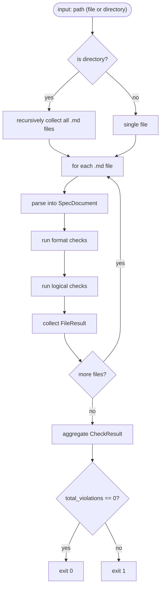
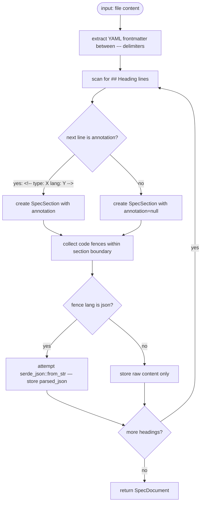
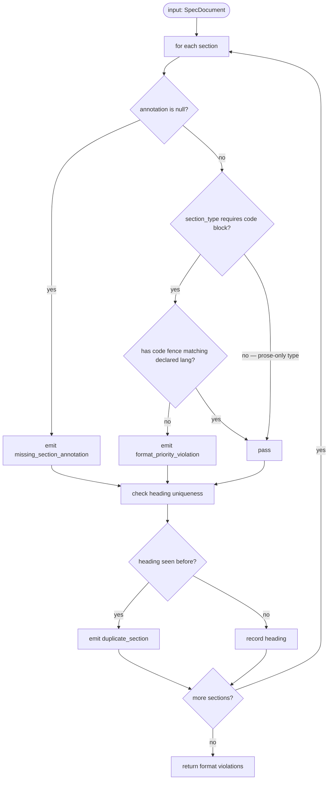
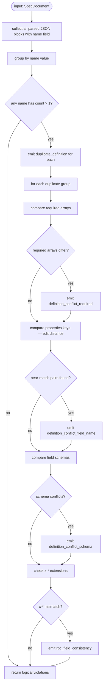

# Check Alignment

## Overview

Validates spec files for format compliance and logical consistency. Library function `spec_alignment::check()` callable from CLI (`cclab sdd check-alignment`), artifact tools (write-time), and merge workflow.

**Problem**: No automated spec format/content validation exists. Manual review of #1136 specs found 13 content gaps + 7 format violations. Agents generate malformed specs that pass through unchecked.

**Solution**: Two-layer validation:

| Layer | Rules | Method |
|-------|-------|--------|
| Format compliance | `missing_section_annotation`, `duplicate_section`, `format_priority_violation` | Parse structured section format (heading + `<!-- type: X lang: Y -->` annotation) |
| Logical consistency | `duplicate_definition`, `definition_conflict_required`, `definition_conflict_field_name`, `definition_conflict_schema`, `rpc_field_consistency` | Parse JSON/YAML blocks within sections, group by `name` field, compare across duplicates |

**Architecture**: Single `spec_alignment::check()` entry point. No regex for section parsing — uses structured heading + annotation format. JSON blocks parsed with `serde_json`. Output matches `validate-spec-structure` pattern (text + JSON, exit code 0/1).

**Scope boundary**: Phase 1 only — spec-internal validation. No code↔spec coverage (Phase 2 #1141), no workflow integration (Phase 3 #1142).
## Requirements

| ID | Requirement | Priority |
|----|-------------|----------|
| R1 | `SpecDocument` parser: parse spec `.md` files into structured representation — frontmatter (YAML), sections (heading + type annotation + content blocks). Section boundaries determined by `## Heading` + `<!-- type: X lang: Y -->` annotation. No regex for section splitting. | high |
| R2 | Format rule `missing_section_annotation`: every `## Heading` in a spec file must have a `<!-- type: X lang: Y -->` annotation on the next line. Violation emitted with heading name and line number. | high |
| R3 | Format rule `duplicate_section`: no duplicate `## Heading` text within a single file. Violation emitted with heading name and all line numbers. | high |
| R4 | Format rule `format_priority_violation`: sections with types that require a spec-lang code block (`config`→JSON, `logic`→mermaid, `rpc-api`→JSON, `state-machine`→mermaid, `cli`→YAML, `changes`→YAML, `schema`→JSON, `rest-api`→YAML, `async-api`→YAML, `db-model`→mermaid, `dependency`→mermaid, `interaction`→mermaid, `wireframe`→YAML, `component`→JSON, `design-token`→JSON) must contain at least one code fence matching the declared `lang`. Sections typed `overview`, `requirements`, `scenarios`, `test-plan`, `doc` are exempt (prose-only). | high |
| R5 | Logical rule `duplicate_definition`: within a single file, if multiple JSON blocks define objects with the same `name` field value (e.g., OpenRPC method name), emit violation with definition name and all block line numbers. | high |
| R6 | Logical rule `definition_conflict_required`: across duplicate definitions (same `name`), if `required` arrays differ, emit violation showing each block's `required` array. | medium |
| R7 | Logical rule `definition_conflict_field_name`: across duplicate definitions, if `properties` keys have near-matches (edit distance ≤ 2, e.g. `specs_merged` vs `merged_specs`), emit violation with both field names and their block locations. | medium |
| R8 | Logical rule `definition_conflict_schema`: across duplicate definitions, if the same property key has different `type`, `enum`, or `format` values, emit violation with field name and differing schemas. | medium |
| R9 | Logical rule `rpc_field_consistency`: across duplicate OpenRPC definitions, `x-*` extension field values must be identical. Emit violation on mismatch. | low |
| R10 | Library function `spec_alignment::check(path) -> CheckResult` callable from CLI, artifact tools, and merge workflow. Returns structured result with file path, pass/fail, and violation list. | high |
| R11 | CLI command `cclab sdd check-alignment [path]` — optional positional path (file or directory). If directory, recursively check all `.md` files. If omitted, defaults to `cclab/specs/`. | high |
| R12 | Output format: text mode (default) prints `OK` or `FAIL` per file with indented violation lines. `--json` flag emits JSON array. Exit code 0 if all files pass, non-zero if any violations. | high |
| R13 | Zero false positives on well-formed specs. Prose content in sections is allowed — the check validates spec-lang block presence, not prose absence. | high |
## Scenarios

### Scenario: Clean spec file passes all checks
- **GIVEN** a spec file with all `## Heading` lines followed by `<!-- type: X lang: Y -->` annotations, no duplicate headings, all required code blocks present, no duplicate JSON definitions
- **WHEN** `spec_alignment::check(path)` is called
- **THEN** result is `pass` with empty violations list
- **AND** CLI prints `OK  {filename}` and exits 0

### Scenario: Missing section annotation detected
- **GIVEN** a spec file where `## Commands` (line 32) has no `<!-- type: ... -->` annotation
- **WHEN** `spec_alignment::check(path)` is called
- **THEN** violation emitted: `{ kind: "missing_section_annotation", heading: "Commands", line: 32 }`

### Scenario: Duplicate section heading detected
- **GIVEN** a spec file with `## Overview` appearing at lines 10 and 45
- **WHEN** `spec_alignment::check(path)` is called
- **THEN** violation emitted: `{ kind: "duplicate_section", heading: "Overview", lines: [10, 45] }`

### Scenario: Format priority violation — missing code block
- **GIVEN** a spec file where `## Config` has `<!-- type: config lang: json -->` annotation but contains only prose (no ` ```json ` code fence)
- **WHEN** `spec_alignment::check(path)` is called
- **THEN** violation emitted: `{ kind: "format_priority_violation", heading: "Config", expected_lang: "json", line: <heading_line> }`

### Scenario: Prose-only sections are exempt from code block requirement
- **GIVEN** a spec file where `## Overview` has `<!-- type: overview lang: markdown -->` and contains only prose
- **WHEN** `spec_alignment::check(path)` is called
- **THEN** no `format_priority_violation` emitted for that section

### Scenario: Duplicate JSON definition detected
- **GIVEN** a spec file with 3 JSON blocks each containing `{ "name": "sdd_workflow_create_change_merge", ... }` at lines 305, 377, 498
- **WHEN** `spec_alignment::check(path)` is called
- **THEN** violation emitted: `{ kind: "duplicate_definition", name: "sdd_workflow_create_change_merge", lines: [305, 377, 498] }`

### Scenario: Conflicting required arrays across duplicate definitions
- **GIVEN** two JSON blocks with `name: "sdd_workflow_create_change_merge"` where block 1 has `required: ["status", "specs_merged", "audit_log"]` and block 2 has `required: ["status", "merged_specs"]`
- **WHEN** `spec_alignment::check(path)` is called
- **THEN** violation emitted: `{ kind: "definition_conflict_required", name: "sdd_workflow_create_change_merge", blocks: [{line: ..., required: [...]}, {line: ..., required: [...]}] }`

### Scenario: Field name near-match detected
- **GIVEN** duplicate definitions where block 1 has property `specs_merged` and block 2 has property `merged_specs` (edit distance = 2)
- **WHEN** `spec_alignment::check(path)` is called
- **THEN** violation emitted: `{ kind: "definition_conflict_field_name", pairs: [["specs_merged", "merged_specs"]] }`

### Scenario: Schema type conflict detected
- **GIVEN** duplicate definitions where field `status` is `{ type: "string" }` in block 1 and `{ type: "string", enum: ["ok", "error"] }` in block 2
- **WHEN** `spec_alignment::check(path)` is called
- **THEN** violation emitted: `{ kind: "definition_conflict_schema", field: "status" }`

### Scenario: Directory path checks all .md files recursively
- **GIVEN** `cclab/specs/crates/cclab-sdd/` contains 5 spec `.md` files, 2 with violations
- **WHEN** `cclab sdd check-alignment cclab/specs/crates/cclab-sdd/` is run
- **THEN** output shows `FAIL` for 2 files with violations indented, `OK` for 3 clean files
- **AND** exits non-zero

### Scenario: JSON output mode
- **GIVEN** a spec file with 2 violations
- **WHEN** `cclab sdd check-alignment --json {path}` is run
- **THEN** output is a JSON array of violation objects
- **AND** exits non-zero

### Scenario: No path defaults to cclab/specs/
- **GIVEN** no positional path argument provided
- **WHEN** `cclab sdd check-alignment` is run
- **THEN** recursively checks all `.md` files under `cclab/specs/`
## Diagrams

### Interaction
<!-- type: interaction lang: mermaid -->
<!-- TODO -->

### Logic
<!-- type: logic lang: mermaid -->
<!-- TODO -->

### Dependencies
<!-- type: dependency lang: mermaid -->
<!-- TODO -->

### State Machine
<!-- type: state-machine lang: mermaid -->
<!-- TODO -->

### Data Model
<!-- type: db-model lang: mermaid -->
<!-- TODO -->

## API Spec

### REST API
<!-- type: rest-api lang: yaml -->
<!-- TODO -->

### RPC API
<!-- type: rpc-api lang: json -->
<!-- TODO -->

### Async API
<!-- type: async-api lang: yaml -->
<!-- TODO -->

### CLI
<!-- type: cli lang: yaml -->
<!-- TODO -->

### Schema
<!-- type: schema lang: json -->
<!-- TODO -->

### Config
<!-- type: config lang: json -->
<!-- TODO -->

## Test Plan

| Test | Category | Input | Expected | Covers |
|------|----------|-------|----------|--------|
| `test_parse_spec_document_with_frontmatter` | unit | `.md` with YAML frontmatter + 3 annotated sections | `SpecDocument` with 3 `SpecSection` entries, annotations parsed | R1 |
| `test_parse_section_without_annotation` | unit | `## Heading` followed by content (no annotation comment) | `SpecSection.annotation == None` | R1, R2 |
| `test_parse_code_blocks_within_section` | unit | Section with 2 code fences (json + yaml) | 2 `CodeBlock` entries with correct lang and content | R1 |
| `test_parse_json_code_block` | unit | JSON code fence with valid JSON | `CodeBlock.parsed_json` is `Some(...)` | R1, R5 |
| `test_parse_invalid_json_code_block` | unit | JSON code fence with malformed JSON | `CodeBlock.parsed_json` is `None`, no error | R1 |
| `test_missing_section_annotation` | unit | File with `## Foo` without annotation | 1 violation: `missing_section_annotation` | R2 |
| `test_duplicate_section_heading` | unit | File with `## Overview` at lines 10 and 45 | 1 violation: `duplicate_section` with `lines: [10, 45]` | R3 |
| `test_format_priority_violation_config_no_json` | unit | `type: config lang: json` section with prose only | 1 violation: `format_priority_violation` | R4 |
| `test_format_priority_violation_logic_no_mermaid` | unit | `type: logic lang: mermaid` section with prose only | 1 violation: `format_priority_violation` | R4 |
| `test_prose_only_section_exempt` | unit | `type: overview lang: markdown` with prose only | 0 violations | R4, R13 |
| `test_duplicate_definition_same_name` | unit | 2 JSON blocks with `name: "foo"` | 1 violation: `duplicate_definition` | R5 |
| `test_definition_conflict_required` | unit | 2 blocks same name, different `required` arrays | 1 violation: `definition_conflict_required` | R6 |
| `test_definition_conflict_field_name_near_match` | unit | Blocks with `specs_merged` vs `merged_specs` | 1 violation: `definition_conflict_field_name` | R7 |
| `test_definition_conflict_schema_type_mismatch` | unit | Same field, different `type` values | 1 violation: `definition_conflict_schema` | R8 |
| `test_rpc_field_consistency_x_extension` | unit | Blocks with differing `x-sdd` values | 1 violation: `rpc_field_consistency` | R9 |
| `test_check_single_file` | integration | Well-formed `.md` file path | `CheckResult.passed == true` | R10 |
| `test_check_directory_recursive` | integration | Directory with 3 `.md` files (1 with violations) | `CheckResult` with 3 `FileResult` entries, 1 fail | R10, R11 |
| `test_cli_text_output_format` | integration | File with 2 violations | Text output: `FAIL {path}\n  {kind}: {msg}` | R12 |
| `test_cli_json_output_format` | integration | File with violations + `--json` flag | Valid JSON matching `CheckResult` schema | R12 |
| `test_cli_exit_code_clean` | integration | Directory of clean specs | Exit code 0 | R12 |
| `test_cli_exit_code_violations` | integration | Directory with violations | Exit code 1 | R12 |
| `test_zero_false_positives_on_existing_specs` | acceptance | Run against `cclab/specs/crates/cclab-sdd/logic/spec-structure.md` (known clean) | 0 violations | R13 |
| `test_catches_1136_violations` | acceptance | Spec files reproducing #1136 violations (4 dup Overview, 3 conflicting RPC defs, missing annotations) | All violations detected | R2-R9 |
## Changes

```yaml
changes:
  - path: crates/cclab-sdd/src/spec_alignment/mod.rs
    action: create
    description: "Module root — re-exports check(), parser, rules"

  - path: crates/cclab-sdd/src/spec_alignment/parser.rs
    action: create
    description: "SpecDocument parser — frontmatter extraction, section splitting by ## heading + annotation, code block collection, JSON parsing"

  - path: crates/cclab-sdd/src/spec_alignment/models.rs
    action: create
    description: "Data types: SpecDocument, SpecSection, CodeBlock, Violation, ViolationKind, FileResult, CheckResult"

  - path: crates/cclab-sdd/src/spec_alignment/format_rules.rs
    action: create
    description: "Format compliance rules: missing_section_annotation, duplicate_section, format_priority_violation"

  - path: crates/cclab-sdd/src/spec_alignment/logical_rules.rs
    action: create
    description: "Logical consistency rules: duplicate_definition, definition_conflict_required, definition_conflict_field_name, definition_conflict_schema, rpc_field_consistency"

  - path: crates/cclab-sdd/src/spec_alignment/check.rs
    action: create
    description: "Entry point spec_alignment::check(path) — orchestrates parse → format checks → logical checks → aggregate results"

  - path: crates/cclab-sdd/src/lib.rs
    action: modify
    description: "Add pub mod spec_alignment"

  - path: crates/cclab-sdd-cli/src/commands.rs
    action: modify
    description: "Add CheckAlignment subcommand to SddCommand enum"

  - path: crates/cclab-sdd-cli/src/check_alignment.rs
    action: create
    description: "CLI handler — parse args, call spec_alignment::check(), format output (text/json), set exit code"

  - path: crates/cclab-sdd/tests/spec_alignment_tests.rs
    action: create
    description: "Unit + integration tests per test-plan table"
```
## Wireframe
<!-- type: wireframe lang: yaml -->

<!-- TODO -->

## Component
<!-- type: component lang: json -->

<!-- TODO -->

## Design Token
<!-- type: design-token lang: json -->

<!-- TODO -->

## Doc
<!-- type: doc lang: markdown -->

<!-- TODO -->


## Schema

```json
{
  "$schema": "https://json-schema.org/draft/2020-12/schema",
  "$id": "check-alignment",
  "title": "CheckAlignment",
  "description": "Data models for spec format validation and logical consistency checking",
  "definitions": {
    "SpecDocument": {
      "description": "Parsed representation of a spec .md file",
      "type": "object",
      "required": ["path", "frontmatter", "sections"],
      "properties": {
        "path": { "type": "string", "description": "File path relative to project root" },
        "frontmatter": {
          "type": "object",
          "description": "Parsed YAML frontmatter (id, main_spec_ref, etc.)",
          "additionalProperties": true
        },
        "sections": {
          "type": "array",
          "items": { "$ref": "#/definitions/SpecSection" }
        }
      }
    },
    "SpecSection": {
      "description": "A single section parsed from heading + annotation + content",
      "type": "object",
      "required": ["heading", "line"],
      "properties": {
        "heading": { "type": "string", "description": "Heading text (without ## prefix)" },
        "line": { "type": "integer", "description": "Line number of the ## heading" },
        "annotation": {
          "oneOf": [
            {
              "type": "object",
              "required": ["section_type", "lang"],
              "properties": {
                "section_type": { "type": "string", "description": "Declared section type (e.g. overview, config, logic)" },
                "lang": { "type": "string", "description": "Declared lang (e.g. markdown, json, mermaid, yaml)" }
              }
            },
            { "type": "null", "description": "Missing annotation" }
          ]
        },
        "code_blocks": {
          "type": "array",
          "items": { "$ref": "#/definitions/CodeBlock" },
          "description": "Fenced code blocks found within this section"
        }
      }
    },
    "CodeBlock": {
      "description": "A fenced code block within a section",
      "type": "object",
      "required": ["lang", "line", "content"],
      "properties": {
        "lang": { "type": "string", "description": "Code fence language (json, yaml, mermaid, etc.)" },
        "line": { "type": "integer", "description": "Line number of opening fence" },
        "content": { "type": "string", "description": "Raw content between fences" },
        "parsed_json": {
          "description": "Parsed JSON value if lang=json and content is valid JSON, null otherwise",
          "oneOf": [{ "type": "object" }, { "type": "array" }, { "type": "null" }]
        }
      }
    },
    "ViolationKind": {
      "type": "string",
      "enum": [
        "missing_section_annotation",
        "duplicate_section",
        "format_priority_violation",
        "duplicate_definition",
        "definition_conflict_required",
        "definition_conflict_field_name",
        "definition_conflict_schema",
        "rpc_field_consistency"
      ]
    },
    "Violation": {
      "description": "A single validation violation",
      "type": "object",
      "required": ["kind", "message"],
      "properties": {
        "kind": { "$ref": "#/definitions/ViolationKind" },
        "message": { "type": "string", "description": "Human-readable violation message" },
        "heading": { "type": "string", "description": "Section heading (for format rules)" },
        "line": { "type": "integer", "description": "Primary line number" },
        "lines": {
          "type": "array",
          "items": { "type": "integer" },
          "description": "Multiple line numbers (for duplicates)"
        },
        "name": { "type": "string", "description": "Definition name (for logical rules)" },
        "expected_lang": { "type": "string", "description": "Expected code fence lang (for format_priority_violation)" },
        "field": { "type": "string", "description": "Field name (for schema/field conflicts)" },
        "details": {
          "type": "object",
          "description": "Additional context (differing required arrays, schema values, etc.)",
          "additionalProperties": true
        }
      }
    },
    "FileResult": {
      "description": "Check result for a single file",
      "type": "object",
      "required": ["path", "status", "violations"],
      "properties": {
        "path": { "type": "string" },
        "status": { "type": "string", "enum": ["ok", "fail"] },
        "violations": {
          "type": "array",
          "items": { "$ref": "#/definitions/Violation" }
        }
      }
    },
    "CheckResult": {
      "description": "Aggregate result from spec_alignment::check()",
      "type": "object",
      "required": ["files", "total_violations", "passed"],
      "properties": {
        "files": {
          "type": "array",
          "items": { "$ref": "#/definitions/FileResult" }
        },
        "total_violations": { "type": "integer", "minimum": 0 },
        "passed": { "type": "boolean", "description": "true if total_violations == 0" }
      }
    }
  }
}
```


## Logic

### Check Pipeline



### SpecDocument Parsing



### Format Checks



### Logical Checks




## CLI

```yaml
cclab sdd check-alignment:
  args:
    path:
      type: string
      required: false
      description: "File or directory path to check. If directory, recursively checks all .md files. Defaults to cclab/specs/ if omitted."
  flags:
    --json:
      type: bool
      default: false
      description: "Emit results as JSON array instead of text"
  behavior:
    - Resolve path: if omitted, use {project_root}/cclab/specs/
    - If path is a file, check that single file
    - If path is a directory, recursively find all .md files and check each
    - Run spec_alignment::check() on collected files
    - Text output (default): print OK/FAIL per file, indented violations under FAIL lines
    - JSON output (--json): print CheckResult as JSON
    - Exit 0 if all files pass, exit 1 if any violations
  output_format:
    text: |
      FAIL  {relative_path}
        {violation_kind}: {message}
        {violation_kind}: {message}
      OK    {relative_path}
    json: |
      {
        "files": [{"path": "...", "status": "ok|fail", "violations": [...]}],
        "total_violations": N,
        "passed": true|false
      }
  exit_codes:
    0: "All files passed — no violations"
    1: "One or more violations found"
```

# Reviews
