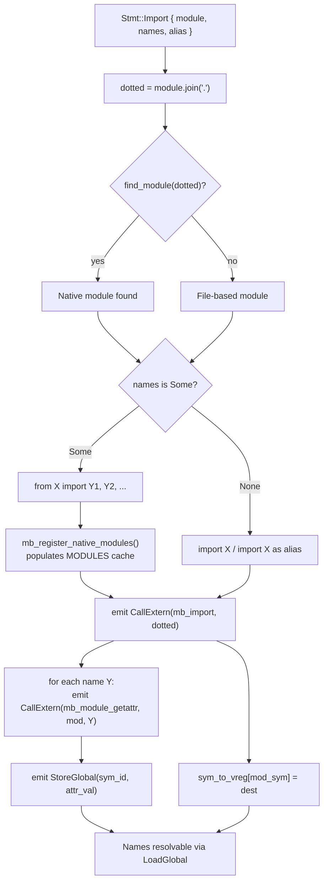

# Native Import Resolution

## Overview

Wire the compiler's import resolution pipeline to the `MAMBA_MODULES` distributed slice and `RuntimeSymbol` registry so that native module imports (`from cclab.log import get_logger`) resolve to FFI function pointers instead of the default 0.0 float value.

Currently, `Stmt::Import` is a no-op in the resolver (`resolve/pass.rs:251`), and `HirStmt::Import` lowering in `hir_to_mir.rs:1679` only calls `mb_import()` which searches file-based modules — never querying `MAMBA_MODULES`. Meanwhile, `register_external_modules()` injects `RuntimeSymbol` entries into the Cranelift JIT symbol table by Python name, but nothing bridges the imported name's `SymbolId` to the FFI function pointer at runtime.

The fix spans three layers:

| Layer | Gap | Fix |
|-------|-----|-----|
| Resolver (`resolve/pass.rs`) | `Stmt::Import` is a no-op — imported names never enter symbol table | Query `find_module()` for native modules, define imported names as `SymbolKind::NativeFunction` with FFI name metadata |
| HIR→MIR lowering (`lower/hir_to_mir.rs`) | `HirStmt::Import` emits `CallExtern("mb_import")` for all imports — no native path | For native imports, emit `StoreGlobal(sym_id, ffi_func_ptr)` to populate `GLOBAL_ID_NAMESPACE` with the FFI function pointer |
| Runtime (`runtime/module.rs`) | `mb_import()` only searches file-based modules and stdlib | Add `mb_register_native_modules()` that iterates `MAMBA_MODULES`, calls `register()`, and populates the runtime module cache so `mb_import_from()` can extract symbols |

### Scope

| Layer | Files | Change |
|-------|-------|--------|
| Registry | `cclab-mamba-registry/src/lib.rs` | Ensure `RuntimeSymbol.name` is the Python-visible name (already documented, verify rt_sym! usages) |
| Resolver | `resolve/pass.rs` | Process `Stmt::Import` — query `find_module()`, define native symbols |
| HIR→MIR | `lower/hir_to_mir.rs` | Detect native imports, emit `StoreGlobal` with FFI func ptr |
| Runtime | `runtime/module.rs` | `mb_register_native_modules()` — populate module cache from `MAMBA_MODULES` |
| Driver | `driver/mod.rs` | Call `mb_register_native_modules()` before compilation |
| Codegen | `codegen/cranelift/jit.rs` | No change (existing `register_external_modules()` already injects symbols) |
## Requirements

### R1 - Register Native Modules in Runtime Module Cache

```yaml
id: R1
priority: high
```

Add `mb_register_native_modules()` in `runtime/module.rs` that iterates `all_modules()` from `MAMBA_MODULES`, calls each module's `register()` to collect `RuntimeSymbol` entries, and inserts them into the `MODULES` thread-local cache as `MbModule` instances with `attrs` populated from the symbol's Python name → FFI function pointer mapping. This makes native modules discoverable by `mb_import()` and `mb_import_from()`.

The driver (`driver/mod.rs`) must call `mb_register_native_modules()` during initialization (before compilation), alongside the existing `mb_register_builtins()`.

### R2 - Resolve Native Import Names in Symbol Table

```yaml
id: R2
priority: high
```

In `resolve/pass.rs`, the `Stmt::Import` arm must no longer be a no-op. For `from X import Y` statements:

1. Join module path to dotted name (e.g., `["cclab", "log"]` → `"cclab.log"`)
2. Call `find_module(&dotted)` to check if it's a native module
3. If native: for each imported name `Y`, define `Y` in the symbol table as `SymbolKind::Variable` (consistent with how Python treats imported names as regular bindings)
4. If not native: still define imported names in the symbol table (they'll be resolved at runtime by `mb_import`)

For bare `import X` statements, define the module name (or alias) in the symbol table.

### R3 - Lower Native From-Import to Global Store

```yaml
id: R3
priority: high
```

In `hir_to_mir.rs`, the `HirStmt::Import` lowering must handle `from X import Y` (the `names` variant):

1. Emit `CallExtern("mb_import", mod_name)` to load the module (now works for native modules via R1)
2. For each imported name `Y`:
   a. Emit `CallExtern("mb_module_getattr", mod_name, Y)` to extract the symbol's value from the module
   b. Look up the `SymbolId` for `Y` (or alias) from the symbol table
   c. Emit `StoreGlobal(sym_id, attr_value)` to populate `GLOBAL_ID_NAMESPACE` so subsequent `LoadGlobal(sym_id)` returns the function pointer
   d. Also store in `sym_to_vreg` so the same compilation unit can reference the name

### R4 - Store FFI Function Pointers as MbValue

```yaml
id: R4
priority: high
```

Native module `attrs` must store FFI function pointers as callable `MbValue` instances. When `mb_register_native_modules()` populates module attrs, each `RuntimeSymbol.func_ptr` (a `usize`) must be wrapped in an `MbValue` that the JIT can later invoke via `CallExtern` or `CallIndirect`.

The wrapping strategy: store the function pointer as `MbValue::from_func_ptr(ptr)` (or equivalent), so that when the codegen encounters a call like `get_logger("test")`, it can extract the raw pointer and emit an indirect call.

### R5 - Python-Name to FFI-Name Consistency

```yaml
id: R5
priority: medium
```

Verify that `RuntimeSymbol.name` contains the **Python-visible name** (e.g., `"get_logger"`) in all binding crates. The `rt_sym!()` macro's first argument must be the Python name, not the FFI symbol name (e.g., NOT `"mb_log_get_logger"`). Audit and fix all `rt_sym!()` call sites in:

- `cclab-log-mamba`
- `cclab-api-mamba`
- `cclab-runtime-mamba`
- Any other `-mamba` binding crates

The FFI symbol name is derived from the function pointer argument and is separately registered in the JIT via `register_external_modules()`.

### R6 - Expose Filtering Integration

```yaml
id: R6
priority: medium
```

`check_native_imports()` in `driver/mod.rs` already validates imports against the `mamba.toml` expose list. This must continue to work correctly with the new resolution path. The expose check runs before compilation; the resolver's native import handling (R2) runs during compilation. Both must agree on which symbols are accessible. No new filtering logic needed — existing `check_native_imports()` is sufficient.
## Scenarios

### Scenario: From-import resolves native function to FFI pointer

- **GIVEN** a mamba script: `from cclab.log import get_logger`
- **AND** `cclab-log-mamba` registers `RuntimeSymbol { name: "get_logger", func_ptr: mb_log_get_logger as usize }`
- **WHEN** the script is compiled and executed
- **THEN** `get_logger` resolves to the `mb_log_get_logger` FFI function pointer (not 0.0)
- **AND** `print(get_logger)` outputs a function representation (not `0.0`)

### Scenario: Calling an imported native function invokes FFI

- **GIVEN** a mamba script: `from cclab.log import get_logger; logger = get_logger("test")`
- **WHEN** executed
- **THEN** `get_logger("test")` invokes `mb_log_get_logger` via FFI
- **AND** `logger` is a valid Logger object (not `None`)

### Scenario: Multiple names from single native module

- **GIVEN** `from cclab.log import get_logger, Logger, configure_logging`
- **WHEN** the resolver processes the import
- **THEN** all three names are defined in the symbol table
- **AND** each resolves to its respective FFI function pointer at runtime

### Scenario: Import with alias

- **GIVEN** `from cclab.log import get_logger as gl`
- **WHEN** compiled and executed
- **THEN** `gl` resolves to the `mb_log_get_logger` FFI function pointer
- **AND** `get_logger` is NOT defined in scope

### Scenario: Bare import of native module

- **GIVEN** `import cclab.log`
- **WHEN** compiled and executed
- **THEN** `cclab` (the first module path component) is bound to the module dict
- **AND** `cclab.log.get_logger` attribute access returns the FFI function pointer

### Scenario: Non-native import is unaffected

- **GIVEN** `import json` (stdlib, not a native module)
- **WHEN** compiled and executed
- **THEN** resolution follows the existing file-based `mb_import()` path
- **AND** `json.dumps` works as before

### Scenario: Expose filtering blocks unlisted symbol

- **GIVEN** `mamba.toml` with `[crates.cclab-log-mamba].expose = ["get_logger"]`
- **AND** script: `from cclab.log import configure_logging`
- **WHEN** `check_native_imports()` runs
- **THEN** ImportError: `symbol 'configure_logging' is not in expose list for 'cclab.log'`

### Scenario: Native import in single-file mode (no project)

- **GIVEN** `cclab mamba run test.py` without a `mamba.toml` project
- **AND** script contains `from cclab.log import get_logger`
- **WHEN** compiled
- **THEN** native modules are still resolvable (no expose filtering without project config)
- **AND** `get_logger` resolves to the FFI function pointer

### Scenario: Undefined name error for non-existent symbol in native module

- **GIVEN** `from cclab.log import nonexistent_function`
- **AND** `cclab.log` is a valid native module but has no symbol `nonexistent_function`
- **WHEN** compiled
- **THEN** compile error or runtime `None` (consistent with module attrs behavior)
## Diagrams

### Interaction
<!-- type: interaction lang: mermaid -->
<!-- TODO -->

### Logic
<!-- type: logic lang: mermaid -->
<!-- TODO -->

### Dependencies
<!-- type: dependency lang: mermaid -->
<!-- TODO -->

### State Machine
<!-- type: state-machine lang: mermaid -->
<!-- TODO -->

### Data Model
<!-- type: db-model lang: mermaid -->
<!-- TODO -->

## API Spec

### REST API
<!-- type: rest-api lang: yaml -->
<!-- TODO -->

### RPC API
<!-- type: rpc-api lang: json -->
<!-- TODO -->

### Async API
<!-- type: async-api lang: yaml -->
<!-- TODO -->

### CLI
<!-- type: cli lang: yaml -->
<!-- TODO -->

### Schema
<!-- type: schema lang: json -->
<!-- TODO -->

### Config
<!-- type: config lang: json -->
<!-- TODO -->

## Test Plan
<!-- type: test-plan lang: markdown -->

<!-- TODO -->

## Changes

```yaml
changes:
  - file: crates/mamba/src/runtime/module.rs
    action: modify
    description: |
      Add mb_register_native_modules() that iterates all_modules() from MAMBA_MODULES,
      calls register() on each, and inserts into MODULES thread-local cache as MbModule
      with attrs mapping python_name -> MbValue::from_func_ptr(func_ptr). (R1)

  - file: crates/mamba/src/resolve/pass.rs
    action: modify
    description: |
      Replace the no-op `Stmt::Import { .. } => {}` arm with logic that:
      1. For `from X import Y` — defines each imported name Y (or alias) in the symbol
         table as SymbolKind::Variable
      2. For bare `import X` — defines the module name (or alias) in the symbol table
      This ensures imported names have valid SymbolIds for LoadGlobal codegen. (R2)

  - file: crates/mamba/src/lower/hir_to_mir.rs
    action: modify
    description: |
      Extend HirStmt::Import lowering (line 1679) to handle `from X import Y`:
      1. Call mb_import(mod_name) as before
      2. For each imported name, emit CallExtern("mb_module_getattr", mod_name, name)
      3. Look up SymbolId for the imported name (or alias)
      4. Emit StoreGlobal(sym_id, attr_value) to bridge module attrs → GLOBAL_ID_NAMESPACE
      5. Store in sym_to_vreg for in-compilation references. (R3)

  - file: crates/mamba/src/driver/mod.rs
    action: modify
    description: |
      Call mb_register_native_modules() in the run() method before compilation,
      alongside existing mb_register_builtins() call. This populates the runtime module
      cache with native module entries so mb_import()/mb_import_from() find them. (R1)

  - file: crates/cclab-mamba-registry/src/lib.rs
    action: verify
    description: |
      Verify RuntimeSymbol.name contains Python-visible names in all rt_sym!() usages.
      The struct definition already documents this as "Python-visible name" — confirm
      binding crates comply. Fix any that use FFI names instead. (R5)

  - file: crates/cclab-log-mamba/src/lib.rs
    action: verify
    description: |
      Audit rt_sym!() calls — first arg must be Python name ("get_logger", "Logger",
      "configure_logging"), not FFI name ("mb_log_get_logger"). Fix if needed. (R5)

  - file: crates/cclab-api-mamba/src/lib.rs
    action: verify
    description: |
      Audit rt_sym!() calls — first arg must be Python name. Fix if needed. (R5)

  - file: crates/cclab-runtime-mamba/src/lib.rs
    action: verify
    description: |
      Audit rt_sym!() calls — first arg must be Python name. Fix if needed. (R5)

  - file: tests/fixtures/native_import_basic.py
    action: add
    description: |
      Fixture test: from cclab.log import get_logger; print(get_logger); logger = get_logger("test"); print(logger)
      Expected: non-zero function repr + valid Logger object. (R1, R2, R3)

  - file: tests/fixtures/native_import_multi.py
    action: add
    description: |
      Fixture test: from cclab.log import get_logger, Logger; print(get_logger); print(Logger)
      Expected: both resolve to valid function pointers. (R2, R3)

  - file: tests/fixtures/native_import_alias.py
    action: add
    description: |
      Fixture test: from cclab.log import get_logger as gl; print(gl)
      Expected: gl resolves to get_logger FFI pointer. (R2, R3)
```
## Wireframe
<!-- type: wireframe lang: yaml -->

<!-- TODO -->

## Component
<!-- type: component lang: json -->

<!-- TODO -->

## Design Token
<!-- type: design-token lang: json -->

<!-- TODO -->

## Doc
<!-- type: doc lang: markdown -->

<!-- TODO -->


## Logic

Native import resolution decision flowchart — determines whether an import is native (MAMBA_MODULES) or file-based, and routes accordingly.



# Reviews
