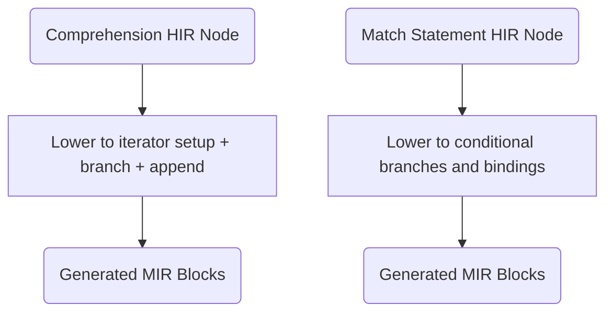
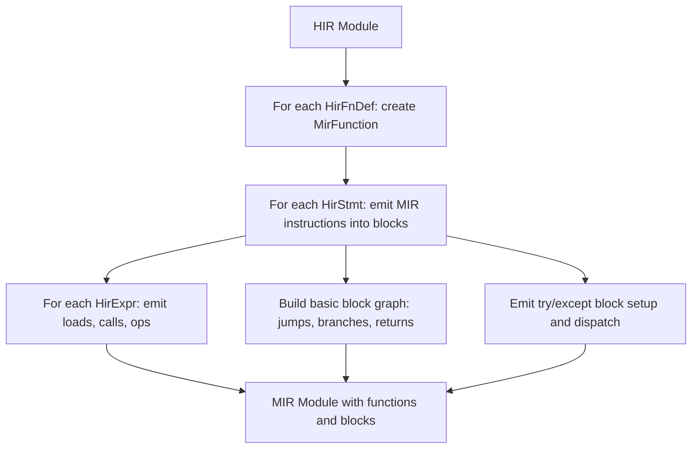

# HIR to MIR Lowering

## Overview

This specification defines the HIR-to-MIR transformation pass, the largest and most complex pass in the Mamba compiler. It translates desugared HIR nodes into MIR instructions: variable loads/stores, function calls to `mb_*` runtime functions, explicit control flow (blocks, jumps, branches), exception handling setup, and pattern matching decision trees.

Derived from the HIR-to-MIR portion of the former `lowering-and-codegen-logic.md` spec and `advanced-features.md` (R2/R3/R5).

## Source Files

- **lower/hir_to_mir.rs** (1,728 LOC): HIR to MIR transformation -- generates MIR basic blocks with instructions for all HIR constructs. Handles control flow, exception handling, runtime function calls, and complex lowering of comprehensions, generators, pattern matching, unpacking, and f-strings.

## Requirements

### R1 - Comprehension Lowering to MIR

```yaml
id: R1
priority: high
```

Lower comprehensions (already desugared to loops in HIR) to MIR instructions:
- Emit `mb_list_new()` / `mb_set_new()` / `mb_dict_new()` for container creation.
- Emit iterator setup: `mb_get_iter()`, `mb_iter_next()`.
- Emit conditional branch for filter clauses.
- Emit `mb_list_append()` / `mb_set_add()` / `mb_dict_setitem()` for element insertion.

### R2 - Generator Expression Codegen

```yaml
id: R2
priority: high
```

Compile generator expressions into state-machine coroutine objects that yield values lazily:
- Each `yield` point becomes a state transition.
- The generator function is split into blocks, one per state.
- `mb_gen_new()` creates the generator object, `mb_gen_next()` resumes execution.

### R3 - Pattern Matching Lowering

```yaml
id: R3
priority: high
```

Lower `match`/`case` statements to conditional branches and bindings:
- Literal patterns: emit equality comparison and branch.
- Sequence patterns: emit length check, then element-wise matching.
- Mapping patterns: emit key-existence check, then value matching.
- Class patterns: emit `isinstance` check, then attribute matching.
- Capture patterns: emit variable binding.
- Guard clauses: emit additional conditional after pattern match.

### R4 - Loop Else via MIR Block Restructuring

```yaml
id: R4
priority: high
```

The flag-based for-else (from HIR) translates to MIR blocks:
- A flag variable `_no_break` is initialized to `true`.
- On `break`, emit `StoreVar(_no_break, false)` before the jump.
- After the loop, emit a `Branch` on `_no_break` to the else block or the exit block.

### R5 - F-String Format Specifier Lowering

```yaml
id: R5
priority: high
```

F-string expressions with format specifiers lower to `mb_format_value(value, spec)` calls:
- Without spec: `mb_obj_to_str(value)`.
- With spec (e.g., `:.2f`): `mb_format_value(value, ".2f")`.
- Result parts are concatenated via `mb_string_concat`.

### R6 - Starred Unpacking Codegen

```yaml
id: R6
priority: high
```

Starred assignment targets (`a, *b, c = iterable`) lower to indexed access:
- Pre-star elements: forward indexing (`mb_getitem(iter, 0)`, `mb_getitem(iter, 1)`).
- Star element: slice from pre-star count to `len - post_star_count`.
- Post-star elements: backward indexing (`mb_getitem(iter, -1)`, `mb_getitem(iter, -2)`).

### R7 - Dict Unpacking Expressions (`draft`)

`{**d1, **d2, key: val}` lowers to `mb_dict_new()`, then `mb_dict_merge()` per `**expr`, then `mb_dict_setitem()` per literal key.

### R8 - List Unpacking Expressions (`draft`)

`[*a, *b, val]` lowers to `mb_list_new()`, then `mb_list_extend()` per `*expr`, then `mb_list_append()` per literal.

### R9 - F-String Debug Syntax (`draft`)

`f"{x=}"` lowers to: load `"x="`, call `mb_repr(x)`, concatenate via `mb_string_concat`.

## Acceptance Criteria

### Scenario: Lower Comprehension to Loop

- **GIVEN** `[x*2 for x in items if x > 0]` lowered to MIR.
- **THEN** MIR contains iterator setup, condition branch, and list append.

### Scenario: Lower Pattern Match to Branches

- **GIVEN** A match statement with literal and sequence patterns lowered to MIR.
- **THEN** MIR contains conditional jumps corresponding to the pattern structure.

### Scenario: For-else natural exit

- **GIVEN** A for loop with else clause completes without break.
- **THEN** The else body executes (flag-based branch to else block).

### Scenario: F-string with format spec

- **GIVEN** f-string `{value:.2f}` lowered to MIR.
- **THEN** `mb_format_value` is called with spec `.2f`.

### Scenario: Starred unpacking

- **GIVEN** `a, *b, c = [1, 2, 3, 4]` lowered to MIR.
- **THEN** a=1, b=[2,3], c=4 via indexed access pattern.

### Scenario: Dict unpacking and f-string debug

- **GIVEN** `{**d1, **d2}` lowers to `dict_new` + `dict_merge` calls.
- **GIVEN** `f'{x=}'` lowers to `"x=" + mb_repr(x)`.

## Diagrams

### Syntactic Feature Lowering Flow



### HIR-to-MIR Overall Pipeline



### Dict/List Unpacking: `dict_new` + `dict_merge`/`list_extend` per starred expr, then `dict_setitem`/`list_append` per literal.
