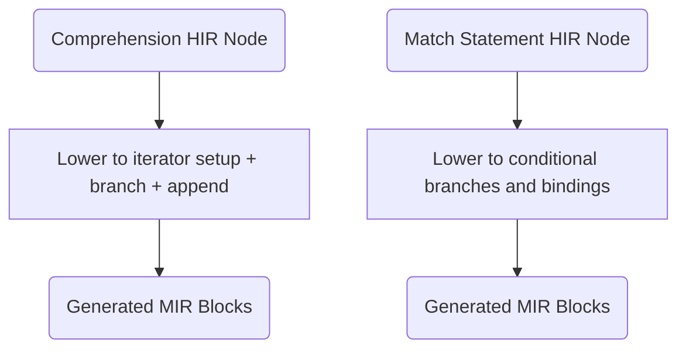
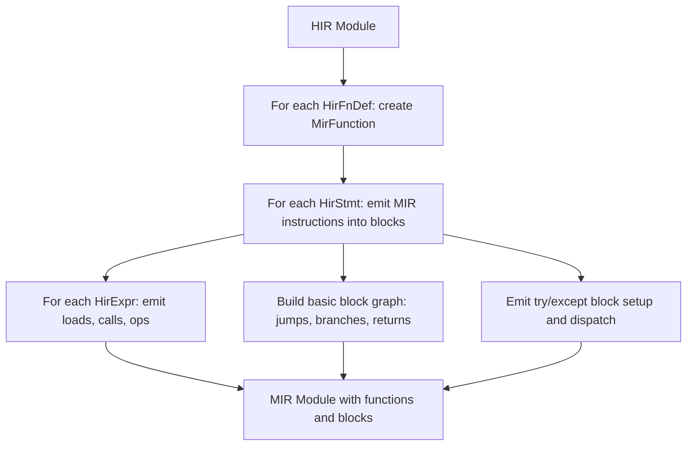

# HIR to MIR Lowering

## Overview

<!-- type: overview lang: markdown -->

Fix `__name__` module-level dunder variable initialization in the HIR-to-MIR `lower_top_level()` pass. Currently, `__name__` resolves to `0.0` (uninitialized VReg → NaN-boxed zero) instead of `"__main__"` because no `StoreGlobal` is emitted for module-scope dunder variables before user code runs.

The fix adds a `StoreGlobal(__name__, "__main__")` emission at the start of `lower_top_level()`, after the existing `mb_register_builtins` call, so the standard `if __name__ == "__main__"` entry-point pattern works correctly. The REPL variant `lower_top_level_repl()` requires the same initialization.

Root cause: `types/builtins.rs` declares `__name__` as a `str`-typed symbol, but the lowering pass never emits an initialization instruction. When user code references `__name__`, it falls through to the `VariableClass::Local` path which allocates an uninitialized VReg (bit pattern 0 → f64 `0.0` under NaN-boxing).
## Source Files

- **lower/hir_to_mir.rs** (1,728 LOC): HIR to MIR transformation -- generates MIR basic blocks with instructions for all HIR constructs. Handles control flow, exception handling, runtime function calls, and complex lowering of comprehensions, generators, pattern matching, unpacking, and f-strings.

## Requirements

<!-- type: requirements lang: markdown -->

### R10 - Module-Scope Dunder Variable Initialization

```yaml
id: R10
priority: high
issue: "#1133"
```

`lower_top_level()` must emit `StoreGlobal` instructions to initialize module-scope dunder variables before any user code runs. For the entry-point module:

| Variable | Value | Condition |
|----------|-------|-----------|
| `__name__` | `"__main__"` | Always (entry-point script) |

Emission sequence in `lower_top_level()`:
1. `mb_register_builtins()` (existing)
2. `emit_str_const("__main__")` → VReg
3. `StoreGlobal { name: __name__ SymbolId, value: VReg }` ← **new**
4. Class registrations (existing)
5. User statements (existing)

### R11 - REPL Dunder Initialization

```yaml
id: R11
priority: high
issue: "#1133"
```

`lower_top_level_repl()` must also emit `StoreGlobal(__name__, "__main__")` after `mb_register_builtins`, before restoring globals. REPL sessions are entry-point contexts and must have `__name__ == "__main__"` consistent with CPython.

### R12 - Symbol Resolution for Dunder Stores

```yaml
id: R12
priority: medium
issue: "#1133"
```

The `__name__` SymbolId must be resolved from the symbol table (`symbols.lookup("__name__")`) when available (in `lower_hir_to_mir_with_symbols`), or from `hir.sym_names` reverse lookup. For the non-symbol-table path (`lower_hir_to_mir`), use a well-known sentinel SymbolId or emit a `CallExtern` to `mb_global_set` with a string key.
## Acceptance Criteria

### Scenario: Lower Comprehension to Loop

- **GIVEN** `[x*2 for x in items if x > 0]` lowered to MIR.
- **THEN** MIR contains iterator setup, condition branch, and list append.

### Scenario: Lower Pattern Match to Branches

- **GIVEN** A match statement with literal and sequence patterns lowered to MIR.
- **THEN** MIR contains conditional jumps corresponding to the pattern structure.

### Scenario: For-else natural exit

- **GIVEN** A for loop with else clause completes without break.
- **THEN** The else body executes (flag-based branch to else block).

### Scenario: F-string with format spec

- **GIVEN** f-string `{value:.2f}` lowered to MIR.
- **THEN** `mb_format_value` is called with spec `.2f`.

### Scenario: Starred unpacking

- **GIVEN** `a, *b, c = [1, 2, 3, 4]` lowered to MIR.
- **THEN** a=1, b=[2,3], c=4 via indexed access pattern.

### Scenario: Dict unpacking and f-string debug

- **GIVEN** `{**d1, **d2}` lowers to `dict_new` + `dict_merge` calls.
- **GIVEN** `f'{x=}'` lowers to `"x=" + mb_repr(x)`.

## Diagrams

### Syntactic Feature Lowering Flow



### HIR-to-MIR Overall Pipeline



### Dict/List Unpacking: `dict_new` + `dict_merge`/`list_extend` per starred expr, then `dict_setitem`/`list_append` per literal.


## Scenarios

<!-- type: scenarios lang: markdown -->

### Scenario: Entry-point __name__ is __main__

- **GIVEN** a script `print(__name__)` run via `cclab mamba run`.
- **THEN** output is `__main__`.

### Scenario: if __name__ == "__main__" guard executes

- **GIVEN** a script containing `if __name__ == "__main__": print("ok")`.
- **WHEN** run as entry point via `cclab mamba run`.
- **THEN** output includes `ok`.

### Scenario: REPL __name__ is __main__

- **GIVEN** an interactive REPL session.
- **WHEN** user evaluates `__name__`.
- **THEN** result is `__main__`.

### Scenario: __name__ type is str

- **GIVEN** a script `print(type(__name__).__name__)` run via `cclab mamba run`.
- **THEN** output is `str` (not `float`).

### Scenario: __name__ initialization precedes user code

- **GIVEN** a script where `__name__` is referenced on the first line.
- **THEN** `__name__` is already initialized to `"__main__"` — no uninitialized VReg (0.0) observed.


## Changes

<!-- type: changes lang: yaml -->

```yaml
changes:
  - path: crates/mamba/src/lower/hir_to_mir.rs
    action: modify
    description: |
      In lower_top_level(): after mb_register_builtins call (~line 813),
      emit emit_str_const("__main__") + StoreGlobal for __name__ SymbolId.
      In lower_top_level_repl(): same emission after mb_register_builtins,
      before global restore loop.
      Requires resolving __name__ SymbolId from symbol_table or sym_names.

  - path: crates/mamba/tests/
    action: add
    description: |
      Add test verifying __name__ == "__main__" for entry-point scripts.
      Add test verifying if __name__ == "__main__" guard body executes.
```

# Reviews
