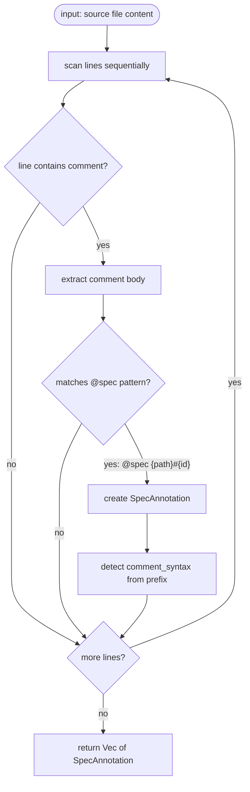
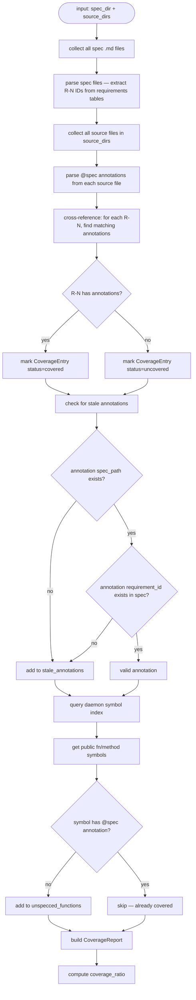
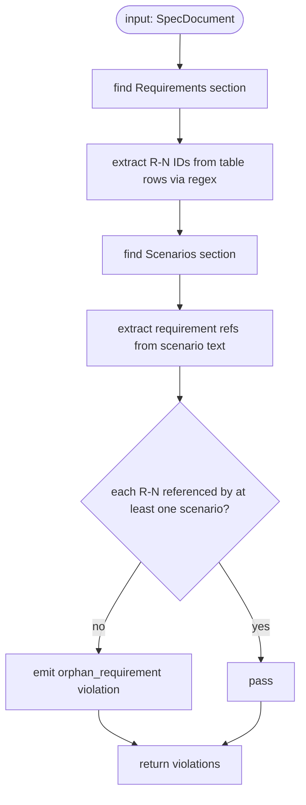
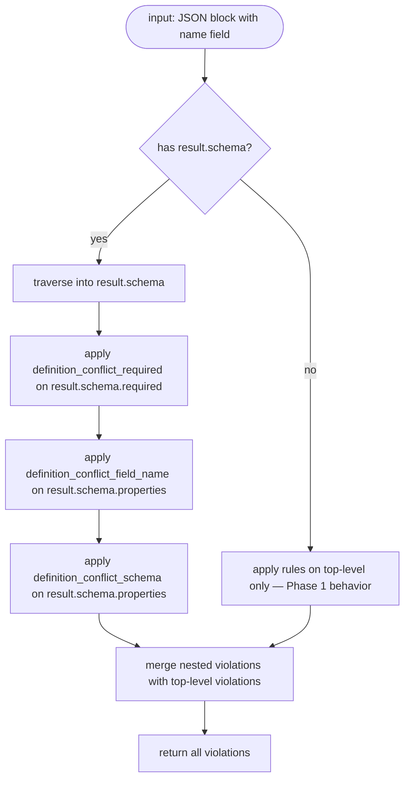
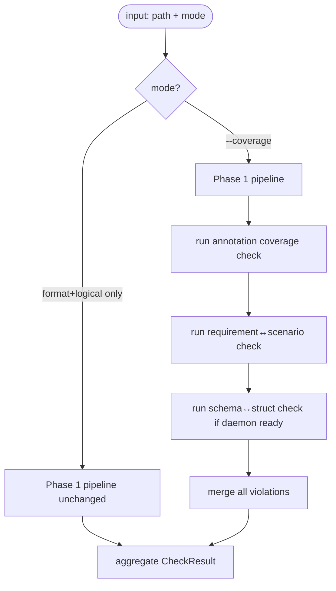
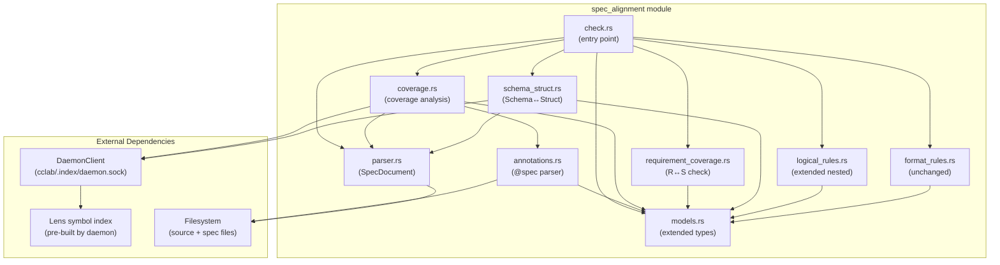
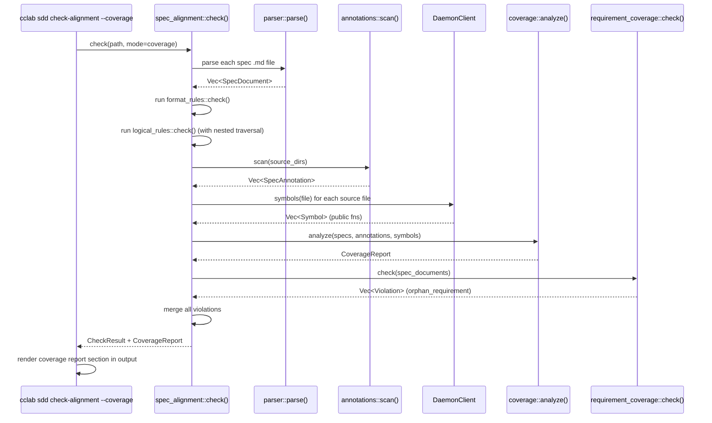

# Check Alignment

## Overview

Extends Phase 1 spec-internal validation with code↔spec coverage mapping, nested schema traversal, and requirement↔scenario cross-referencing.

**Problem**: Phase 1 validates spec format/content but cannot detect: (a) source code functions without spec coverage, (b) spec requirements without test scenarios, (c) stale `@spec` annotations pointing to removed specs, (d) OpenRPC `result.schema.required`/`result.schema.properties` inconsistencies (nested schema limitation).

**Solution**: Three new validation layers added to the existing two-layer architecture:

| Layer | Rules | Method |
|-------|-------|--------|
| Format compliance (Phase 1) | `missing_section_annotation`, `duplicate_section`, `format_priority_violation` | Unchanged |
| Logical consistency (Phase 1) | `duplicate_definition`, `definition_conflict_*`, `rpc_field_consistency` | Extended: traverse into `result.schema` for nested fields |
| Annotation coverage (Phase 2) | `uncovered_requirement`, `unspecced_function`, `stale_annotation` | Parse `@spec {path}#{id}` from source comments, cross-reference with spec requirement IDs |
| Requirement coverage (Phase 2) | `orphan_requirement` | Every `R{N}` in requirements table must be referenced by at least one `S{N}` in scenarios |
| Schema↔Struct (Phase 2) | `schema_struct_mismatch` | Compare JSON Schema `properties` with Rust struct fields via Lens symbol index |

**Architecture**: Existing `spec_alignment::check()` pipeline extended with new submodules:
- `annotations.rs` — language-agnostic `@spec` annotation parser (comment syntaxes: `//`, `#`, `--`, `<!-- -->`, `/* */`)
- `coverage.rs` — cross-references annotations with spec requirement IDs, queries daemon symbol index for unspecced functions
- `requirement_coverage.rs` — R{N}↔S{N} cross-referencing within spec files
- `schema_struct.rs` — JSON Schema ↔ Rust struct field comparison
- `logical_rules.rs` — extended to traverse `result.schema.required` and `result.schema.properties` for nested OpenRPC definitions

**Scope boundary**: Phase 2 — code↔spec coverage + nested schema fix. No workflow integration (Phase 3 #1142). Daemon symbol index must be pre-built (`IndexStatus.is_ready`).
## Requirements

| ID | Requirement | Priority |
|----|-------------|----------|
| R14 | `@spec` annotation parser: language-agnostic token scan for `@spec {path}#{id}` in all comment syntaxes (`//`, `#`, `--`, `<!-- -->`, `/* */`). Returns `Vec<SpecAnnotation>` with spec_path, requirement_id, source_file, line, comment_syntax. Handles multiple annotations per file. | high |
| R15 | Coverage check module: scan source directories for `@spec` annotations, cross-reference with spec requirement IDs parsed from requirements tables (`R{N}` pattern). Produce `CoverageReport` with: covered, uncovered_requirements, stale_annotations, coverage_ratio. Stale = annotation points to non-existent spec path or requirement ID. | high |
| R16 | Unspecced function detection via Lens: query daemon's pre-built symbol index (`DaemonClient::symbols(file)`) for public functions/methods (`fn_item`, `impl_method`, `trait_method`). Functions without any `@spec` annotation are reported as `UnspeccedFunction`. Private functions ignored. Graceful degradation if daemon not ready (warn + skip). | medium |
| R17 | Schema→Struct validation: compare JSON Schema `properties` from spec files with Rust struct fields from Lens symbol index. Emit `schema_struct_mismatch` with kind (`missing_in_struct`, `missing_in_schema`, `type_mismatch`), field name, and both types. Only active when daemon index is ready. | medium |
| R18 | Requirement↔Scenario validation: within each spec file, extract `R{N}` IDs from requirements table rows, check that each is referenced by at least one scenario body or test-plan `Covers` column. Emit `orphan_requirement` violation for unreferenced requirements. | high |
| R19 | Fix Phase 1 nested schema limitation: logical rules (`definition_conflict_required`, `definition_conflict_field_name`, `definition_conflict_schema`) must traverse into `result.schema.required`, `result.schema.properties`, `params[*].schema.required`, `params[*].schema.properties` for OpenRPC format definitions. Emit `nested_schema_conflict_*` violation kinds. | high |
| R20 | Implementation agent prompt update: add `@spec` annotation instruction to `create_change_implementation` prompt template directing agents to annotate public functions with `@spec {spec_path}#R{N}`. | low |
| R21 | CLI extension: `--coverage` flag enables Phase 2 checks. `--source-dir` (repeatable, default `crates/`) specifies source scan directories. Output appends coverage report section (text mode) or `coverage` object (JSON mode). Without `--coverage`, behavior is identical to Phase 1. | high |
## Scenarios

### Scenario: @spec annotation parsed from Rust comment
- **GIVEN** a Rust source file containing `// @spec crates/cclab-sdd/logic/check-alignment.md#R1` at line 15
- **WHEN** `annotations::scan(file)` is called
- **THEN** returns `SpecAnnotation { spec_path: "crates/cclab-sdd/logic/check-alignment.md", requirement_id: "R1", line: 15, comment_syntax: "//" }`

### Scenario: @spec annotation parsed from Python comment
- **GIVEN** a Python source file containing `# @spec crates/cclab-sdd/logic/state-machine.md#R5` at line 8
- **WHEN** `annotations::scan(file)` is called
- **THEN** returns `SpecAnnotation { comment_syntax: "#" }`

### Scenario: @spec annotation parsed from HTML comment
- **GIVEN** a Markdown file containing `<!-- @spec crates/cclab-sdd/logic/check-alignment.md#R2 -->` at line 3
- **WHEN** `annotations::scan(file)` is called
- **THEN** returns `SpecAnnotation { comment_syntax: "<!--" }`

### Scenario: No annotation in regular comment
- **GIVEN** a source file containing `// This is a regular comment` with no `@spec` token
- **WHEN** `annotations::scan(file)` is called
- **THEN** returns empty `Vec<SpecAnnotation>`

### Scenario: Full coverage — all requirements have annotations
- **GIVEN** a spec with R1, R2, R3 in requirements table, and source files with `@spec` annotations for each
- **WHEN** `coverage::analyze(specs, annotations, symbols)` is called
- **THEN** `CoverageReport.coverage_ratio == 1.0` and `uncovered_requirements` is empty

### Scenario: Uncovered requirement detected
- **GIVEN** a spec with R1, R2, R3 but source files only annotate R1
- **WHEN** `coverage::analyze(specs, annotations, symbols)` is called
- **THEN** `uncovered_requirements` contains R2 and R3 with `status: "uncovered"`

### Scenario: Stale annotation — spec file does not exist
- **GIVEN** source file with `@spec nonexistent/path.md#R1` but `nonexistent/path.md` does not exist under `cclab/specs/`
- **WHEN** `coverage::analyze()` is called
- **THEN** `stale_annotations` includes the annotation

### Scenario: Stale annotation — requirement ID does not exist
- **GIVEN** source file with `@spec existing-spec.md#R99` but the spec only has R1-R5
- **WHEN** `coverage::analyze()` is called
- **THEN** `stale_annotations` includes the annotation

### Scenario: Unspecced public function detected
- **GIVEN** source file with `pub fn process_data()` at line 42 and no `@spec` annotation above or beside it, daemon symbol index reports it as `fn_item`
- **WHEN** coverage analysis runs
- **THEN** `unspecced_functions` contains `{ name: "process_data", file: "...", line: 42, kind: "fn_item" }`

### Scenario: Private function not flagged
- **GIVEN** source file with `fn helper()` (private) and no `@spec` annotation, daemon index does not include it (private)
- **WHEN** coverage analysis runs
- **THEN** `unspecced_functions` does not contain `helper`

### Scenario: Daemon not ready — graceful degradation
- **GIVEN** `--coverage` flag enabled but daemon is not running (`IndexStatus.is_ready == false`)
- **WHEN** `check(path, coverage=true)` is called
- **THEN** warn message printed, `unspecced_functions` and `schema_struct_mismatch` checks skipped, annotation coverage and requirement↔scenario checks still run

### Scenario: Requirement↔Scenario — all requirements covered
- **GIVEN** spec file with requirements R1, R2, R3 and scenarios referencing R1, R2, R3 in body text
- **WHEN** `requirement_coverage::check(doc)` is called
- **THEN** no `orphan_requirement` violations

### Scenario: Orphan requirement detected
- **GIVEN** spec file with requirements R1, R2, R3 but scenarios only reference R1, R3
- **WHEN** `requirement_coverage::check(doc)` is called
- **THEN** violation: `{ kind: "orphan_requirement", name: "R2" }`

### Scenario: Schema↔Struct — fields match
- **GIVEN** JSON Schema with `properties: { name: string, count: integer }` and Rust struct `MyModel { name: String, count: usize }`
- **WHEN** `schema_struct::check()` is called
- **THEN** no `schema_struct_mismatch` violations

### Scenario: Schema↔Struct — missing field in struct
- **GIVEN** JSON Schema has `status` property but Rust struct lacks `status` field
- **WHEN** `schema_struct::check()` is called
- **THEN** violation: `{ kind: "schema_struct_mismatch", field: "status", schema_type: "string", struct_type: null }`

### Scenario: Nested schema conflict detected in result.schema
- **GIVEN** two OpenRPC blocks with same `name`, block 1 has `result.schema.required: ["id", "status"]`, block 2 has `result.schema.required: ["id"]`
- **WHEN** logical_rules::check() is called
- **THEN** violation: `{ kind: "nested_schema_conflict_required", name: "...", details: { path: "result.schema" } }`

### Scenario: CLI --coverage appends coverage report
- **GIVEN** `cclab sdd check-alignment --coverage cclab/specs/crates/cclab-sdd/`
- **WHEN** command runs with source annotations present
- **THEN** output contains Phase 1 per-file OK/FAIL lines followed by `--- Coverage Report ---` section
- **AND** exit code reflects both violations and coverage

### Scenario: CLI --coverage --json includes coverage object
- **GIVEN** `cclab ssd check-alignment --coverage --json`
- **WHEN** command runs
- **THEN** JSON output has top-level `coverage` key with `covered`, `uncovered_requirements`, `unspecced_functions`, `stale_annotations`, `orphan_requirements`, `coverage_ratio`
## Diagrams

### Interaction
<!-- type: interaction lang: mermaid -->
<!-- TODO -->

### Logic
<!-- type: logic lang: mermaid -->
<!-- TODO -->

### Dependencies
<!-- type: dependency lang: mermaid -->
<!-- TODO -->

### State Machine
<!-- type: state-machine lang: mermaid -->
<!-- TODO -->

### Data Model
<!-- type: db-model lang: mermaid -->
<!-- TODO -->

## API Spec

### REST API
<!-- type: rest-api lang: yaml -->
<!-- TODO -->

### RPC API
<!-- type: rpc-api lang: json -->
<!-- TODO -->

### Async API
<!-- type: async-api lang: yaml -->
<!-- TODO -->

### CLI
<!-- type: cli lang: yaml -->
<!-- TODO -->

### Schema
<!-- type: schema lang: json -->
<!-- TODO -->

### Config
<!-- type: config lang: json -->
<!-- TODO -->

## Test Plan

| Test | Category | Input | Expected | Covers |
|------|----------|-------|----------|--------|
| `test_parse_annotation_rust_comment` | unit | `// @spec crates/cclab-sdd/logic/check-alignment.md#R1` | `SpecAnnotation { spec_path: "crates/cclab-sdd/logic/check-alignment.md", requirement_id: "R1", comment_syntax: "//" }` | R14 |
| `test_parse_annotation_python_comment` | unit | `# @spec crates/cclab-sdd/logic/state-machine.md#R5` | `SpecAnnotation { comment_syntax: "#" }` | R14 |
| `test_parse_annotation_sql_comment` | unit | `-- @spec crates/cclab-pg/logic/query.md#R3` | `SpecAnnotation { comment_syntax: "--" }` | R14 |
| `test_parse_annotation_html_comment` | unit | `<!-- @spec crates/cclab-sdd/logic/check-alignment.md#R2 -->` | `SpecAnnotation { comment_syntax: "<!--" }` | R14 |
| `test_parse_annotation_block_comment` | unit | `/* @spec crates/cclab-sdd/logic/check-alignment.md#R10 */` | `SpecAnnotation { comment_syntax: "/*" }` | R14 |
| `test_parse_annotation_no_match` | unit | `// This is a regular comment` | Empty result | R14 |
| `test_parse_annotation_multiple_per_file` | unit | File with 3 `@spec` annotations on lines 5, 20, 45 | 3 `SpecAnnotation` entries with correct lines | R14 |
| `test_coverage_all_requirements_covered` | unit | Spec with R1-R3, source with `@spec` for each | `CoverageReport { coverage_ratio: 1.0, uncovered_requirements: [] }` | R15 |
| `test_coverage_uncovered_requirement` | unit | Spec with R1-R3, source with `@spec` for R1 only | `uncovered_requirements` contains R2, R3 | R15 |
| `test_coverage_stale_annotation` | unit | Source `@spec nonexistent.md#R1` | `stale_annotations` contains the annotation | R15 |
| `test_coverage_stale_requirement_id` | unit | Source `@spec existing.md#R99` where R99 not in spec | `stale_annotations` contains the annotation | R15 |
| `test_unspecced_function_detected` | unit | Public fn `pub fn process()` without `@spec`, daemon index has symbol | `unspecced_functions` contains `UnspeccedFunction { name: "process", kind: "fn_item" }` | R16 |
| `test_unspecced_private_fn_ignored` | unit | Private fn `fn helper()` without `@spec` | `unspecced_functions` empty — only public symbols checked | R16 |
| `test_schema_struct_match` | unit | JSON Schema with `{ properties: { name: { type: "string" }, count: { type: "integer" } } }`, Rust struct with `name: String, count: usize` | No `schema_struct_mismatch` violations | R17 |
| `test_schema_struct_missing_field` | unit | JSON Schema has `status` property, Rust struct lacks it | `schema_struct_mismatch { kind: "missing_in_struct", field: "status" }` | R17 |
| `test_requirement_scenario_all_covered` | unit | Spec with R1-R3 in requirements, scenarios reference R1, R2, R3 | No `orphan_requirement` violations | R18 |
| `test_requirement_scenario_orphan` | unit | Spec with R1-R3 in requirements, scenarios reference R1, R3 only | `orphan_requirement` for R2 | R18 |
| `test_nested_schema_required_conflict` | unit | OpenRPC blocks with same name, differing `result.schema.required` | `nested_schema_conflict_required` violation | R19 |
| `test_nested_schema_properties_conflict` | unit | OpenRPC blocks with same name, differing `result.schema.properties.field.type` | `nested_schema_conflict_schema` violation | R19 |
| `test_nested_schema_params_traversal` | unit | OpenRPC blocks with same name, differing `params[0].schema.required` | `nested_schema_conflict_required` violation | R19 |
| `test_cli_coverage_flag_runs_phase2` | integration | `cclab sdd check-alignment --coverage cclab/specs/` | Output contains `--- Coverage Report ---` section | R21 |
| `test_cli_coverage_json_includes_report` | integration | `cclab sdd check-alignment --coverage --json` | JSON output has `coverage` object with all Phase 2 fields | R21 |
| `test_cli_coverage_source_dir_flag` | integration | `--coverage --source-dir crates/cclab-sdd/src/` | Only scans specified directory for annotations | R21 |
| `test_cli_coverage_daemon_not_ready` | integration | `--coverage` with daemon not running | Warn message, skip unspecced_functions + schema_struct, rest still works | R21 |
| `test_implementation_prompt_has_spec_instruction` | unit | Read `create_change_implementation` prompt template | Contains `@spec` annotation instruction text | R20 |
## Changes

```yaml
changes:
  - path: crates/cclab-sdd/src/spec_alignment/annotations.rs
    action: create
    description: "@spec annotation parser — language-agnostic scan for '@spec {path}#{id}' across comment syntaxes (// # -- <!-- /*). Returns Vec<SpecAnnotation>."

  - path: crates/cclab-sdd/src/spec_alignment/coverage.rs
    action: create
    description: "Coverage analysis module — cross-references @spec annotations with spec requirement IDs, queries daemon symbol index for unspecced public functions. Returns CoverageReport."

  - path: crates/cclab-sdd/src/spec_alignment/requirement_coverage.rs
    action: create
    description: "Requirement↔Scenario cross-reference — extracts R{N} from requirements tables, checks each is referenced by at least one scenario. Emits orphan_requirement violations."

  - path: crates/cclab-sdd/src/spec_alignment/schema_struct.rs
    action: create
    description: "Schema↔Struct validation — compares JSON Schema properties with Rust struct fields via Lens symbol index. Emits schema_struct_mismatch violations."

  - path: crates/cclab-sdd/src/spec_alignment/models.rs
    action: modify
    description: "Extend ViolationKind enum with Phase 2 variants: UncoveredRequirement, UnspeccedFunction, StaleAnnotation, OrphanRequirement, SchemaStructMismatch, NestedSchemaConflictRequired, NestedSchemaConflictFieldName, NestedSchemaConflictSchema. Add SpecAnnotation, CoverageEntry, UnspeccedFunction, CoverageReport, SchemaStructMismatch structs."

  - path: crates/cclab-sdd/src/spec_alignment/logical_rules.rs
    action: modify
    description: "Extend logical rules to traverse nested schema paths: result.schema.required, result.schema.properties, params[*].schema.required, params[*].schema.properties. Apply existing conflict rules at nested level with nested_schema_conflict_* violation kinds."

  - path: crates/cclab-sdd/src/spec_alignment/mod.rs
    action: modify
    description: "Add pub mod annotations, coverage, requirement_coverage, schema_struct. Extend re-exports for new types."

  - path: crates/cclab-sdd/src/spec_alignment/check.rs
    action: modify
    description: "Add coverage mode parameter to check(). When coverage enabled: run annotation scan, coverage analysis, requirement↔scenario check, schema↔struct validation. Merge results into CheckResult with optional CoverageReport."

  - path: crates/cclab-sdd-cli/src/check_alignment.rs
    action: modify
    description: "Add --coverage and --source-dir flags. When --coverage: pass coverage mode to spec_alignment::check(), render coverage report section in text output, include coverage object in JSON output."

  - path: crates/cclab-sdd/src/tools/prompts/create_change_implementation.md
    action: modify
    description: "Add @spec annotation instruction to implementation agent prompt template: 'Add @spec {spec_path}#{R-N} annotations to public functions that implement spec requirements.'"

  - path: crates/cclab-sdd/tests/spec_alignment_phase2_tests.rs
    action: create
    description: "Unit + integration tests for Phase 2: annotation parsing, coverage analysis, requirement↔scenario check, nested schema traversal, CLI coverage flags."
```
## Wireframe
<!-- type: wireframe lang: yaml -->

<!-- TODO -->

## Component
<!-- type: component lang: json -->

<!-- TODO -->

## Design Token
<!-- type: design-token lang: json -->

<!-- TODO -->

## Doc
<!-- type: doc lang: markdown -->

<!-- TODO -->


## Schema

```json
{
  "$schema": "https://json-schema.org/draft/2020-12/schema",
  "$id": "check-alignment-phase2",
  "title": "CheckAlignment Phase 2 Extensions",
  "description": "New data models for code↔spec coverage mapping and extended validation",
  "definitions": {
    "SpecAnnotation": {
      "description": "A parsed @spec annotation found in source code comments",
      "type": "object",
      "required": ["spec_path", "requirement_id", "source_file", "line"],
      "properties": {
        "spec_path": { "type": "string", "description": "Spec file path from annotation (e.g. crates/cclab-sdd/logic/check-alignment.md)" },
        "requirement_id": { "type": "string", "description": "Requirement ID after # (e.g. R1, R5)" },
        "source_file": { "type": "string", "description": "Source file where annotation was found" },
        "line": { "type": "integer", "description": "Line number of the annotation (1-based)" },
        "comment_syntax": { "type": "string", "enum": ["//", "#", "--", "<!--", "/*"], "description": "Comment syntax used" }
      }
    },
    "CoverageEntry": {
      "description": "Coverage status for a single spec requirement",
      "type": "object",
      "required": ["requirement_id", "spec_path", "status"],
      "properties": {
        "requirement_id": { "type": "string" },
        "spec_path": { "type": "string" },
        "status": { "type": "string", "enum": ["covered", "uncovered"] },
        "annotations": {
          "type": "array",
          "items": { "$ref": "#/definitions/SpecAnnotation" },
          "description": "Source annotations referencing this requirement (empty if uncovered)"
        }
      }
    },
    "UnspeccedFunction": {
      "description": "A public function/method found in source code with no @spec annotation",
      "type": "object",
      "required": ["name", "file", "line", "kind"],
      "properties": {
        "name": { "type": "string", "description": "Function/method name" },
        "file": { "type": "string", "description": "Source file path" },
        "line": { "type": "integer", "description": "Line number (1-based)" },
        "kind": { "type": "string", "enum": ["fn_item", "impl_method", "trait_method"], "description": "Symbol kind from Lens index" }
      }
    },
    "CoverageReport": {
      "description": "Full coverage analysis report",
      "type": "object",
      "required": ["covered", "uncovered_requirements", "unspecced_functions", "stale_annotations", "orphan_requirements", "coverage_ratio"],
      "properties": {
        "covered": {
          "type": "array",
          "items": { "$ref": "#/definitions/CoverageEntry" },
          "description": "Requirements with at least one @spec annotation"
        },
        "uncovered_requirements": {
          "type": "array",
          "items": { "$ref": "#/definitions/CoverageEntry" },
          "description": "Requirements with no @spec annotation in source"
        },
        "unspecced_functions": {
          "type": "array",
          "items": { "$ref": "#/definitions/UnspeccedFunction" },
          "description": "Public functions without any @spec annotation"
        },
        "stale_annotations": {
          "type": "array",
          "items": { "$ref": "#/definitions/SpecAnnotation" },
          "description": "Annotations pointing to non-existent spec paths or requirement IDs"
        },
        "orphan_requirements": {
          "type": "array",
          "items": {
            "type": "object",
            "required": ["requirement_id", "spec_path"],
            "properties": {
              "requirement_id": { "type": "string" },
              "spec_path": { "type": "string" },
              "description": { "type": "string", "description": "Requirement text for context" }
            }
          },
          "description": "R{N} IDs in requirements table not referenced by any S{N} in scenarios"
        },
        "coverage_ratio": {
          "type": "number",
          "minimum": 0,
          "maximum": 1,
          "description": "Fraction of requirements covered (covered / total)"
        }
      }
    },
    "SchemaStructMismatch": {
      "description": "A mismatch between JSON Schema properties and Rust struct fields",
      "type": "object",
      "required": ["schema_path", "struct_name", "kind"],
      "properties": {
        "schema_path": { "type": "string", "description": "Path to spec file containing the JSON Schema" },
        "struct_name": { "type": "string", "description": "Rust struct name" },
        "kind": {
          "type": "string",
          "enum": ["missing_in_struct", "missing_in_schema", "type_mismatch"],
          "description": "Mismatch category"
        },
        "field": { "type": "string", "description": "Field name with the mismatch" },
        "schema_type": { "type": "string", "description": "Type declared in JSON Schema" },
        "struct_type": { "type": "string", "description": "Type declared in Rust struct" }
      }
    },
    "ViolationKind_Phase2": {
      "description": "New violation kinds added in Phase 2 (extends Phase 1 ViolationKind enum)",
      "type": "string",
      "enum": [
        "uncovered_requirement",
        "unspecced_function",
        "stale_annotation",
        "orphan_requirement",
        "schema_struct_mismatch",
        "nested_schema_conflict_required",
        "nested_schema_conflict_field_name",
        "nested_schema_conflict_schema"
      ]
    }
  }
}
```
## Logic

### @spec Annotation Parsing



**Comment syntax detection**: Token scan checks line prefixes in order: `//`, `#`, `--`, `<!--`, `/*`. First match wins. Pattern: `@spec\s+([\w/.-]+\.md)#(R\d+)` extracts path and requirement ID.

### Coverage Analysis Pipeline



### Requirement↔Scenario Cross-Reference



**R{N} extraction**: Regex `\bR(\d+)\b` applied to Requirements table `ID` column. **Scenario reference extraction**: Same regex applied to scenario body text and `Covers` column in test-plan tables.

### Nested Schema Traversal (Phase 1 Fix)



**Traversal paths**: `result.schema.required`, `result.schema.properties`, `params[*].schema.required`, `params[*].schema.properties`. Each path is checked independently — violations tagged with `nested_schema_conflict_*` kinds.

### Extended Check Pipeline


## CLI

```yaml
cclab sdd check-alignment:
  args:
    path:
      type: string
      required: false
      description: "File or directory path. Defaults to cclab/specs/ if omitted."
  flags:
    --json:
      type: bool
      default: false
      description: "Emit results as JSON instead of text"
    --coverage:
      type: bool
      default: false
      description: "Enable Phase 2 coverage analysis (annotation scanning, requirement↔scenario check, schema↔struct validation). Requires daemon index to be ready."
    --source-dir:
      type: string
      required: false
      repeatable: true
      default: "[crates/]"
      description: "Source directories to scan for @spec annotations. Multiple allowed. Only used with --coverage."
  behavior:
    - Phase 1 (no --coverage flag): unchanged — format + logical checks only
    - Phase 2 (--coverage flag):
      - Run all Phase 1 checks first
      - Scan --source-dir paths for @spec annotations in source files
      - Cross-reference annotations with spec requirement IDs
      - Query daemon symbol index for public functions without @spec annotations
      - Check R{N}↔S{N} requirement↔scenario coverage within spec files
      - Compare JSON Schema definitions with Rust struct fields (if daemon ready)
      - Append coverage report section to output
    - If --coverage and daemon not ready, warn and skip daemon-dependent checks (unspecced_functions, schema_struct_mismatch)
  output_format:
    text_coverage_section: |
      --- Coverage Report ---
      Coverage: {covered}/{total} requirements ({ratio}%)

      Uncovered requirements:
        {spec_path}#R{N}: {description}

      Unspecced functions:
        {file}:{line} {name} ({kind})

      Stale annotations:
        {source_file}:{line} @spec {spec_path}#{id} — {reason}

      Orphan requirements:
        {spec_path}#R{N}: no scenario references
    json: |
      {
        "files": [...],
        "total_violations": N,
        "passed": true|false,
        "coverage": {
          "covered": [...],
          "uncovered_requirements": [...],
          "unspecced_functions": [...],
          "stale_annotations": [...],
          "orphan_requirements": [...],
          "coverage_ratio": 0.75
        }
      }
  exit_codes:
    0: "All checks passed, no violations, full coverage (if --coverage)"
    1: "Violations found or coverage below threshold"
```
## Dependencies




## Interaction



# Reviews
