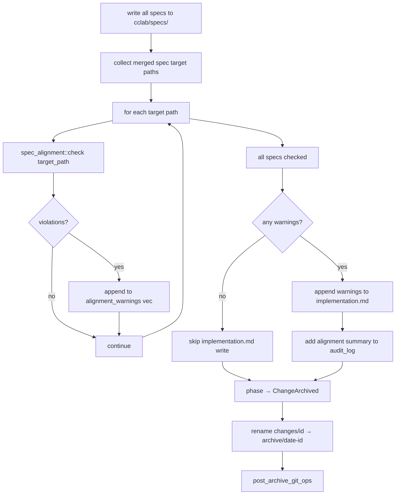

# Change Merge Phase3

## Overview

Extend the merge workflow (`sdd_workflow_create_change_merge`) with post-merge, pre-git-commit alignment checking. After all specs are written to `cclab/specs/` and phase is set to `ChangeArchived`, but before post-archive git operations, run `spec_alignment::check()` on each merged spec target path. Violations are collected as warnings — they do NOT block the merge or prevent archiving.

Alignment warnings are:
1. Appended to `implementation.md` in the archive directory (review section)
2. Included in the tool response JSON as `alignment_warnings` field (full violation list)
3. Included in the audit log

**Scope**: This spec covers only the merge workflow integration point. Same `check()` function, different strictness than artifact tools or CLI callers.

| Caller | Format violations | Coverage gaps |
|--------|-------------------|---------------|
| Merge workflow (this spec) | Warning — allow merge | Warning — allow merge |
| Artifact tools | Error — block write | Warning — allow write |
| CLI post-hoc | Report all | Report all |
## Requirements
<!-- type: requirements lang: markdown -->

<!-- TODO -->

## Scenarios
<!-- type: scenarios lang: markdown -->

<!-- TODO -->

## Diagrams

### Interaction
<!-- type: interaction lang: mermaid -->
<!-- TODO -->

### Logic
<!-- type: logic lang: mermaid -->
<!-- TODO -->

### Dependencies
<!-- type: dependency lang: mermaid -->
<!-- TODO -->

### State Machine
<!-- type: state-machine lang: mermaid -->
<!-- TODO -->

### Data Model
<!-- type: db-model lang: mermaid -->
<!-- TODO -->

## API Spec

### REST API
<!-- type: rest-api lang: yaml -->
<!-- TODO -->

### RPC API
<!-- type: rpc-api lang: json -->
<!-- TODO -->

### Async API
<!-- type: async-api lang: yaml -->
<!-- TODO -->

### CLI
<!-- type: cli lang: yaml -->
<!-- TODO -->

### Schema
<!-- type: schema lang: json -->
<!-- TODO -->

### Config
<!-- type: config lang: json -->
<!-- TODO -->

## Test Plan
<!-- type: test-plan lang: markdown -->

<!-- TODO -->

## Changes

```yaml
changes:
  - path: crates/cclab-sdd/src/tools/create_change_merge.rs
    action: modify
    description: |
      After the spec-write loop (after all `std::fs::write` calls to `cclab/specs/`)
      and before `update_phase(ChangeArchived)`, add alignment check loop:

      1. Collect all merged target paths from `merge_results` (Vec<PathBuf>)
      2. For each target path, call `spec_alignment::check::check(&target_path)`
      3. Collect all `FileResult` entries where `violations` is non-empty
      4. Flatten violations into `alignment_warnings: Vec<Violation>` with file path attached
      5. If warnings non-empty:
         a. Build alignment summary string: "{N} violation(s) in {M} file(s)"
         b. Add `[merge] alignment: {summary}` to audit_log
      6. After archive move, if warnings non-empty:
         a. Append alignment warnings table to `{archive_path}/implementation.md`
      7. Add `alignment_warnings` and `alignment_summary` fields to response JSON

      Import: `use crate::spec_alignment::check as alignment_check;`
      Import: `use crate::spec_alignment::models::{Violation, FileResult};`

  - path: crates/cclab-sdd/src/tools/create_change_merge.rs
    action: modify
    description: |
      Add helper function: `run_alignment_checks(target_paths: &[PathBuf]) -> (Vec<AlignmentWarning>, String)`

      struct AlignmentWarning {
          file: String,
          kind: String,
          message: String,
          heading: Option<String>,
          line: Option<usize>,
      }

      For each path in target_paths:
        - Call `alignment_check::check(path)`
        - For each FileResult with violations, map each Violation to AlignmentWarning
          with `file` set to the FileResult.path
      Return (warnings_vec, summary_string)
      summary_string: "{total} violation(s) in {files_with_violations} file(s)" or empty if clean

  - path: crates/cclab-sdd/src/tools/create_change_merge.rs
    action: modify
    description: |
      Add helper function: `append_alignment_to_impl(archive_path: &Path, warnings: &[AlignmentWarning])`

      Builds markdown table from warnings and appends to `{archive_path}/implementation.md`.
      Creates file if absent. Uses `std::fs::OpenOptions` with append+create.
      Format:
        ## Alignment Warnings\n\n
        | File | Kind | Message |\n
        |------|------|---------|\n
        | {w.file} | {w.kind} | {w.message} |\n per warning
```
## Wireframe
<!-- type: wireframe lang: yaml -->

<!-- TODO -->

## Component
<!-- type: component lang: json -->

<!-- TODO -->

## Design Token
<!-- type: design-token lang: json -->

<!-- TODO -->

## Doc
<!-- type: doc lang: markdown -->

<!-- TODO -->


## Logic

### Alignment Check Integration Point

Inserted into the merge flowchart between spec-write and archive-move. All violations are non-blocking warnings.



### Violation Classification

All violations from `spec_alignment::check()` are treated as warnings at merge time — no distinction between Phase 1 (format) and Phase 2 (coverage) severity.

```yaml
merge_strictness:
  format_violations: warning  # MissingSectionAnnotation, DuplicateSection, etc.
  coverage_gaps: warning       # OrphanRequirement, UncoveredRequirement
  blocking: false              # merge always proceeds
  io_errors: warning           # file read failures during check
```

### Implementation.md Append Format

When alignment warnings exist, append to `implementation.md` in the archive directory:

```yaml
append_format: |
  ## Alignment Warnings

  {total_violations} violation(s) found across {files_checked} spec(s).

  | File | Kind | Message |
  |------|------|---------|
  | {path} | {violation_kind} | {message} |
  ...

write_target: "{archive_path}/implementation.md"
write_mode: append  # create if absent, append if exists
```

### Response JSON Extension

```json
{
  "$id": "merge-alignment-response",
  "type": "object",
  "properties": {
    "alignment_warnings": {
      "type": ["array", "null"],
      "items": {
        "$ref": "#/definitions/Violation"
      },
      "description": "Full list of alignment violations from merged specs. Null if no checks ran or no violations."
    },
    "alignment_summary": {
      "type": ["string", "null"],
      "description": "Human-readable summary: '{N} violation(s) in {M} file(s)'. Null if clean."
    }
  },
  "definitions": {
    "Violation": {
      "type": "object",
      "properties": {
        "kind": { "type": "string" },
        "message": { "type": "string" },
        "heading": { "type": ["string", "null"] },
        "line": { "type": ["integer", "null"] },
        "file": { "type": "string", "description": "Spec file path where violation was found" }
      },
      "required": ["kind", "message", "file"]
    }
  }
}
```

# Reviews
