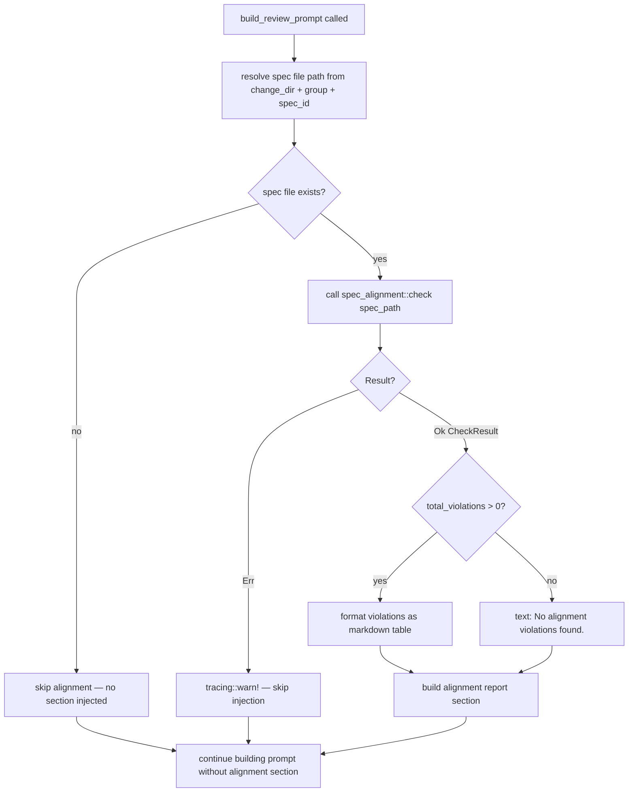
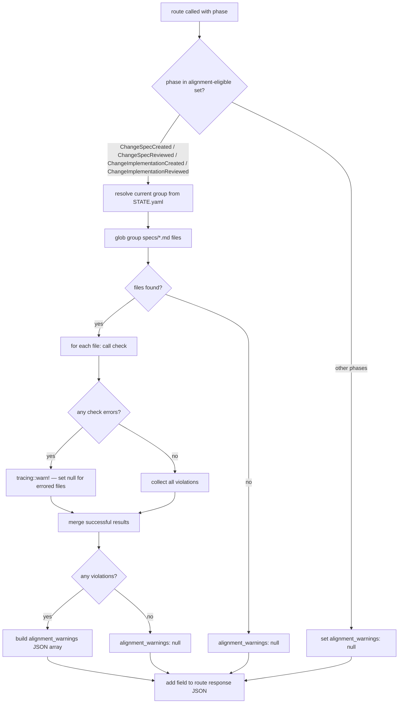

# Check Alignment Phase3

## Overview

Integrate `spec_alignment::check()` into 4 SDD workflow integration points with per-caller strictness. Phase 3 adds workflow-level validation to the existing Phase 1 (format/logical) and Phase 2 (coverage) rule engines.

**Problem**: `check()` and `check_with_coverage()` exist as standalone CLI tools but are not called during the SDD workflow. Spec authors can write malformed specs through artifact tools, merge misaligned specs without warning, and review code without knowing the spec has violations. There is no feedback loop between spec authoring and spec validation.

**Solution**: Same `check()` function, 4 integration points, different strictness per caller:

| Caller | Format violations | Coverage gaps | Blocking? |
|--------|-------------------|---------------|-----------|
| Artifact tools (artifact-tools-phase3) | Error — block write, revert file | Warning — allow write | Yes (format only) |
| Merge workflow (change-merge-phase3) | Warning — allow merge | Warning — allow merge | No |
| Review agent prompt (this spec) | Info — injected into prompt | Info — injected into prompt | No |
| Run-change response (this spec) | Info — returned in JSON | Info — returned in JSON | No |

**Scope**: This spec covers the overarching integration architecture plus the two remaining integration points: (3) review agent prompt injection and (4) run-change response extension. Artifact tools and merge workflow are specified separately. Also includes deferred Phase 2 R20 (`@spec` annotation instruction in implementation prompt).
## Requirements

| ID | Requirement | Priority |
|----|-------------|----------|
| R22 | Per-caller strictness model: define shared strictness configuration mapping each caller to violation handling. Artifact tools: format → error (block write), coverage → warning. Merge: all → warning. Review prompt: all → informational (injected into prompt, no blocking). Run-change: all → informational (returned in response JSON, no blocking). Strictness is caller-side logic — `check()` itself always returns all violations. | high |
| R23 | Review prompt injection (implementation review): `build_review_prompt()` in `review_change_impl.rs` calls `spec_alignment::check()` on the change-spec file for the spec being reviewed. Inject alignment report as markdown table (`## Alignment Report` heading, columns: File, Kind, Message) into the review prompt between "Pre-Review Step" and "Instructions" sections. If no violations, inject "No alignment violations found." If check errors, skip injection silently (log warning). | high |
| R24 | Review prompt injection (spec review): `build_review_prompt()` in `review_change_spec.rs` calls `spec_alignment::check()` on the change-spec file being reviewed. Same injection format and error handling as R23. | high |
| R25 | Run-change response extension: `route()` in `workflow/mod.rs` adds `alignment_warnings` field to response JSON for phases: `ChangeSpecCreated`, `ChangeSpecReviewed`, `ChangeImplementationCreated`, `ChangeImplementationReviewed`. Check runs on all `.md` files in current group's `specs/` directory. For other phases, field is `null`. | high |
| R26 | `alignment_warnings` JSON schema: array of Violation objects, each `{ kind: string, message: string, heading?: string, line?: number, file: string }`. Field is `null` when no violations found, check not applicable, or check errored. Full violation list per Q3 clarification. | high |
| R27 | Error isolation: alignment check failures (I/O errors, parse failures) must not crash the workflow or block prompt generation. Catch all errors, emit `tracing::warn!`, continue with `alignment_warnings: null` (run-change) or omit alignment section (review prompt). | high |
| R28 | Implementation prompt `@spec` annotation instruction: add instruction to `build_implement_code_prompt()` in `create_change_impl.rs` directing agents to annotate public functions with `@spec {spec_path}#R{N}` comments. Deferred from Phase 2 R20. | low |
## Scenarios

### Scenario: Review prompt includes alignment violations for implementation review
- **GIVEN** a change `1142` with spec `my-feature.md` in group `my-group`, and the spec has a `DuplicateSection` violation
- **WHEN** `sdd_workflow_review_change_implementation` builds the review prompt for `my-feature`
- **THEN** the prompt contains `## Alignment Report` section with a markdown table
- **AND** the table has a row: `| my-feature.md | DuplicateSection | ... |`

### Scenario: Review prompt with clean spec shows no-violations message
- **GIVEN** a change with spec `clean-spec.md` that passes all alignment checks (0 violations)
- **WHEN** `sdd_workflow_review_change_implementation` builds the review prompt
- **THEN** the prompt contains `## Alignment Report` section with text "No alignment violations found."

### Scenario: Review prompt for spec review includes alignment violations
- **GIVEN** a change with spec `my-spec.md` that has a `FormatPriorityViolation`
- **WHEN** `sdd_workflow_review_change_spec` builds the review prompt
- **THEN** the prompt contains `## Alignment Report` table with the violation

### Scenario: Review prompt alignment check I/O error — graceful degradation
- **GIVEN** a change referencing spec path that does not exist on disk
- **WHEN** `build_review_prompt()` calls `spec_alignment::check()` and it returns `Err`
- **THEN** `tracing::warn!` is emitted, no `## Alignment Report` section in prompt, prompt built normally

### Scenario: Run-change response includes alignment warnings in ChangeSpecCreated phase
- **GIVEN** a change in `ChangeSpecCreated` phase with group `g1` having 2 spec files, one with violations
- **WHEN** `sdd_run_change` is called
- **THEN** response JSON includes `"alignment_warnings": [{ "kind": "...", "message": "...", "file": "..." }]`

### Scenario: Run-change response with clean specs returns null
- **GIVEN** a change in `ChangeSpecCreated` phase with all spec files passing alignment check
- **WHEN** `sdd_run_change` is called
- **THEN** response JSON includes `"alignment_warnings": null`

### Scenario: Run-change response for non-spec phases returns null
- **GIVEN** a change in `ChangeInited` phase (no specs yet)
- **WHEN** `sdd_run_change` is called
- **THEN** response JSON includes `"alignment_warnings": null`

### Scenario: Run-change alignment check error — graceful degradation
- **GIVEN** a change in `ChangeSpecCreated` phase but the group specs directory is unreadable
- **WHEN** `route()` calls `collect_alignment_warnings()` and it encounters I/O error
- **THEN** `tracing::warn!` is emitted, response has `"alignment_warnings": null`, workflow continues

### Scenario: Implementation prompt includes @spec annotation instruction
- **GIVEN** a spec `my-feature.md` with requirements R1-R3
- **WHEN** `build_implement_code_prompt()` generates the implementation task prompt
- **THEN** the prompt contains instruction text mentioning `@spec` and `#R{N}` annotation pattern
## Diagrams

### Interaction
<!-- type: interaction lang: mermaid -->
<!-- TODO -->

### Logic
<!-- type: logic lang: mermaid -->
<!-- TODO -->

### Dependencies
<!-- type: dependency lang: mermaid -->
<!-- TODO -->

### State Machine
<!-- type: state-machine lang: mermaid -->
<!-- TODO -->

### Data Model
<!-- type: db-model lang: mermaid -->
<!-- TODO -->

## API Spec

### REST API
<!-- type: rest-api lang: yaml -->
<!-- TODO -->

### RPC API
<!-- type: rpc-api lang: json -->
<!-- TODO -->

### Async API
<!-- type: async-api lang: yaml -->
<!-- TODO -->

### CLI
<!-- type: cli lang: yaml -->
<!-- TODO -->

### Schema
<!-- type: schema lang: json -->
<!-- TODO -->

### Config
<!-- type: config lang: json -->
<!-- TODO -->

## Test Plan

| Test | Category | Input | Expected | Covers |
|------|----------|-------|----------|--------|
| `test_review_impl_prompt_includes_alignment_violations` | unit | Spec file with `DuplicateSection` violation | Prompt contains `## Alignment Report` table with `DuplicateSection` row | R23 |
| `test_review_impl_prompt_clean_spec_no_violations` | unit | Spec file passing all checks (0 violations) | Prompt contains "No alignment violations found." | R23 |
| `test_review_impl_prompt_alignment_error_graceful` | unit | Non-existent spec file path → `check()` returns Err | Prompt built normally without `## Alignment Report` section, no panic | R23, R27 |
| `test_review_spec_prompt_includes_alignment_violations` | unit | Change-spec file with `FormatPriorityViolation` | Prompt contains `## Alignment Report` table with violation | R24 |
| `test_review_spec_prompt_clean_spec` | unit | Change-spec file passing all checks | Prompt contains "No alignment violations found." | R24 |
| `test_run_change_response_alignment_warnings_present` | integration | Change in `ChangeSpecCreated` phase, group has spec with violations | Response JSON has `alignment_warnings` array with Violation objects | R25, R26 |
| `test_run_change_response_alignment_warnings_null_clean` | integration | Change in `ChangeSpecCreated` phase, all specs clean | Response JSON has `"alignment_warnings": null` | R25, R26 |
| `test_run_change_non_eligible_phase_null` | unit | Change in `ChangeInited` phase | Response JSON has `"alignment_warnings": null` | R25 |
| `test_run_change_implementation_phase_eligible` | integration | Change in `ChangeImplementationCreated` phase with spec violations | Response JSON has `alignment_warnings` array | R25 |
| `test_collect_alignment_warnings_io_error` | unit | Non-existent specs directory | Returns `None`, `tracing::warn!` emitted, no panic | R27 |
| `test_collect_alignment_warnings_empty_dir` | unit | Empty specs directory (no .md files) | Returns `None` | R25 |
| `test_alignment_warnings_json_schema` | unit | Known violations | Each element has `kind` (string), `message` (string), `file` (string), optional `heading`, optional `line` | R26 |
| `test_implementation_prompt_has_spec_annotation_instruction` | unit | Build implementation prompt for any spec | Prompt contains `@spec` and `#R` annotation instruction text | R28 |
## Changes

```yaml
changes:
  - path: crates/cclab-sdd/src/tools/review_change_impl.rs
    action: modify
    description: |
      In `build_review_prompt()`, after resolving `spec_path` (line ~300),
      call `spec_alignment::check::check()` on the resolved spec file.
      Build alignment report section:
        - If Ok(result) with violations: markdown table under `## Alignment Report`
        - If Ok(result) with 0 violations: "No alignment violations found."
        - If Err: tracing::warn!, skip section entirely
      Inject the section into the prompt string between "Pre-Review Step"
      and "Instructions" sections using string interpolation.
      Import: `use crate::spec_alignment::check as alignment_check;`

  - path: crates/cclab-sdd/src/tools/review_change_spec.rs
    action: modify
    description: |
      Same pattern as review_change_impl.rs: in `build_review_prompt()`,
      call `spec_alignment::check()` on the change-spec file being reviewed.
      Inject `## Alignment Report` section into the spec review prompt.
      Same format, same error handling (tracing::warn, skip on error).
      Import: `use crate::spec_alignment::check as alignment_check;`

  - path: crates/cclab-sdd/src/workflow/mod.rs
    action: modify
    description: |
      In `route()`, for phases ChangeSpecCreated, ChangeSpecReviewed,
      ChangeImplementationCreated, ChangeImplementationReviewed:
      call `helpers::collect_alignment_warnings(&change_dir)` and add
      the result as `alignment_warnings` field to the response JSON.
      For all other phases, add `"alignment_warnings": Value::Null`.
      Modify the match arms to insert this field into each json!() macro.

  - path: crates/cclab-sdd/src/workflow/helpers.rs
    action: modify
    description: |
      Add pub fn `collect_alignment_warnings(change_dir: &Path) -> Option<Vec<Value>>`.
      Steps:
        1. Load StateManager, get current group from groups_progress
        2. Build specs dir: change_dir/groups/{group_id}/specs/
        3. Glob *.md files
        4. For each file, call spec_alignment::check::check(&file)
        5. Collect violations from FileResult entries, map to JSON:
           { "kind": v.kind, "message": v.message, "heading": v.heading,
             "line": v.line, "file": file_result.path }
        6. Return Some(vec) if non-empty, None if empty
      Wrap entire body in match/catch: on any error → tracing::warn! → return None.
      Import: `use crate::spec_alignment::check as alignment_check;`
      Import: `use crate::spec_alignment::models::FileResult;`

  - path: crates/cclab-sdd/src/tools/create_change_impl.rs
    action: modify
    description: |
      In `build_implement_code_prompt()`, add @spec annotation instruction
      to the prompt template. Insert after the spec requirements section:
      "For each public function/method that implements a spec requirement,
      add a comment: `// @spec {spec_path}#R{N}` where {spec_path} is the
      spec file path and R{N} is the requirement ID."
```
## Wireframe
<!-- type: wireframe lang: yaml -->

<!-- TODO -->

## Component
<!-- type: component lang: json -->

<!-- TODO -->

## Design Token
<!-- type: design-token lang: json -->

<!-- TODO -->

## Doc
<!-- type: doc lang: markdown -->

<!-- TODO -->


## Logic

### Per-Caller Strictness Model

`check()` always returns all violations. Strictness is caller-side — each integration point decides how to handle violations.

```yaml
callers:
  artifact_tools:
    format_violations: error    # Phase 1: block write, revert file
    coverage_gaps: warning      # Phase 2: allow write, return in response
    spec: artifact-tools-phase3
  merge_workflow:
    format_violations: warning  # allow merge
    coverage_gaps: warning      # allow merge
    spec: change-merge-phase3
  review_prompt:
    format_violations: info     # inject into prompt as context for reviewer
    coverage_gaps: info         # inject into prompt
    blocking: false
  run_change:
    format_violations: info     # return in response JSON for mainthread
    coverage_gaps: info         # return in response JSON
    blocking: false
```

### Review Prompt Injection Flow



**Injection point**: Between `## Pre-Review Step` and `## Instructions` in the prompt string. Format:

```markdown
## Alignment Report

| File | Kind | Message |
|------|------|---------|
| {path} | {violation.kind} | {violation.message} |
```

### Run-Change Alignment Integration Flow



### collect_alignment_warnings Helper

Added to `workflow/helpers.rs`. Returns `Option<Vec<Value>>` — `None` means no violations or error.

```yaml
function: collect_alignment_warnings
params:
  change_dir: "&Path"  # cclab/changes/{change_id}
steps:
  1: load STATE.yaml → get current group from groups_progress
  2: build path → change_dir/groups/{group_id}/specs/
  3: glob *.md files in specs dir
  4: for each file, call spec_alignment::check::check(&file)
  5: collect FileResult entries with non-empty violations
  6: flatten violations to Vec<Value> with file path attached
  7: return Some(vec) if non-empty, None if empty
error_handling: catch all errors → tracing::warn! → return None
```

### Alignment-Eligible Phases

```yaml
alignment_eligible_phases:
  - ChangeSpecCreated
  - ChangeSpecReviewed
  - ChangeImplementationCreated
  - ChangeImplementationReviewed
rationale: |
  These phases have spec files in the group's specs/ directory.
  Earlier phases (ChangeInited, InputRestructured, etc.) have no specs yet.
  Later phases (ChangeMergeCreated, ChangeArchived) are handled by
  the merge workflow integration point (change-merge-phase3).
```

# Reviews
